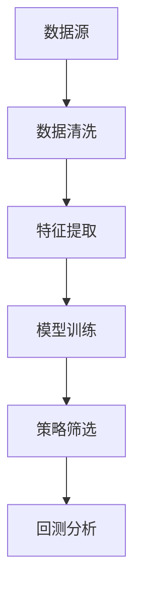

                 


# 格雷厄姆特价股票策略的历史表现分析

> 关键词：格雷厄姆投资策略，特价股票，安全边际，价值投资，市场周期

> 摘要：本文深入分析格雷厄姆特价股票策略的核心理念、理论基础及其在不同历史阶段的表现。通过数学模型和实际案例，探讨该策略的有效性、优化方法及在现代投资环境中的应用。

---

## 第一部分：格雷厄姆特价股票策略的背景与理论基础

### 第1章：格雷厄姆的投资理念

#### 1.1 投资的基本原理

格雷厄姆的价值投资理念强调安全边际和内在价值。他认为，股票不仅是企业的一部分权益，更是可以计算的数字。通过分析企业的财务数据，投资者可以找到市场价格低于其真实价值的股票，即特价股票。

#### 1.2 格雷厄姆特价股票策略的核心要素

- **安全边际**：安全边际是市场价格与内在价值之间的差距，公式为：
  $$ \text{安全边际} = \text{内在价值} - \text{市场价格} $$
  当安全边际为正时，股票具有投资价值。

- **内在价值**：格雷厄姆提出了内在价值的计算公式：
  $$ \text{内在价值} = \frac{\text{每股收益} \times (5 + \text{长期增长率})}{\text{资本成本}} $$
  该公式考虑了企业的盈利能力、成长性和资本成本。

- **市场情绪与周期**：格雷厄姆认为市场情绪会影响股票价格，投资者应关注市场周期，避免受短期波动影响。

#### 1.3 理论基础

格雷厄姆的价值投资理论基于以下几点：
1. **安全边际的重要性**：通过购买低于内在价值的股票，降低投资风险。
2. **内在价值的计算**：通过基本面分析评估企业的真实价值。
3. **市场情绪的影响**：市场恐慌或狂热时，价格与价值脱节，提供投资机会。

### 第2章：格雷厄姆特价股票策略的理论基础

#### 2.1 安全边际的数学模型

安全边际是格雷厄姆策略的核心，公式为：
$$ \text{安全边际} = \frac{\text{内在价值}}{\text{市场价格}} - 1 $$

当安全边际超过20%时，股票具有投资吸引力。

#### 2.2 内在价值的评估方法

格雷厄姆采用保守的估值方法，主要考虑企业的账面价值和未来盈利能力。内在价值公式为：
$$ \text{内在价值} = \text{每股账面价值} \times (1 + \text{预期增长率}) $$

#### 2.3 市场情绪与周期分析

格雷厄姆强调长期投资，避免短期市场波动。他将市场周期分为四个阶段：
1. **复苏阶段**：市场逐渐恢复，价值股开始反弹。
2. **牛市阶段**：市场情绪高涨，股价高于内在价值。
3. **熊市阶段**：市场恐慌，股价低于内在价值。
4. **震荡阶段**：市场波动不定，投资者应保持谨慎。

---

## 第二部分：格雷厄姆特价股票策略的历史表现分析

### 第3章：格雷厄姆特价股票策略的历史表现

#### 3.1 20世纪的表现

- **20世纪初至50年代**：格雷厄姆策略在经济大萧条期间表现出色，许多股票价格远低于内在价值。
- **60年代至70年代**：增长股流行，价值投资策略表现相对平淡。
- **80年代至90年代**：高科技股推动市场上涨，格雷厄姆策略在周期性股票中表现良好。

#### 3.2 21世纪的表现

- **21世纪初至2010年**：互联网泡沫破裂后，价值股重新受到重视，格雷厄姆策略表现优异。
- **2010年至今**：科技股主导市场，但传统价值股在低估值时依然表现稳定。

### 第4章：格雷厄姆策略在不同市场环境下的适应性

#### 4.1 牛市环境下的表现

- **优势**：在牛市中，格雷厄姆策略可能错过部分高增长股，但在市场顶部时，其防御性较强。
- **风险**：高估值环境下，安全边际不足，需谨慎选择股票。

#### 4.2 熊市环境下的表现

- **优势**：熊市中，许多股票价格大幅下跌，价值股往往被低估，提供投资机会。
- **风险**：需警惕市场恐慌导致的过度抛售，避免错杀优质股。

---

## 第三部分：格雷厄姆特价股票策略的优化与应用

### 第5章：策略的优化与调整

#### 5.1 动态调整安全边际

根据市场变化，动态调整安全边际的要求。在牛市中适当降低安全边际，在熊市中提高安全边际。

#### 5.2 引入风险管理机制

- **止损策略**：设定止损点，避免重大损失。
- **分散投资**：通过投资组合分散风险，避免过度集中。

#### 5.3 结合技术分析

将技术分析与基本面分析结合，寻找价格突破或形态变化的股票。

### 第6章：系统分析与架构设计

#### 6.1 系统架构设计



#### 6.2 系统功能设计

- 数据清洗：处理缺失值和异常值。
- 特征提取：计算安全边际、内在价值等指标。
- 模型训练：使用历史数据训练策略模型。
- 策略筛选：筛选符合条件的股票。
- 回测分析：评估策略的收益和风险。

---

## 第四部分：项目实战

### 第7章：环境安装与数据获取

#### 7.1 环境安装

- Python 3.8+
- pandas、numpy、scikit-learn库

#### 7.2 数据获取

使用Yahoo Finance API获取股票数据。

### 第8章：策略实现与回测分析

#### 8.1 策略实现代码

```python
import pandas as pd
import numpy as np

def calculate_intrinsic_value(df):
    df['Intrinsic Value'] = df['Earnings Per Share'] * (5 + df['Growth Rate']) / df['Cost of Capital']
    return df

def calculate_margin_of_safety(df):
    df['Margin of Safety'] = df['Intrinsic Value'] - df['Price']
    return df

# 示例数据
data = {
    'Ticker': ['AAPL', 'MSFT', 'GOOGL'],
    'Price': [150, 300, 120],
    'Earnings Per Share': [2.5, 3.0, 4.5],
    'Growth Rate': [8, 5, 10],
    'Cost of Capital': [8, 8, 8]
}

df = pd.DataFrame(data)
df = calculate_intrinsic_value(df)
df = calculate_margin_of_safety(df)
print(df)
```

#### 8.2 回测分析

通过回测分析，计算策略的年化收益、最大回撤等指标。

### 第9章：风险控制与优化

#### 9.1 风险控制

- 设置止损点：当股价跌破买入价的10%，立即卖出。
- 分散投资：将资金分散投资于多只股票，降低风险。

---

## 第五部分：总结与展望

### 第10章：结论与展望

格雷厄姆特价股票策略在历史表现中显示出较强的稳定性，尤其在熊市中表现优异。然而，在现代市场环境下，需结合动态调整和风险管理，以应对复杂多变的市场环境。

---

## 作者

作者：AI天才研究院 & 禅与计算机程序设计艺术

