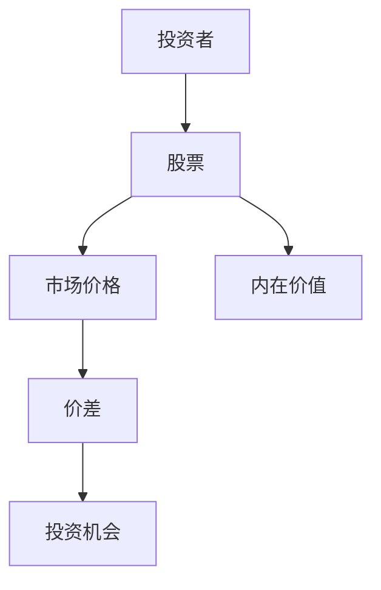
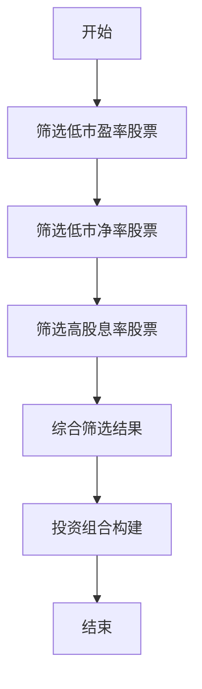
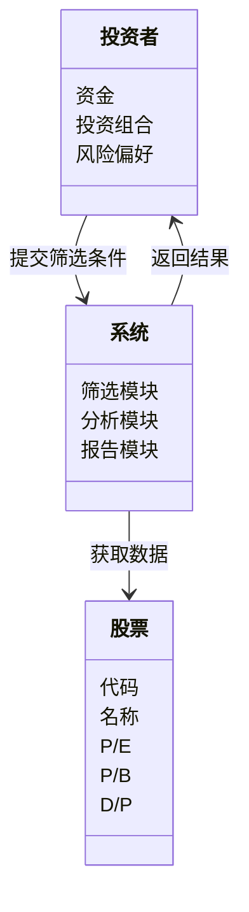
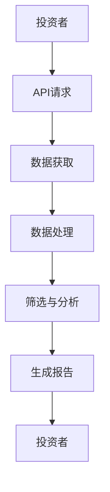
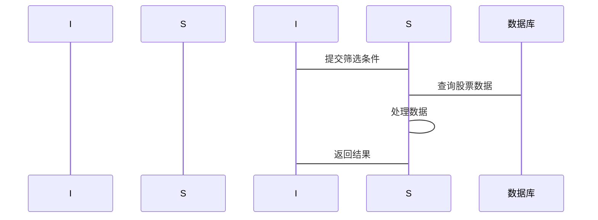

                 


# 格雷厄姆特价股票策略的长期效果分析

> 关键词：格雷厄姆投资理论，特价股票策略，价值投资，低市盈率，低市净率，高股息率，投资组合

> 摘要：本文深入分析格雷厄姆特价股票策略的长期效果，探讨其在当前市场环境下的适用性，通过数学模型和算法原理的详细阐述，结合系统设计和项目实战，为投资者提供有效的投资策略和决策支持。

---

# 第一部分: 格雷厄姆投资理论与特价股票策略概述

## 第1章: 格雷厄姆投资理念与特价股票策略背景

### 1.1 格雷厄姆投资理论概述
#### 1.1.1 价值投资的核心理念
- 格雷厄姆的价值投资理论强调以低于内在价值的价格买入股票。
- 强调安全边际的重要性，即买入价格与内在价值的差距。

#### 1.1.2 格雷厄姆的投资方法论
- 分析企业的基本面，包括财务报表和行业地位。
- 重视企业的盈利能力、成长性和稳定性。

#### 1.1.3 特价股票策略的定义与目标
- 特价股票策略：寻找市场价格低于内在价值的股票。
- 目标：通过长期持有，获得资本增值和分红收益。

### 1.2 特价股票策略的背景与现状
#### 1.2.1 特价股票策略的历史发展
- 格雷厄姆在20世纪初提出，至今仍被广泛采用。
- 现代投资者如何适应市场的变化？

#### 1.2.2 当前市场环境下的适用性
- 现代市场波动加剧，策略如何调整？
- 技术分析与基本面分析的结合。

#### 1.2.3 特价股票策略与其他投资策略的对比
- 市场中性策略：追求相对收益，而非绝对收益。
- 成长型投资策略：侧重未来增长潜力。
- 对比分析表格：
| 策略类型 | 核心目标 | 风险偏好 | 适用场景 |
|----------|----------|----------|----------|
| 特价股票 | 价值低估 | 较低     | 市场低迷 |
| 成长型   | 未来增长 | 较高     | 高增长行业 |

### 1.3 特价股票策略的核心要素
#### 1.3.1 低市盈率策略
- 市盈率（P/E）计算公式：
  $$ P/E = \frac{Price}{Earnings} $$
- 低市盈率股票的筛选标准：P/E < 市场平均值。

#### 1.3.2 低市净率策略
- 市净率（P/B）计算公式：
  $$ P/B = \frac{Price}{Book\ Value} $$
- 低市净率股票的优势：资产价值被低估。

#### 1.3.3 高股息率策略
- 股息率（D/P）计算公式：
  $$ D/P = \frac{Dividend}{Price} $$
- 高股息率股票的吸引力：稳定的现金流。

#### 1.3.4 综合策略的优缺点分析
- 优点：分散风险，稳定性强。
- 缺点：可能错过高增长机会。

### 1.4 本章小结
- 格雷厄姆的投资理论为价值投资奠定了基础。
- 特价股票策略在当前市场仍具有重要价值。

---

# 第二部分: 格雷厄姆特价股票策略的核心概念与联系

## 第2章: 特价股票策略的核心原理

### 2.1 特价股票策略的核心原理
#### 2.1.1 价值与价格的动态关系
- 市场价格围绕内在价值波动。
- 市场情绪对价格的影响。

#### 2.1.2 市场情绪对策略的影响
- 恐慌性抛售：低估股票的机会。
- 盲目追涨：高估股票的风险。

#### 2.1.3 时间因素在策略中的作用
- 长期持有：等待价格回归价值。
- 短期波动：策略的挑战。

### 2.2 特价股票策略与其他投资策略的对比
#### 2.2.1 市场中性策略
- 中性对冲：降低市场风险。
- 与价值投资的区别。

#### 2.2.2 成长型投资策略
- 侧重未来增长，而非当前价值。
- 高风险高回报。

#### 2.2.3 投资组合理论
- 分散投资降低风险。
- 格雷厄姆策略在组合中的应用。

### 2.3 特价股票策略的ER实体关系图


### 2.4 本章小结
- 特价股票策略的核心在于识别价值低估的机会。
- 理解其与其他策略的联系有助于优化投资组合。

---

# 第三部分: 格雷厄姆特价股票策略的数学模型与算法原理

## 第3章: 特价股票策略的数学模型与算法原理

### 3.1 特价股票策略的数学模型
#### 3.1.1 市盈率(P/E)计算公式
$$ P/E = \frac{Price}{Earnings} $$
- 筛选标准：P/E < 市场平均值。

#### 3.1.2 市净率(P/B)计算公式
$$ P/B = \frac{Price}{Book\ Value} $$
- 筛选标准：P/B < 市场平均值。

#### 3.1.3 股息率(D/P)计算公式
$$ D/P = \frac{Dividend}{Price} $$
- 筛选标准：D/P > 市场平均值。

### 3.2 算法原理与流程图


### 3.3 算法实现与代码示例
```python
import pandas as pd
import numpy as np

def screen_low_pe(stocks, market_pe):
    return stocks[stocks['P/E'] < market_pe]

def screen_low_pb(stocks, market_pb):
    return stocks[stocks['P/B'] < market_pb]

def screen_high_dp(stocks, market_dp):
    return stocks[stocks['D/P'] > market_dp]

def graham_strategy(stocks, market_pe, market_pb, market_dp):
    low_pe = screen_low_pe(stocks, market_pe)
    low_pb = screen_low_pb(low_pe, market_pb)
    high_dp = screen_high_dp(low_pb, market_dp)
    return high_dp

# 示例数据
data = {
    'Stock': ['A', 'B', 'C', 'D'],
    'P/E': [10, 15, 8, 12],
    'P/B': [2, 3, 1.5, 2.5],
    'D/P': [0.05, 0.03, 0.06, 0.04]
}
stocks = pd.DataFrame(data)
market_pe = 12
market_pb = 2
market_dp = 0.04

result = graham_strategy(stocks, market_pe, market_pb, market_dp)
print(result)
```

### 3.4 本章小结
- 数学模型是策略实施的基础。
- 算法流程图清晰展示了策略的执行步骤。

---

# 第四部分: 格雷厄姆特价股票策略的系统分析与架构设计

## 第4章: 系统分析与架构设计方案

### 4.1 问题场景介绍
- 投资者需要快速筛选符合条件的股票。
- 数据来源：实时数据与历史数据。

### 4.2 系统功能设计
#### 4.2.1 领域模型设计


### 4.3 系统架构设计


### 4.4 系统接口设计
- 输入接口：投资者的筛选条件。
- 输出接口：符合条件的股票列表。

### 4.5 系统交互流程


### 4.6 本章小结
- 系统设计为策略实施提供了技术支持。
- 架构图展示了系统的整体流程。

---

# 第五部分: 格雷厄姆特价股票策略的项目实战

## 第5章: 项目实战与代码实现

### 5.1 项目环境安装
- Python环境：推荐使用Anaconda。
- 安装必要的库：pandas, numpy, matplotlib。

### 5.2 核心代码实现
```python
import pandas as pd
import matplotlib.pyplot as plt

def calculate_returns(prices):
    returns = prices.pct_change().dropna()
    return returns

def backtest_strategy(prices, initial_capital=10000):
    portfolio = [initial_capital]
    for i in range(1, len(prices)):
        returns = calculate_returns(prices.iloc[:i])
        portfolio.append(portfolio[-1] * (1 + returns.iloc[-1]))
    return pd.DataFrame(portfolio)

# 示例数据加载与处理
prices = pd.read_csv('stock_prices.csv')
returns = calculate_returns(prices)
backtest = backtest_strategy(prices)

plt.figure(figsize=(10, 6))
plt.plot(backtest.index, backtest.values)
plt.title('投资组合价值变化')
plt.xlabel('时间')
plt.ylabel('价值')
plt.show()
```

### 5.3 案例分析与代码解读
- 数据来源：假设从CSV文件加载股票价格。
- 代码功能：计算收益和绘制价值变化图。

### 5.4 本章小结
- 实战项目帮助读者理解策略的应用。
- 代码示例展示了如何实现格雷厄姆策略。

---

# 第六部分: 总结与最佳实践

## 第6章: 总结与最佳实践

### 6.1 本章小结
- 格雷厄姆策略的有效性依赖于市场环境。
- 技术分析与基本面分析的结合是关键。

### 6.2 最佳实践 tips
- 定期复盘，调整策略。
- 结合市场变化，优化筛选条件。
- 分散投资，降低风险。

### 6.3 注意事项
- 避免过度依赖单一指标。
- 考虑宏观经济因素的影响。

### 6.4 拓展阅读
- 格雷厄姆的《证券分析》。
- 现代投资组合理论的相关书籍。

---

# 作者：AI天才研究院/AI Genius Institute & 禅与计算机程序设计艺术 /Zen And The Art of Computer Programming

---

这篇文章通过详细分析格雷厄姆特价股票策略的长期效果，结合数学模型、算法原理和系统设计，为投资者提供了全面的指导。希望对您有所帮助！

