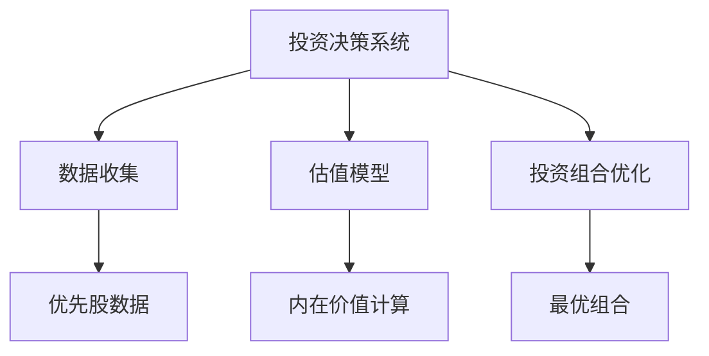

                 


# 格雷厄姆的优先股投资策略

> 关键词：格雷厄姆，优先股，投资策略，安全边际，价值投资，股息率

> 摘要：本文详细探讨了本杰明·格雷厄姆的优先股投资策略，分析了其核心思想、数学模型及系统架构，结合实际案例，为投资者提供深入的指导。

---

## 第一部分: 格雷厄姆投资理念概述

### 第1章: 格雷厄姆及其投资哲学

#### 1.1 格雷厄姆的生平简介
本杰明·格雷厄姆（Benjamin Graham）是20世纪著名的投资大师，被誉为“价值投资之父”。他在1929年美国股市大崩盘后，发展出一套稳健的价值投资理论，强调以低于内在价值的价格购买优质资产。

#### 1.2 格雷厄姆的投资哲学核心
格雷厄姆的核心理念是“安全边际”，即买入价格远低于内在价值的资产，以降低风险并确保收益。

#### 1.3 格雷厄姆与价值投资的关系
格雷厄姆是价值投资的鼻祖，其方法影响了包括巴菲特在内的众多投资者。他强调深入分析和安全边际的重要性。

---

### 第2章: 优先股的基本概念

#### 2.1 优先股的定义与特点
优先股是混合型证券，具有固定股息率和优先的股息分配权。与普通股相比，优先股风险较低，回报稳定。

#### 2.2 优先股与普通股的对比
| 特性      | 优先股                 | 普通股                 |
|-----------|------------------------|------------------------|
| 股息      | 固定，优先分配          | 不固定，后分配          |
| 权益      | 优先                   | 次优先                |
| 风险      | 较低                   | 较高                   |

#### 2.3 优先股的投资价值
优先股的稳定收益和较高的股息率使其成为保守投资者的理想选择，尤其适合追求稳定收入的投资者。

---

### 第3章: 格雷厄姆优先股投资策略的核心原理

#### 3.1 安全边际的数学模型
$$ \text{安全边际} = \text{内在价值} - \text{市场价格} $$
安全边际是衡量投资风险的重要指标，确保在市场波动中仍能获得正收益。

#### 3.2 内在价值的计算方法
使用股息折现法：
$$ \text{内在价值} = \frac{\text{股息}}{\text{折现率}} $$

#### 3.3 优先股投资的决策流程
1. 确定投资目标
2. 选择优质优先股
3. 估值与安全边际计算
4. 构建投资组合

---

## 第二部分: 格雷厄姆优先股投资策略的系统分析

### 第4章: 投资决策系统的总体架构

#### 4.1 系统功能模块划分
- 数据收集模块
- 估值模型模块
- 投资组合优化模块

#### 4.2 系统架构设计图（Mermaid）



#### 4.3 系统接口设计
- 数据输入接口：接收优先股的基本信息
- 估值接口：计算内在价值和安全边际
- 输出接口：显示投资建议

---

## 第三部分: 项目实战

### 第5章: 优先股投资实战案例

#### 5.1 环境安装
安装Python和相关库：
```bash
pip install pandas numpy matplotlib
```

#### 5.2 核心实现代码
```python
import pandas as pd
import numpy as np

def calculate_intrinsic_value(dividend, discount_rate):
    return dividend / discount_rate

def calculate_margin_of_safety(intrinsic_value, market_price):
    return intrinsic_value - market_price

# 示例数据
dividend = 5
discount_rate = 0.05
market_price = 40

iv = calculate_intrinsic_value(dividend, discount_rate)
mos = calculate_margin_of_safety(iv, market_price)

print(f"内在价值: {iv:.2f}")
print(f"安全边际: {mos:.2f}")
```

#### 5.3 实际案例分析
选择一只优先股，计算其内在价值和安全边际，评估是否具备投资价值。

---

## 第四部分: 总结与拓展

### 6.1 最佳实践
- 确保足够的安全边际
- 定期复评估投资组合
- 避免追涨杀跌

### 6.2 小结
格雷厄姆的优先股投资策略强调安全边际和价值投资，帮助投资者在波动的市场中稳定收益。

### 6.3 注意事项
- 优先股并非无风险，需关注 issuer 信用风险
- 市场波动可能影响价格，需动态调整

### 6.4 拓展阅读
- 《聪明的投资者》
- 其他价值投资经典书籍

---

## 作者

作者：AI天才研究院/AI Genius Institute & 禅与计算机程序设计艺术 /Zen And The Art of Computer Programming

---

通过以上结构，文章详细阐述了格雷厄姆的优先股投资策略，从理论到实践，结合代码和图表，为读者提供全面的指导。

