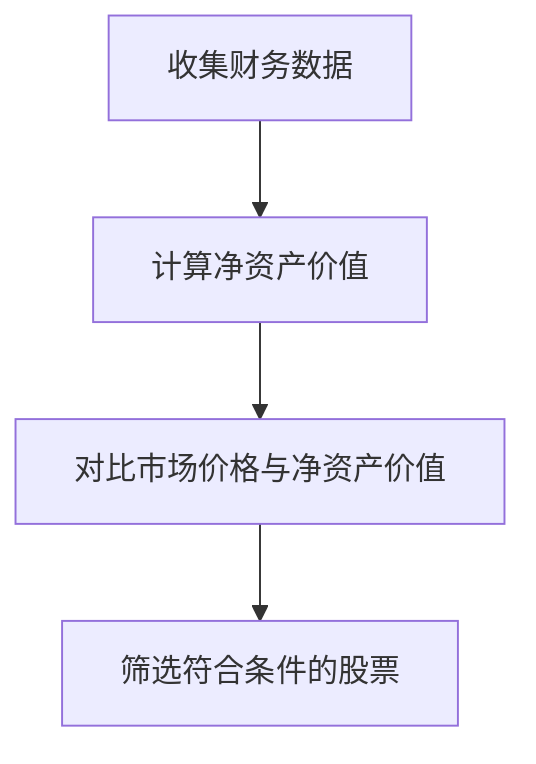

                 


# 格雷厄姆的净净股策略

> 关键词：价值投资，净净股，格雷厄姆，投资策略，财务分析

> 摘要：本文深入探讨了本杰明·格雷厄姆提出的净净股策略，从其背景、核心概念、算法原理到系统分析和项目实战，详细阐述了这一策略在投资中的应用。通过数学公式、Python代码和Mermaid图表，本文为读者提供了一个全面的理解框架，帮助投资者掌握这一经典的价值投资方法。

---

## 第一部分: 价值投资与净净股策略的背景

### 第1章: 价值投资与净净股策略概述

#### 1.1 价值投资的基本概念
##### 1.1.1 价值投资的定义
价值投资是一种以企业内在价值为核心的投资策略，强调以低于内在价值的价格买入优质资产。其核心在于寻找市场低估的投资机会，而不是关注市场的短期波动。

##### 1.1.2 价值投资的核心理念
价值投资的核心理念包括：
1. 市场价格围绕内在价值波动。
2. 投资的目标是以低于内在价值的价格买入优质资产。
3. 长期投资，避免频繁交易。

##### 1.1.3 价值投资与投机的区别
| 属性 | 价值投资 | 投机 |
|------|----------|------|
| 标准 | 内在价值 | 市场情绪 |
| 时间框架 | 长期 | 短期 |
| 风险 | 较低 | 较高 |

#### 1.2 格雷厄姆的投资理念
##### 1.2.1 格雷厄姆的生平简介
本杰明·格雷厄姆（1897-1976）是价值投资的鼻祖，被誉为“价值投资之父”。他是哥伦比亚大学的教授，也是沃伦·巴菲特的导师。

##### 1.2.2 格雷厄姆的价值投资理论
格雷厄姆提出了“安全边际”概念，即以低于内在价值的价格买入资产，以确保投资的安全性。

##### 1.2.3 格雷厄姆的投资策略特点
格雷厄姆的投资策略注重企业基本面分析，尤其是企业的财务状况和盈利能力。

#### 1.3 净净股策略的定义与特点
##### 1.3.1 净净股的定义
净净股是指市场价格低于其净资产价值的股票。公式表示为：
$$ P < B $$
其中，P为股票价格，B为每股净资产。

##### 1.3.2 净净股策略的核心思想
净净股策略的核心思想是寻找市场价格低于净资产价值的股票，以确保投资的安全性和盈利能力。

##### 1.3.3 净净股策略的优势与局限性
| 优势 | 局限性 |
|------|--------|
| 安全性高 | 可能错过成长股的机会 |
| 低估值 | 仅适用于特定市场环境 |
| 稳定性 | 不适合短期投机 |

### 第2章: 净净股策略的核心概念

#### 2.1 净值与市场价的关系
##### 2.1.1 净值的定义与计算
净资产价值（Net Worth）是企业资产减去负债的净值。公式表示为：
$$ B = \frac{A - L}{S} $$
其中，A为资产总额，L为负债总额，S为股份数。

##### 2.1.2 市场价的波动性分析
市场价格受市场情绪和市场参与者的影响，波动较大。而净资产价值反映企业的实际价值，相对稳定。

##### 2.1.3 净值与市场价的差异对企业价值的影响
当市场价格低于净资产价值时，企业被低估，具有投资价值。反之，当市场价格高于净资产价值时，企业可能被高估，投资风险增加。

#### 2.2 净净股策略的数学模型
##### 2.2.1 净值计算公式
$$ B = \frac{A - L}{S} $$

##### 2.2.2 市场价与净值的对比
$$ P < B $$

#### 2.3 净净股策略的核心要素
##### 2.3.1 企业基本面分析
包括企业的盈利能力、财务状况、行业地位等。

##### 2.3.2 财务报表分析
分析企业的资产负债表、利润表和现金流量表，评估企业的财务健康状况。

##### 2.3.3 行业分析与企业竞争优势
分析企业的行业地位、竞争优势和未来发展前景。

---

## 第二部分: 净净股策略的算法原理

### 第3章: 净净股策略的算法原理

#### 3.1 净净股筛选算法
##### 3.1.1 算法步骤
1. 收集目标企业的财务数据，包括资产、负债和股份数。
2. 计算企业的净资产价值：
$$ B = \frac{A - L}{S} $$
3. 对比股票的市场价格和净资产价值：
$$ P < B $$
4. 筛选符合条件的股票作为投资标的。

##### 3.2 净净股策略的数学模型
$$ P < B $$

##### 3.3 净净股策略的Python实现
```python
import pandas as pd
import numpy as np

def calculate_net_worth/assets.py
```

#### 3.4 净净股策略的Mermaid流程图


---

## 第三部分: 净净股策略的系统分析

### 第4章: 净净股策略的系统分析

#### 4.1 净净股策略的投资系统架构设计
##### 4.1.1 系统架构
- 数据采集模块：收集企业的财务数据。
- 数据处理模块：计算净资产价值。
- 投资决策模块：筛选符合条件的股票。

##### 4.1.2 系统功能设计
- 数据采集：从财务报表中提取资产、负债和股份数。
- 数据处理：计算净资产价值。
- 投资决策：对比市场价格与净资产价值，筛选投资标的。

##### 4.1.3 系统架构图


---

## 第四部分: 净净股策略的项目实战

### 第5章: 净净股策略的项目实战

#### 5.1 净净股策略的环境安装
安装必要的Python库，如Pandas、NumPy等。

#### 5.2 净净股策略的核心实现
```python
import pandas as pd

def calculate_net_worth(data):
    assets = data['资产']
    liabilities = data['负债']
    shares = data['股份数']
    net_worth = (assets - liabilities) / shares
    return net_worth

data = {
    '资产': 1000,
    '负债': 600,
    '股份数': 200
}

net_worth = calculate_net_worth(data)
print(net_worth)
```

#### 5.3 净净股策略的案例分析
分析某公司的财务数据，计算其净资产价值，并对比市场价格，判断是否符合净净股的条件。

---

## 第五部分: 净净股策略的最佳实践

### 第6章: 净净股策略的最佳实践

#### 6.1 净净股策略的总结
净净股策略是一种简单而有效的投资方法，通过寻找市场价格低于净资产价值的股票，实现长期的资本增值。

#### 6.2 净净股策略的注意事项
1. 选择具有稳定财务状况的企业。
2. 结合行业分析和企业竞争优势，综合评估投资标的。
3. 定期调整投资组合，应对市场变化。

#### 6.3 净净股策略的拓展阅读
推荐阅读格雷厄姆的《聪明的投资者》和巴菲特的《投资思想的变迁》。

---

## 作者简介

作者：AI天才研究院/AI Genius Institute & 禅与计算机程序设计艺术 /Zen And The Art of Computer Programming

---

# 结语

通过本文的详细讲解，读者可以全面理解格雷厄姆的净净股策略，并将其应用于实际投资中。希望本文能为投资者提供有价值的参考和启发。

