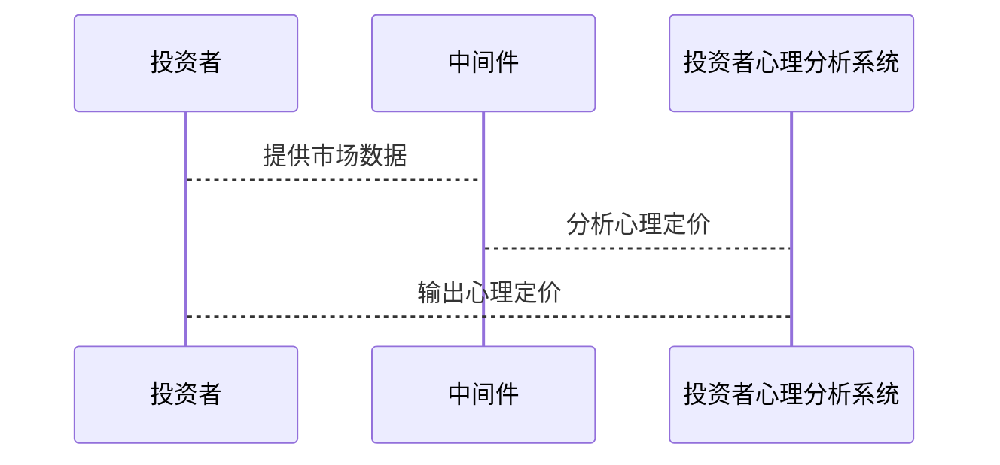

                 


# 格雷厄姆的投资者心理建设

> 关键词：投资者心理，价值投资，格雷厄姆，风险管理，决策框架，心理定价

> 摘要：本文从格雷厄姆的价值投资理念出发，详细探讨投资者心理建设的重要性及其核心概念。通过分析心理定价模型、风险偏好评估算法、数学公式和系统架构，结合实际案例，提出投资者心理建设的实践方法。文章旨在帮助投资者建立理性决策框架，增强风险控制能力，实现长期投资目标。

---

## 第1章: 投资者心理建设概述

### 1.1 投资者心理建设的重要性

#### 1.1.1 投资者心理建设的核心概念
投资者心理建设是指通过分析和调整投资者的心态、认知和行为模式，以提升投资决策的理性和长期性。核心包括：  
1. **心态调整**：避免过度自信和情绪化决策。  
2. **认知框架**：建立正确的市场观和价值判断。  
3. **行为规范**：制定纪律性投资策略。

#### 1.1.2 心理因素对投资决策的影响
投资者的心理偏差（如过度自信、从众心理）常常导致非理性决策，影响投资收益。例如：  
- **过度自信**：投资者认为自己能准确预测市场，忽视不确定性。  
- **贪婪与恐惧**：市场上涨时贪婪，下跌时恐惧，导致追涨杀跌。  
- **确认偏差**：倾向于寻找支持自己观点的信息，忽视反面证据。

#### 1.1.3 格雷厄姆投资理念与心理建设的关系
格雷厄姆的价值投资强调“安全边际”和长期复利效应，这与心理建设密切相关：  
- 安全边际要求投资者保持理性，避免高估资产价值。  
- 长期复利需要投资者具备耐心和纪律性，抵制短期波动的干扰。

---

### 1.2 投资者心理问题的常见表现

#### 1.2.1 过度自信与决策偏差
投资者往往高估自己的分析能力，低估市场的复杂性。例如：  
- 在市场下跌时，坚持认为市场会很快反弹，忽略潜在风险。

#### 1.2.2 惶恐与贪婪的交替影响
市场波动容易引发投资者的极端情绪：  
- **贪婪**：市场上涨时追高，忽视估值风险。  
- **恐惧**：市场下跌时恐慌抛售，错失长期机会。

#### 1.2.3 短期波动与长期投资目标的冲突
投资者容易因短期亏损而放弃长期计划，或因短期盈利而过度冒险。

---

### 1.3 心理建设在投资中的作用

#### 1.3.1 提高决策的理性化
通过心理建设，投资者能够更好地识别和克服心理偏差，做出更理性的决策。

#### 1.3.2 增强风险控制能力
心理建设帮助投资者建立风险意识，制定合理的风险管理策略。

#### 1.3.3 促进长期投资目标的实现
通过心理建设，投资者能够坚持长期投资策略，避免因短期波动而偏离目标。

---

## 第2章: 格雷厄姆投资理念的核心要素

### 2.1 格雷厄姆的价值投资理论

#### 2.1.1 价值投资的定义与内涵
价值投资强调以低于内在价值的价格买入优质资产，长期持有，获得超额收益。

#### 2.1.2 格雷厄姆的安全边际概念
安全边际是指买入价格与内在价值的差距，确保在市场波动中仍有获利空间。

#### 2.1.3 价值投资与心理建设的关系
价值投资要求投资者具备耐心和纪律性，与心理建设的核心目标一致。

### 2.2 格雷厄姆的投资策略

#### 2.2.1 长期投资与复利效应
复利效应强调长期投资的收益积累，要求投资者保持耐心和信心。

#### 2.2.2 高质量资产的选择标准
格雷厄姆重视资产的稳定性、高分红率和低估值，这要求投资者具备理性判断能力。

#### 2.2.3 风险控制与资产配置
通过分散投资和合理配置，降低风险，实现稳健收益。

### 2.3 格雷厄姆心理建设的实践意义

#### 2.3.1 投资者心态的自我认知
通过心理建设，投资者能够更好地认识自己的优缺点，避免情绪化决策。

#### 2.3.2 避免情绪化决策的方法
格雷厄姆强调纪律性，建议投资者制定明确的投资计划并严格执行。

#### 2.3.3 建立长期投资的耐心与信心
心理建设帮助投资者在市场波动中保持冷静，坚持长期投资策略。

---

## 第3章: 投资者心理建设的核心概念与联系

### 3.1 投资者心理建设的核心概念

#### 3.1.1 投资心态的定义与特征
投资心态是指投资者在面对市场波动时的心理状态和反应方式，包括情绪稳定性、风险承受能力和决策能力。

#### 3.1.2 风险管理的内涵与外延
风险管理包括识别、评估和控制风险，涉及投资组合的选择和调整。

#### 3.1.3 决策框架的结构与功能
决策框架是指投资者在面对信息时的分析和判断过程，包括信息筛选、逻辑推理和决策执行。

### 3.2 核心概念的属性对比

#### 3.2.1 投资心态与决策行为的对比
| 属性       | 投资心态          | 决策行为          |
|------------|-------------------|-------------------|
| 定义       | 心理状态和反应方式 | 行动和选择        |
| 影响因素   | 情绪、认知偏差     | 信息、规则、环境   |
| 目标       | 提高决策质量       | 实现投资目标       |

#### 3.2.2 风险偏好与收益预期的关系
风险偏好影响投资者对收益的预期，高风险偏好的投资者更倾向于追求高收益，而低风险偏好的投资者更注重稳定性。

#### 3.2.3 心理定价与市场行为的关联
心理定价影响投资者的买卖决策，进而影响市场价格波动。

### 3.3 ER实体关系图
```mermaid
entity 投资者
entity 投资心态
entity 风险管理
entity 决策框架

关系：投资者 -> 投资心态
关系：投资者 -> 风险管理
关系：投资者 -> 决策框架
```

---

## 第4章: 投资者心理建设的算法原理

### 4.1 心理定价模型

#### 4.1.1 模型定义与输入参数
心理定价模型基于投资者的心理预期和市场信息，计算资产的定价。  
输入参数包括：市场数据、投资者认知、心理预期。

#### 4.1.2 模型算法流程
1. 收集市场数据（如价格、成交量等）。  
2. 分析投资者认知（如情绪、预期）。  
3. 计算心理定价 = 市场数据 × 投资者认知。

#### 4.1.3 模型实现的Python代码
```python
def心理定价(市场数据, 个体认知):
    定价结果 = 市场数据 * 个体认知
    return 定价结果
```

### 4.2 风险偏好评估算法

#### 4.2.1 算法原理
通过分析投资者的决策行为和市场反应，评估其风险偏好。

#### 4.2.2 算法流程
1. 收集投资者行为数据（如交易频率、资产配置）。  
2. 分析市场波动对投资者行为的影响。  
3. 评估风险偏好（如保守型、激进型）。

#### 4.2.3 算法实现的Python代码
```python
def风险偏好评估(交易数据, 市场波动):
    风险偏好 = 交易数据 * 市场波动
    return 风险偏好
```

---

## 第5章: 数学模型与公式

### 5.1 期望值公式
$$E[X] = \sum_{i=1}^{n} P_i X_i$$  
其中，$P_i$ 是第 $i$ 种情况发生的概率，$X_i$ 是对应的情况的收益。

### 5.2 方差公式
$$\text{方差} = E[(X - E[X])^2]$$  
方差反映了资产收益的波动性。

### 5.3 夏普比率公式
$$\text{夏普比率} = \frac{E[X] - R_f}{\sigma}$$  
其中，$R_f$ 是无风险利率，$\sigma$ 是资产收益的标准差。

---

## 第6章: 系统分析与架构设计方案

### 6.1 问题场景介绍
设计一个投资者心理分析系统，帮助投资者识别和调整心理偏差。

### 6.2 系统功能设计

#### 6.2.1 领域模型


#### 6.2.2 系统架构设计


#### 6.2.3 系统接口设计
接口1：市场数据接口  
接口2：投资者行为数据接口  
接口3：心理定价输出接口  
接口4：风险偏好评估输出接口

#### 6.2.4 系统交互流程


---

## 第7章: 项目实战

### 7.1 环境安装
安装Python、Pandas、Matplotlib等工具。

### 7.2 核心代码实现

#### 7.2.1 心理定价模型
```python
import pandas as pd
import matplotlib.pyplot as plt

def心理定价(市场数据, 个体认知):
    定价结果 = 市场数据 * 个体认知
    return 定价结果

市场数据 = pd.read_csv('market_data.csv')
个体认知 = pd.read_csv('individual_perception.csv')
定价结果 = 心理定价(市场数据, 个体认知)
plt.plot(定价结果)
plt.show()
```

#### 7.2.2 风险偏好评估
```python
def风险偏好评估(交易数据, 市场波动):
    风险偏好 = 交易数据 * 市场波动
    return 风险偏好

交易数据 = pd.read_csv('transaction_data.csv')
市场波动 = pd.read_csv('market_volatility.csv')
风险偏好 = 风险偏好评估(交易数据, 市场波动)
print(风险偏好)
```

### 7.3 案例分析
分析某投资者在市场下跌时的心理变化，评估其风险偏好，并制定相应的投资策略。

### 7.4 项目小结
通过实战，验证心理定价模型和风险偏好评估算法的有效性，总结经验教训。

---

## 第8章: 最佳实践与总结

### 8.1 小结
投资者心理建设是实现长期投资目标的关键，需要结合格雷厄姆的价值投资理念和现代算法工具。

### 8.2 注意事项
- 避免过度依赖算法，保持人性化的判断。  
- 定期回顾和调整投资策略。  
- 坚持学习和提升投资知识。

### 8.3 拓展阅读
- 格雷厄姆的《聪明的投资者》  
- 行为金融学相关书籍  
- 投资心理分析的经典文献

---

## 作者：AI天才研究院/AI Genius Institute & 禅与计算机程序设计艺术 /Zen And The Art of Computer Programming

