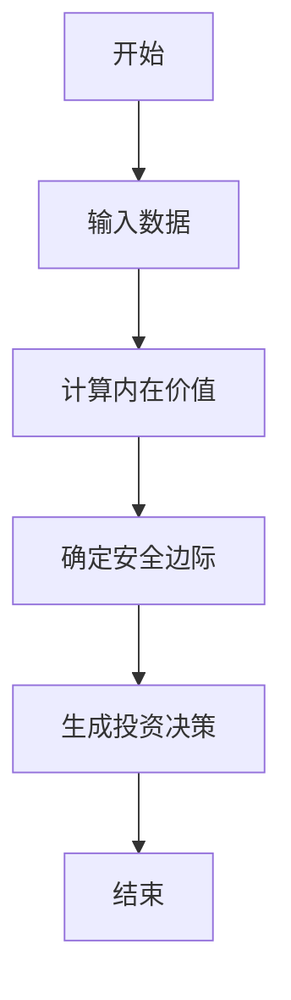
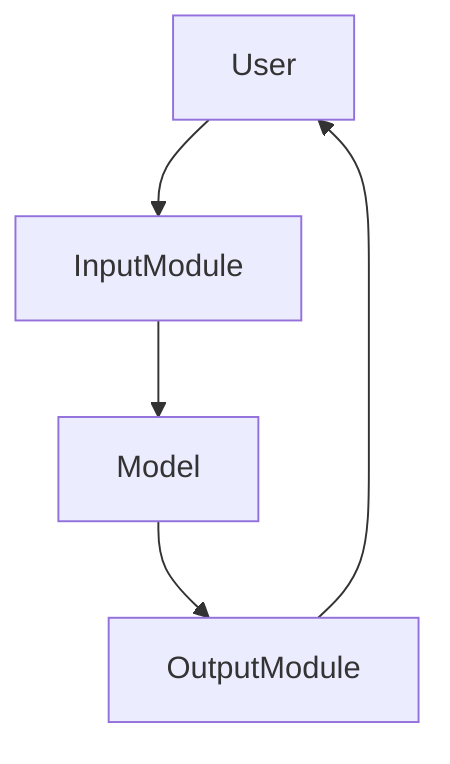

                 


# 格雷厄姆的投资风险控制

## 关键词：
- 投资风险控制
- 价值投资
- 格雷厄姆模型
- 安全边际
- 风险收益比

## 摘要：
本文详细探讨了格雷厄姆的投资风险控制策略，从其核心理念到数学模型，再到系统设计和项目实战，全面解析如何通过安全边际等方法有效控制投资风险，实现稳健收益。

---

## 第一章：投资风险的基本概念

### 1.1 投资风险的定义与分类
- **定义**：投资风险是指在投资过程中，由于市场波动或其他因素导致投资收益低于预期或出现损失的可能性。
- **分类**：
  - 系统性风险：影响整个市场的因素，如经济衰退、通货膨胀。
  - 非系统性风险：特定资产或行业的风险，如公司违约。
  - 流动性风险：资产难以快速变现的风险。

### 1.2 格雷厄姆的投资理念
- **背景**：本杰明·格雷厄姆是价值投资的鼻祖，强调安全边际和长期稳健收益。
- **策略**：通过分析公司基本面，寻找被市场低估的股票，以低于其内在价值的价格买入。
- **贡献**：格雷厄姆的理论奠定了巴菲特等投资者的基础。

---

## 第二章：格雷厄姆投资模型的核心概念

### 2.1 模型的结构
- **输入变量**：公司财务数据（如市盈率、市净率）、市场利率、通货膨胀率。
- **输出结果**：安全边际值、投资建议（买入、持有或卖出）。
- **假设条件**：市场存在非有效，股票价格围绕其内在价值波动。

### 2.2 核心概念的对比分析
| 概念          | 特征                | 示例                |
|---------------|---------------------|--------------------|
| 安全边际      | 股价低于内在价值    | 股价为8元，价值为10元 |
| 非系统性风险  | 公司特定风险        | 利润下降            |
| 风险收益比    | 预期收益与风险的比值 | 10%收益，5%风险     |

---

## 第三章：格雷厄姆投资模型的算法原理

### 3.1 算法流程


### 3.2 代码实现
```python
def graham_model(intrinsic_value):
    margin_ofSafety = intrinsic_value * 0.3  # 30%安全边际
    return "买入" if (current_price < intrinsic_value - margin_ofSafety) else "卖出"

# 示例
intrinsic_value = 100
current_price = 70
print(graham_model(intrinsic_value))  # 输出：买入
```

---

## 第四章：数学模型与公式

### 4.1 核心公式
- 安全边际计算公式：
  $$ \text{安全边际} = \text{内在价值} \times \text{安全边际率} $$
- 资产评估公式：
  $$ \text{内在价值} = \frac{\text{股息}}{\text{折现率} - \text{增长率}} $$
- 风险收益比公式：
  $$ \text{风险收益比} = \frac{\text{预期收益} - \text{无风险利率}}{\text{标准差}} $$

---

## 第五章：系统分析与架构设计

### 5.1 系统功能设计
- **模块划分**：数据输入、模型计算、结果输出。
- **功能流程**：用户输入股票数据，系统计算并给出投资建议。

### 5.2 架构图


---

## 第六章：项目实战

### 6.1 环境安装
- 安装Python和相关库（如numpy、pandas）。

### 6.2 核心代码
```python
import numpy as np

def calculate_margin_of_safety(intrinsic_value):
    return intrinsic_value * 0.3

intrinsic_value = 150
current_price = 120
margin = calculate_margin_of_safety(intrinsic_value)
print(f"安全边际：{margin}$，建议：{ '买入' if current_price < intrinsic_value - margin else '卖出'}")
```

### 6.3 实际案例分析
假设某股票的内在价值为150美元，当前价格为120美元，计算安全边际为45美元。由于120 < 150 - 45，建议买入。

---

## 第七章：最佳实践与总结

### 7.1 小结
- 格雷厄姆的模型通过安全边际有效控制风险，但需结合市场环境调整。

### 7.2 注意事项
- 定期更新财务数据，避免过时。
- 结合技术分析，综合判断投资决策。

### 7.3 拓展阅读
- 格雷厄姆的《聪明的投资者》深入阐述了价值投资的理念。

---

## 作者：AI天才研究院 & 禅与计算机程序设计艺术

---

通过以上分析，格雷厄姆的投资风险控制方法提供了系统化、可量化的策略，帮助投资者在不确定的市场中做出明智决策。

