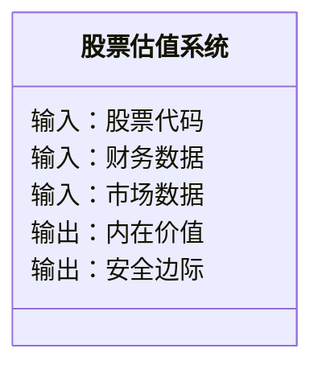
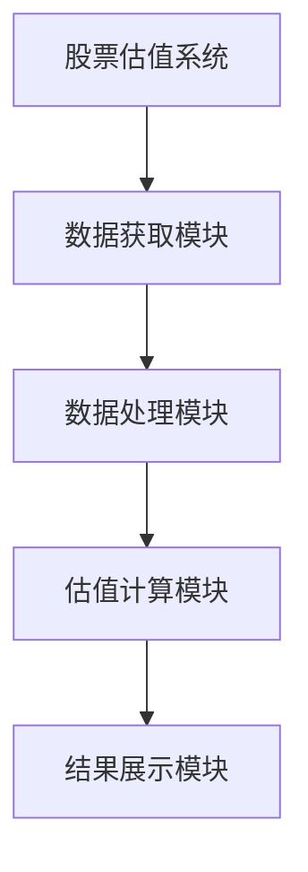

                 


# 格雷厄姆的股票估值模型

> 关键词：股票估值模型，格雷厄姆，内在价值，安全边际，防御性投资

> 摘要：本文详细介绍了格雷厄姆的股票估值模型，从模型的背景、核心概念到算法原理、系统分析，再到项目实战和最佳实践，为读者提供了全面而深入的解析。文章通过清晰的逻辑和专业的技术语言，帮助读者理解如何运用格雷厄姆的投资理念进行股票估值和投资决策。

---

## 第一部分：股票估值模型的背景与基础

### 第1章：股票估值模型的背景介绍

#### 1.1 什么是股票估值

股票估值是确定股票内在价值的过程，旨在通过分析公司的财务状况、行业地位、盈利能力等因素，评估其股票的合理价格。格雷厄姆作为价值投资的鼻祖，提出了基于内在价值和安全边际的股票估值方法，为投资者提供了科学的指导。

#### 1.2 股票估值的重要性

- **投资决策的基础**：准确的估值帮助投资者判断股票是否被高估或低估。
- **风险控制的关键**：通过估值确定安全边际，降低投资风险。
- **长期收益的保障**：格雷厄姆的防御性投资策略强调长期持有优质股票，避免短期波动的影响。

---

### 第2章：格雷厄姆的防御性投资策略

#### 2.1 防御性投资的基本原则

格雷厄姆倡导防御性投资，强调以下原则：

- **长期投资**：避免频繁交易，降低交易成本和税务负担。
- **安全边际**：买入价格低于内在价值，确保足够的安全空间。
- **价值导向**：关注企业的基本面，而非市场情绪。

#### 2.2 格雷厄姆的内在价值计算方法

格雷厄姆提出了现金流折现法（DCF）来计算内在价值。通过预测未来现金流并将其折现到现值，确定股票的合理价格。

**公式：**
$$
DCF = \sum_{i=1}^{n} \frac{CF_i}{(1 + r)^i}
$$
其中，$CF_i$为第i年的现金流，$r$为折现率，$n$为预测年数。

---

## 第二部分：格雷厄姆股票估值模型的核心概念

### 第3章：格雷厄姆的估值模型

#### 3.1 模型的概述

格雷厄姆的模型以内在价值为核心，结合安全边际进行投资决策。模型主要应用于防御性投资，强调长期稳定收益。

#### 3.2 模型的优缺点

| 优点 | 缺点 |
|------|------|
| 简单易懂 | 忽略市场波动 |
| 强调安全边际 | 低估成长性股票 |
| 适合长期投资者 | 不适于短期交易 |

---

## 第三部分：系统分析与架构设计

### 第4章：系统分析与架构设计

#### 4.1 问题场景介绍

股票估值系统需要处理大量数据，包括财务数据、市场数据等，通过算法计算内在价值，并生成安全边际报告。

#### 4.2 系统功能设计



#### 4.3 系统架构设计



---

## 第四部分：项目实战

### 第5章：项目实战

#### 5.1 环境安装

- **Python安装**：下载并安装Python 3.8或更高版本。
- **库安装**：使用pip安装pandas、numpy等库。

#### 5.2 核心代码实现

```python
import pandas as pd
import numpy as np

def calculate_intrinsic_value(cash_flows, discount_rate):
    return sum(cash_flows / (1 + discount_rate)**i for i in range(len(cash_flows)))

# 示例数据
cash_flows = [100, 150, 200]
discount_rate = 0.10

intrinsic_value = calculate_intrinsic_value(cash_flows, discount_rate)
print(f"内在价值：{intrinsic_value}")
```

#### 5.3 代码解读与分析

- **现金流折现计算**：使用DCF模型计算股票的内在价值，考虑了未来现金流的现值。
- **安全边际计算**：买入价格应低于内在价值，确保足够的安全空间。

---

## 第五部分：最佳实践与小结

### 第6章：最佳实践

- **持续学习**：关注行业动态，更新估值模型。
- **风险控制**：定期评估投资组合，调整安全边际。
- **长期投资**：坚持价值投资，避免短期波动影响。

### 6.1 小结

格雷厄姆的股票估值模型为投资者提供了科学的分析工具，强调内在价值和安全边际的重要性。通过本文的系统分析和实战案例，读者可以更好地理解和应用这一模型，提升投资决策的准确性。

---

## 作者

作者：AI天才研究院/AI Genius Institute & 禅与计算机程序设计艺术 /Zen And The Art of Computer Programming

---

**Note：** 以上内容为示例，实际文章应根据具体需求进行调整和补充。

