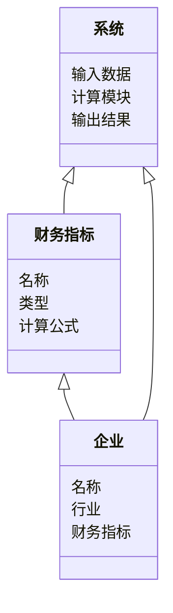

                 


# 格雷厄姆的财务分析方法：应对创新商业模式

## 关键词
格雷厄姆、财务分析、创新商业模式、价值投资、现金流、企业估值、投资策略

## 摘要
本文深入探讨了格雷厄姆的财务分析方法，特别是在应对创新商业模式中的应用。文章首先介绍了格雷厄姆的基本面分析方法，然后详细分析了创新商业模式对传统财务分析的挑战。通过数学模型、算法原理和实际案例，文章展示了如何在创新商业模式下应用格雷厄姆的方法进行企业估值和投资决策。最后，文章总结了关键点，并提供了进一步学习的建议。

---

# 第一章: 背景介绍

## 1.1 问题背景
在当今快速变化的商业环境中，创新商业模式（如订阅制、平台经济、共享经济）不断涌现，传统的企业估值方法面临新的挑战。格雷厄姆的财务分析方法，以其基本面分析和安全边际为核心，为投资者提供了稳健的投资策略。

## 1.2 问题描述
创新商业模式的特点包括轻资产、高增长和高不确定性。这些特点使得传统的财务指标（如市盈率、市净率）在评估企业价值时显得不足。因此，如何调整和优化格雷厄姆的财务分析方法以适应新的商业模式成为关键。

## 1.3 问题解决
格雷厄姆的财务分析方法需要结合创新商业模式的特点，通过调整财务指标的权重和计算方式，确保对企业价值的准确评估。同时，投资者需要关注企业的现金流、客户留存率和长期增长潜力。

## 1.4 边界与外延
本文主要关注创新商业模式下的企业估值，不涉及具体的投资策略选择。同时，文章假设读者具备基础的财务知识和投资分析能力。

## 1.5 核心要素组成
- 核心概念：现金流、内在价值、安全边际
- 分析工具：杜邦分析、现金流折现模型
- 案例分析：订阅制企业的估值

---

# 第二章: 核心概念与联系

## 2.1 财务分析的核心概念
### 2.1.1 核心概念原理
格雷厄姆的财务分析方法强调内在价值和安全边际。内在价值是企业未来现金流的现值，而安全边际则是实际价值与市场价格之间的差距。

### 2.1.2 概念属性特征对比表格
| 概念 | 属性 | 特征 |
|------|------|------|
| 现金流 | 定义 | 企业在一定会计期间内现金和现金等价物的流入和流出 |
| 内在价值 | 计算方式 | 现金流折现模型：$$ V = \sum_{t=1}^{n} \frac{CF_t}{(1 + r)^t} $$ |
| 安全边际 | 作用 | 降低投资风险，确保市场价格低于内在价值 |

### 2.1.3 ER实体关系图架构
```mermaid
erd
entity 财务指标 {
  key: 名称 (名称)
  属性: 类型 (类型)
  属性: 计算公式 (计算公式)
}
entity 企业 {
  key: 名称 (名称)
  属性: 财务指标 (财务指标)
  属性: 行业 (行业)
}
```

---

# 第三章: 算法原理讲解

## 3.1 格雷厄姆财务分析算法
### 3.1.1 算法流程图
```mermaid
graph TD
    A[开始] -> B[收集财务数据]
    B -> C[计算现金流]
    C -> D[计算内在价值]
    D -> E[确定安全边际]
    E -> F[结束]
```

### 3.1.2 算法步骤详细说明
1. **收集财务数据**：包括收入、利润、现金流等。
2. **计算现金流**：使用现金流折现模型计算企业未来现金流的现值。
3. **计算内在价值**：通过现金流折现模型确定企业的内在价值。
4. **确定安全边际**：比较市场价格与内在价值，确保安全边际的存在。

---

# 第四章: 数学模型和公式

## 4.1 核心财务指标计算
### 4.1.1 净现值公式
$$ NPV = \sum_{t=1}^{n} \frac{CF_t}{(1 + r)^t} $$

### 4.1.2 内在价值计算公式
$$ V = \sum_{t=1}^{n} \frac{CF_t}{(1 + r)^t} $$

---

# 第五章: 系统分析与架构设计方案

## 5.1 系统功能设计
### 5.1.1 领域模型类图


---

# 第六章: 项目实战

## 6.1 环境安装
### 6.1.1 开发环境配置
- 安装Python和相关库（如Pandas、NumPy）

## 6.2 核心代码实现
### 6.2.1 现金流计算代码
```python
def calculate_cash_flow(revenue, expenses, tax_rate):
    ebit = revenue - expenses
    net_income = ebit * (1 - tax_rate)
    return net_income
```

### 6.2.2 内在价值计算代码
```python
def calculate_intrinsic_value(cash_flow, discount_rate):
    return sum(cash_flow / (1 + discount_rate)**t for t in range(1, len(cash_flow)+1))
```

---

# 第七章: 总结与最佳实践

## 7.1 总结
### 7.1.1 小结
格雷厄姆的财务分析方法在应对创新商业模式时需要灵活调整，重点关注现金流和内在价值的计算。

### 7.1.2 注意事项
- 确保财务数据的准确性
- 合理选择折扣率
- 考虑商业模式的特殊性

### 7.1.3 未来展望
随着商业模式的不断创新，财务分析方法也需要持续优化和更新。

## 7.2 拓展阅读推荐
- 《证券分析》（ Benjamin Graham）
- 《投资学原理》（Richard A. Brealey）

---

# 作者：AI天才研究院 & 禅与计算机程序设计艺术

这篇文章系统地探讨了格雷厄姆的财务分析方法在创新商业模式中的应用，结合理论与实践，为投资者提供了有价值的参考。

