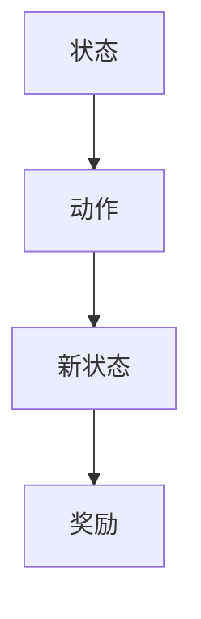
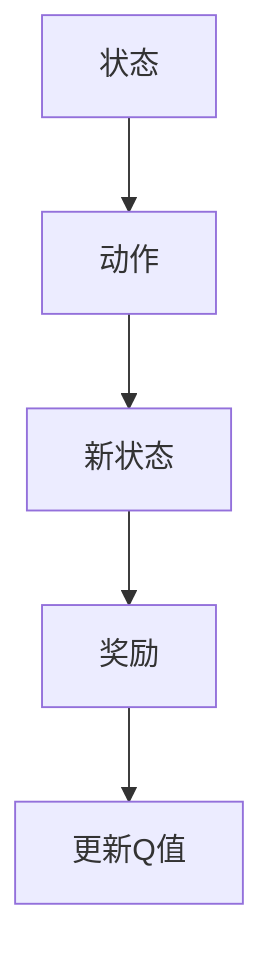
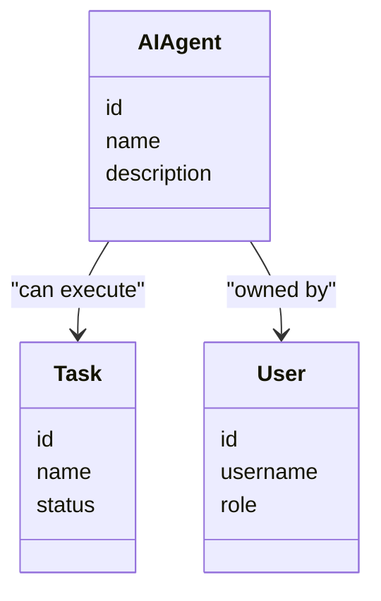

                 


# 案例解析：成功落地的企业级AI Agent项目

**关键词：企业级AI Agent、人工智能、系统设计、算法原理、项目实战**

**摘要：**  
本文将详细解析一个成功落地的企业级AI Agent项目的背景、核心概念、算法原理、系统设计、项目实战及总结。通过案例分析，探讨企业级AI Agent在实际应用中的价值与挑战，并总结其成功的关键因素。

---

# 第一部分：企业级AI Agent项目背景与核心概念

---

## 第1章：企业级AI Agent概述

### 1.1 什么是AI Agent？
#### 1.1.1 AI Agent的定义与核心概念
AI Agent（人工智能代理）是一种能够感知环境、自主决策并执行任务的智能实体。它通过传感器获取信息，利用算法进行推理，并通过执行器与环境交互。企业级AI Agent强调高可用性、可扩展性和安全性，适用于复杂的商业场景。

#### 1.1.2 企业级AI Agent的特点
- **智能性**：能够理解任务目标并自主决策。
- **自主性**：无需人工干预，独立完成任务。
- **协作性**：能够与其他系统或AI Agent协同工作。
- **适应性**：能够根据环境变化动态调整行为。

#### 1.1.3 AI Agent与传统软件的区别
| 属性 | 传统软件 | 企业级AI Agent |
|------|----------|----------------|
| 决策方式 | 预定义逻辑 | 动态推理与学习 |
| 适应性 | 低 | 高 |
| 交互方式 | 单向 | 双向 |

---

### 1.2 企业级AI Agent的应用背景
#### 1.2.1 当前企业数字化转型的挑战
企业面临数据爆炸、业务复杂化、用户需求多样化等挑战，传统规则引擎已难以应对动态变化的商业环境。

#### 1.2.2 AI Agent在企业中的潜在价值
- **提升效率**：通过自动化决策减少人工干预。
- **增强决策能力**：利用机器学习优化业务决策。
- **提高用户体验**：通过个性化服务提升客户满意度。

#### 1.2.3 企业级AI Agent的市场现状
随着AI技术的成熟，企业级AI Agent在金融、医疗、物流等领域逐渐落地，但技术门槛较高，落地难度较大。

---

### 1.3 企业级AI Agent的核心要素
#### 1.3.1 问题背景与问题描述
企业在数字化转型中面临以下问题：
- 业务流程复杂，难以快速响应。
- 数据分散，难以实现智能决策。
- 缺乏智能化工具，难以提升效率。

#### 1.3.2 问题解决的边界与外延
- **边界**：聚焦于企业内部业务流程优化。
- **外延**：延伸至企业外部的合作伙伴和客户。

#### 1.3.3 核心概念与联系的ER实体关系图
```mermaid
er
    entity(AI Agent) {
        id
        name
        description
        capabilities
    }
    entity(Task) {
        id
        name
        description
        status
    }
    entity(User) {
        id
        username
        role
    }
    AI Agent --> Task: "can execute"
    AI Agent --> User: "owned by"
```

---

## 第2章：AI Agent的核心概念与联系

### 2.1 AI Agent的核心原理
#### 2.1.1 感知模块
AI Agent通过传感器或API获取环境数据，例如从数据库中获取订单信息。

#### 2.1.2 决策模块
基于感知到的信息，AI Agent利用算法生成决策，例如使用强化学习选择最优行动路径。

#### 2.1.3 执行模块
AI Agent通过执行器将决策转化为具体行动，例如调用API发送邮件。

---

### 2.2 AI Agent的类型与对比
#### 2.2.1 基于规则的AI Agent
- **优点**：简单易懂，易于部署。
- **缺点**：难以应对复杂场景。

#### 2.2.2 基于模型的AI Agent
- **优点**：能够动态推理，适应性强。
- **缺点**：计算资源消耗较大。

#### 2.2.3 基于强化学习的AI Agent
- **优点**：能够通过试错优化策略。
- **缺点**：训练周期长，需要大量数据。

---

### 2.3 AI Agent的核心属性对比
| 属性 | 基于规则的AI Agent | 基于模型的AI Agent | 基于强化学习的AI Agent |
|------|---------------------|---------------------|--------------------------|
| 决策方式 | 预定义规则         | 动态模型推理         | 奖励驱动优化            |
| 适应性 | 低                 | 中                 | 高                      |
| 复杂性 | 低                 | 高                 | 极高                    |

---

## 第3章：AI Agent的算法原理

### 3.1 常见AI Agent算法
#### 3.1.1 基于规则的算法
```python
def rule_based_agent():
    if condition1:
        action1()
    elif condition2:
        action2()
```

#### 3.1.2 基于模型的算法
```python
def model_based_agent():
    input = get_input()
    output = model.predict(input)
    execute(output)
```

#### 3.1.3 基于强化学习的算法


---

### 3.2 强化学习算法（Q-Learning）详解
#### 3.2.1 算法流程图


#### 3.2.2 数学模型
$$ Q(s, a) = Q(s, a) + \alpha (r + \gamma \max Q(s', a') - Q(s, a)) $$

---

## 第4章：企业级AI Agent的系统分析与架构设计

### 4.1 项目背景与目标
- **背景**：某企业希望通过AI Agent优化订单处理流程。
- **目标**：实现自动化的订单处理、库存管理与客户通知。

### 4.2 系统功能设计
#### 4.2.1 领域模型


#### 4.2.2 系统架构


---

## 第5章：项目实战

### 5.1 环境安装
- 安装Python、TensorFlow、Keras等依赖库。

### 5.2 核心代码实现
```python
def main():
    env = Environment()
    agent = AI_Agent(env)
    while True:
        state = env.get_state()
        action = agent.decide(state)
        reward = env.feedback(action)
        agent.update_model(reward)
```

---

## 第6章：总结与展望

### 6.1 项目总结
通过案例分析，我们验证了企业级AI Agent在实际应用中的可行性与价值。

### 6.2 未来展望
随着技术进步，企业级AI Agent将在更多领域发挥重要作用。

---

## 第7章：最佳实践

### 7.1 小结
企业级AI Agent的成功落地需要技术、业务和团队的完美结合。

### 7.2 注意事项
- 确保数据安全与隐私保护。
- 定期优化模型以适应业务变化。

### 7.3 拓展阅读
推荐阅读《强化学习入门》与《企业架构设计》。

---

## 附录

### 附录A：术语表
- AI Agent：人工智能代理。
- 强化学习：一种机器学习范式。

### 附录B：工具推荐
- TensorFlow：深度学习框架。
- OpenAI API：AI服务接口。

---

**作者：AI天才研究院/AI Genius Institute & 禅与计算机程序设计艺术 /Zen And The Art of Computer Programming**

