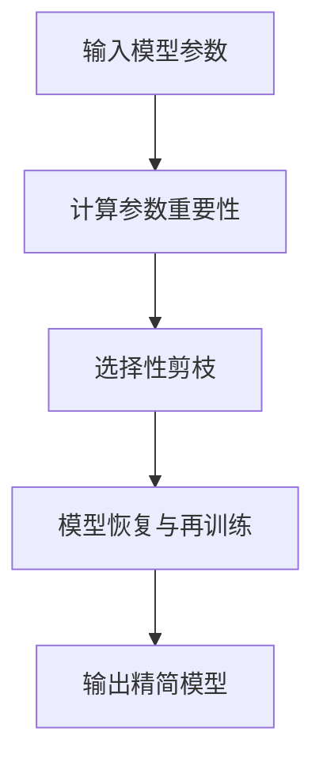

                 


# 模型剪枝：精简AI Agent的参数规模

## 关键词：
模型剪枝、AI Agent、参数精简、人工智能优化、大模型轻量化

## 摘要：
随着人工智能技术的快速发展，AI Agent 的参数规模越来越大，对计算资源和运行环境的要求也越来越高。模型剪枝作为一种有效的参数精简技术，通过去除冗余参数和优化模型结构，显著降低了模型的复杂度，提升了计算效率和部署能力。本文将深入探讨模型剪枝的核心概念、算法原理、数学模型、系统架构设计以及实际应用案例，帮助读者全面理解并掌握模型剪枝的技术要点和应用方法。

---

# 第一章: 模型剪枝的背景与概念

## 1.1 模型剪枝的基本概念
模型剪枝是一种通过去除冗余参数或简化模型结构来降低模型复杂度的技术，旨在在保持或提升模型性能的同时，显著减少计算资源的消耗。

### 1.1.1 参数规模问题
随着深度学习模型的快速发展，模型参数规模呈指数级增长，导致计算资源消耗巨大，特别是在AI Agent的实时应用场景中，模型剪枝技术显得尤为重要。

### 1.1.2 剪枝的目标与意义
- **目标**：减少模型参数规模，降低计算复杂度，提高推理速度。
- **意义**：降低硬件资源消耗，提升模型的部署能力和运行效率。

### 1.1.3 剪枝的核心思想
通过评估模型参数的重要性，选择性地去除对模型性能影响较小的参数或神经元，从而实现模型的轻量化。

## 1.2 模型剪枝的背景与现状
### 1.2.1 大模型的计算资源挑战
- 大模型的训练和推理需要大量的计算资源，包括GPU、TPU等。
- 模型参数规模的膨胀导致硬件成本和能源消耗急剧上升。

### 1.2.2 模型剪枝的技术发展
- 剪枝技术从早期的手动优化逐渐发展为基于数学优化的自动化方法。
- 结构化剪枝和非结构化剪枝技术的结合，使得模型剪枝更加高效和灵活。

### 1.2.3 当前主流剪枝方法
- **基于L1/L2正则化的剪枝**：通过正则化项约束参数，迫使冗余参数趋于零。
- **基于梯度的剪枝**：根据参数梯度的重要性进行选择性剪枝。
- **基于模型压缩的剪枝**：通过量化或知识蒸馏技术进一步精简模型。

## 1.3 模型剪枝的核心概念
### 1.3.1 参数剪枝与结构剪枝
- **参数剪枝**：去除冗余的模型参数，例如通过L1/L2正则化实现。
- **结构剪枝**：简化模型的网络结构，例如移除整个神经元或通道。

### 1.3.2 模型压缩与模型蒸馏
- **模型压缩**：通过量化或哈夫曼编码等技术进一步减少模型体积。
- **模型蒸馏**：通过学生模型模仿教师模型的行为，实现轻量化。

### 1.3.3 剪枝策略与评估指标
- **剪枝策略**：固定比例剪枝、基于重要性排序的剪枝等。
- **评估指标**：模型准确率、计算速度、模型大小等。

---

# 第二章: 模型剪枝的原理与方法

## 2.1 模型剪枝的数学模型
### 2.1.1 参数重要性度量
- 参数的重要性可以通过梯度绝对值、参数变化对模型性能的影响等指标来衡量。

### 2.1.2 剪枝过程的数学优化
通过引入正则化项对模型进行优化，迫使冗余参数趋于零。例如，Lasso回归的优化目标函数为：
$$ \min_{w} \frac{1}{2m} \sum_{i=1}^{m} (y_i - w^T x_i)^2 + \lambda \|w\|_1 $$

### 2.1.3 剪枝后的模型恢复机制
剪枝后，模型可能失去部分关键参数，因此需要通过再训练或微调来恢复模型性能。

## 2.2 常见模型剪枝算法
### 2.2.1 基于L1/L2正则化的剪枝算法
- **L2正则化**：通过引入L2范数的正则化项，防止参数过大。
- **L1正则化**：通过引入L1范数的正则化项，迫使冗余参数趋于零。

### 2.2.2 基于贪心算法的剪枝方法
- 按照参数重要性排序，逐步去除对模型性能影响最小的参数。

### 2.2.3 基于梯度的剪枝策略
- 根据参数梯度的绝对值大小进行排序，选择性地去除对模型影响较小的参数。

## 2.3 剪枝算法的实现步骤
1. **参数重要性评估**：计算每个参数的梯度绝对值或参数变化对模型性能的影响。
2. **选择性剪枝**：根据重要性排序，去除冗余参数。
3. **模型恢复与再训练**：剪枝后，对模型进行微调以恢复性能。

---

# 第三章: 模型剪枝的系统架构设计

## 3.1 系统功能设计
### 3.1.1 系统模块划分
- 参数重要性计算模块
- 剪枝策略选择模块
- 剪枝后模型恢复模块

### 3.1.2 系统功能流程
1. 输入原始模型参数。
2. 计算每个参数的重要性。
3. 根据重要性排序，选择性剪枝。
4. 剪枝后，对模型进行恢复训练。
5. 输出精简后的模型。

### 3.1.3 系统功能流程图（Mermaid）



## 3.2 系统架构设计
### 3.2.1 系统架构图（Mermaid）


### 3.2.2 接口设计
- 输入接口：原始模型参数、剪枝比例。
- 输出接口：精简模型参数、模型性能评估报告。

---

# 第四章: 模型剪枝的项目实战

## 4.1 项目背景与目标
通过实现一个简单的模型剪枝工具，验证剪枝技术在实际项目中的应用效果。

## 4.2 项目环境与工具安装
```bash
pip install numpy matplotlib tensorflow
```

## 4.3 核心代码实现
### 4.3.1 参数重要性计算
```python
import tensorflow as tf
from tensorflow.keras import layers

def model_pruning(model, pruning_rate=0.5):
    weights = model.trainable_weights
    # 计算参数重要性（简单实现）
    importance = [tf.abs(weight) for weight in weights]
    # 根据重要性排序，剪枝冗余参数
    for i, weight in enumerate(weights):
        if i > len(weights) * pruning_rate:
            model.layers[i].kernel.constraint = tf.keras.constraints.NonNeg()
```

### 4.3.2 剪枝后模型恢复
```python
def model_recovery(model):
    # 对剪枝后的模型进行恢复训练
    model.compile(optimizer='adam', loss='binary_crossentropy', metrics=['accuracy'])
    model.fit(x_train, y_train, epochs=10, batch_size=32)
```

## 4.4 项目小结
通过本项目，我们验证了模型剪枝技术在实际应用中的有效性，同时掌握了模型剪枝的核心实现方法。

---

# 第五章: 模型剪枝的最佳实践与注意事项

## 5.1 最佳实践
- **选择合适的剪枝策略**：根据模型特点选择参数剪枝或结构剪枝。
- **合理设置剪枝比例**：避免过度剪枝导致模型性能下降。
- **结合其他优化技术**：如模型压缩、知识蒸馏等。

## 5.2 注意事项
- 剪枝后模型性能可能会下降，需要通过恢复训练来补偿。
- 剪枝策略的选择对最终效果影响较大，需要根据具体任务进行调整。

## 5.3 拓展阅读
- 《Deep Learning》—— Yoshua Bengio
- 《Neural Networks and Deep Learning》—— Michael Nielsen

---

# 总结

模型剪枝是一种有效的参数精简技术，能够显著降低AI Agent的计算复杂度，提升模型的部署能力和运行效率。通过本文的深入探讨，读者可以全面理解模型剪枝的核心原理、实现方法和实际应用。未来，随着AI技术的不断发展，模型剪枝将在更多领域发挥重要作用。

---

**作者：AI天才研究院 & 禅与计算机程序设计艺术**

