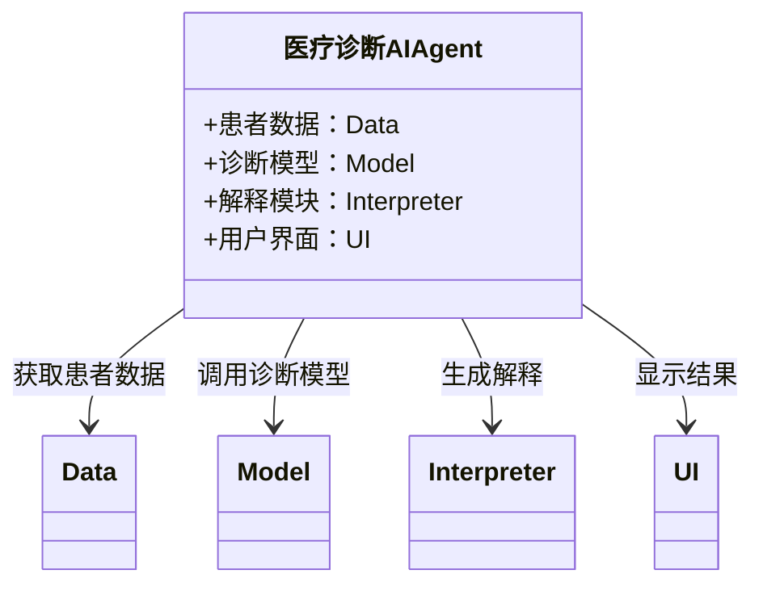
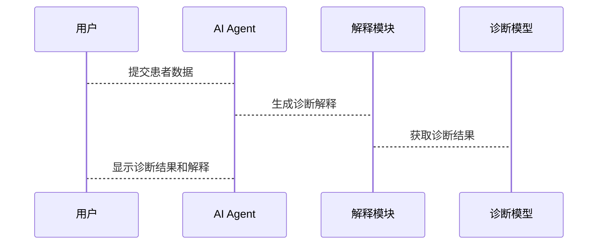

                 


# 模型可解释性技术在AI Agent中的应用

**关键词**：模型可解释性，AI Agent，LIME算法，SHAP值，系统架构设计，项目实战，最佳实践

**摘要**：  
模型可解释性技术在AI Agent中的应用是当前人工智能领域的重要研究方向。随着AI技术的快速发展，模型的透明性和可解释性成为用户信任和决策支持的关键因素。本文将从模型可解释性的基本概念出发，深入探讨其在AI Agent中的核心原理、算法实现、系统设计以及实际应用。通过具体案例分析和最佳实践总结，为读者提供全面的技术解读和实践指导。

---

# 第1章: 模型可解释性概述

## 1.1 模型可解释性的基本概念

### 1.1.1 可解释性的定义  
模型可解释性是指AI模型的决策过程能够被人类理解和解释。一个可解释的模型不仅输出结果，还能揭示其决策背后的逻辑和依据，从而增强用户对模型的信任。

### 1.1.2 可解释性的重要性  
在AI Agent的应用中，可解释性是确保决策透明性和责任追究的基础。特别是在医疗、金融等高风险领域，可解释性是法律和伦理合规的必要条件。

### 1.1.3 可解释性与AI Agent的关系  
AI Agent通过可解释性技术，能够向用户展示其决策过程，从而增强用户对AI系统的信任，并在出现问题时提供有效的追溯和改进方向。

## 1.2 AI Agent的基本概念

### 1.2.1 AI Agent的定义  
AI Agent是一种智能实体，能够感知环境、自主决策并执行任务。它具备自主性、反应性、社交能力和持续性的特点。

### 1.2.2 AI Agent的分类  
AI Agent可以根据智能水平分为反应式和基于模型的Agent；根据应用场景分为服务型、社交型和自主型Agent。

### 1.2.3 AI Agent的应用场景  
AI Agent广泛应用于自动驾驶、智能客服、机器人控制等领域，其决策过程的可解释性直接影响系统的可靠性和用户体验。

## 1.3 本章小结  
本章介绍了模型可解释性的基本概念及其在AI Agent中的重要性，为后续内容奠定了基础。

---

# 第2章: 可解释性模型的维度

## 2.1 可解释性的维度分析

### 2.1.1 局部可解释性  
局部可解释性关注单个预测的解释，适用于复杂模型如深度神经网络。通过局部解释，用户可以理解模型在特定输入下的决策逻辑。

### 2.1.2 全局可解释性  
全局可解释性揭示模型整体的行为模式，帮助用户理解模型在所有输入下的决策规律。例如，通过特征重要性分析可以了解各个特征对模型输出的影响程度。

### 2.1.3 透明度与可解释性的对比  
透明度是指模型的设计和决策过程是否易于理解。可解释性则强调模型输出的解释能力。两者相辅相成，共同提升模型的可信度。

## 2.2 模型可解释性的评估指标

### 2.2.1 评估指标的定义  
可解释性评估指标用于衡量模型的透明性和可理解性。常见的指标包括可解释性得分、解释复杂度和用户理解度等。

### 2.2.2 常见评估指标对比  
| 评估指标 | 优点 | 缺点 |
|----------|------|------|
| 可解释性得分 | 客观量化 | 易受模型复杂性影响 |
| 解释复杂度 | 易操作 | 难以全面反映模型行为 |
| 用户理解度 | 聚焦实际需求 | 主观性强 |

### 2.2.3 评估指标的优缺点分析  
可解释性得分能够量化模型的解释能力，但可能无法捕捉到模型的全局行为。用户理解度虽然主观，但更能反映实际应用中的可解释性需求。

## 2.3 本章小结  
本章分析了可解释性的不同维度及其评估指标，为后续算法选择提供了理论基础。

---

# 第3章: LIME算法原理

## 3.1 LIME算法的基本原理

### 3.1.1 LIME的定义  
LIME（Local Interpretable Model-agnostic Explanations）是一种用于解释机器学习模型的可解释性技术，适用于任何模型架构。

### 3.1.2 LIME的工作流程  
1. 对于一个特定的输入，生成扰动数据点。
2. 使用扰动数据训练一个简单的可解释模型（如线性回归）。
3. 使用简单模型的权重系数，解释原始输入的决策过程。

### 3.1.3 LIME的数学模型  
$$ LIME = \sum_{i=1}^{n} w_i \cdot f(x_i) $$  
其中，$w_i$是简单模型的权重系数，$f(x_i)$是复杂模型的预测值。

## 3.2 LIME算法的实现步骤

### 3.2.1 数据预处理  
对原始数据进行标准化或归一化处理，确保模型输入的统一性。

### 3.2.2 模型训练  
使用扰动数据训练简单模型，提取权重系数。

### 3.2.3 解释性计算  
根据权重系数和复杂模型的预测结果，计算每个特征的解释力。

### 3.2.4 结果可视化  
通过可视化工具展示特征的重要性，帮助用户理解模型决策。

## 3.3 LIME算法的优缺点

### 3.3.1 优点  
- 解释性高，适用于复杂模型。
- 能够提供局部解释，适用于非线性模型。

### 3.3.2 缺点  
- 解释范围有限，仅适用于局部预测。
- 对扰动数据的生成方式敏感，可能影响解释的稳定性。

## 3.4 本章小结  
本章详细讲解了LIME算法的原理和实现步骤，分析了其优缺点，为后续应用提供了理论支持。

---

# 第4章: 系统架构设计

## 4.1 问题场景介绍  
以医疗诊断AI Agent为例，设计一个基于可解释性技术的诊断系统。

## 4.2 系统功能设计

### 4.2.1 领域模型  
使用Mermaid类图展示系统模块关系：


## 4.3 系统架构设计

### 4.3.1 系统架构图  
使用Mermaid架构图展示系统模块：


## 4.4 系统接口设计  
定义系统的主要接口：
- 输入接口：接收患者症状和病史数据。
- 输出接口：返回诊断结果和解释性报告。

## 4.5 系统交互流程  
使用Mermaid序列图展示交互流程：


## 4.6 本章小结  
本章通过系统架构设计和交互流程图，展示了AI Agent如何集成可解释性技术，确保系统的透明性和可用性。

---

# 第5章: 项目实战

## 5.1 环境配置  
安装必要的库：`pip install lime`, `pip install scikit-learn`, `pip install matplotlib`。

## 5.2 系统核心实现

### 5.2.1 代码实现  
```python
from lime import lime_tabular
import numpy as np
import joblib

# 加载数据和模型
model = joblib.load('diagnosis_model.pkl')
test_data = np.load('test_data.npy')

# 初始化LIME解释器
explainer = lime_tabular.LimeTabularExplainer(model.predict_proba,
                                               feature_names=['症状1', '症状2', '症状3'])

# 生成解释
explanation = explainer.explain_instance(test_data[0], model.predict, num_samples=1000)

# 可视化解释
explanation.as_list()
```

### 5.2.2 代码解读  
1. 使用`lime_tabular`解释器，对复杂模型进行局部解释。
2. 通过`explain_instance`方法，生成特定输入的解释。
3. 使用`as_list`方法，将解释结果可视化。

## 5.3 实际案例分析  
以一个具体病例为例，展示诊断过程和解释结果。

## 5.4 本章小结  
本章通过实际项目案例，展示了模型可解释性技术在AI Agent中的具体实现和应用效果。

---

# 第6章: 最佳实践与总结

## 6.1 最佳实践

### 6.1.1 选择合适的可解释性技术  
根据具体场景和模型类型，选择LIME、SHAP等适合的技术。

### 6.1.2 平衡模型性能与可解释性  
在追求模型性能的同时，不应忽视可解释性的需求，特别是在高风险领域。

### 6.1.3 注重用户体验  
通过直观的可视化和简洁的解释，提升用户对AI Agent的信任和满意度。

## 6.2 本章小结  
总结了模型可解释性技术在AI Agent中的应用经验，并提出了未来的研究方向和挑战。

---

# 作者  
**作者：AI天才研究院 & 禅与计算机程序设计艺术**

---

以上是《模型可解释性技术在AI Agent中的应用》的技术博客文章的完整目录和内容概述。通过分章节详细讲解模型可解释性的核心概念、算法实现、系统设计和项目实战，本文为读者提供了一条从理论到实践的学习路径。

