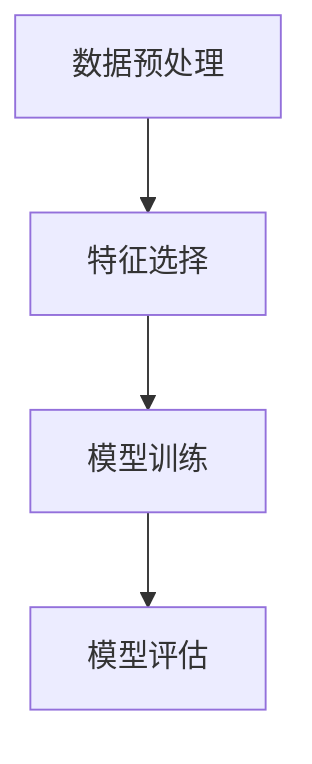
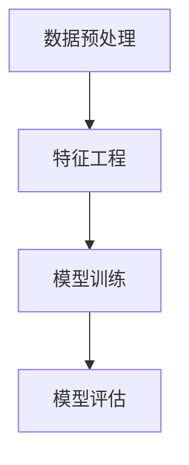

                 


# 模型训练与金融数据的结合

> 关键词：模型训练，金融数据，机器学习，算法原理，系统架构

> 摘要：本文探讨模型训练在金融数据中的应用，分析其核心概念、算法原理、系统架构及项目实战。通过详细讲解，帮助读者理解如何利用模型训练优化金融决策和风险控制。

---

## 第1章: 模型训练与金融数据的结合背景

### 1.1 模型训练的基本概念

#### 1.1.1 机器学习模型训练的定义
机器学习模型训练是通过算法学习数据中的模式和特征，构建能够预测或分类的新数据的模型。训练过程包括数据预处理、特征提取、模型选择和优化。

#### 1.1.2 模型训练的核心要素
- **数据**：输入特征和标签。
- **算法**：学习策略，如线性回归、决策树。
- **目标函数**：衡量模型预测与真实值的差距。
- **优化方法**：调整模型参数以最小化目标函数。

#### 1.1.3 金融数据的特点与挑战
金融数据具有波动性、非线性、噪声多等特点，且涉及大量实时数据和高风险决策，增加了模型训练的复杂性。

---

### 1.2 金融数据的定义与分类

#### 1.2.1 金融数据的定义
金融数据是反映金融市场状态的信息，包括股票价格、交易量、经济指标等。

#### 1.2.2 金融数据的分类
- **时间序列数据**：按时间排序的数据，如股票价格。
- **结构化数据**：表格形式的交易数据。
- **非结构化数据**：新闻、社交媒体信息。

#### 1.2.3 金融数据的采集与处理
数据预处理包括清洗、特征提取和标准化，以提高模型训练的效率和准确性。

---

### 1.3 模型训练与金融数据结合的意义

#### 1.3.1 提高金融决策的准确性
模型训练帮助识别数据中的模式，提升预测的准确性。

#### 1.3.2 优化金融风险控制
通过分析历史数据，模型训练能有效识别潜在风险，优化投资组合。

#### 1.3.3 提升金融业务的效率
自动化处理数据和预测，减少人工干预，提高业务效率。

---

## 第2章: 模型训练与金融数据的核心概念

### 2.1 模型训练的基本原理

#### 2.1.1 数据预处理
包括数据清洗、特征选择和标准化，确保数据质量。

#### 2.1.2 特征工程
通过提取有意义的特征，如波动率、成交量，提升模型性能。

#### 2.1.3 模型选择与训练
选择合适的算法，如线性回归或随机森林，并调整参数以优化性能。

---

### 2.2 金融数据的特征与属性

#### 2.2.1 时间序列特征
时间依赖性，如趋势和周期性。

#### 2.2.2 市场情绪特征
反映市场参与者情绪，如VIX指数。

#### 2.2.3 风险评估特征
衡量资产风险，如VaR和信用评分。

---

### 2.3 模型训练与金融数据的结合方式

#### 2.3.1 监督学习在金融数据中的应用
使用带标签的数据进行预测，如股票价格预测。

#### 2.3.2 非监督学习在金融数据中的应用
发现数据中的隐藏结构，如聚类分析识别客户群体。

#### 2.3.3 强化学习在金融数据中的应用
通过模拟交易环境优化策略。

---

## 第3章: 模型训练的算法原理

### 3.1 线性回归算法

#### 3.1.1 线性回归的定义
通过最小化预测值与实际值的平方差之和，找到最佳拟合直线。

#### 3.1.2 线性回归的数学模型
$$ y = \beta_0 + \beta_1x + \epsilon $$

#### 3.1.3 线性回归的实现流程


---

### 3.2 决策树算法

#### 3.2.1 决策树的定义
通过树状结构进行分类或回归，适用于高维数据。

#### 3.2.2 决策树的构建过程
特征选择、数据分割和树的生成。

---

## 第4章: 金融数据的特征处理

### 4.1 时间序列分析

#### 4.1.1 时间序列的特征提取
计算均值、标准差等统计指标。

#### 4.1.2 时间序列的预测模型
使用ARIMA或LSTM进行预测。

---

## 第5章: 系统架构设计

### 5.1 系统功能设计

#### 5.1.1 领域模型


### 5.2 系统架构设计

#### 5.2.1 系统架构图


---

## 第6章: 项目实战

### 6.1 环境配置

```bash
pip install numpy pandas scikit-learn
```

### 6.2 核心代码实现

#### 6.2.1 数据预处理
```python
import pandas as pd
data = pd.read_csv('stock.csv')
data = data.dropna()
```

#### 6.2.2 特征工程
```python
from sklearn.preprocessing import StandardScaler
scaler = StandardScaler()
X_scaled = scaler.fit_transform(X)
```

#### 6.2.3 模型训练
```python
from sklearn.linear_model import LinearRegression
model = LinearRegression()
model.fit(X_scaled, y)
```

#### 6.2.4 模型评估
```python
from sklearn.metrics import mean_squared_error
y_pred = model.predict(X_test_scaled)
print(mean_squared_error(y_test, y_pred))
```

---

## 第7章: 小结与注意事项

### 7.1 本章小结
模型训练在金融数据中的应用广泛，通过合理的数据处理和算法选择，能显著提升预测准确性和风险控制能力。

### 7.2 注意事项
- 数据质量影响模型性能。
- 模型选择需结合业务需求。
- 需关注模型的可解释性和鲁棒性。

---

作者：AI天才研究院 & 禅与计算机程序设计艺术

