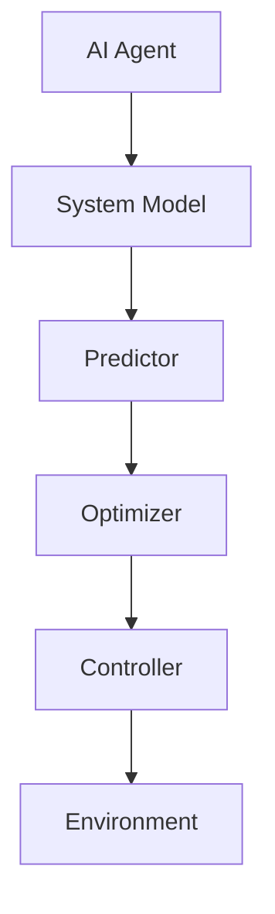

                 


# 模型预测控制：提高AI Agent的决策质量

---

## 关键词

模型预测控制（MPC）、AI Agent、决策优化、系统建模、多步预测

---

## 摘要

模型预测控制（Model Predictive Control，MPC）是一种基于系统模型的控制策略，通过预测未来状态来优化当前控制输入，从而提高AI Agent的决策质量。本文深入分析了MPC的核心原理、算法实现、系统架构设计及其在AI代理中的应用，并通过具体案例展示了如何通过MPC优化决策过程。文章内容包括背景介绍、核心概念、算法原理、系统设计、项目实战和总结，帮助读者全面理解和应用MPC技术。

---

## 第一部分：模型预测控制的背景与概念

### 第1章：模型预测控制的基本概念

#### 1.1 模型预测控制的定义与特点

模型预测控制（MPC）是一种基于系统模型的控制策略，通过预测未来状态来优化当前控制输入。其特点是：

- **基于模型**：依赖系统的数学模型进行状态预测。
- **多步优化**：考虑未来多步状态，实现全局优化。
- **约束处理**：能够处理系统的各种约束条件。

#### 1.2 MPC与传统控制方法的对比

| 对比维度 | 传统控制方法 | 模型预测控制（MPC） |
|----------|--------------|---------------------|
| 基础     | 当前状态反馈 | 系统模型预测        |
| 计算方式 | 实时反馈      | 离线优化            |
| 优化范围 | 单变量调节    | 多变量优化          |

#### 1.3 MPC的核心要素

- **系统模型**：描述系统状态变化的数学方程。
- **目标函数**：优化的目标，如最小化误差或最大化收益。
- **约束条件**：系统运行的限制，如安全边界。
- **优化算法**：求解优化问题的算法，如线性规划。

---

### 第2章：模型预测控制在AI代理中的应用

#### 2.1 AI代理决策问题的背景

AI代理在复杂环境中需要做出决策，面临以下挑战：

- **不确定性**：环境和目标的变化导致决策的不确定性。
- **多目标优化**：需要在多个目标之间找到平衡。
- **动态环境**：环境状态不断变化，需要实时调整决策。

#### 2.2 模型预测控制在代理决策中的作用

- **提供优化路径**：通过预测未来状态，找到最优决策路径。
- **处理多步预测**：考虑未来多步的影响，避免短视决策。
- **实现复杂约束下的最优决策**：在满足约束条件下优化决策。

---

## 第二部分：模型预测控制的核心原理

### 第3章：模型预测控制的数学模型与公式

#### 3.1 系统动力学方程

系统状态的变化可以用以下方程描述：

$$ \dot{x} = f(x, u, t) $$

其中，$x$ 是状态向量，$u$ 是控制输入，$t$ 是时间。

#### 3.2 优化目标与约束条件

目标函数通常是一个二次型函数：

$$ J = \sum_{k=0}^{N-1} (x_k - x_{ref})^T Q (x_k - x_{ref}) + u_k^T R u_k $$

约束条件包括：

$$ g(x_k, u_k) \leq 0 $$

### 第4章：模型预测控制的算法实现

#### 4.1 算法步骤

1. 预测未来N步状态。
2. 计算优化目标函数。
3. 应用约束条件。
4. 输出最优控制输入。

#### 4.2 代码实现

```python
import numpy as np
from scipy.optimize import minimize

def MPC_Controller(x_current, reference, Q, R, N):
    # 预测未来N步状态
    x_pred = np.zeros((N, len(x_current)))
    x_pred[0] = x_current
    for i in range(1, N):
        x_pred[i] = x_pred[i-1] + f(x_pred[i-1], u_prev)
    
    # 定义目标函数
    def objective(u):
        J = 0
        for k in range(N):
            error = x_pred[k] - reference[k]
            J += error.T @ Q @ error + u[k].T @ R @ u[k]
        return J
    
    # 约束条件
    constraints = []
    for k in range(N):
        constraints.append({'type': 'ineq', 'fun': lambda u, k=k: g(u[k])})
    
    # 最优化
    res = minimize(objective, np.zeros(N), constraints=constraints)
    return res.x[0]
```

---

## 第三部分：系统分析与架构设计

### 第5章：系统架构设计

#### 5.1 系统架构图



#### 5.2 接口设计

- **输入接口**：接收环境状态和目标。
- **输出接口**：输出最优控制输入。

---

## 第四部分：项目实战与案例分析

### 第6章：项目实战

#### 6.1 环境安装

```bash
pip install numpy scipy matplotlib
```

#### 6.2 核心代码实现

```python
import numpy as np
from scipy.optimize import minimize

def objective(u, x_ref, Q, R, N):
    J = 0
    for k in range(N):
        error = x_ref[k] - u[k]
        J += error.T @ Q @ error + u[k].T @ R @ u[k]
    return J

def MPC(x_current, reference, Q, R, N):
    N_steps = N
    u_initial = np.zeros(N_steps)
    result = minimize(objective, u_initial, args=(x_current, Q, R, N_steps))
    return result.x[0]
```

#### 6.3 案例分析

**案例：智能交通系统中的路径优化**

- **问题描述**：自动驾驶车辆在动态交通环境中选择最优路径。
- **解决方案**：使用MPC预测未来交通状况，优化当前决策。

---

## 第五部分：总结与最佳实践

### 第7章：总结与小结

模型预测控制（MPC）是一种强大的工具，能够帮助AI代理在复杂环境中做出高质量的决策。通过预测未来状态和优化当前输入，MPC能够有效处理不确定性、多目标优化和动态环境问题。

### 7.2 注意事项

- **模型准确性**：系统模型的准确性直接影响预测结果。
- **计算效率**：实时应用需要高效的计算能力。
- **约束条件**：合理设置约束条件，避免过度限制。

### 7.3 拓展阅读

- 建议阅读相关论文和文献，深入理解MPC的数学基础和优化算法。

---

## 作者信息

作者：AI天才研究院（AI Genius Institute） & 禅与计算机程序设计艺术（Zen And The Art of Computer Programming）

--- 

感谢您的阅读！希望本文对您理解和应用模型预测控制有所帮助。

