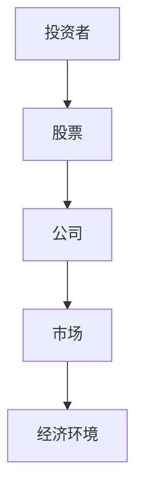
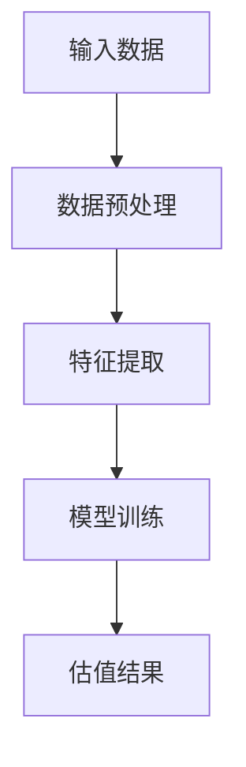
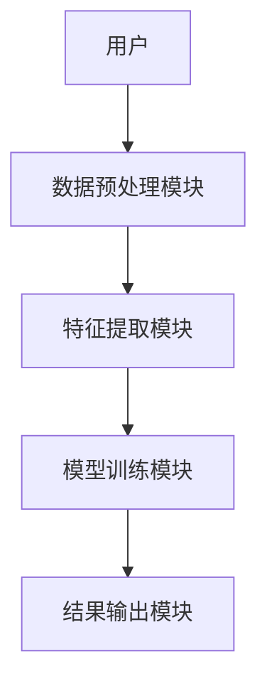
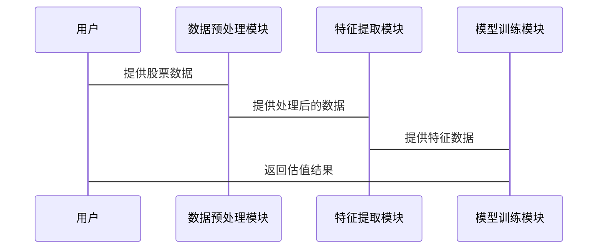

                 


# 比利时股市估值:欧洲心脏地带的投资机会

## 关键词：比利时股市、股票估值、投资机会、欧洲经济、多元产业

## 摘要：  
本文深入分析了比利时股市的投资机会，探讨了股市估值的核心概念、方法及其在实际投资中的应用。通过对比利时股市的背景介绍、估值模型的详细解析、算法实现以及项目实战的多维度分析，为投资者提供了科学的决策依据。

---

# 第一部分: 比利时股市估值的背景与核心概念

## 第1章: 股市估值的基本概念

### 1.1 股票市场的基本概念

#### 1.1.1 股票市场的定义与作用  
股票市场是投资者通过买卖公司股份进行投资的场所，是企业融资的重要渠道。它反映了经济的活力，为投资者提供了财富增长的机会。

#### 1.1.2 股票市场的参与者  
股票市场的参与者包括个人投资者、机构投资者（如基金公司、保险公司）、上市公司、经纪商、交易所等。

#### 1.1.3 股票市场的分类与特点  
股票市场按地域可分为本地市场和国际市场。本地市场的特点包括高流动性、透明度高；国际市场的特点是全球化、风险分散。

### 1.2 比利时股市的概况

#### 1.2.1 比利时股市的历史与发展  
比利时股市起源于19世纪末，经过多次改革，成为欧洲重要的金融中心之一。

#### 1.2.2 比利时股市的主要指数  
主要指数包括布鲁塞尔交易所指数（BEL 20）、BEL 25等。

#### 1.2.3 比利时股市的国际化特征  
作为欧盟的核心国家之一，比利时吸引了大量国际投资者。

### 1.3 为什么选择投资比利时股市

#### 1.3.1 欧洲经济的中心地位  
比利时是欧盟总部所在地，地理位置优越，经济联系广泛。

#### 1.3.2 比利时的多元产业优势  
涵盖金融、化工、汽车制造等多个领域，产业多元化降低了投资风险。

#### 1.3.3 比利时股市的流动性与稳定性  
高流动性确保了交易的便捷性，而稳定性则为投资者提供了可靠的投资环境。

## 第2章: 股市估值的核心概念与方法

### 2.1 股票估值的基本原理

#### 2.1.1 股票价值的定义  
股票价值是投资者对公司未来现金流的现值估计。

#### 2.1.2 股票价格的影响因素  
包括宏观经济、行业状况、公司基本面、市场情绪等。

#### 2.1.3 股票估值的目标与意义  
目标是确定股票的合理价格，意义在于帮助投资者做出明智的投资决策。

### 2.2 股票估值的主要方法

#### 2.2.1 市盈率（P/E）法  
公式：P/E = 股价 / 每股收益。市盈率反映了市场对公司未来盈利能力的预期。

#### 2.2.2 市净率（P/B）法  
公式：P/B = 股价 / 每股净资产。适用于评估银行、保险公司等资产密集型行业。

#### 2.2.3 股息率法  
公式：股息率 = 每股股息 / 股价。用于衡量投资回报率。

#### 2.2.4 内在价值法  
通过DCF模型计算公司未来现金流的现值，确定股票的内在价值。

#### 2.2.5 相对估值法  
与行业平均水平或竞争对手的估值进行比较。

### 2.3 比利时股市估值的特殊性

#### 2.3.1 欧洲经济环境的影响  
比利时作为欧元区核心国家，经济政策和欧洲一体化进程直接影响股市。

#### 2.3.2 比利时的多元文化融合  
多种语言和文化的共存，影响了企业的管理和市场行为。

#### 2.3.3 比利时股市的国际化特征  
吸引了大量国际企业上市，增加了市场的多样性和流动性。

---

# 第二部分: 股市估值的核心概念与联系

## 第3章: 股票估值的核心概念原理

### 3.1 股票估值的核心要素

#### 3.1.1 股票的内在价值  
通过公司基本面分析得出的股票价值。

#### 3.1.2 股票的市场价值  
实际交易价格，受市场情绪和供需关系影响。

#### 3.1.3 股票的流动性与风险  
流动性高意味着容易买卖，风险低意味着稳定性好。

### 3.2 股票估值的核心概念原理

#### 3.2.1 股票估值的数学模型与公式  
常用公式包括市盈率、市净率、股息率等。

#### 3.2.2 股票估值公式的比较与选择  
表格对比不同估值方法的适用场景和优缺点。

| 估值方法 | 适用场景 | 优缺点 |
|----------|-----------|--------|
| 市盈率    | 盈利稳定   | 简单但受周期影响 |
| 市净率    | 资产密集型 | 稳定但忽视收益 |
| 股息率    | 稳定收益   | 适合长期投资者 |

### 3.3 股票估值的ER实体关系图



## 第4章: 股票估值算法的原理与实现

### 4.1 股票估值算法的原理

#### 4.1.1 股票估值的基本算法  
基于历史数据和市场趋势预测未来价格。

#### 4.1.2 股票估值算法的优化  
引入机器学习模型，提高预测精度。

### 4.2 股票估值算法的实现

#### 4.2.1 多元回归模型



#### 4.2.2 代码实现

```python
import pandas as pd
from sklearn.linear_model import LinearRegression

# 数据预处理
data = pd.read_csv('belpx.csv')
X = data[['PE Ratio', 'PB Ratio']]
y = data['Price']

# 模型训练
model = LinearRegression()
model.fit(X, y)

# 预测结果
predicted_price = model.predict(X)
```

### 4.3 股票估值算法的数学模型

#### 4.3.1 多元回归模型

$$ y = \beta_0 + \beta_1 x_1 + \beta_2 x_2 + \epsilon $$

其中，$y$ 是目标变量，$x_1$ 和 $x_2$ 是自变量，$\epsilon$ 是误差项。

---

# 第三部分: 股票估值系统的分析与设计

## 第5章: 系统分析与架构设计

### 5.1 问题场景介绍

#### 5.1.1 背景介绍  
设计一个基于多元回归模型的股票估值系统，帮助投资者做出决策。

### 5.2 系统功能设计

#### 5.2.1 领域模型


#### 5.2.2 系统架构设计



#### 5.2.3 系统接口设计  
系统通过API接口接收输入数据，返回估值结果。

#### 5.2.4 系统交互流程



## 第6章: 项目实战

### 6.1 环境安装

#### 6.1.1 安装Python
使用Anaconda安装Python 3.9以上版本。

#### 6.1.2 安装依赖库
安装pandas、numpy、scikit-learn等库。

### 6.2 核心代码实现

#### 6.2.1 数据预处理

```python
import pandas as pd
import numpy as np

data = pd.read_csv('belpx.csv')
data = data.dropna()
```

#### 6.2.2 特征提取

```python
X = data[['PE Ratio', 'PB Ratio', 'Dividend Yield']]
y = data['Price']
```

#### 6.2.3 模型训练

```python
from sklearn.linear_model import LinearRegression
from sklearn.metrics import mean_squared_error

model = LinearRegression()
model.fit(X, y)
predictions = model.predict(X)
mse = mean_squared_error(y, predictions)
print(f'MSE: {mse}')
```

### 6.3 代码应用解读与分析

#### 6.3.1 代码解读  
上述代码实现了数据预处理、特征提取和模型训练，用于预测股票价格。

#### 6.3.2 案例分析  
以实际数据为例，分析模型预测结果与实际价格的差异，评估模型的准确性。

### 6.4 项目小结

通过实战项目，验证了多元回归模型在股票估值中的有效性，为投资者提供了科学的决策支持。

---

# 第四部分: 最佳实践与总结

## 第7章: 投资策略与风险管理

### 7.1 投资策略

#### 7.1.1 长期投资 vs 短期交易  
根据投资目标选择合适策略。

#### 7.1.2 分散投资  
通过投资不同行业和地区的股票降低风险。

### 7.2 风险管理

#### 7.2.1 设置止损点  
当股价下跌到一定程度时立即卖出，避免更大损失。

#### 7.2.2 定期调整投资组合  
根据市场变化和个人财务状况，及时调整投资组合。

## 第8章: 总结与展望

### 8.1 投资机会总结

#### 8.1.1 比利时股市的优势  
国际化程度高、产业多元化、流动性好。

### 8.2 未来展望

#### 8.2.1 数字化转型带来的机会  
科技行业的发展为股市带来新的增长点。

## 第9章: 最佳实践 Tips

### 9.1 小结

通过本文的分析，投资者可以更好地理解比利时股市的估值方法，抓住投资机会。

### 9.2 注意事项

- 定期关注市场动态
- 保持分散投资
- 合理设置止损点

### 9.3 拓展阅读

- 阅读相关书籍：《股市作手回忆录》
- 关注行业动态：科技、金融等领域的投资机会

---

# 作者：AI天才研究院 & 禅与计算机程序设计艺术
```

