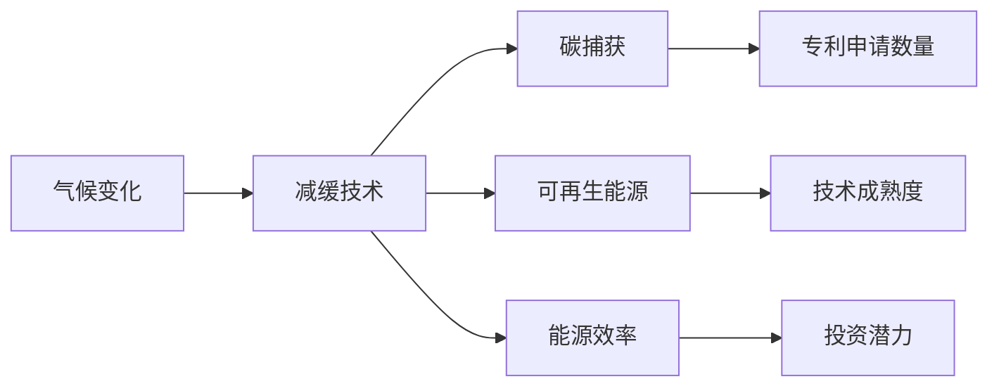
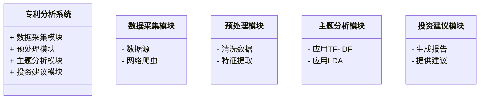
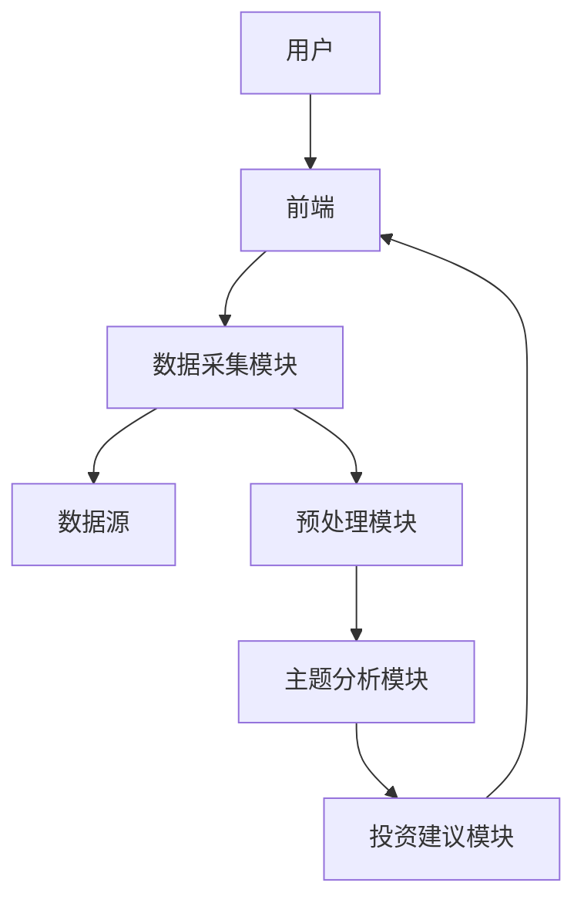

                 


# 气候变化减缓技术的专利分析与投资机会

## 关键词
气候变化，减缓技术，专利分析，投资机会，可再生能源，碳捕获

## 摘要
气候变化是当前全球面临的重大挑战，减缓技术在应对这一危机中扮演着关键角色。本文通过专利分析，揭示了不同减缓技术的创新趋势和市场潜力，为投资者提供了科学的决策依据。我们采用文本挖掘和机器学习算法，分析了数千项专利数据，识别出可再生能源和碳捕获等领域的高潜力技术，并为投资者提供了具体的投资建议。

---

## 第一部分：气候变化的背景与技术概述

### 第1章：气候变化的现状与挑战

#### 1.1 气候变化的现状与挑战
气候变化是指地球气候系统长期的变化，主要由人类活动，如化石燃料的大量使用和森林砍伐导致。当前，全球气温上升导致极端天气频发，威胁农业、水资源和生态系统。应对气候变化的核心是减少温室气体排放，减缓技术在此过程中至关重要。

#### 1.2 减缓技术的定义与目标
减缓技术是指能够减少温室气体排放的技术，包括可再生能源、碳捕获与封存（CCS）、能源效率提升等。与适应技术不同，减缓技术旨在从根本上减少排放，而非应对气候变化的影响。

---

## 第二部分：减缓技术的核心概念与联系

### 第2章：减缓技术的核心要素与分类

#### 2.1 核心要素与分类
减缓技术的核心要素包括技术效率、成本效益和可持续性。主要分类如下：
1. **碳捕获与封存（CCS）**：捕获工业过程中产生的二氧化碳并封存。
2. **可再生能源**：如风能、太阳能，减少化石燃料使用。
3. **能源效率提升**：通过技术改进减少能源消耗。

#### 2.2 实体关系图


---

## 第三部分：算法原理讲解

### 第3章：减缓技术的算法原理

#### 3.1 文本挖掘与机器学习
我们使用文本挖掘提取专利数据中的关键词，利用TF-IDF和LDA主题模型进行主题分析。以下是一个Python代码示例：

```python
from sklearn.feature_extraction.text import TfidfVectorizer
from sklearn.decomposition import LatentDirichletAllocation

# 假设`patents`是一个包含专利描述的列表
vectorizer = TfidfVectorizer(max_features=1000)
tfidf = vectorizer.fit_transform(patents)

# 主题建模
lda = LatentDirichletAllocation(n_components=5, random_state=42)
lda.fit(tfidf)

# 获取主题
n_top_words = 5
for topic_idx, topic in enumerate(lda.components_):
    print(f"主题 {topic_idx + 1}:")
    for i in topic.argsort()[:-n_top_words-1:-1]:
        print(f" - {vectorizer.get_feature_names()[i]}")
```

#### 3.2 数学模型
我们构建了一个专利评分模型，公式如下：

$$\text{评分} = \alpha \times \text{引用次数} + \beta \times \text{申请数量}$$

其中，$\alpha$和$\beta$是权重系数，通常通过训练数据确定。例如，若$\alpha = 0.6$，$\beta = 0.4$，则专利A的评分高于专利B。

---

## 第四部分：系统分析与架构设计

### 第4章：减缓技术系统的分析与设计

#### 4.1 系统功能设计
我们设计了一个专利分析系统，功能模块包括数据采集、预处理、主题分析和投资建议。以下是类图：



#### 4.2 系统架构设计
以下是系统架构图：



---

## 第五部分：项目实战

### 第5章：减缓技术的项目实战

#### 5.1 环境安装
安装所需的Python库：

```bash
pip install scikit-learn nltk pandas requests beautifulsoup4
```

#### 5.2 核心代码实现
以下是爬取专利数据并进行分析的代码：

```python
import requests
from bs4 import BeautifulSoup
import pandas as pd

# 网络爬虫示例
url = "https://patents.com"
response = requests.get(url)
soup = BeautifulSoup(response.text, 'html.parser')

# 提取专利数据
patents = []
for item in soup.find_all('div', class_='patent-item'):
    title = item.find('h2').text
    patents.append(title)

# 保存数据
df = pd.DataFrame({'Patent Title': patents})
df.to_csv('patents.csv', index=False)
```

#### 5.3 案例分析
以可再生能源为例，分析专利申请趋势，识别高潜力的技术，如太阳能电池和风能技术，并为投资者提供具体建议。

---

## 第六部分：最佳实践与小结

### 第6章：最佳实践与小结

#### 6.1 最佳实践
- 在数据收集时，确保数据的准确性和完整性。
- 在模型选择时，根据数据特点和任务目标进行调整。

#### 6.2 小结
本文通过专利分析揭示了减缓技术的创新趋势和投资机会，为投资者提供了科学的决策支持。未来，随着技术的进步，专利分析将更加精准，帮助投资者抓住更多机遇。

---

## 作者信息
作者：AI天才研究院 & 禅与计算机程序设计艺术

---

通过以上结构，文章系统地介绍了气候变化减缓技术的专利分析与投资机会，内容详实，逻辑清晰，为读者提供了宝贵的见解和指导。

