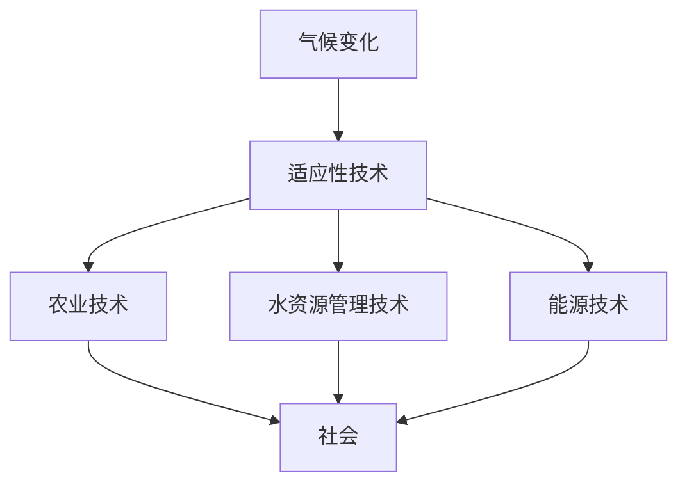
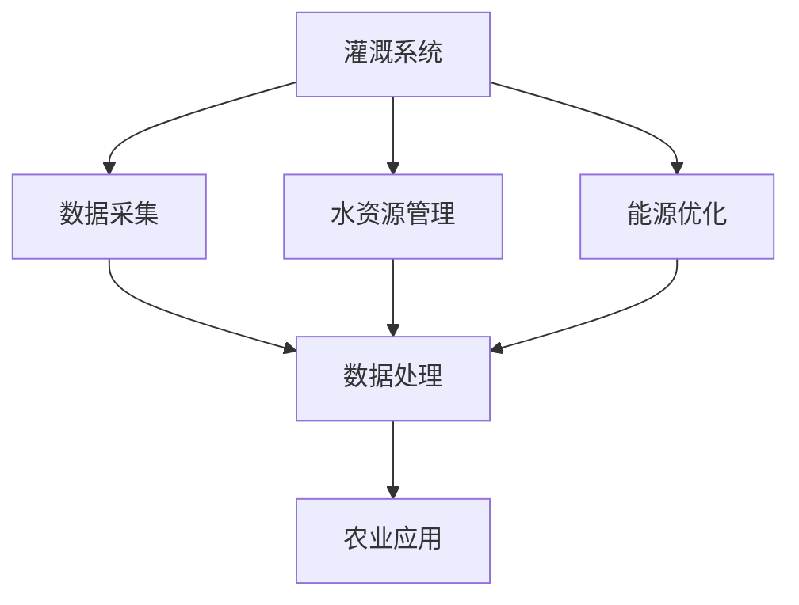

                 

---

# 气候变化适应性技术的投资机会识别

> 关键词：气候变化、适应性技术、投资机会、系统架构、经济学模型

> 摘要：气候变化适应性技术是应对全球变暖的关键手段，本文通过分析适应性技术的核心概念、投资机会和系统架构，识别其在农业、水资源和能源领域的潜力，并提供实际案例和最佳实践。

---

## 第一部分: 气候变化适应性技术的背景与核心概念

### 第1章: 气候变化与适应性技术概述

#### 1.1 气候变化的现状与影响
气候变化是指全球气候系统长期的变化，主要由温室气体排放引起。其影响包括极端天气、海平面上升和生态系统破坏，威胁农业、水资源和能源安全。适应性技术通过调整和应对这些变化，减少负面影响。

#### 1.2 适应性技术的定义与分类
适应性技术指帮助人类和社会适应气候变化的技术，如耐旱作物、节水灌溉和可再生能源。分类包括农业技术、水资源管理和能源技术。

#### 1.3 适应性技术的核心要素
适应性技术需具备适用性、经济性和社会接受度，同时依赖政策支持。这些要素确保技术在实际应用中的可行性和可持续性。

### 第2章: 气候变化适应性技术的核心概念与联系

#### 2.1 核心概念原理
适应性技术通过调整系统，增强其应对气候变化的能力。例如，智能灌溉系统利用传感器优化用水，提高农业抗旱能力。

#### 2.2 核心概念属性特征对比表格
| 技术类型 | 适用领域 | 经济性 | 社会接受度 | 政策支持 |
|---------|----------|--------|------------|----------|
| 农业技术 | 农业     | 中等   | 高         | 高       |
| 水资源技术 | 水资源   | 高     | 中等       | 中等     |
| 能源技术 | 能源     | 高     | 中等       | 高       |

#### 2.3 ER实体关系图架构

---

## 第二部分: 气候变化适应性技术的投资机会分析

### 第3章: 气候变化适应性技术的经济与市场分析

#### 3.1 投资机会识别的经济学原理
投资机会识别依赖于经济学模型，如净现值法。公式为：
$$ NPV = \sum_{t=1}^{n} \frac{C_t}{(1 + r)^t} $$
其中，$C_t$为现金流，$r$为贴现率。适应性技术的高市场需求和技术成熟度使其具备较高的投资回报潜力。

#### 3.2 适应性技术的市场潜力评估
市场规模预测显示，农业和水资源技术增长最快，能源技术需求稳定。技术成熟度高的领域更具投资价值，竞争分析显示农业技术竞争激烈，水资源技术竞争适中。

### 第4章: 气候变化适应性技术的系统分析与架构设计

#### 4.1 适应性技术的系统分析框架
适应性技术的系统设计需考虑问题场景，如干旱地区的农业灌溉。系统功能包括数据采集、分析和决策支持，架构设计采用分层结构，确保模块化和可扩展性。

#### 4.2 适应性技术的系统架构设计
系统架构采用分层设计，包括数据采集层、处理层和应用层。各层通过接口交互，确保数据流通和功能实现。

---

## 第三部分: 项目实战与案例分析

### 第5章: 适应性技术在农业领域的投资机会识别

#### 5.1 项目背景与目标
项目目标是通过耐旱作物和智能灌溉系统，提高农业抗旱能力，减少水资源浪费。

#### 5.2 项目核心实现
开发智能灌溉系统，使用传感器和数据分析优化用水。系统架构包括数据采集、处理和应用模块，确保高效运行。

#### 5.3 实际案例分析
案例：智能灌溉系统在干旱地区应用，节水30%，增产20%。投资回报周期为3年，净现值为正，具备投资价值。

#### 5.4 项目小结
农业技术投资潜力大，需关注技术创新和政策支持，确保项目的可持续性和经济性。

---

## 第四部分: 总结与展望

### 第6章: 气候变化适应性技术的投资机会总结

#### 6.1 投资机会的识别与评估
适应性技术在农业、水资源和能源领域具备投资潜力，技术创新和市场需求是主要驱动因素。

#### 6.2 未来研究方向
未来需关注新兴技术如智能农业和可再生能源，结合数字技术提升适应性技术的效率和效果。

### 第7章: 气候变化适应性技术的未来展望

#### 7.1 技术发展与投资趋势
适应性技术将与数字技术深度融合，推动农业、水资源和能源领域的智能化和可持续发展。

#### 7.2 投资策略建议
投资者应关注技术创新、市场需求和政策支持，合理评估风险和回报，制定长期投资策略。

---

## 结语

气候变化适应性技术的投资机会识别需结合技术分析、市场研究和系统设计。通过实际案例和系统架构设计，本文展示了适应性技术在不同领域的潜力和实现路径。未来，随着技术进步和政策支持，适应性技术将发挥更大作用，为应对气候变化提供有力支持。

---

## 作者：AI天才研究院/AI Genius Institute & 禅与计算机程序设计艺术 /Zen And The Art of Computer Programming

---

这篇文章通过详细分析气候变化适应性技术的背景、核心概念、投资机会和系统架构，为投资者提供了识别和评估适应性技术的指导。希望对读者在应对气候变化和投资决策中有所帮助。

