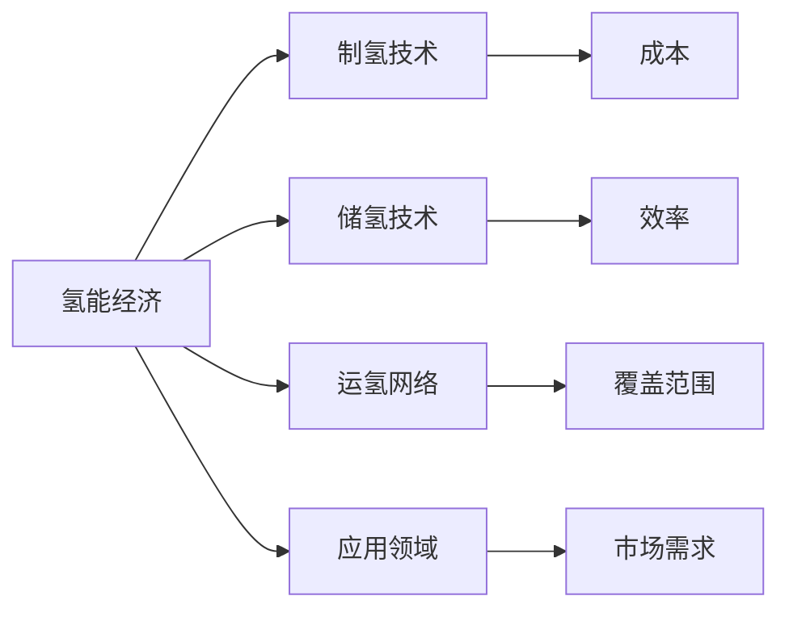
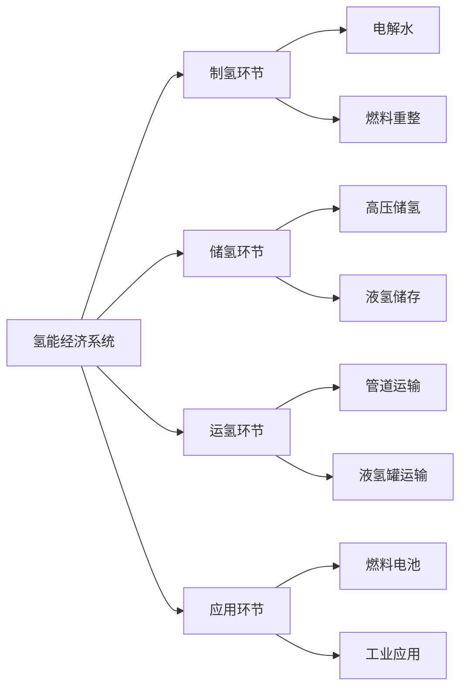

                 

# 氢能源经济的发展前景与投资策略

## 关键词：氢能源经济、氢能发展、投资策略、政策支持、技术分析、市场分析

## 摘要：  
氢能源作为一种清洁、高效、可持续的能源形式，正逐渐成为全球能源转型的重要组成部分。随着技术进步和政策支持的加强，氢能源经济展现出巨大的发展潜力。本文从氢能的技术现状、经济性、市场结构、政策支持以及投资策略等多方面进行深入分析，探讨氢能源经济的发展前景，并为投资者提供实用的策略建议。  

---

## 第1章: 氢能能源的基本概念与背景介绍  

### 1.1 氢能的定义与特点  
氢能是通过氢气（H₂）的化学能转换为其他形式能量的能源。作为一种清洁能源，氢能在燃烧或反应过程中几乎不产生污染物，仅产生水和热。其主要特点包括：  
- **高能量密度**：氢气的热值高，质量能量密度约为142 MJ/kg，仅次于铀-235。  
- **零碳排放**：在燃料电池中，氢气与氧气反应仅生成水，无碳排放。  
- **可储存性**：氢气可以通过多种方式储存，适用于多种应用场景。  

### 1.2 氢能能源的背景与问题背景  
全球能源结构正面临转型压力，气候变化和环境污染问题亟待解决。氢能作为一种清洁能源，被视为替代传统化石能源的重要选择。然而，氢能的推广也面临诸多挑战，包括：  
- **技术瓶颈**：制氢、储氢和运氢技术尚未完全成熟。  
- **成本问题**：目前氢能的成本较高，尚未具备与传统能源竞争的优势。  
- **基础设施**：氢气的储存和运输需要特殊设备，现有基础设施不足。  

### 1.3 氢能产业链的构成与核心要素  
氢能产业链包括制氢、储氢、运氢和应用四个主要环节：  
1. **制氢**：通过电解水、化石燃料重整等方法生产氢气。  
2. **储氢**：采用高压储氢、液氢储存等方式储存氢气。  
3. **运氢**：通过管道、液氢罐等方式运输氢气。  
4. **应用**：氢能在交通、发电、工业等领域有广泛应用潜力。  

---

## 第2章: 氢能经济的核心概念与联系  

### 2.1 氢能经济的核心概念原理  
氢能经济是指以氢气为载体，通过制氢、储氢、运氢和应用环节形成的经济体系。其核心在于通过技术创新和成本降低，推动氢能在各个领域的广泛应用。  

### 2.2 氢能经济的核心概念属性对比  
以下是氢能与其他能源的对比分析：  

| 属性       | 煤炭       | 天然气     | 氢能     |  
|------------|------------|------------|----------|  
| 碳排放     | 高         | 中         | 零        |  
| 能量密度   | 低         | 中         | 高        |  
| 技术成熟度 | 高         | 高         | 中        |  

### 2.3 氢能经济的ER实体关系图  
以下是一个简化的氢能经济实体关系图：  

---

## 第3章: 氢能经济的数学模型与公式分析  

### 3.1 氢能经济的成本分析模型  
氢气的制备成本是决定其经济性的关键因素。以下是几种常见的制氢成本计算公式：  

#### 1. 电解水制氢成本公式  
$$ \text{电解水制氢成本} = \frac{\text{电能成本} + \text{设备折旧} + \text{维护成本}}{\text{年产量}} $$  

#### 2. 石化燃料重整制氢成本公式  
$$ \text{重整制氢成本} = \frac{\text{燃料成本} + \text{设备折旧} + \text{维护成本}}{\text{年产量}} $$  

### 3.2 氢能经济的市场需求模型  
氢气的需求量与价格密切相关。需求函数通常采用幂函数形式：  
$$ Q = aP^b $$  
其中，$Q$ 是需求量，$P$ 是价格，$a$ 和 $b$ 是参数，$b$ 通常为负数，表示价格上升需求下降。  

### 3.3 氢能经济的市场均衡分析  
市场均衡时，氢气的价格等于供给成本。假设供给函数为：  
$$ S = cP^d $$  
需求函数为：  
$$ D = aP^b $$  
市场均衡时，$S = D$，即：  
$$ cP^d = aP^b $$  
解得均衡价格：  
$$ P^* = \left(\frac{c}{a}\right)^{\frac{1}{b - d}} $$  

---

## 第4章: 氢能经济的系统分析与架构设计  

### 4.1 氢能经济的系统构成与功能设计  
氢能经济系统由以下几个核心模块构成：  
1. **制氢模块**：负责氢气的生产，包括电解水、化石燃料重整等技术。  
2. **储氢模块**：负责氢气的储存，包括高压储氢、液氢储存等方式。  
3. **运氢模块**：负责氢气的运输，包括管道运输、液氢罐运输等。  
4. **应用模块**：负责氢气的使用，包括燃料电池、工业应用等。  

### 4.2 氢能经济的系统架构设计  
以下是一个简化的氢能经济系统架构图：  

---

## 第5章: 氢能经济的投资策略分析  

### 5.1 氢能经济的投资背景与驱动因素  
随着全球能源转型的推进，氢能在交通、工业和发电等领域的需求不断增长。投资者需要关注以下驱动因素：  
- **政策支持**：政府对氢能产业的补贴和税收优惠。  
- **技术进步**：制氢、储氢技术的突破将降低成本。  
- **市场需求**：氢能在交通领域的应用潜力巨大。  

### 5.2 氢能经济的投资模式与风险分析  
#### 1. 投资模式  
氢能经济的投资模式主要包括：  
- **直接投资**：投资制氢厂、加氢站等基础设施。  
- **股权投资**：投资氢能相关企业或项目。  
- **技术创新投资**：投资氢能技术的研发与商业化。  

#### 2. 风险分析  
氢能经济的投资风险主要包括：  
- **技术风险**：制氢、储氢技术尚未完全成熟。  
- **市场风险**：市场需求的不确定性。  
- **政策风险**：政策支持的不确定性和变化。  

### 5.3 氢能经济的投资策略建议  
#### 1. 短期策略  
- 投资制氢技术的研发与商业化。  
- 投资氢能在交通领域的应用，如燃料电池汽车。  

#### 2. 中长期策略  
- 投资氢能基础设施建设，如加氢站和运氢网络。  
- 关注氢能在工业领域的应用，如化工、冶金等行业的能源替代。  

---

## 第6章: 氢能经济的发展趋势与未来展望  

### 6.1 氢能经济的技术发展趋势  
随着技术的进步，氢能在制氢、储氢和应用领域的技术瓶颈将逐步被突破。例如：  
- **可再生能源制氢**：利用风能、太阳能等可再生能源电解水制氢。  
- **新型储氢技术**：如固态储氢技术的开发。  

### 6.2 氢能经济的市场发展趋势  
预计未来几年，氢能在全球能源结构中的占比将逐步提高。根据国际能源署（IEA）的预测，到2050年，氢能在全球能源需求中的占比将达到15%以上。  

### 6.3 氢能经济的挑战与对策  
尽管氢能经济前景广阔，但仍面临以下挑战：  
- **技术瓶颈**：制氢、储氢技术仍需突破。  
- **成本问题**：氢气的成本较高，需要进一步降低成本。  
- **基础设施**：氢气的储存和运输需要完善的基础设施支持。  

应对策略包括：  
- 加大技术研发投入。  
- 推动政策支持与国际合作。  

---

## 作者：AI天才研究院/AI Genius Institute & 禅与计算机程序设计艺术 /Zen And The Art of Computer Programming  

---

通过以上分析，氢能源经济的发展前景广阔，但同时也面临技术和成本等多方面的挑战。投资者需要结合政策、技术和市场多方面的因素，制定合理的投资策略，抓住氢能经济的发展机遇。

