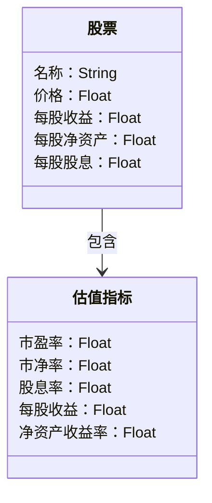

                 

# 《沃伦·巴菲特对市场估值指标的看法》

## 关键词：沃伦·巴菲特，市场估值，市盈率，市净率，股息率，投资策略

## 摘要

本文深入探讨了沃伦·巴菲特如何看待和运用市场估值指标，分析了他的投资策略及其背后的哲学，详细解释了市盈率、市净率、股息率等核心指标，并结合实际案例说明如何在投资中应用这些指标。文章结构清晰，内容丰富，适合投资者和对巴菲特投资理念感兴趣的人阅读。

---

## 第一部分：引言

### 1.1 沃伦·巴菲特及其投资理念

#### 1.1.1 沃伦·巴菲特的生平简介

沃伦·巴菲特（Warren Buffett），1934年8月31日出生于美国奥马哈市，是全球著名的投资家、慈善家。他通过伯克希尔·哈撒韦公司（Berkshire Hathaway）的投资成功，成为世界富豪榜上的常客。巴菲特的投资理念强调长期价值投资，注重基本面分析，尤其是企业的内在价值。

#### 1.1.2 巴菲特的投资哲学与价值观

巴菲特的价值投资理念基于以下几点：
1. **长期持有优质资产**：寻找那些具有持续竞争优势、良好管理和稳固财务状况的公司。
2. **安全边际**：以低于内在价值的价格买入，确保有足够的安全空间。
3. **价值与价格分离**：价格围绕价值波动，长期来看，价值将决定价格。
4. **关注企业基本面**：重点分析企业的盈利能力、成长性和财务健康状况。

#### 1.1.3 巴菲特与市场估值指标的核心关联

市场估值指标是巴菲特评估企业内在价值的重要工具。他不仅关注企业的财务表现，还通过估值指标判断股票是否被市场合理定价。这些指标帮助他识别低估或高估的投资标的，从而做出投资决策。

---

### 1.2 市场估值指标的基本概念

#### 1.2.1 什么是市场估值指标

市场估值指标是用于评估企业股票在市场上的价值的工具，帮助投资者判断股票是否被高估或低估。常见的指标包括市盈率、市净率、股息率等。

#### 1.2.2 市场估值指标的作用与意义

1. **衡量企业价值**：通过比较企业的内在价值和市场价值，判断投资的安全边际。
2. **指导投资决策**：帮助投资者在不同股票之间做出选择，优化投资组合。
3. **识别投资机会**：发现被市场低估的企业，提前布局。

#### 1.2.3 市场估值指标的分类与应用场景

市场估值指标可分为盈利能力、成长能力、财务健康和估值指标四类。本文主要讨论估值指标，包括市盈率、市净率、股息率等。

---

### 1.3 本书的核心内容与目标

#### 1.3.1 本书的核心观点

本书旨在分析巴菲特如何使用市场估值指标进行投资，探讨这些指标的计算方法、应用场景及其在投资决策中的作用。

#### 1.3.2 本书的结构与逻辑

1. 引言：介绍巴菲特及其投资理念。
2. 核心概念：详细讲解市场估值指标的定义、计算和优缺点。
3. 巴菲特的估值方法：分析他如何综合运用这些指标。
4. 实战案例：通过具体案例说明指标的应用。
5. 总结：总结巴菲特的估值哲学及其对投资者的启示。

#### 1.3.3 本书的阅读方法与建议

建议读者结合实际案例，理解每种指标的优缺点，并在实际投资中灵活运用。同时，注意市场环境的变化对估值指标的影响。

---

## 第二部分：市场估值指标的核心概念

### 2.1 市盈率（P/E Ratio）

#### 2.1.1 市盈率的定义与计算公式

市盈率（P/E Ratio）= 股票价格 / 每股收益（EPS）

公式为：
$$
P/E = \frac{P}{EPS}
$$

其中，P为股票价格，EPS为每股收益。

#### 2.1.2 市盈率的优缺点分析

优点：
- 反映市场对企业的盈利预期。
- 易于计算，数据获取方便。

缺点：
- 受企业盈利波动影响大。
- 无法反映企业的资产价值。

#### 2.1.3 巴菲特对市盈率的看法与应用

巴菲特认为，市盈率可以帮助判断企业的估值水平。他更倾向于选择市盈率较低的股票，尤其是那些盈利稳定、增长潜力大的企业。例如，他会寻找市盈率低于市场平均水平且具有竞争优势的企业。

---

### 2.2 市净率（P/B Ratio）

#### 2.2.1 市净率的定义与计算公式

市净率（P/B Ratio）= 股票价格 / 每股净资产（BPS）

公式为：
$$
P/B = \frac{P}{BPS}
$$

其中，P为股票价格，BPS为每股净资产。

#### 2.2.2 市净率的优缺点分析

优点：
- 适用于评估资产密集型企业的价值。
- 能反映企业的资产质量。

缺点：
- 受行业特性影响较大。
- 高负债企业可能导致市净率失真。

#### 2.2.3 巴菲特对市净率的看法与应用

巴菲特认为，市净率是评估银行和保险公司等资产密集型企业的有效工具。他通常选择市净率低于1的企业，尤其是那些资产质量高且盈利能力强的公司。

---

### 2.3 股息率（Dividend Yield）

#### 2.3.1 股息率的定义与计算公式

股息率 = 每股股息（DIV） / 股票价格（P）

公式为：
$$
\text{股息率} = \frac{DIV}{P}
$$

#### 2.3.2 股息率的优缺点分析

优点：
- 反映企业分红能力。
- 适合保守型投资者。

缺点：
- 受股价波动影响大。
- 高股息率可能暗示企业增长潜力有限。

#### 2.3.3 巴菲特对股息率的看法与应用

巴菲特并不特别强调股息率，但倾向于投资那些能够持续分红且股息率合理的公司。他更关注企业的盈利能力和成长性，而非单纯的股息回报。

---

### 2.4 其他重要估值指标

#### 2.4.1 每股收益（EPS）

每股收益 = 净利润 / 总股本

公式为：
$$
EPS = \frac{\text{净利润}}{\text{总股本}}
$$

#### 2.4.2 净资产收益率（ROE）

净资产收益率 = 净利润 / 平均净资产

公式为：
$$
ROE = \frac{\text{净利润}}{\text{平均净资产}}
$$

---

## 第三部分：系统分析与架构设计

### 3.1 问题场景介绍

投资者需要通过分析企业财务报表和市场估值指标，选择具有投资价值的股票。本文以巴菲特的投资策略为框架，构建一个基于市场估值指标的投资分析系统。

### 3.2 项目介绍

本系统旨在帮助投资者快速评估企业价值，辅助投资决策。系统功能包括数据采集、指标计算、指标分析和投资建议生成。

### 3.3 系统功能设计

#### 3.3.1 领域模型类图

#### 3.3.2 系统架构设计

---

## 第四部分：项目实战

### 4.1 实战案例分析

#### 4.1.1 可口可乐公司的分析

1. **市盈率**：假设可口可乐股价为50美元，每股收益为2.5美元，则市盈率为20。
2. **市净率**：假设每股净资产为10美元，市净率为5。
3. **股息率**：假设股息为1.25美元，股息率为2.5%。

通过这些指标，巴菲特判断可口可乐具有稳定的收益和合理的估值，符合他的投资标准。

---

## 第五部分：总结与注意事项

### 5.1 最佳实践 tips

- **多指标结合**：综合运用市盈率、市净率等指标，全面评估企业价值。
- **关注长期趋势**：分析指标的长期变化趋势，而非短期波动。
- **行业特性考虑**：不同行业的估值指标标准不同，需结合行业特点分析。

### 5.2 小结

沃伦·巴菲特的成功投资策略基于对市场估值指标的深入理解和灵活运用。通过合理使用这些指标，投资者可以更准确地评估企业价值，做出明智的投资决策。

### 5.3 注意事项

- 市场估值指标仅为参考工具，需结合企业基本面分析。
- 市场环境变化会影响指标的有效性，需及时调整策略。
- 投资需谨慎，建议根据自身风险承受能力进行投资。

### 5.4 拓展阅读

推荐阅读巴菲特的《聪明的投资者》和彼得·林奇的《战胜市场的人》，深入理解价值投资的理念和方法。

---

## 作者：AI天才研究院/AI Genius Institute & 禅与计算机程序设计艺术 /Zen And The Art of Computer Programming

---

**感谢您的阅读！**

