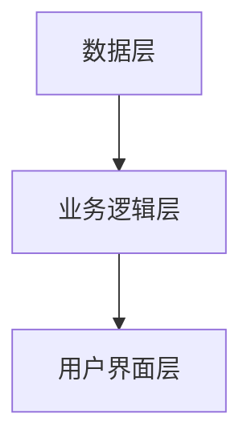
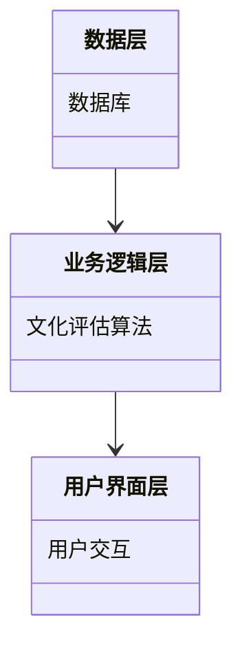

                 


# 沃伦·巴菲特的公司文化评估方法

> 关键词：沃伦·巴菲特，公司文化，评估方法，投资策略，价值投资，企业文化

> 摘要：本文深入分析了沃伦·巴菲特的公司文化评估方法，探讨了其文化评估的核心理念、标准、工具以及数学模型。通过系统分析与架构设计，结合实际案例，详细讲解了如何将巴菲特的投资理念应用于企业文化评估中，帮助投资者和企业管理者更好地理解和应用这一方法。

---

## 第1章: 沃伦·巴菲特投资理念与文化评估背景

### 1.1 沃伦·巴菲特的生平与投资哲学

#### 1.1.1 巴菲特的成长经历与投资理念
沃伦·巴菲特（Warren Buffett）是全球最著名的职业投资者之一，被誉为“股神”。他出生于1934年，早年通过投资俱乐部和合伙企业积累了丰富的投资经验。巴菲特的投资理念以“价值投资”为核心，强调寻找具有持续竞争优势和良好管理团队的企业，长期持有，等待其内在价值的实现。

#### 1.1.2 巴菲特的价值投资理论
巴菲特的价值投资理论强调企业内在价值的重要性。他认为，市场短期可能疯狂，但长期会回归企业的真实价值。因此，投资者需要关注企业的基本面，包括财务状况、盈利能力、管理团队和企业文化等因素。

#### 1.1.3 巴菲特对文化评估的重视
在巴菲特看来，企业文化是决定企业长期成功的关键因素之一。他特别关注企业的管理团队稳定性、员工激励机制、企业创新文化以及财务透明度等指标。

---

### 1.2 公司文化评估的重要性

#### 1.2.1 企业文化对企业价值的影响
企业文化是企业的灵魂，它决定了企业的行为方式、决策风格和长期发展方向。良好的企业文化能够增强员工的凝聚力，提升企业的市场竞争力，从而为企业创造更大的价值。

#### 1.2.2 投资者如何通过文化评估筛选优质企业
投资者通过评估企业文化，可以筛选出那些具有稳定管理团队、良好激励机制和持续创新能力的企业。这些企业更有可能在长期实现价值增长。

#### 1.2.3 文化评估在长期投资中的战略意义
在长期投资中，企业文化评估是投资者制定投资策略的重要依据。通过文化评估，投资者可以更好地识别企业的潜在风险和成长潜力，从而做出更明智的投资决策。

---

## 第2章: 巴菲特的文化评估标准与核心要素

### 2.1 巴菲特文化评估的核心维度

#### 2.1.1 高层管理团队的稳定性与价值观
巴菲特认为，管理团队的稳定性和价值观是企业文化的重要组成部分。他倾向于选择那些具有长期稳定管理团队的企业，因为这些团队更有可能坚持企业的长期目标。

#### 2.1.2 企业经营理念与长期目标
企业的经营理念和长期目标反映了其文化的核心价值观。巴菲特关注那些具有明确长期目标并能够持续创新的企业。

#### 2.1.3 员工激励机制与企业凝聚力
良好的员工激励机制是企业文化的重要组成部分。巴菲特认为，具有强大凝聚力的企业能够吸引和留住优秀人才，从而为企业创造更大的价值。

#### 2.1.4 企业创新文化与适应能力
在快速变化的市场环境中，企业的创新能力和适应能力至关重要。巴菲特倾向于选择那些能够不断适应市场变化并保持创新活力的企业。

#### 2.1.5 企业财务健康状况与透明度
财务健康状况和透明度是企业文化的重要指标。巴菲特认为，具有健康财务状况和高透明度的企业更值得投资。

---

### 2.2 文化评估的标准与指标

#### 2.2.1 企业文化的定性评估指标
- 管理团队的稳定性与价值观
- 企业的长期目标与经营理念
- 员工激励机制与凝聚力
- 企业的创新文化与适应能力

#### 2.2.2 企业文化的定量评估指标
- 财务健康状况（如净利润率、资产负债率等）
- 股东回报率（ROE）
- 企业成长性（如收入增长率）

#### 2.2.3 文化评估的综合评分体系
巴菲特的文化评估体系将定性与定量指标相结合，采用加权评分的方法，对企业的文化进行全面评估。例如：

$$ \text{文化评分} = \sum (\text{指标权重} \times \text{指标评分}) $$

---

## 第3章: 巴菲特文化评估方法的详细解析

### 3.1 文化评估的步骤与流程

#### 3.1.1 确定评估目标与范围
投资者需要明确评估的目标和范围，例如评估目标是筛选具有长期增长潜力的企业，范围是特定行业或地区。

#### 3.1.2 收集企业相关信息与数据
通过企业年报、新闻报道、行业分析等渠道，收集企业的管理团队、财务状况、员工激励机制等信息。

#### 3.1.3 分析企业文化的核心特征
通过定性分析和定量分析，识别企业的核心文化特征，例如管理团队的稳定性、创新文化等。

#### 3.1.4 综合评估与结果解读
根据评估指标和权重，对企业的文化进行综合评分，并解读评估结果，为投资决策提供依据。

---

### 3.2 文化评估的工具与方法

#### 3.2.1 定性分析方法
- 文化价值观分析
- 管理团队稳定性分析
- 员工激励机制分析

#### 3.2.2 定量分析方法
- 财务指标分析
- 市场表现分析
- 股东回报率分析

#### 3.2.3 综合评估模型
通过构建综合评估模型，将定性与定量指标相结合，对企业的文化进行全面评估。

---

## 第4章: 巴菲特文化评估的数学模型与算法原理

### 4.1 文化评估的数学模型

#### 4.1.1 企业文化的评分体系
企业文化的评分体系包括多个指标，每个指标都有一定的权重。例如：

$$ \text{文化评分} = w_1 \times \text{管理团队评分} + w_2 \times \text{创新文化评分} + \cdots + w_n \times \text{财务健康评分} $$

其中，$w_i$ 是每个指标的权重，$\text{指标评分}$ 是每个指标的具体评分。

#### 4.1.2 文化评估的加权算法
加权算法的核心思想是根据每个指标的重要性赋予不同的权重，从而计算出综合评分。例如：

$$ \text{综合评分} = \sum_{i=1}^{n} (w_i \times s_i) $$

其中，$w_i$ 是第 $i$ 个指标的权重，$s_i$ 是第 $i$ 个指标的评分。

#### 4.1.3 评估结果的数学表达
通过数学表达式，可以清晰地展示评估结果。例如，假设某企业的综合评分为85分，则可以表示为：

$$ \text{综合评分} = 85 $$

---

### 4.2 文化评估的算法流程

#### 4.2.1 数据输入与预处理
- 收集企业的相关数据
- 清洗数据，确保数据的准确性和完整性

#### 4.2.2 指标权重的确定
- 根据企业的特点和投资目标，确定每个指标的权重

#### 4.2.3 综合评分计算
- 根据加权算法，计算企业的综合评分

#### 4.2.4 结果分析与优化
- 分析评估结果，识别潜在问题
- 根据需要调整权重和指标，优化评估模型

---

## 第5章: 系统分析与架构设计方案

### 5.1 系统分析

#### 5.1.1 问题场景介绍
在投资领域，评估企业文化是一个复杂的过程，需要结合多种因素进行分析。

#### 5.1.2 项目介绍
本项目旨在构建一个基于巴菲特文化评估方法的企业文化评估系统。

#### 5.1.3 系统功能设计
- 数据收集与处理
- 文化评估指标计算
- 综合评分展示

#### 5.1.4 系统架构设计
采用分层架构，包括数据层、业务逻辑层和用户界面层。

#### 5.1.5 系统接口设计
- 数据接口：与企业数据库对接
- 用户接口：供投资者输入评估需求

#### 5.1.6 系统交互设计
- 用户输入评估需求
- 系统计算并展示评估结果

---

### 5.2 系统架构设计

#### 5.2.1 系统架构图


#### 5.2.2 系统功能设计


---

## 第6章: 项目实战与案例分析

### 6.1 环境安装

#### 6.1.1 安装Python
安装Python 3.x版本，确保环境配置正确。

#### 6.1.2 安装依赖库
安装必要的Python库，例如 `pandas`、`numpy` 和 `scikit-learn`。

---

### 6.2 系统核心实现源代码

#### 6.2.1 数据处理代码
```python
import pandas as pd

# 加载数据
data = pd.read_csv('企业数据.csv')

# 数据预处理
data = data.dropna()
```

#### 6.2.2 文化评估算法实现
```python
def calculate_culture_score(data, weights):
    return sum(weights[i] * data[i] for i in range(len(weights)))

# 示例权重
weights = [0.3, 0.2, 0.1, 0.2, 0.2]

# 计算文化评分
culture_score = calculate_culture_score(data, weights)
print(f"文化评分: {culture_score}")
```

---

### 6.3 实际案例分析

#### 6.3.1 案例分析
以某零售企业为例，分析其文化评估过程。

#### 6.3.2 代码实现
```python
# 示例数据
data = [90, 85, 80, 95, 85]
weights = [0.3, 0.2, 0.1, 0.2, 0.2]

# 计算文化评分
culture_score = sum(weights[i] * data[i] for i in range(len(weights)))
print(f"文化评分: {culture_score}")
```

---

## 第7章: 总结与展望

### 7.1 最佳实践 tips
- 在文化评估中，定性分析与定量分析相结合
- 根据企业特点调整评估指标和权重

### 7.2 小结
沃伦·巴菲特的公司文化评估方法为我们提供了一个系统化的评估框架，通过结合定性与定量分析，能够更好地识别优质企业。

### 7.3 注意事项
- 文化评估需要结合企业的实际情况
- 投资者需要不断优化评估模型

### 7.4 拓展阅读
- 巴菲特的经典投资著作
- 相关企业文化评估的学术研究

---

作者：AI天才研究院/AI Genius Institute & 禅与计算机程序设计艺术 /Zen And The Art of Computer Programming

