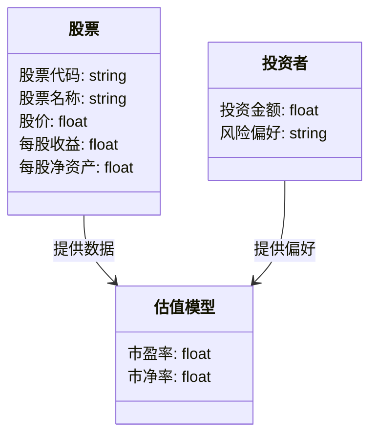

                 

# 法国股市估值: 欧元区重要经济体的投资价值

> 关键词：法国股市，股市估值，市盈率，市净率，欧元区经济，投资价值

> 摘要：本文系统地探讨了法国股市的估值方法，从基本概念到数学模型，再到实际应用，全面分析了法国股市的投资价值。通过详细分析市盈率和市净率等核心指标，结合法国股市的独特性，为投资者提供了实用的估值策略和风险管理建议。

---

# 第1章: 法国股市的概述与重要性

## 1.1 法国股市的定义与历史发展

法国股市是全球最重要的股票市场之一，其历史可以追溯到17世纪。巴黎证券交易所（Euronext Paris）是法国最大的证券交易所，也是欧元区的核心市场之一。法国股市的交易品种包括普通股、优先股、衍生品等。

- 法国股市的起源：1688年，巴黎建立了第一个股票交易所。
- 19世纪至20世纪：法国股市经历了多次改革和整合，逐步成为全球重要的金融市场。
- 21世纪：法国股市与欧元区其他国家的市场深度融合，成为全球投资者的重要配置对象。

## 1.2 欧元区经济与法国股市的关系

欧元区是全球第二大经济体，法国作为欧元区的第二大经济体（仅次于德国），其股市在全球经济中具有重要地位。

- 法国股市的行业分布：涵盖能源、金融、汽车、科技等多个领域。
- 法国股市对欧元区经济的反映：法国股市的表现可以反映欧元区经济的整体状况。
- 全球投资者的配置需求：法国股市因其多样性和稳定性，成为全球投资者的重要配置对象。

## 1.3 投资者视角下的法国股市

- 机构投资者：法国股市是全球机构投资者的重要配置对象。
- 个人投资者：法国股市提供了多样化的投资机会，适合不同风险偏好的投资者。
- 法国股市的独特性：法国股市的行业分布、政策环境和市场结构具有独特性，需要投资者深入研究。

---

# 第2章: 股市估值的核心概念与分析方法

## 2.1 股票估值的核心概念

股票估值是通过对公司基本面的分析，确定其股票的内在价值。核心概念包括：

- **市盈率（P/E）**：衡量股票的相对价值。
- **市净率（P/B）**：衡量股票相对于其账面价值的高低。
- **股息率**：衡量股票的分红能力。

## 2.2 市盈率与市净率的计算与应用

### 2.2.1 市盈率的计算

$$P/E = \frac{\text{股价}}{\text{每股收益}}$$

市盈率反映了投资者为每股收益支付的溢价。市盈率越低，通常意味着股票的投资价值越高。

### 2.2.2 市净率的计算

$$P/B = \frac{\text{股价}}{\text{每股净资产}}$$

市净率反映了股票相对于其账面价值的高低。市净率越低，通常意味着股票的投资价值越高。

### 2.2.3 市盈率与市净率的对比

| 指标 | 市盈率（P/E） | 市净率（P/B） |
|------|----------------|---------------|
| 定义 | 股价/每股收益 | 股价/每股净资产 |
| 适用场景 | 适用于盈利稳定的公司 | 适用于净资产较多的公司 |
| 优缺点 | 考虑了盈利能力，但受行业影响较大 | 考虑了资产价值，但受资产质量影响较大 |

---

# 第3章: 法国股市估值的数学模型

## 3.1 市盈率与市净率的数学模型

### 3.1.1 市盈率模型

$$P/E = \frac{\text{股价}}{\text{每股收益}}$$

假设某公司股价为50欧元，每股收益为5欧元，则市盈率为10。这意味着投资者为每股收益支付了10倍的溢价。

### 3.1.2 市净率模型

$$P/B = \frac{\text{股价}}{\text{每股净资产}}$$

假设某公司股价为50欧元，每股净资产为20欧元，则市净率为2.5。这意味着投资者为每股净资产支付了2.5倍的溢价。

---

# 第4章: 法国股市估值的系统分析与架构设计

## 4.1 系统功能设计

### 4.1.1 领域模型（Mermaid类图）

### 4.1.2 系统架构设计（Mermaid架构图）

---

# 第5章: 投资策略与案例分析

## 5.1 投资策略的制定

### 5.1.1 价值投资与成长投资的对比

| 战略 | 价值投资 | 成长投资 |
|------|----------|----------|
| 核心理念 | 买入低于内在价值的股票 | 买入具有高增长潜力的股票 |
| 适用场景 | 市场低迷或低估时 | 市场增长或高景气度时 |
| 代表人物 | 本·格雷厄姆 | 约翰·涅夫 |

### 5.1.2 技术分析与基本面分析的结合

- 技术分析：通过K线图、均线、成交量等指标判断买卖时机。
- 基本面分析：通过财务报表、行业地位、竞争优势等判断公司质地。

---

# 第6章: 风险管理与投资技巧

## 6.1 风险评估与控制

### 6.1.1 风险来源分析

- 市场风险：股市波动导致的损失。
- 信用风险：公司信用状况变化导致的损失。
- 流动性风险：难以以合理价格买卖股票的风险。

### 6.1.2 风险对冲策略

- 买入看跌期权：保护本金，锁定收益。
- 分批建仓：降低一次性投资的风险。
- 行业分散：避免单一行业风险。

---

# 第7章: 总结与未来趋势

## 7.1 本书内容的总结

本文系统地探讨了法国股市的估值方法，从基本概念到数学模型，再到实际应用，全面分析了法国股市的投资价值。通过详细分析市盈率和市净率等核心指标，结合法国股市的独特性，为投资者提供了实用的估值策略和风险管理建议。

## 7.2 未来趋势与投资机会

- **全球经济趋势**：全球经济复苏和技术创新将推动法国股市的增长。
- **行业发展趋势**：绿色能源、人工智能、高端制造等领域将带来新的投资机会。
- **政策环境**：法国政府的政策支持和监管改革将为股市注入新的活力。

---

# 附录

## 附录A: 常用估值工具与资源

### A.1 估值工具的介绍

- **Yahoo Finance**：提供实时股价、财务数据和估值指标。
- **Morningstar**：提供详细的公司分析和估值报告。
- **S&P Global**：提供行业分析和市场报告。

---

作者：AI天才研究院 & 禅与计算机程序设计艺术

