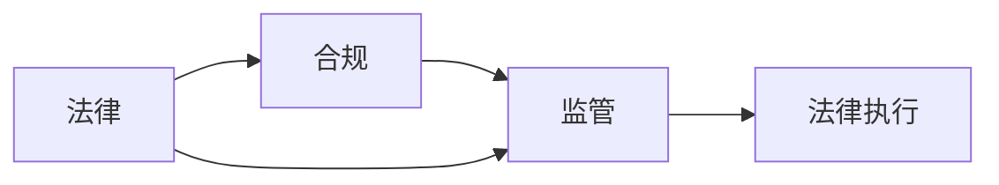
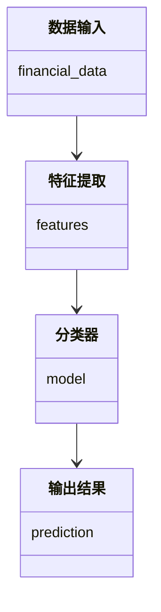
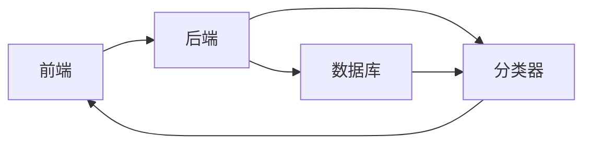

                 


# 法律合规与监管

> 关键词：法律合规、监管、合规算法、系统架构、案例分析

> 摘要：本文详细探讨了法律合规与监管的核心概念、算法原理、系统架构及实际应用。通过背景介绍、核心概念对比、算法实现、系统设计和案例分析，帮助读者全面理解法律合规与监管的内在联系及实际应用。

---

# 第一部分: 法律合规与监管概述

# 第1章: 法律合规与监管的背景介绍

## 1.1 法律的基本概念

### 1.1.1 法律的定义与特征

法律是规范社会行为的一系列规则，具有强制性和普遍性。法律的特征包括权威性、规范性和约束性。

$$法律 = \text{规范} + \text{约束} + \text{权威}$$

### 1.1.2 法律的分类与层次结构

法律可以分为宪法、民法、刑法等，形成一个层次分明的结构体系。

- **宪法**：国家的根本大法，具有最高的法律效力。
- **普通法律**：由立法机关制定，效力低于宪法。
- **行政法规**：由行政机关制定，效力低于普通法律。

## 1.2 合规的核心概念

### 1.2.1 合规的定义与范围

合规是指组织在经营活动中遵守相关法律法规、行业标准和内部政策的行为。合规的范围包括但不限于反腐败、反洗钱、数据隐私保护等。

$$合规 = \text{遵守} \times \text{法规} + \text{遵循} \times \text{标准}$$

### 1.2.2 合规的重要性与作用

合规是企业风险管理的重要组成部分，能够有效降低法律风险，提升企业信誉。

- **降低风险**：避免因违规行为导致的法律制裁。
- **提升信誉**：合规的企业更容易获得客户和合作伙伴的信任。
- **竞争优势**：合规企业在市场上更具竞争力。

## 1.3 监管的背景与目标

### 1.3.1 监管的定义与特点

监管是指政府或其他权威机构对市场、行业或组织的监督和管理，确保其遵守相关法律法规。

### 1.3.2 监管的主要目标与手段

监管的主要目标是维护市场秩序，保护消费者权益，促进公平竞争。监管手段包括法律制裁、经济处罚、行政命令等。

## 1.4 法律、合规与监管的关系

### 1.4.1 法律与合规的关系

法律是合规的依据，合规是法律的具体实践。

### 1.4.2 合规与监管的关系

合规是监管的基础，监管是合规的保障。

### 1.4.3 法律、合规与监管的系统性联系

法律、合规与监管三者相互依存，共同构建了一个完整的法律执行体系。

---

# 第二部分: 法律合规与监管的核心概念

# 第2章: 法律、合规与监管的核心要素

## 2.1 法律的核心要素

### 2.1.1 法律的制定与颁布

法律的制定和颁布是一个复杂的过程，通常包括立法、审议和发布三个阶段。

## 2.2 合规的核心要素

### 2.2.1 合规标准与规范

合规需要遵循的标准包括国际标准（如ISO）、行业标准（如金融行业的KYC规则）和内部政策。

### 2.2.2 合规风险与控制

识别和评估合规风险是制定合规策略的基础。

## 2.3 监管的核心要素

### 2.3.1 监管机构与职责

监管机构包括中央银行、证监会、银保监会等，职责包括制定监管政策、监督检查、处理违规行为等。

### 2.3.2 监管政策与执行

监管政策的制定和执行需要考虑市场环境、企业规模和行业特点。

## 2.4 法律、合规与监管的实体关系图



---

# 第三部分: 法律合规与监管的算法原理

# 第3章: 合规与监管的算法实现

## 3.1 合规分类算法

### 3.1.1 分类算法概述

分类算法用于将数据分为不同的类别，常用于合规风险评估。


### 3.1.2 合规分类器的实现

使用决策树分类器进行合规分类。

```python
# 合规分类器示例代码
from sklearn.tree import DecisionTreeClassifier
import pandas as pd

# 数据加载
data = pd.read_csv('compliance_data.csv')

# 特征提取
X = data[['feature1', 'feature2', 'feature3']]
y = data['label']

# 模型训练
model = DecisionTreeClassifier()
model.fit(X, y)

# 预测
new_data = pd.DataFrame([[feature1, feature2, feature3]])
predicted_label = model.predict(new_data)
print(predicted_label)
```

---

# 第四部分: 系统分析与架构设计

# 第4章: 系统分析与架构设计

## 4.1 问题场景介绍

假设我们正在设计一个合规管理系统，需要对企业的财务数据进行合规性检查。

## 4.2 领域模型设计



## 4.3 系统架构设计



---

# 第五部分: 项目实战

# 第5章: 项目实战

## 5.1 环境安装

安装必要的Python库：

```bash
pip install pandas scikit-learn
```

## 5.2 核心功能实现

实现合规分类器：

```python
from sklearn.tree import DecisionTreeClassifier
import pandas as pd

data = pd.read_csv('compliance_data.csv')
X = data[['feature1', 'feature2', 'feature3']]
y = data['label']

model = DecisionTreeClassifier()
model.fit(X, y)

new_data = pd.DataFrame([[1, 2, 3]])
predicted_label = model.predict(new_data)
print(predicted_label)
```

## 5.3 案例分析

分析一个企业的财务数据，判断其是否合规。

## 5.4 总结

通过实际案例分析，验证模型的准确性和适用性。

---

# 第六部分: 最佳实践

# 第6章: 最佳实践

## 6.1 小结

法律合规与监管是企业风险管理的重要组成部分，需要结合法律知识和先进技术。

## 6.2 注意事项

- 数据隐私保护
- 模型的可解释性
- 持续优化和更新

## 6.3 拓展阅读

推荐阅读相关书籍，如《法律风险管理》、《合规技术与实践》。

---

# 结语

法律合规与监管是一个复杂而重要的领域，结合法律知识和先进技术，可以帮助企业有效降低风险，提升竞争力。

---

作者：AI天才研究院/AI Genius Institute & 禅与计算机程序设计艺术 /Zen And The Art of Computer Programming

