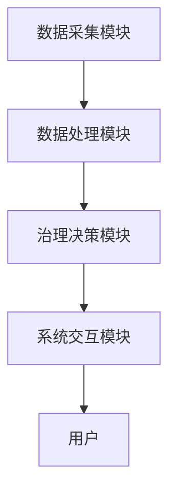

                 


# 海洋塑料污染治理技术的投资价值评估

## 关键词：海洋塑料污染，治理技术，投资价值，技术评估，环境经济

## 摘要：本文章探讨了海洋塑料污染治理技术的投资价值，从背景、核心概念、技术分析、投资评估、系统设计到项目实战，详细分析了如何评估海洋塑料污染治理技术的经济与环境效益。文章结合实际案例，提出了技术可行性与经济回报的平衡点，为投资者和技术开发者提供了决策支持。

---

## 第一部分: 背景与核心概念

### 第1章: 海洋塑料污染治理的背景与问题

#### 1.1 海洋塑料污染的现状与挑战

##### 1.1.1 海洋塑料污染的定义与来源
海洋塑料污染是指海洋环境中存在的塑料制品对生态系统造成破坏的现象。塑料垃圾的主要来源包括工业排放、生活废弃物、渔业活动和航运业。这些塑料最终通过河流、风暴潮和洋流进入海洋。

##### 1.1.2 海洋塑料污染的分布与影响
海洋塑料污染分布呈现明显的区域特征，例如马尾藻海、太平洋垃圾带等。塑料垃圾对海洋生物造成直接威胁，导致海洋生物误食或被缠绕，进而影响食物链和海洋生态系统的稳定性。

##### 1.1.3 全球治理海洋塑料污染的必要性
海洋塑料污染不仅威胁海洋生态，还对人类健康和经济活动产生负面影响。治理海洋塑料污染已成为全球关注的环境问题，需要技术与经济的双重解决方案。

#### 1.2 问题背景与描述

##### 1.2.1 海洋塑料污染的环境影响
塑料垃圾对海洋生物多样性造成严重破坏，例如微塑料被海洋生物误食，导致生理损害和死亡。此外，塑料分解过程中释放的有害物质对海洋水质造成污染。

##### 1.2.2 对海洋生态系统的破坏
塑料垃圾破坏海洋生态系统的平衡，影响海洋食物链的稳定性。例如，塑料纤维和微塑料通过食物链传递，最终影响人类健康。

##### 1.2.3 对人类健康与经济的影响
海洋塑料污染对渔业、旅游业和航运业造成经济损失。塑料垃圾不仅影响海洋资源的可持续利用，还威胁人类健康，增加了医疗成本。

#### 1.3 问题解决与技术需求

##### 1.3.1 治理技术的必要性
为了解决海洋塑料污染问题，需要开发有效的治理技术，包括物理收集、化学分解和生物降解等方法。

##### 1.3.2 技术与投资的结合
治理技术的开发和应用需要大量资金支持，因此技术的经济可行性是投资决策的关键因素。

##### 1.3.3 技术与经济的双重目标
治理技术不仅要有效减少塑料污染，还需要具备经济可行性，确保技术能够在市场上广泛应用。

### 第2章: 核心概念与联系

#### 2.1 投资价值评估的核心概念

##### 2.1.1 技术评估的基本框架
技术评估包括技术可行性、环境效益和经济回报三个维度。技术可行性分析需要考虑技术的成熟度、实施成本和维护难度。

##### 2.1.2 市场与经济分析
市场分析包括目标市场规模、竞争状况和政策支持。经济分析则需要考虑投资回报率、成本效益和风险评估。

##### 2.1.3 投资回报模型
投资回报模型结合技术的环境效益和经济回报，综合评估技术的投资价值。模型需要考虑时间和空间的动态变化。

#### 2.2 核心概念的属性对比

##### 2.2.1 技术可行性与经济可行性
技术可行性关注技术的科学性和实践性，而经济可行性关注技术的市场回报和成本控制。两者需要在投资决策中找到平衡点。

##### 2.2.2 环保效益与经济效益
环保效益是技术的环境价值，而经济效益是技术的市场价值。两者的结合决定了技术的综合投资价值。

##### 2.2.3 技术成熟度与投资风险
技术成熟度高则投资风险低，反之则风险高。技术成熟度是评估技术经济性的关键因素。

#### 2.3 ER实体关系图

```mermaid
erDiagram
    投资者 [ 投资者 ] {
        投资者ID
        投资金额
        投资期限
    }
    治理技术提供方 [ 治理技术提供方 ] {
        技术ID
        技术名称
        技术成本
    }
    环境监管机构 [ 环境监管机构 ] {
        监管ID
        监管要求
        政策支持
    }
    投资者 --> 治理技术提供方 : 选择技术
    治理技术提供方 --> 环境监管机构 : 满足监管要求
    环境监管机构 --> 投资者 : 提供政策支持
```

---

## 第二部分: 治理技术分析

### 第3章: 海洋塑料污染治理技术的分类与分析

#### 3.1 物理收集技术

##### 3.1.1 物理收集技术的原理
物理收集技术通过机械方法将海洋表面的塑料垃圾收集起来。例如，使用大型网具或浮动装置捕获塑料垃圾。

##### 3.1.2 技术优缺点
优点：操作简单，成本较低；缺点：收集效率有限，难以捕捉深层塑料垃圾。

##### 3.1.3 适用场景
适用于靠近海岸线或浅海区域的塑料污染治理。

#### 3.2 化学分解技术

##### 3.2.1 化学分解技术的原理
化学分解技术通过化学反应将塑料分解为小分子物质，例如使用催化剂或高温分解。

##### 3.2.2 技术优缺点
优点：能够分解难以回收的塑料制品；缺点：分解过程可能产生有害副产品，且成本较高。

##### 3.2.3 适用场景
适用于处理复杂塑料制品，如工业废弃物。

#### 3.3 生物降解技术

##### 3.3.1 生物降解技术的原理
生物降解技术利用微生物分解塑料，例如使用专有菌株分解聚乙烯和聚丙烯。

##### 3.3.2 技术优缺点
优点：环保且可持续；缺点：分解速度较慢，需要特定环境条件。

##### 3.3.3 适用场景
适用于处理可降解的塑料制品，如生物降解塑料袋和包装材料。

---

### 第4章: 治理技术的环境与经济影响分析

#### 4.1 技术的环境效益

##### 4.1.1 技术对海洋生态的保护
有效的治理技术能够减少塑料垃圾对海洋生物的威胁，保护海洋生态系统的平衡。

##### 4.1.2 技术对气候变化的影响
减少塑料垃圾的数量可以降低温室气体排放，缓解气候变化的影响。

#### 4.2 技术的经济效益

##### 4.2.1 技术的市场价值
高技术含量和创新性的治理技术能够获得更高的市场回报。

##### 4.2.2 技术的成本效益
通过优化技术和生产工艺，降低成本，提高经济回报率。

##### 4.2.3 技术的可持续性
可持续的治理技术能够长期减少塑料污染，带来长期的经济和社会效益。

---

## 第三部分: 投资价值评估模型

### 第5章: 投资价值评估模型的设计与实现

#### 5.1 技术可行性分析

##### 5.1.1 技术成熟度评估
技术成熟度评估包括实验室测试、小规模试验和大规模应用三个阶段。

##### 5.1.2 技术实施成本
技术实施成本包括设备采购、人员培训和运营维护等费用。

##### 5.1.3 技术维护难度
技术维护难度包括设备维护、技术升级和人员支持等成本。

#### 5.2 市场与经济分析

##### 5.2.1 市场需求预测
市场需求预测包括全球塑料污染治理市场的规模、增长趋势和主要驱动力。

##### 5.2.2 技术的竞争优势
技术的竞争优势包括技术独特性、成本优势和市场响应速度。

##### 5.2.3 技术的经济回报
技术的经济回报包括投资回报率（ROI）、净现值（NPV）和内部收益率（IRR）。

#### 5.3 投资回报模型

##### 5.3.1 投资回报模型的设计
投资回报模型综合考虑技术的环境效益和经济回报，建立多维度评估体系。

##### 5.3.2 技术的经济指标计算
使用数学模型计算技术的经济回报，例如：

$$ ROI = \frac{净收益}{初始投资} \times 100\% $$

##### 5.3.3 技术的环境指标计算
使用环境效益指标评估技术的环境价值，例如：

$$ 环境效益 = 减少的塑料垃圾量 \times 环境价值系数 $$

---

## 第四部分: 系统分析与架构设计

### 第6章: 治理技术的系统分析与架构设计

#### 6.1 系统功能设计

##### 6.1.1 数据采集模块
数据采集模块负责收集海洋环境数据，例如塑料垃圾分布、海洋洋流和天气条件。

##### 6.1.2 数据处理模块
数据处理模块对采集的数据进行清洗、分类和分析，生成治理方案。

##### 6.1.3 治理决策模块
治理决策模块基于分析结果，制定治理策略，优化技术实施。

##### 6.1.4 系统交互模块
系统交互模块提供用户界面，方便用户与系统进行交互，实时监控治理进展。

#### 6.2 系统架构设计



---

## 第五部分: 项目实战

### 第7章: 项目实战与案例分析

#### 7.1 环境安装与配置

##### 7.1.1 系统环境要求
系统要求包括硬件配置和软件环境，例如Python 3.8以上版本、Jupyter Notebook和相关数据处理库。

##### 7.1.2 依赖安装
安装必要的Python库，例如numpy、pandas、scikit-learn和matplotlib。

#### 7.2 核心实现

##### 7.2.1 数据处理代码
```python
import pandas as pd
import numpy as np

# 读取数据
data = pd.read_csv('marine_plastic.csv')

# 数据清洗
data.dropna(inplace=True)
data = data[~data['latitude'].isnull()]
```

##### 7.2.2 模型训练代码
```python
from sklearn.model_selection import train_test_split
from sklearn.ensemble import RandomForestRegressor

# 划分训练集和测试集
X = data[['longitude', 'latitude', 'depth']]
y = data['plastic_density']

X_train, X_test, y_train, y_test = train_test_split(X, y, test_size=0.2, random_state=42)

# 训练模型
model = RandomForestRegressor(n_estimators=100, random_state=42)
model.fit(X_train, y_train)

# 预测结果
y_pred = model.predict(X_test)
```

##### 7.2.3 结果展示代码
```python
import matplotlib.pyplot as plt

plt.scatter(y_test, y_pred)
plt.xlabel('真实值')
plt.ylabel('预测值')
plt.title('投资回报预测结果')
plt.show()
```

#### 7.3 案例分析

##### 7.3.1 案例背景
某公司开发了一种新型生物降解技术，应用于海洋塑料污染治理。

##### 7.3.2 技术实施
技术实施包括设备采购、人员培训和试运行测试。

##### 7.3.3 经济效益
通过投资回报模型计算，该技术的投资回报率约为20%，净现值为正，具有良好的经济价值。

---

## 第六部分: 总结与展望

### 第8章: 总结与展望

#### 8.1 总结
本文从技术与经济的双重角度，详细分析了海洋塑料污染治理技术的投资价值。通过建立投资回报模型，评估了不同技术的经济与环境效益，为投资者和技术开发者提供了决策支持。

#### 8.2 未来展望
未来研究可以进一步优化投资回报模型，引入更多环境和社会效益指标，如碳足迹和生态效益。此外，还需要加强国际合作，推动全球范围内的技术应用与推广。

---

## 作者：AI天才研究院/AI Genius Institute & 禅与计算机程序设计艺术 /Zen And The Art of Computer Programming

