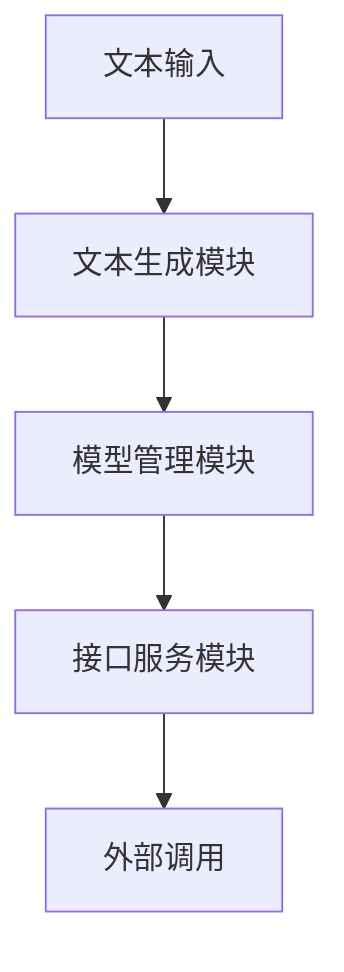
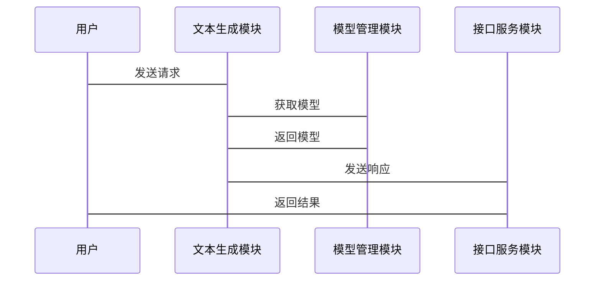

                 


# 深入理解LLM大模型：从GPT到企业级应用

## 关键词

- 大语言模型
- LLM
- 企业级应用
- GPT
- 人工智能
- NLP
- 系统架构

## 摘要

本文将从大语言模型的基本概念出发，深入探讨其技术原理，并结合企业级应用的实际场景，分析其在不同领域的应用潜力。通过详细的技术分析和实际案例，本文旨在帮助读者理解如何在企业环境中有效部署和应用LLM大模型，同时探讨其面临的挑战与解决方案。文章内容涵盖模型架构、训练方法、系统设计等核心内容，并结合实际项目案例，为读者提供全面的技术视角。

---

## 第一部分: LLM大模型概述

### 第1章: LLM大模型的基本概念

#### 1.1 LLM大模型的背景与现状

随着人工智能技术的快速发展，大语言模型（LLM）逐渐成为学术界和工业界的焦点。LLM的出现，标志着自然语言处理（NLP）技术迈入了一个新的阶段。从最初的GPT模型到后续的GPT-3、GPT-4，LLM的能力不断提升，应用场景也日益广泛。本文将从LLM的基本概念出发，逐步展开其技术细节和企业级应用的探讨。

#### 1.2 LLM大模型的核心概念

LLM（Large Language Model）是一种基于深度学习的自然语言处理模型，其核心目标是通过大量文本数据的训练，生成与人类语言具有高度相似性的文本。LLM不仅能够理解上下文，还能进行推理和创造性思维，这使其在多种场景中展现出强大的应用潜力。

**LLM与传统NLP模型的区别**  
传统NLP模型通常基于规则或浅层学习，难以处理复杂的语义关系。而LLM采用深度学习技术，通过大量的参数和多层神经网络结构，能够捕捉到数据中的深层语义信息。

#### 1.3 LLM大模型的技术特点

1. **模型规模与参数量**  
   LLM通常拥有数百万甚至数十亿的参数，这使得模型能够处理复杂的语言模式和语义关系。
   
2. **多模态能力**  
   部分先进的LLM模型已经具备多模态能力，能够处理图像、音频等多种类型的数据。

3. **对齐与可解释性**  
   为了使LLM的输出更加符合人类的期望，研究者们提出了多种对齐方法和可解释性技术，以提升模型的可信度。

#### 1.4 LLM大模型的行业应用前景

LLM在企业级应用中展现出巨大的潜力，尤其是在客服、数据分析、内容生成等领域。通过LLM，企业可以显著提升效率、降低成本，并为用户提供更加智能化的服务。

---

### 第2章: LLM大模型的技术原理

#### 2.1 模型架构

LLM的核心架构通常基于Transformer模型，由编码器和解码器两部分组成。编码器负责将输入的文本转换为向量表示，解码器则根据这些向量生成输出文本。

**Transformer模型的结构**  
Transformer模型由多层自注意力机制和前馈网络组成。自注意力机制能够捕捉到文本中不同位置之间的关系，从而生成更准确的向量表示。

#### 2.2 训练方法

LLM的训练通常采用预训练和微调相结合的方式。预训练阶段，模型通过大量通用文本数据进行训练，以掌握基本的语言规律。微调阶段，则针对特定任务对模型进行进一步优化。

**监督学习与无监督学习**  
在监督学习中，模型通过标记的训练数据进行优化；无监督学习则利用未标记的数据，通过自动生成标签的方式进行训练。

#### 2.3 推理机制

在生成文本时，LLM采用解码策略，通常包括贪心搜索和蒙特卡洛采样等方法。这些策略能够帮助模型生成多样且合理的输出。

---

## 第二部分: 企业级应用中的LLM大模型

### 第3章: 企业级LLM应用的挑战与解决方案

#### 3.1 企业级应用的挑战

1. **模型性能**  
   企业级应用通常需要处理大量数据，对模型的性能提出了更高的要求。

2. **成本与资源**  
   LLM的训练和部署需要大量的计算资源和较高的成本。

3. **安全与隐私**  
   在企业环境中，数据安全和隐私保护是部署LLM时必须考虑的重要因素。

#### 3.2 解决方案

1. **模型优化**  
   通过知识蒸馏和参数高效微调等技术，可以有效降低模型的计算成本。

2. **资源管理**  
   采用分布式计算和云原生架构，能够提高资源利用率，降低运营成本。

3. **数据安全**  
   通过数据脱敏和隐私保护技术，可以有效保障企业数据的安全性。

---

### 第4章: 企业级LLM应用的案例分析

#### 4.1 客服系统中的应用

在企业客服系统中，LLM可以用于自动回复客户咨询，提高服务效率。通过自然语言理解技术，模型能够准确识别客户的问题，并生成合适的回答。

#### 4.2 数据分析与决策支持

LLM可以辅助企业进行数据分析，通过文本挖掘和情感分析等技术，帮助企业从海量数据中提取有价值的信息，支持决策。

#### 4.3 内容生成

在内容生成领域，LLM可以用于自动生成营销文案、产品描述等文本内容，显著提高内容创作的效率。

---

## 第三部分: 系统架构与实现

### 第5章: 系统架构设计

#### 5.1 系统功能设计

1. **文本生成模块**  
   负责根据输入生成输出文本。

2. **模型管理模块**  
   负责模型的加载、管理和优化。

3. **接口服务模块**  
   提供API接口，方便其他系统调用。

#### 5.2 系统架构设计

**系统架构图**  


#### 5.3 系统交互设计

**系统交互图**  


---

## 第四部分: 项目实战

### 第6章: 项目实战与代码实现

#### 6.1 环境安装

```bash
pip install transformers
pip install torch
pip install numpy
```

#### 6.2 核心代码实现

```python
from transformers import AutoTokenizer, AutoModelForCausalLM
import torch

model_name = "gpt2"
tokenizer = AutoTokenizer.from_pretrained(model_name)
model = AutoModelForCausalLM.from_pretrained(model_name)

inputs = tokenizer("Hello, how are you?", return_tensors="pt")
outputs = model.generate(inputs.input_ids, max_length=50, do_sample=True)
print(tokenizer.decode(outputs[0], skip_special_tokens=True))
```

---

## 第五部分: 总结与展望

### 第7章: 总结与最佳实践

#### 7.1 总结

本文从LLM的基本概念出发，深入探讨了其技术原理，并结合企业级应用的实际场景，分析了其在不同领域的应用潜力。通过详细的技术分析和实际案例，本文旨在帮助读者理解如何在企业环境中有效部署和应用LLM大模型。

#### 7.2 最佳实践

1. **模型优化**  
   在实际应用中，应根据具体需求选择合适的模型规模和优化方法。

2. **资源管理**  
   通过分布式计算和云原生架构，可以有效提高资源利用率。

3. **数据安全**  
   数据脱敏和隐私保护技术是保障企业数据安全的关键。

---

## 作者信息

作者：AI天才研究院/AI Genius Institute & 禅与计算机程序设计艺术 /Zen And The Art of Computer Programming

---

以上是《深入理解LLM大模型：从GPT到企业级应用》的目录大纲和部分具体内容。通过以上内容，我们可以看到，从GPT到企业级应用，大语言模型的潜力是无限的。然而，其在实际应用中也面临着诸多挑战。通过不断的优化和创新，我们相信LLM将在未来的企业级应用中发挥更加重要的作用。

