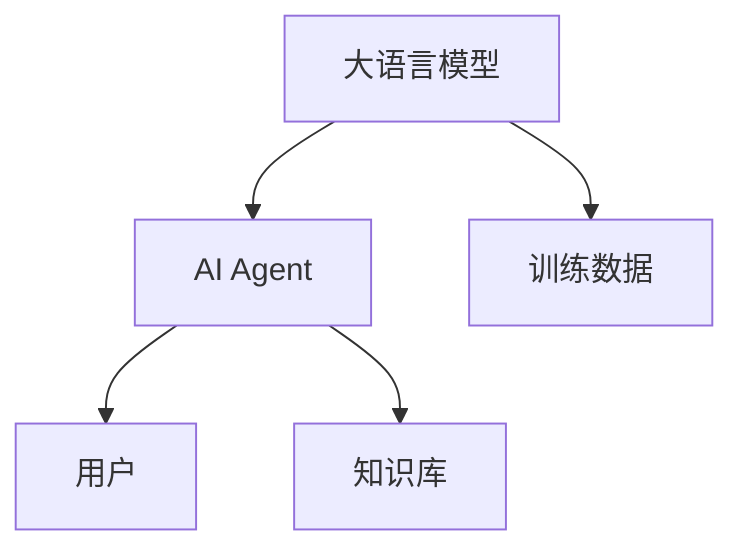
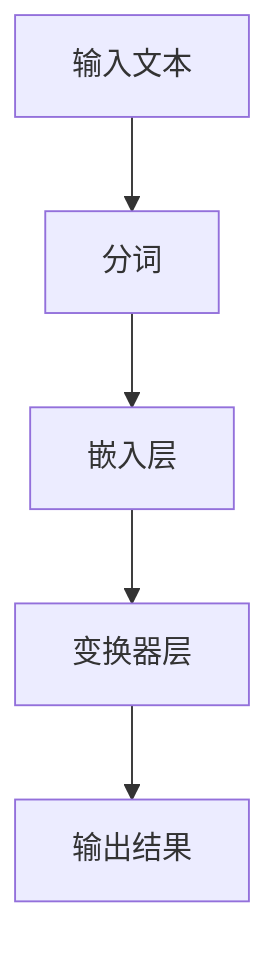
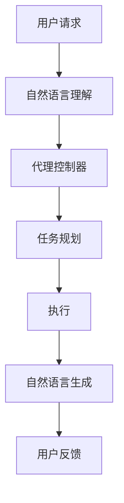
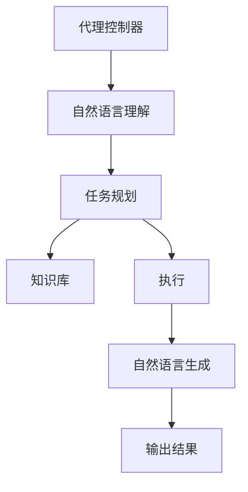
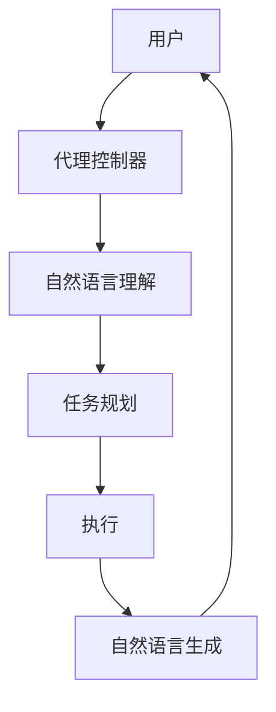
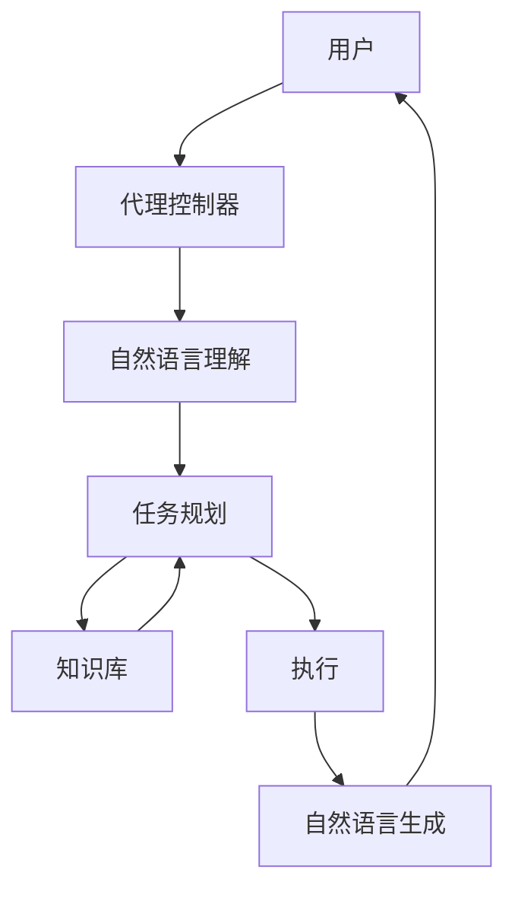

                 


# 深入理解LLM：AI Agent开发的基石

## 关键词：
- 大语言模型 (LLM)
- AI Agent
- 人工智能
- 机器学习
- 自然语言处理
- 系统架构
- 技术开发

## 摘要：
本文深入探讨大语言模型（LLM）与AI Agent的核心概念、算法原理及系统架构设计，结合实际案例分析，帮助读者理解AI Agent开发的关键技术要点。通过详细的技术分析和系统设计，为开发者提供从理论到实践的全面指导。

---

# 第一部分: 大语言模型 (LLM) 与 AI Agent 的背景介绍

## 第1章: 大语言模型 (LLM) 与 AI Agent 的背景介绍

### 1.1 问题背景

#### 1.1.1 从传统AI到大语言模型的演进
传统的人工智能技术依赖于规则引擎和基于知识的系统，而大语言模型（LLM）的出现标志着AI技术的重大突破。LLM通过深度学习和自然语言处理技术，能够理解和生成人类语言，从而实现更智能的交互方式。

#### 1.1.2 AI Agent 的概念与应用场景
AI Agent（人工智能代理）是一种能够感知环境并采取行动以实现目标的智能实体。它可以广泛应用于聊天机器人、智能助手、自动化决策系统等领域。

#### 1.1.3 当前 AI Agent 开发的核心挑战
当前AI Agent开发的主要挑战包括模型的可解释性、多轮对话的连贯性、知识库的动态更新以及人机交互的自然性。

### 1.2 问题描述

#### 1.2.1 大语言模型的局限性
大语言模型虽然在文本生成和理解方面表现出色，但仍然存在知识更新滞后、推理能力有限等问题。

#### 1.2.2 AI Agent 的定义与功能边界
AI Agent 的功能边界包括感知环境、理解用户需求、决策并执行任务。其核心挑战在于如何将LLM的能力与实际任务需求相结合。

#### 1.2.3 问题解决的关键技术点
为了解决上述问题，我们需要结合大语言模型的能力，设计高效的对话管理和任务执行机制。

---

## 第2章: 大语言模型 (LLM) 的核心概念与原理

### 2.1 LLM 的核心概念

#### 2.1.1 大语言模型的基本原理
大语言模型通过大量数据的预训练，掌握了语言的模式和上下文关系。其核心是Transformer架构，能够处理长距离依赖关系。

#### 2.1.2 模型的训练与推理过程
模型的训练包括数据预处理、模型构建和优化。推理过程则是将用户输入通过模型处理，生成输出结果。

#### 2.1.3 模型的可解释性与局限性
尽管LLM在文本生成方面表现出色，但其可解释性较差，且容易受到训练数据偏差的影响。

### 2.2 AI Agent 的构成与功能

#### 2.2.1 AI Agent 的基本组成
AI Agent通常包括自然语言理解（NLU）、任务规划、执行和自然语言生成（NLG）等模块。

#### 2.2.2 多轮对话机制
多轮对话机制通过上下文记忆和状态管理，确保对话的连贯性和一致性。

#### 2.2.3 知识库的构建与管理
知识库是AI Agent的核心资产，需要动态更新和维护，以确保信息的准确性和相关性。

---

## 第3章: 大语言模型与AI Agent 的核心概念联系

### 3.1 核心概念原理

#### 3.1.1 LLM 作为 AI Agent 的核心驱动力
大语言模型为AI Agent提供了强大的文本理解和生成能力，使其能够与用户进行自然交互。

#### 3.1.2 AI Agent 的智能决策过程
AI Agent通过结合LLM的能力和任务规划，实现智能决策和行动。

#### 3.1.3 人机交互中的协同作用
在人机交互中，LLM和AI Agent协同工作，通过自然语言处理技术实现更高效的用户交互体验。

### 3.2 概念属性特征对比表

| 概念 | 属性 | 特征 |
|------|------|------|
| LLM  | 输入 | 文本 |
| LLM  | 输出 | 文本 |
| LLM  | 核心技术 | Transformer架构 |
| AI Agent | 输入 | 用户指令 |
| AI Agent | 输出 | 行动或反馈 |
| AI Agent | 核心技术 | 多轮对话与任务执行 |

### 3.3 ER实体关系图



---

## 第4章: 大语言模型与AI Agent 的算法原理

### 4.1 LLM 的算法原理



### 4.2 AI Agent 的算法实现



---

## 第5章: 系统分析与架构设计方案

### 5.1 问题场景介绍

#### 5.1.1 AI Agent 的核心功能
AI Agent需要具备多轮对话能力、任务规划和执行能力，以及与外部系统交互的能力。

#### 5.1.2 系统功能设计
系统功能设计包括用户输入处理、任务规划、知识库查询和结果输出等模块。

### 5.2 系统架构设计



### 5.3 系统接口设计



### 5.4 系统交互设计



---

## 第6章: 项目实战

### 6.1 环境安装

```bash
pip install transformers torch
```

### 6.2 系统核心实现源代码

```python
from transformers import AutoTokenizer, AutoModelForCausalLM
import torch

class AI_Agent:
    def __init__(self):
        self.tokenizer = AutoTokenizer.from_pretrained("gpt2")
        self.model = AutoModelForCausalLM.from_pretrained("gpt2")
        
    def generate_response(self, input_text):
        inputs = self.tokenizer(input_text, return_tensors="pt")
        outputs = self.model.generate(**inputs, max_length=100)
        response = self.tokenizer.decode(outputs[0], skip_special_tokens=True)
        return response
```

### 6.3 代码应用解读与分析

上述代码展示了AI Agent的基本实现，包括模型加载、输入处理和输出生成。通过这种方式，我们可以实现基本的对话功能。

### 6.4 实际案例分析和详细讲解剖析

通过具体案例分析，我们可以看到AI Agent在实际应用中的强大能力。例如，在智能客服系统中，AI Agent可以自动处理用户的咨询和问题。

---

## 第7章: 最佳实践、小结与注意事项

### 7.1 最佳实践

- 定期更新知识库，确保信息的准确性。
- 结合具体场景优化模型参数，提升性能。

### 7.2 小结

本文详细探讨了大语言模型与AI Agent的核心概念、算法原理和系统架构设计，并通过具体案例分析展示了其实现过程。

### 7.3 注意事项

在实际开发中，需要注意模型的可解释性问题，并确保系统的安全性和稳定性。

---

## 第8章: 拓展阅读

### 8.1 拓展阅读推荐

- 《深度学习入门》
- 《自然语言处理实战》
- 《AI Agent设计与实现》

### 8.2 持续学习建议

建议读者持续关注AI领域的最新动态，积极参与实践，不断提升自己的技术能力。

---

## 作者：AI天才研究院 & 禅与计算机程序设计艺术

---

以上是文章的完整目录和部分内容。希望这篇文章能够帮助读者深入理解大语言模型和AI Agent的核心概念，并为实际开发提供指导。

