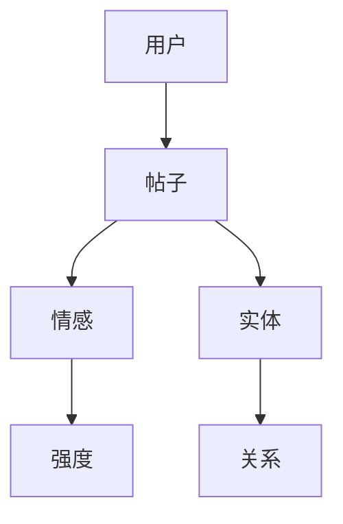
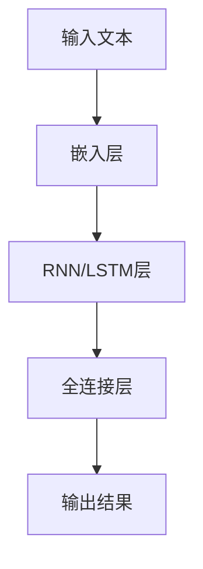
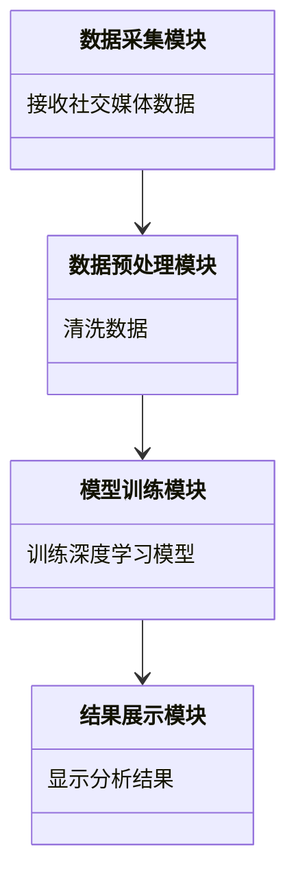

                 


# 深度学习分析社交媒体投资情绪

**关键词：** 深度学习，社交媒体，投资情绪，情感分析，自然语言处理，数据挖掘，时间序列分析

**摘要：**  
本文探讨了利用深度学习技术分析社交媒体上的投资情绪，结合自然语言处理和情感分析，构建高效的情绪预测模型，为投资决策提供数据支持。

---

# 第1章 背景与概述

## 1.1 问题背景与重要性

### 1.1.1 社交媒体的兴起与影响力  
社交媒体已成为信息传播的主要平台，用户在社交媒体上分享观点、评论和情绪，这些信息对投资决策具有重要影响。

### 1.1.2 投资情绪分析的定义与目标  
投资情绪分析旨在通过自然语言处理技术，识别社交媒体上的情绪倾向，帮助投资者预测市场走势。

### 1.1.3 情绪分析在投资决策中的作用  
情绪分析可以揭示市场的乐观或悲观情绪，辅助投资者做出更明智的决策。

## 1.2 现有方法的局限性与挑战

### 1.2.1 传统文本挖掘方法的不足  
传统方法难以处理复杂的语义和情感信息，且缺乏实时性。

### 1.2.2 深度学习在情绪分析中的优势  
深度学习能够自动提取特征，处理非结构化数据，提高分析的准确性。

### 1.2.3 数据质量与实时性问题  
社交媒体数据具有噪声多、实时性强的特点，对分析方法提出了更高的要求。

---

# 第2章 核心概念与联系

## 2.1 情绪分析的基本原理

### 2.1.1 情感分类  
将文本分为积极、消极或中性三类。

### 2.1.2 情感强度  
量化情感的强度，如从0到1的强度值。

### 2.1.3 实体识别与关系抽取  
识别文本中的实体（如公司名称）并分析其关系。

## 2.2 核心概念对比分析

| 情感分类 | 文本分类 | 区别 |
|----------|----------|------|
| 情感强度 | 二元分类 | 强度值 |

## 2.3 实体关系图（Mermaid）



---

# 第3章 算法原理

## 3.1 深度学习模型

### 3.1.1 RNN与LSTM  
用于处理序列数据，捕捉上下文信息。

### 3.1.2 Transformer  
通过自注意力机制，提高模型的并行性。

### 3.1.3 情感分析流程图（Mermaid）



## 3.2 数学模型

### 3.2.1 交叉熵损失函数  
$$\text{损失} = -\sum y_i \log p_i + (1-y_i)\log(1-p_i)$$

### 3.2.2 优化器  
使用Adam优化器，学习率为0.001。

---

# 第4章 数学模型

## 4.1 情感分析模型

### 4.1.1 情感分类模型  
使用LSTM和全连接层进行分类。

### 4.1.2 情感强度回归模型  
通过线性回归预测强度值。

---

# 第5章 系统分析与架构设计

## 5.1 问题场景介绍  
分析社交媒体上的投资情绪，实时预测市场走势。

## 5.2 系统功能设计（Mermaid类图）



---

# 第6章 项目实战

## 6.1 环境安装  
安装Python、TensorFlow、Keras等库。

## 6.2 核心实现代码

```python
import tensorflow as tf
from tensorflow.keras.models import Sequential
from tensorflow.keras.layers import LSTM, Dense, Dropout, Embedding

model = Sequential()
model.add(Embedding(input_dim=10000, output_dim=64))
model.add(LSTM(64, return_sequences=False))
model.add(Dropout(0.5))
model.add(Dense(1, activation='sigmoid'))
model.compile(loss='binary_crossentropy', optimizer='adam', metrics=['accuracy'])
```

## 6.3 实例分析  
分析某社交媒体上的帖子，预测其情感倾向。

---

# 第7章 总结与展望

## 7.1 最佳实践  
- 数据清洗是关键。
- 选择合适的模型结构。
- 定期更新模型。

## 7.2 小结  
本文详细探讨了深度学习在投资情绪分析中的应用，构建了高效的情绪预测模型。

## 7.3 注意事项  
注意数据质量和模型的实时性。

## 7.4 拓展阅读  
推荐相关书籍和论文，深入研究情感分析技术。

---

作者：AI天才研究院/AI Genius Institute & 禅与计算机程序设计艺术/Zen And The Art of Computer Programming

