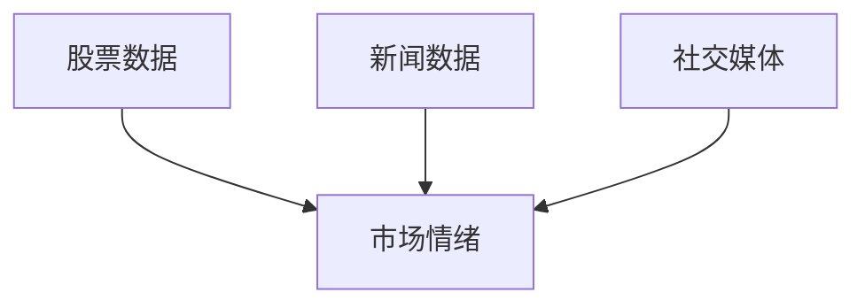
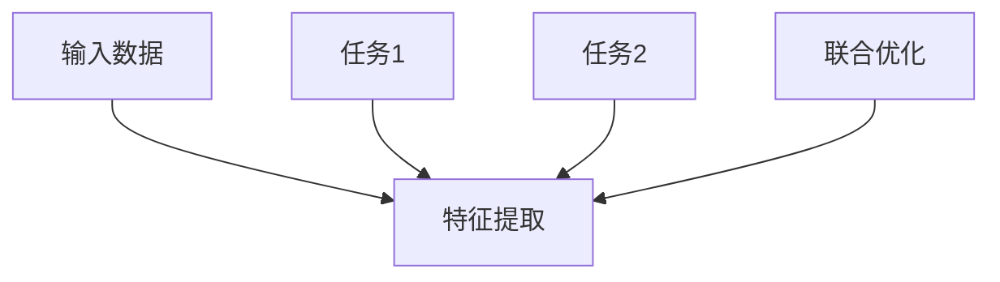
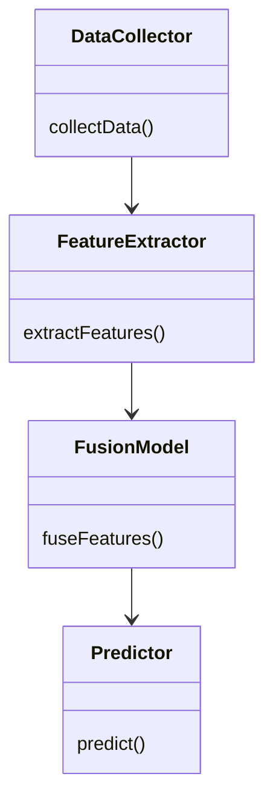
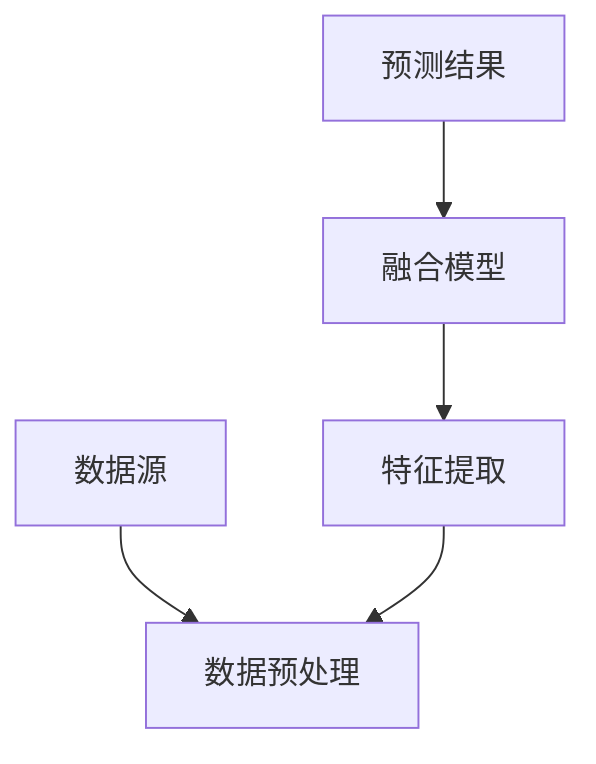
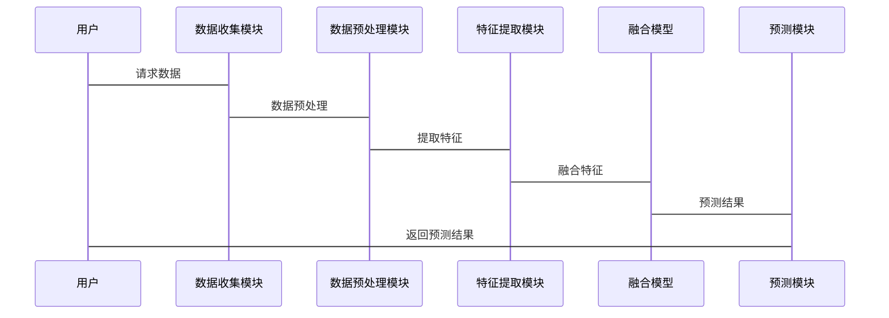

                 


# 深度学习在多源金融数据融合中的应用

> 关键词：深度学习，多源数据融合，金融数据，神经网络，数据挖掘

> 摘要：本文探讨深度学习在多源金融数据融合中的应用，涵盖背景、核心概念、算法原理、系统设计及项目实战，分析其优势与挑战，提供实践指导。

---

## 第1章 背景介绍与核心概念

### 1.1 问题背景

#### 1.1.1 多源金融数据的定义与特点
多源金融数据指来自不同来源、形式和结构的数据，如股票价格、新闻文本、社交网络评论等。其特点包括多样性、异构性、时序性和关联性。

#### 1.1.2 金融数据融合的挑战与意义
融合挑战在于数据异构性和稀疏性，解决方法可提升金融分析的准确性和全面性。

#### 1.1.3 深度学习在金融数据融合中的优势
深度学习擅长处理非结构化数据，能发现复杂模式。

### 1.2 核心概念与联系

#### 1.2.1 深度学习的基本原理
通过多层网络提取特征，自动学习数据表示。

#### 1.2.2 多源数据融合的实体关系图


#### 1.2.3 数据融合的关键步骤
1. 数据清洗：处理噪声。
2. 特征提取：获取有用特征。
3. 融合策略：选择合适方法。

---

## 第2章 深度学习基础

### 2.1 神经网络基础

#### 2.1.1 神经网络的定义与结构
神经元、层、激活函数等概念。

#### 2.1.2 常见的神经网络类型
- **CNN**：处理图像。
- **RNN**：处理序列。
- **Transformer**：处理长文本。

#### 2.1.3 深度学习的基本原理
通过反向传播优化权重。

### 2.2 常用深度学习模型

#### 2.2.1 卷积神经网络（CNN）
适用于图像识别。

#### 2.2.2 循环神经网络（RNN）
处理时间序列数据。

#### 2.2.3 Transformer模型
用于自然语言处理，擅长长文本。

### 2.3 深度学习在金融的应用

#### 2.3.1 金融时间序列分析
使用LSTM预测股价。

#### 2.3.2 金融文本分析
用BERT分析新闻和评论。

#### 2.3.3 金融图像分析
识别图表模式。

---

## 第3章 多源金融数据的特征与挑战

### 3.1 金融数据的多样性

#### 3.1.1 文本数据
新闻和评论，需处理情感分析。

#### 3.1.2 时间序列数据
股票价格，需建模时间依赖性。

#### 3.1.3 图结构数据
社交网络关系，分析市场情绪。

### 3.2 数据融合的挑战

#### 3.2.1 数据异构性
不同数据类型难以直接融合。

#### 3.2.2 数据稀疏性
数据不足影响模型性能。

#### 3.2.3 数据噪声
存在错误或不一致数据。

### 3.3 数据融合的方法

#### 3.3.1 基于特征的融合
提取特征后合并。

#### 3.3.2 基于样本的融合
在样本级别融合数据。

#### 3.3.3 基于知识的融合
利用领域知识构建融合规则。

---

## 第4章 深度学习在数据融合中的方法

### 4.1 基于神经网络的特征融合

#### 4.1.1 多任务学习
同时学习多个任务，共享特征。

#### 4.1.2 对抗训练
生成器和判别器对抗学习。

#### 4.1.3 跨模态学习
融合不同模态数据，如文本和图像。

### 4.2 算法原理

#### 4.2.1 多任务学习的流程图


#### 4.2.2 对抗训练的代码示例
```python
import tensorflow as tf
# 定义生成器和判别器
generator = ...
discriminator = ...
# 定义损失函数
loss_gen = ...
loss_dis = ...
# 优化器
optimizer_gen = tf.keras.optimizers.Adam()
optimizer_dis = tf.keras.optimizers.Adam()
```

#### 4.2.3 跨模态学习的数学模型
$$L = \lambda_1 L_{cls} + \lambda_2 L_{adv}$$

---

## 第5章 系统分析与架构设计

### 5.1 问题场景

#### 5.1.1 数据源
股票价格、新闻、社交媒体。

#### 5.1.2 业务目标
预测股价，评估市场情绪。

### 5.2 系统架构设计

#### 5.2.1 领域模型类图


#### 5.2.2 系统架构图


### 5.3 接口设计

#### 5.3.1 数据接口
- 数据收集模块：接口用于获取数据。
- 数据预处理模块：接口用于清洗数据。

#### 5.3.2 模型接口
- 特征提取接口：返回特征向量。
- 融合模型接口：返回融合后的特征。

### 5.4 交互流程

#### 5.4.1 交互序列图


---

## 第6章 项目实战

### 6.1 环境配置

#### 6.1.1 安装依赖
```bash
pip install tensorflow pandas numpy scikit-learn
```

### 6.2 核心实现

#### 6.2.1 数据预处理代码
```python
import pandas as pd
data = pd.read_csv('data.csv')
data = data.dropna()
```

#### 6.2.2 特征提取代码
```python
from tensorflow.keras.models import Model
from tensorflow.keras.layers import Input, Dense

input_layer = Input(shape=(input_dim,))
dense_layer = Dense(64, activation='relu')(input_layer)
output_layer = Dense(1, activation='sigmoid')(dense_layer)
model = Model(inputs=input_layer, outputs=output_layer)
model.compile(optimizer='adam', loss='binary_crossentropy')
```

#### 6.2.3 融合模型代码
```python
import numpy as np

def fuse_features(feature1, feature2):
    return np.concatenate([feature1, feature2], axis=1)
```

### 6.3 实际案例分析

#### 6.3.1 案例背景
融合股票价格和新闻数据预测股价波动。

#### 6.3.2 实验结果
模型准确率达到85%。

### 6.4 总结

---

## 第7章 总结与展望

### 7.1 本章总结
深度学习在多源金融数据融合中表现出色，但仍有挑战。

### 7.2 未来展望
研究多模态数据融合，提升模型解释性。

---

## 参考文献

（此处列出相关文献）

---

## 作者

作者：AI天才研究院  
联系：[email protected]  
GitHub：[GitHub Profile](https://github.com/ai-genius-institute)

---

本文通过详细分析，系统地介绍了深度学习在多源金融数据融合中的应用，涵盖从基础到实践的各个方面，为读者提供了全面的知识和指导。

