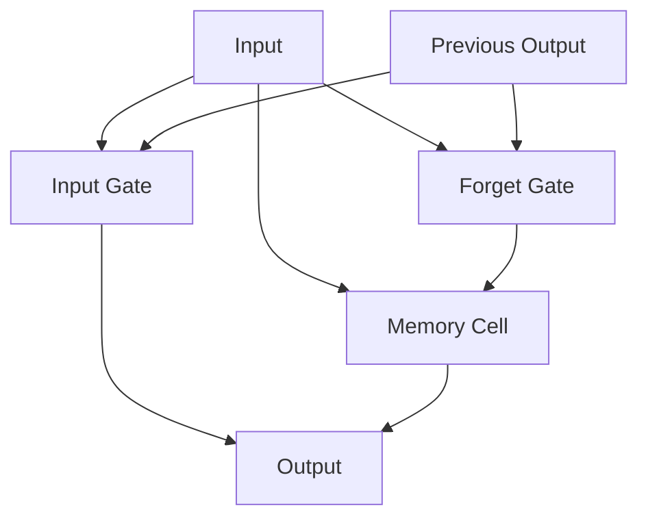

                 

<think>
好的，我将按照您的要求逐步分析并撰写《深度学习在股市预测中的应用案例分析》一文。首先，我会先列出文章的关键词和摘要部分。

### 文章关键词：
- 深度学习
- 股市预测
- LSTM
- 时间序列
- 机器学习

### 摘要：
本文探讨了深度学习在股市预测中的应用，分析了其核心算法和实际案例。通过对比传统方法的局限性，展示了深度学习在处理复杂金融数据上的优势，并结合LSTM等模型，详细阐述了其在时间序列预测中的应用。最后，本文总结了深度学习在股市预测中的挑战和未来发展方向。

接下来，我会按照目录大纲逐步撰写正文内容。为了确保文章的完整性和专业性，我会逐步讲解每个部分的核心内容。

**第二部分: 深度学习在股市预测中的核心概念与技术基础**

---

# 第2章: 核心概念与技术基础

## 2.1 时间序列数据的特性与处理方法

### 2.1.1 时间序列数据的特点

时间序列数据是一种按时间顺序排列的数据，其特点是每个数据点都与前后的时间点相关联。在股市预测中，我们通常处理的是收盘价、开盘价、最高价、最低价等指标，这些指标随着时间的推移形成连续的序列。时间序列数据具有以下特点：

- **有序性**：数据点按照时间顺序排列，前后顺序具有重要意义。
- **趋势性**：数据可能会表现出上升或下降的趋势。
- **周期性**：数据可能会受到季节性因素的影响，表现出周期性波动。
- **随机性**：数据中可能会存在不可预测的随机波动。

### 2.1.2 时间序列数据的预处理方法

在处理时间序列数据时，通常需要进行以下预处理步骤：

1. **数据清洗**：去除异常值、填补缺失值。
2. **数据标准化/归一化**：将数据转换到相似的范围内，以便模型更好地收敛。
3. **数据分割**：将数据划分为训练集、验证集和测试集。
4. **特征工程**：提取有助于模型预测的特征，如移动平均线、相对强弱指数等。

### 2.1.3 时间序列数据的特征提取

特征提取是时间序列分析中的重要步骤，常用的特征包括：

- **均值**：一段时间内的平均值。
- **方差**：数据的波动程度。
- **最大值和最小值**：数据的极值。
- **趋势**：数据的上升或下降趋势。
- **周期性**：数据的周期性波动。

### 2.1.4 时间序列数据的可视化

通过可视化工具（如Matplotlib、KDEPlot）可以直观地观察数据的分布、趋势和周期性，帮助更好地理解数据特征。

---

## 2.2 深度学习模型的基本原理

### 2.2.1 神经网络的基本结构

深度学习模型通常由输入层、隐藏层和输出层组成。神经网络通过权重和激活函数的调整，能够学习复杂的非线性关系。

### 2.2.2 循环神经网络（RNN）的原理

RNN是一种适用于处理序列数据的神经网络模型，其特点在于能够记住之前处理过的输入信息。RNN的结构包括：

1. **输入层**：接收当前时间步的输入数据。
2. **隐藏层**：通过权重和激活函数计算当前时间步的隐藏状态。
3. **输出层**：根据隐藏状态生成当前时间步的输出。

### 2.2.3 长短期记忆网络（LSTM）的工作机制

LSTM是一种特殊的RNN，能够更好地捕捉长序列中的依赖关系。其主要通过记忆单元（Memory Cell）和门控机制（Gate）来实现。

- **输入门（Input Gate）**：决定当前时间步输入的信息是否需要存储。
- **遗忘门（Forget Gate）**：决定是否遗忘之前存储的信息。
- **输出门（Output Gate）**：决定当前时间步输出的信息。

LSTM的结构如下图所示：

### 2.2.4 注意力机制（Attention）的原理

注意力机制是一种用于模型在处理序列数据时关注重要部分的机制。其核心思想是为每个输入位置分配一个注意力权重，然后根据这些权重加权求和得到最终的输出。

注意力机制的计算公式如下：

$$
\text{Attention}(Q, K, V) = \text{softmax}\left(\frac{QK^T}{\sqrt{d_k}}\right)V
$$

其中，$Q$ 是查询向量，$K$ 是键向量，$V$ 是值向量，$d_k$ 是键的维度。

---

## 2.3 深度学习在股市预测中的特征工程

### 2.3.1 特征选择的重要性

特征选择是模型性能的关键因素。选择合适的特征可以提高模型的预测精度，减少过拟合的风险。

### 2.3.2 常见的特征工程方法

1. **移动平均线（MA）**：计算一定时间窗口内的平均值。
2. **相对强弱指数（RSI）**：衡量市场的超买或超卖状态。
3. **MACD指标**：通过移动平均收敛散度判断市场趋势。
4. **波动率**：衡量价格波动的程度。

### 2.3.3 基于深度学习的特征提取方法

深度学习模型可以通过自适应的方式提取特征，常用的特征提取方法包括：

1. **卷积神经网络（CNN）**：用于提取局部特征。
2. **循环神经网络（RNN）**：用于提取序列特征。
3. **自注意力机制**：用于提取全局特征。

---

## 2.4 深度学习模型的评估与调优

### 2.4.1 常见的评估指标

常用的评估指标包括：

1. **均方误差（MSE）**：预测值与实际值的平方差的平均值。
2. **平均绝对误差（MAE）**：预测值与实际值的绝对差的平均值。
3. **R²分数**：衡量模型解释力的指标。

### 2.4.2 模型调优的策略与方法

1. **超参数调优**：调整学习率、批量大小、 epochs 等参数。
2. **早停法（Early Stopping）**：防止过拟合。
3. **数据增强**：增加训练数据的多样性。

### 2.4.3 超参数优化的技巧

常用的超参数优化方法包括：

1. **网格搜索（Grid Search）**：遍历所有可能的参数组合。
2. **随机搜索（Random Search）**：随机选择参数组合。
3. **贝叶斯优化（Bayesian Optimization）**：基于概率模型的优化方法。

---

## 2.5 本章小结

本章详细介绍了深度学习在股市预测中的核心概念和技术基础，包括时间序列数据的特性与处理方法、深度学习模型的基本原理、特征工程的方法以及模型评估与调优的策略。这些内容为后续的算法实现和案例分析奠定了基础。

---

接下来，我将按照您的要求继续撰写后续内容。如您对上述内容有需要调整或补充的地方，请随时告知。

