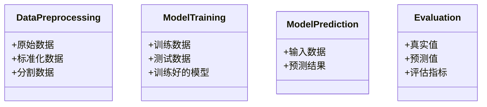

                 


# 深度学习在金融资产相关性分析中的应用

---

## 关键词
- 深度学习
- 金融资产
- 相关性分析
- LSTM
- Transformer
- 机器学习

---

## 摘要
深度学习作为一种强大的人工智能技术，在金融资产相关性分析中展现出独特的优势。本文系统介绍了深度学习的基本概念、相关性分析的核心原理，以及如何将深度学习模型（如LSTM和Transformer）应用于金融资产相关性分析。通过对比传统方法与深度学习的差异，本文详细探讨了深度学习在特征提取、非线性建模等方面的优势，并通过实际案例展示了深度学习在金融资产相关性分析中的具体应用。最后，本文总结了深度学习在该领域的最佳实践和未来发展方向。

---

# 第一部分: 深度学习与金融资产相关性分析的背景介绍

---

## 第1章: 深度学习与金融资产相关性分析概述

### 1.1 深度学习的基本概念

#### 1.1.1 深度学习的定义
深度学习是一种人工智能技术，通过多层神经网络结构模拟人脑的神经活动，能够自动提取数据中的特征信息。其核心思想是通过层次化学习，将低层特征逐步映射到高层语义信息。

#### 1.1.2 深度学习的核心特点
- **非线性建模**：能够捕捉数据中的非线性关系。
- **自动特征提取**：无需人工设计特征，自动从数据中提取有用信息。
- **高维数据处理**：适用于图像、文本、时间序列等多种数据类型。

#### 1.1.3 深度学习与传统机器学习的区别
| 对比维度 | 传统机器学习 | 深度学习 |
|----------|---------------|----------|
| 特征工程 | 需要手动设计 | 自动提取 |
| 模型复杂度 | 模型简单 | 模型复杂 |
| 数据需求 | 数据量较小 | 数据量大 |

---

### 1.2 金融资产相关性分析的背景

#### 1.2.1 金融资产相关性的定义
金融资产相关性分析是指研究不同金融资产（如股票、债券、基金等）之间的价格波动关系。相关性分析可以帮助投资者理解资产之间的关联性，优化投资组合的风险和收益。

#### 1.2.2 传统相关性分析方法的局限性
- **线性假设**：传统相关性分析假设变量之间存在线性关系，无法捕捉非线性关系。
- **特征单一性**：无法处理高维、复杂的数据结构。
- **动态变化**：金融市场中的相关性会随时间变化，传统方法难以实时更新。

#### 1.2.3 深度学习在金融资产相关性分析中的优势
- **非线性建模**：能够捕捉复杂、非线性的相关性关系。
- **实时性**：适用于高频交易和实时数据分析。
- **多模态数据处理**：可以同时处理文本、价格、成交量等多种数据源。

---

### 1.3 深度学习在金融领域的应用前景

#### 1.3.1 金融领域的潜在应用领域
- 股票价格预测
- 风险评估
- 投资组合优化
- 市场情绪分析

#### 1.3.2 深度学习在金融资产相关性分析中的具体应用
- 时间序列分析
- 资产配置
- 风险对冲

#### 1.3.3 深度学习应用的挑战与机遇
- **挑战**：数据稀疏性、模型解释性、计算资源需求。
- **机遇**：技术进步（如大模型）、数据丰富性、计算能力提升。

---

## 第2章: 金融资产相关性分析的核心概念

### 2.1 相关性分析的基本原理

#### 2.1.1 相关系数的定义与计算
相关系数是用来衡量两个变量之间线性相关程度的指标，取值范围为[-1,1]。公式如下：

$$ r = \frac{\sum (x_i - \bar{x})(y_i - \bar{y})}{\sqrt{\sum (x_i - \bar{x})^2 \sum (y_i - \bar{y})^2}} $$

其中，$\bar{x}$和$\bar{y}$分别表示$x$和$y$的平均值。

#### 2.1.2 协方差的定义与计算
协方差衡量两个变量的联合变化程度，公式如下：

$$ \text{Cov}(x, y) = \frac{1}{n-1} \sum_{i=1}^{n} (x_i - \bar{x})(y_i - \bar{y}) $$

---

#### 2.1.3 相关性分析的局限性
- 线性假设
- 数据维度问题
- 外部因素的复杂性

---

### 2.2 深度学习在相关性分析中的优势

#### 2.2.1 深度学习的非线性建模能力
深度学习模型（如LSTM和Transformer）能够捕捉数据中的非线性关系，适用于复杂金融市场环境。

#### 2.2.2 深度学习的特征提取能力
深度学习模型能够从原始数据中自动提取高阶特征，减少人工特征工程的工作量。

#### 2.2.3 深度学习的实时性与可解释性
深度学习模型可以实时处理数据，但目前仍存在可解释性不足的问题。

---

### 2.3 核心概念对比分析

#### 2.3.1 传统相关性分析与深度学习相关性分析的对比
| 对比维度 | 传统相关性分析 | 深度学习相关性分析 |
|----------|----------------|--------------------|
| 特征工程 | 手动设计 | 自动提取 |
| 模型复杂度 | 简单线性模型 | 复杂非线性模型 |
| 数据需求 | 小数据 | 大数据 |

---

#### 2.3.2 不同深度学习模型在相关性分析中的表现
| 模型名称 | 特点 | 适用场景 |
|----------|------|-----------|
| LSTM | 时间序列建模 | 适合处理时序数据 |
| Transformer | 并行计算、全局依赖 | 适合长序列数据 |
| CNN | 局部依赖 | 适合图像数据 |

---

#### 2.3.3 相关性分析的边界与外延
- 边界：仅分析相关性，不考虑因果关系。
- 外延：可以扩展到多模态数据、实时分析。

---

## 第3章: 常见深度学习模型在相关性分析中的应用

### 3.1 RNN与LSTM模型

#### 3.1.1 RNN模型的基本原理
RNN通过循环结构处理序列数据，但在处理长序列时存在梯度消失或爆炸的问题。

#### 3.1.2 LSTM模型的结构与优势
LSTM通过引入记忆单元和遗忘门，有效解决了RNN的长序列训练问题。其结构如下：


LSTM的数学公式如下：

$$
f_t = \sigma(W_f x_t + U_f h_{t-1} + b_f)
$$

$$
i_t = \sigma(W_i x_t + U_i h_{t-1} + b_i)
$$

$$
o_t = \sigma(W_o x_t + U_o h_{t-1} + b_o)
$$

$$
c_t = f_t \cdot c_{t-1} + i_t \cdot tanh(W_c x_t + U_c h_{t-1} + b_c)
$$

$$
h_t = o_t \cdot tanh(c_t)
$$

---

#### 3.1.3 LSTM在时间序列中的应用
LSTM可以捕捉时间序列中的长期依赖关系，适用于股票价格预测、波动率分析等场景。

---

### 3.2 Transformer模型

#### 3.2.1 Transformer的基本原理
Transformer通过自注意力机制和位置编码，捕捉数据中的全局依赖关系。其结构如下：


自注意力机制的计算公式如下：

$$
\text{Attention}(Q, K, V) = \text{softmax}\left(\frac{QK^T}{\sqrt{d_k}}\right)V
$$

---

#### 3.2.2 Transformer在金融资产相关性分析中的优势
- 并行计算能力强
- 能够捕捉全局相关性
- 适用于高频交易场景

---

## 第4章: 金融资产相关性分析的系统设计

### 4.1 问题场景介绍
假设我们有一个包含多只股票价格数据的金融资产集合，我们需要分析这些股票之间的相关性，并预测未来的相关性变化。

---

### 4.2 系统功能设计

#### 4.2.1 领域模型类图


---

#### 4.2.2 系统架构图


---

### 4.3 项目实战

#### 4.3.1 环境安装
```bash
pip install numpy pandas scikit-learn tensorflow
```

---

#### 4.3.2 核心代码实现

##### 数据预处理
```python
import numpy as np
import pandas as pd

# 加载数据
data = pd.read_csv('stock_prices.csv')

# 标准化处理
from sklearn.preprocessing import StandardScaler
scaler = StandardScaler()
data_scaled = scaler.fit_transform(data)
```

##### 模型训练
```python
import tensorflow as tf
from tensorflow.keras.models import Model
from tensorflow.keras.layers import LSTM, Dense, Input

# 定义模型
input_layer = Input(shape=(timesteps, features))
lstm_layer = LSTM(64, return_sequences=False)(input_layer)
output_layer = Dense(1)(lstm_layer)
model = Model(inputs=input_layer, outputs=output_layer)
model.compile(optimizer='adam', loss='mean_squared_error')
```

##### 模型预测与评估
```python
# 预测
predictions = model.predict(x_test)

# 评估
from sklearn.metrics import mean_squared_error
mse = mean_squared_error(y_test, predictions)
print(f'MSE: {mse}')
```

---

## 第5章: 最佳实践与总结

### 5.1 小结
深度学习在金融资产相关性分析中具有独特的优势，尤其是LSTM和Transformer模型。它们能够捕捉复杂的非线性关系，并实时处理金融数据。

---

### 5.2 注意事项
- 数据质量：确保数据的完整性和准确性。
- 模型解释性：提升模型的可解释性，便于金融决策。
- 超参数调优：合理选择模型参数，优化性能。

---

### 5.3 拓展阅读
- "Deep Learning for Time Series Forecasting" by Jason Brownlee
- "Attention Is All You Need" by Vaswani et al.

---

## 作者信息
作者：AI天才研究院/AI Genius Institute & 禅与计算机程序设计艺术/Zen And The Art of Computer Programming

