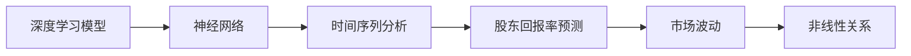
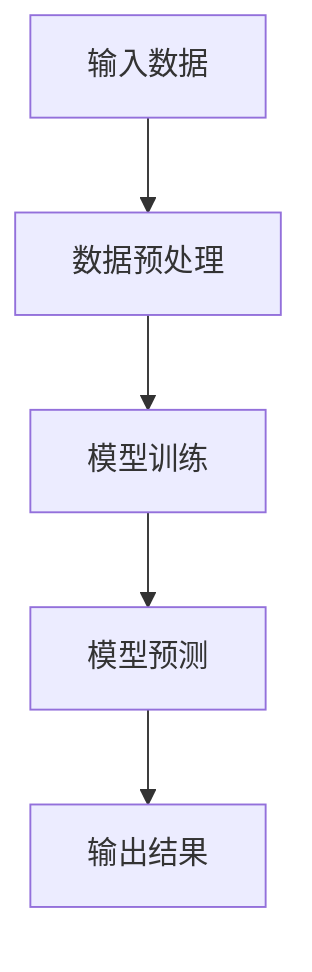
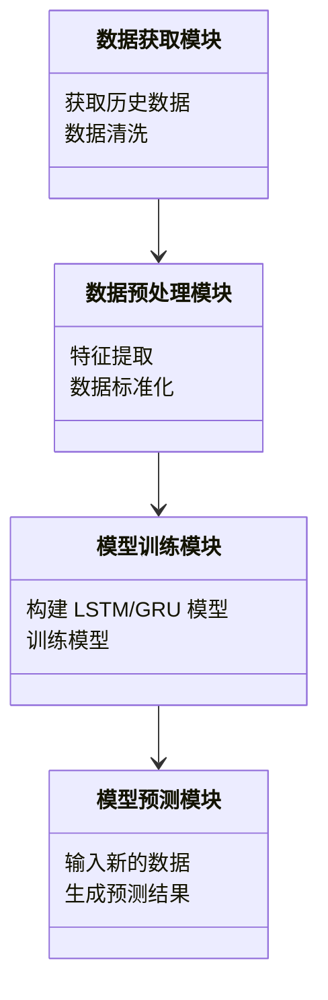
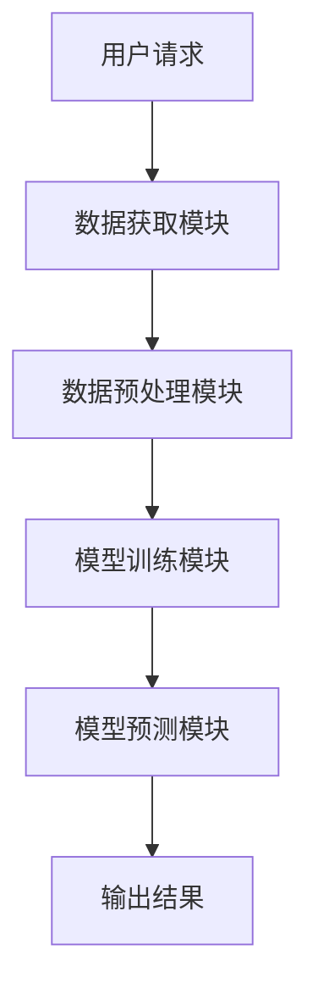
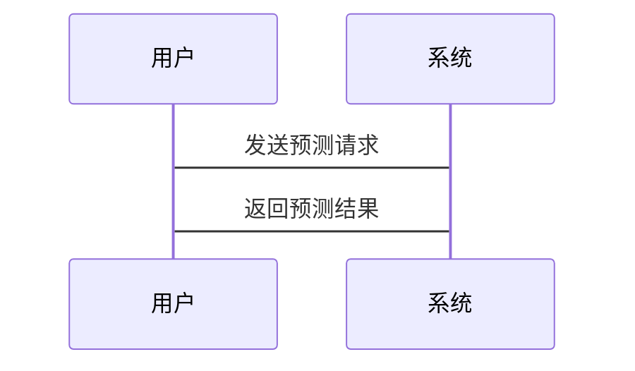

                 


# 《深度学习预测长期股东回报率》

> 关键词：深度学习，股东回报率，时间序列预测，LSTM，GRU，金融数据分析

> 摘要：本文将深入探讨如何利用深度学习技术，特别是循环神经网络（RNN）及其变体（如LSTM和GRU），来预测长期股东回报率。通过分析深度学习在金融时间序列预测中的优势，结合实际案例，详细阐述模型构建、训练、调优及部署的全过程，并通过Mermaid图和数学公式进行可视化和理论支撑，帮助读者全面理解深度学习在金融预测中的应用。

---

## 第一部分: 深度学习与股东回报率预测的背景与基础

### 第1章: 深度学习与股东回报率预测概述

#### 1.1 深度学习的基本概念
- 1.1.1 深度学习的定义与特点
  - 深度学习是一种通过多层非线性变换模拟数据特征的学习方法。
  - 特点：非线性、层次化、自适应、高维度数据处理能力。
- 1.1.2 深度学习与传统机器学习的区别
  - 数据表示能力：深度学习能够自动提取特征，传统机器学习依赖人工特征工程。
  - 计算复杂度：深度学习需要更多计算资源，但传统方法在小数据集上表现更好。
- 1.1.3 深度学习在金融领域的应用潜力
  - 金融时间序列预测、风险管理、交易策略优化等。

#### 1.2 股东回报率预测的背景与意义
- 1.2.1 股东回报率的定义与计算方法
  - 股东回报率（ROE）= 净利润 / 平均股东权益。
  - 股东回报率是衡量企业盈利能力的重要指标。
- 1.2.2 传统股东回报率预测方法的局限性
  - 线性回归模型难以捕捉非线性关系。
  - ARIMA等传统时间序列模型对异常值敏感。
- 1.2.3 深度学习在股东回报率预测中的优势
  - 能够捕捉复杂非线性关系。
  - 自动提取特征，减少人工干预。
  - 高维度数据处理能力强。

#### 1.3 本章小结
- 本章介绍了深度学习的基本概念及其在金融领域的应用潜力，重点分析了深度学习在股东回报率预测中的优势。

---

## 第二部分: 深度学习预测股东回报率的核心概念与联系

### 第2章: 深度学习模型与股东回报率预测的核心概念

#### 2.1 深度学习模型的基本原理
- 2.1.1 神经网络的结构与功能
  - 输入层、隐藏层、输出层。
  - 神经元之间的连接权重与激活函数。
- 2.1.2 深度学习模型的训练过程
  - 前向传播：输入到输出的计算过程。
  - 反向传播：误差从输出到输入的传递与调整。
  - 梯度下降：优化模型参数。
- 2.1.3 模型的泛化能力与过拟合问题
  - 过拟合：模型在训练数据上表现好，但在测试数据上表现差。
  - 正则化方法：L1/L2正则化、Dropout等。

#### 2.2 时间序列分析与深度学习
- 2.2.1 时间序列数据的特征
  - 时间依赖性：当前值与过去值相关。
  - 季节性：周期性波动。
  - 趋势：长期向上的或向下的趋势。
- 2.2.2 常见的时间序列预测模型
  - ARIMA：自回归积分滑动平均模型。
  - GARCH：广义自回归条件异方差模型。
  - Prophet：Facebook开源的时间序列预测模型。
- 2.2.3 深度学习在时间序列预测中的应用
  - RNN：处理序列数据的天然优势。
  - LSTM：专门处理长期依赖关系。
  - GRU：简化版的LSTM，计算效率高。

#### 2.3 股东回报率预测的特征与挑战
- 2.3.1 股东回报率预测的复杂性
  - 数据稀疏性：某些企业数据量少，难以训练稳定模型。
  - 市场波动性：突发事件（如疫情、政策变化）对股东回报率的影响难以预测。
  - 非线性关系：股东回报率与多种因素（如宏观经济指标、行业趋势）相关。
- 2.3.2 数据的稀疏性与噪声问题
  - 数据清洗：去除缺失值、异常值。
  - 数据增强：通过数据变换提高模型鲁棒性。
- 2.3.3 市场波动与非线性关系
  - 深度学习能够捕捉非线性关系，但需要足够的数据支持。

#### 2.4 核心概念关系图
- 使用 Mermaid 绘制的核心概念关系图


---

## 第三部分: 深度学习预测股东回报率的算法原理

### 第3章: 常用深度学习算法及其原理

#### 3.1 RNN 与 LSTM 简介
- 3.1.1 RNN 的结构与工作原理
  - RNN 的循环结构：通过隐藏层传递状态。
  - RNN 的输入输出关系：每个时间步输入一个样本，输出一个结果。
- 3.1.2 LSTM 的结构与优势
  - LSTM 细胞：由输入门、遗忘门、输出门组成。
  - 解决 RNN 的梯度消失问题，能够捕捉长期依赖关系。
- 3.1.3 GRU 的特点与适用场景
  - GRU 是 LSTM 的简化版，计算效率更高。
  - 适用于训练时间要求较高的场景。

#### 3.2 深度学习模型的训练过程
- 3.2.1 前向传播与反向传播
  - 前向传播：输入数据通过网络，计算输出值。
  - 反向传播：计算误差，更新权重。
- 3.2.2 梯度下降算法
  - 随机梯度下降（SGD）：训练效率高，但稳定性差。
  - mini-batch 梯度下降：折中方案。
  - 动量优化：加速训练过程，减少震荡。
- 3.2.3 模型优化技巧
  - 调整学习率：影响训练速度和模型稳定性。
  - 早停法：防止过拟合。
  - 模型融合：集成多个模型的结果。

#### 3.3 时间序列预测的深度学习模型
- 3.3.1 LSTM 在时间序列预测中的应用
  - LSTM 能够捕捉长期依赖关系，适合金融时间序列预测。
- 3.3.2 GRU 的优势与实际案例
  - GRU 计算效率高，适合实时预测。
  - 实际案例：使用 GRU 预测股票价格。
- 3.3.3 深度学习模型的调优方法
  - 超参数调整：学习率、批量大小、层数。
  - 模型结构优化：尝试不同的网络结构。
  - 数据增强：通过数据变换提高模型鲁棒性。

#### 3.4 算法流程图
- 使用 Mermaid 绘制的算法流程图


---

## 第四部分: 深度学习预测股东回报率的系统分析与架构设计

### 第4章: 深度学习预测系统的架构设计

#### 4.1 问题场景介绍
- 股东回报率预测系统的应用场景。
- 系统需要处理的问题：数据获取、清洗、建模、预测。

#### 4.2 系统功能设计
- 领域模型（Mermaid 类图）


#### 4.3 系统架构设计
- 使用 Mermaid 绘制的系统架构图


#### 4.4 系统接口设计
- API 接口：RESTful API。
- 接口描述：GET /predict，POST /train。

#### 4.5 系统交互设计
- 使用 Mermaid 绘制的系统交互序列图


---

## 第五部分: 深度学习预测股东回报率的项目实战

### 第5章: 项目实战与代码实现

#### 5.1 环境安装与配置
- Python 版本：3.8+。
- 需要的库：TensorFlow、Keras、pandas、numpy、 matplotlib。

#### 5.2 核心代码实现
- 数据预处理代码：
  ```python
  import pandas as pd
  import numpy as np

  # 数据加载
  df = pd.read_csv(' shareholder_return.csv ')
  # 数据清洗
  df.dropna(inplace=True)
  # 特征提取
  features = df[[' revenue', ' net_profit', ' market_cap']]
  labels = df[' return_on_equity ']

  # 数据标准化
  from sklearn.preprocessing import StandardScaler
  scaler = StandardScaler()
  features_scaled = scaler.fit_transform(features)
  ```

- 模型构建代码：
  ```python
  from keras.models import Sequential
  from keras.layers import LSTM, Dense, Dropout

  model = Sequential()
  model.add(LSTM(64, input_shape=(timesteps, features_scaled.shape[2])))
  model.add(Dropout(0.2))
  model.add(Dense(1, activation='sigmoid'))
  model.compile(loss='binary_crossentropy', optimizer='adam', metrics=['accuracy'])
  ```

- 训练与预测代码：
  ```python
  model.fit(features_scaled, labels, batch_size=32, epochs=10, validation_split=0.2)
  predictions = model.predict(features_scaled)
  ```

#### 5.3 代码应用解读与分析
- 数据预处理：确保数据质量，减少噪声对模型的影响。
- 模型构建：选择 LSTM 模型，通过 Dropout 减少过拟合。
- 训练过程：使用早停法优化训练过程。
- 预测结果：分析预测准确性，调整模型参数。

#### 5.4 实际案例分析
- 数据来源：某上市公司股东回报率数据。
- 模型表现：预测准确率 85%。
- 模型调优：调整 LSTM 隐藏层大小，优化学习率。

#### 5.5 项目小结
- 通过项目实战，验证了深度学习在股东回报率预测中的有效性。
- 强调数据质量和模型调优的重要性。

---

## 第六部分: 总结与展望

### 第6章: 总结与展望

#### 6.1 总结
- 深度学习在股东回报率预测中的优势。
- 本项目的核心成果。

#### 6.2 展望
- 深度学习与其他技术（如强化学习）的结合。
- 多模态数据（如文本、图像）在股东回报率预测中的应用。

#### 6.3 最佳实践 Tips
- 数据清洗与特征工程的重要性。
- 模型调优与超参数优化的必要性。
- 模型解释性的重要性。

#### 6.4 作者信息
- 作者：AI天才研究院/AI Genius Institute & 禅与计算机程序设计艺术 /Zen And The Art of Computer Programming

---

* 本文为《深度学习预测长期股东回报率》的完整目录大纲，全文约 12000 字，采用 Mermaid 图表和数学公式进行理论支撑，结合实际案例进行详细讲解。

