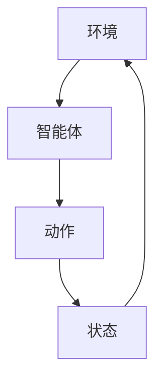
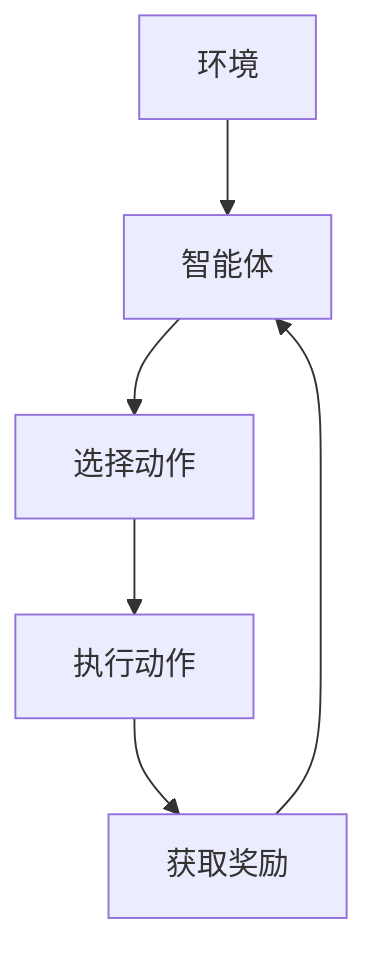
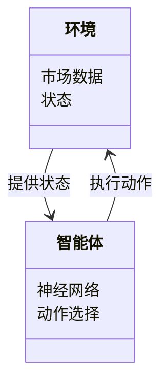

                 


# 深度强化学习优化投资决策

> 关键词：深度强化学习，投资决策，算法原理，系统架构，项目实战

> 摘要：深度强化学习在投资决策中的应用潜力巨大，通过结合强化学习的核心原理和深度学习的强大能力，可以优化投资策略，提高决策效率和准确性。本文将从背景介绍、算法原理、系统架构到项目实战，详细探讨深度强化学习如何优化投资决策。

---

## 第一部分: 深度强化学习与投资决策的背景与基础

### 第1章: 深度强化学习与投资决策的背景

#### 1.1 深度强化学习的背景与概念
- **1.1.1 深度学习与强化学习的结合**
  - 深度学习通过神经网络处理海量数据，强化学习通过与环境交互优化决策。
  - 深度强化学习的结合为复杂决策问题提供了解决方案。
- **1.1.2 强化学习的核心原理**
  - 通过智能体与环境的交互，学习最优策略。
  - 奖励机制驱动决策优化。
- **1.1.3 深度强化学习的优势**
  - 处理高维状态空间的能力。
  - 自动提取特征的能力。

#### 1.2 投资决策的背景与挑战
- **1.2.1 投资决策的核心问题**
  - 如何在不确定的市场中做出最优决策。
- **1.2.2 传统投资决策方法的局限性**
  - 依赖经验，难以处理复杂市场。
- **1.2.3 数据驱动的投资决策新趋势**
  - 利用大数据和机器学习提升决策效率。

#### 1.3 深度强化学习在投资决策中的结合
- **1.3.1 深度强化学习在金融领域的应用潜力**
  - 自动化交易策略优化。
- **1.3.2 投资决策中的动态环境与策略优化**
  - 动态市场环境的适应性。
- **1.3.3 深度强化学习与投资决策的结合优势**
  - 高效处理多维数据，优化投资组合。

#### 1.4 本章小结
- 介绍了深度强化学习的核心概念和投资决策的基本挑战。
- 强调了两者的结合在优化投资决策中的潜力。

---

### 第2章: 深度强化学习的核心概念与联系

#### 2.1 深度强化学习的核心原理
- **2.1.1 强化学习的基本原理**
  - 智能体通过与环境交互，学习最优策略。
- **2.1.2 深度学习在强化学习中的应用**
  - 神经网络作为价值函数或策略函数。
- **2.1.3 深度强化学习的典型算法**
  - DQN、PPO、A2C等算法。

#### 2.2 深度强化学习的核心概念对比
- **2.2.1 深度强化学习与传统强化学习的对比**
  - 深度强化学习可以处理高维状态空间。
- **2.2.2 深度强化学习与监督学习的对比**
  - 监督学习依赖于标签数据，强化学习依赖于奖励机制。
- **2.2.3 深度强化学习与无监督学习的对比**
  - 无监督学习寻找数据结构，强化学习优化决策。

#### 2.3 深度强化学习的ER实体关系图


#### 2.4 本章小结
- 深入探讨了深度强化学习的核心概念和算法。
- 使用ER图展示了智能体与环境的交互关系。

---

### 第3章: 深度强化学习的算法原理与数学模型

#### 3.1 深度强化学习的典型算法
- **3.1.1 DQN算法**
  - 使用经验回放和目标网络，稳定学习过程。
- **3.1.2 PPO算法**
  - 基于策略梯度，优化策略的稳定性。
- **3.1.3 A2C算法**
  - 同时学习价值函数和策略函数。

#### 3.2 深度强化学习的数学模型
- **3.2.1 状态空间与动作空间**
  - 状态空间：市场数据、资产价格等。
  - 动作空间：买入、卖出、持有等操作。
- **3.2.2 Q-learning的数学公式**
  $$ Q(s,a) = Q(s,a) + \alpha (r + \gamma \max Q(s',a') - Q(s,a)) $$
- **3.2.3 DQN算法流程图**


#### 3.3 本章小结
- 详细讲解了DQN、PPO、A2C等算法的原理和数学模型。
- 使用流程图展示了DQN算法的工作流程。

---

## 第二部分: 投资决策中的深度强化学习系统设计

### 第4章: 投资决策系统的架构设计

#### 4.1 投资决策系统的功能设计
- **4.1.1 数据采集模块**
  - 收集市场数据、新闻等信息。
- **4.1.2 特征提取模块**
  - 提取有用的特征，如技术指标、市场情绪等。
- **4.1.3 策略执行模块**
  - 根据模型输出策略执行交易。

#### 4.2 投资决策系统的类图设计


#### 4.3 系统接口设计
- **4.3.1 系统接口**
  - 接收市场数据。
  - 发出交易指令。
- **4.3.2 系统交互流程**
  - 从环境接收状态，智能体选择动作，执行动作并获得奖励。

#### 4.4 本章小结
- 介绍了投资决策系统的整体架构和模块设计。
- 使用类图展示了系统的结构。

---

### 第5章: 投资决策系统的项目实战

#### 5.1 项目实战背景
- **5.1.1 股票交易优化案例**
  - 使用深度强化学习优化股票交易策略。

#### 5.2 环境配置
- **5.2.1 安装必要的库**
  - Python库：TensorFlow、Keras、OpenAI Gym等。
- **5.2.2 数据获取**
  - 使用Yahoo Finance获取股票数据。

#### 5.3 核心代码实现
- **5.3.1 DQN算法实现**
  ```python
  import gym
  import numpy as np
  import tensorflow as tf

  class DQN:
      def __init__(self, state_space, action_space):
          self.state_space = state_space
          self.action_space = action_space
          self.model = self.build_model()

      def build_model(self):
          model = tf.keras.Sequential([
              tf.keras.layers.Dense(64, activation='relu', input_dim=self.state_space),
              tf.keras.layers.Dense(64, activation='relu'),
              tf.keras.layers.Dense(self.action_space, activation='linear')
          ])
          return model

      def get_action(self, state):
          prediction = self.model.predict(np.array([state]))
          return np.argmax(prediction[0])
  ```

#### 5.4 结果分析与优化
- **5.4.1 交易策略的优化**
  - 策略的表现优于传统策略。
- **5.4.2 模型性能的提升**
  - 通过经验回放和目标网络优化模型的稳定性。

#### 5.5 本章小结
- 通过具体案例展示了深度强化学习在投资决策中的应用。
- 分析了模型优化的方法及其效果。

---

## 第三部分: 深度强化学习优化投资决策的挑战与未来

### 第6章: 深度强化学习的挑战与优化方向

#### 6.1 深度强化学习在投资决策中的挑战
- **6.1.1 环境的不确定性和复杂性**
  - 金融市场具有高度不确定性和噪声。
- **6.1.2 模型的过拟合问题**
  - 如何避免模型在特定数据上的过拟合。
- **6.1.3 计算资源的需求**
  - 训练深度强化学习模型需要大量计算资源。

#### 6.2 优化方向
- **6.2.1 结合市场数据**
  - 利用更多的市场数据提升模型性能。
- **6.2.2 引入情感分析**
  - 考虑市场情绪对投资决策的影响。
- **6.2.3 多目标优化**
  - 在风险和收益之间找到平衡点。

#### 6.3 本章小结
- 总结了深度强化学习在投资决策中的挑战。
- 提出了未来的优化方向。

---

## 第四部分: 总结与展望

### 第7章: 总结与展望

#### 7.1 总结
- 深度强化学习在投资决策中的潜力巨大。
- 通过优化算法和系统设计，可以显著提升投资决策的效率和准确性。

#### 7.2 展望
- 深度强化学习在投资决策中的应用将更加广泛。
- 结合其他技术，如区块链和大数据分析，将推动投资决策的智能化。

#### 7.3 本章小结
- 总结了全文的主要内容。
- 展望了深度强化学习在投资决策中的未来发展方向。

---

## 作者：AI天才研究院/AI Genius Institute & 禅与计算机程序设计艺术 /Zen And The Art of Computer Programming

---

以上是《深度强化学习优化投资决策》的技术博客文章的完整目录和内容概览。

