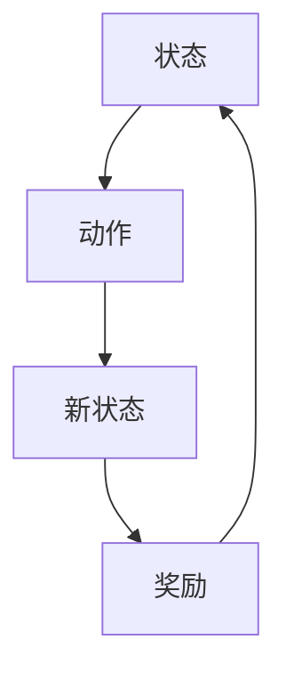
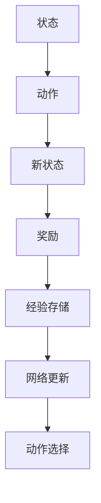
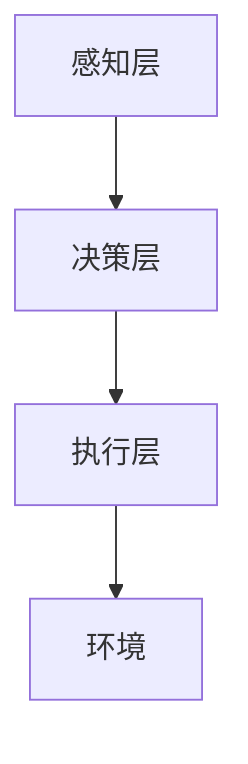
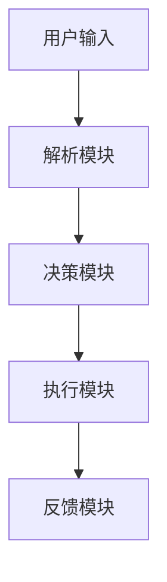
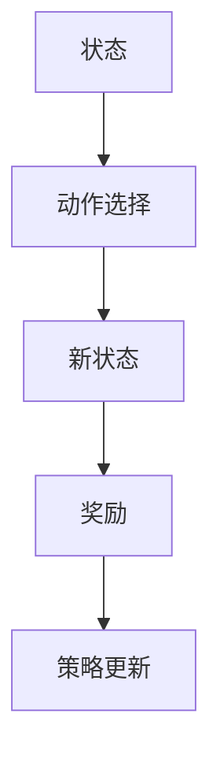

                 


# 深度强化学习在AI Agent控制中的应用

> 关键词：深度强化学习、AI Agent、强化学习算法、系统架构设计、数学模型、项目实战

> 摘要：本文深入探讨了深度强化学习在AI Agent控制中的应用，从基本概念到核心算法，再到系统架构设计和实际项目实现，结合具体案例分析和代码实现，详细讲解了深度强化学习在AI Agent控制中的原理、方法和实践应用。文章旨在帮助读者全面理解深度强化学习在AI Agent控制中的作用，并通过实际案例展示其应用价值。

---

# 第一部分: 深度强化学习与AI Agent基础

# 第1章: 深度强化学习与AI Agent概述

## 1.1 深度强化学习的基本概念

### 1.1.1 什么是强化学习

强化学习是一种机器学习范式，通过智能体与环境交互，学习如何采取一系列行动以最大化累积的奖励。与监督学习不同，强化学习不需要明确的标签，而是通过奖励信号来指导学习过程。

### 1.1.2 深度强化学习的定义

深度强化学习（Deep Reinforcement Learning, DRL）是将深度学习与强化学习结合的一种技术，利用深度神经网络来逼近最优策略或价值函数。深度强化学习通过神经网络处理高维状态空间，适用于复杂任务。

### 1.1.3 AI Agent的基本概念

AI Agent（智能体）是指在环境中能够感知并自主行动以实现目标的实体。AI Agent可以是软件程序、机器人或其他智能系统，通过感知环境信息并采取行动来优化目标。

## 1.2 深度强化学习的核心原理

### 1.2.1 状态、动作、奖励的定义

- **状态（State）**：环境在某一时刻的观察。
- **动作（Action）**：智能体在某一状态下采取的行为。
- **奖励（Reward）**：智能体采取行动后获得的反馈，通常是一个标量值。

### 1.2.2 策略与价值函数

- **策略（Policy）**：智能体选择动作的概率分布。
- **价值函数（Value Function）**：评估当前状态或动作-状态对的未来累积奖励的函数。

### 1.2.3 探索与利用的平衡

在强化学习中，智能体需要在探索新状态和利用已知信息之间找到平衡。探索有助于发现更好的策略，而利用则确保当前最优策略的执行。

## 1.3 深度强化学习的应用场景

### 1.3.1 游戏AI

深度强化学习广泛应用于游戏AI的开发，如AlphaGo、AlphaStar等。

### 1.3.2 机器人控制

在机器人控制中，深度强化学习用于实现复杂的动作规划和控制策略。

### 1.3.3 自动驾驶

自动驾驶系统通过深度强化学习学习复杂的驾驶策略，处理多变的环境条件。

## 1.4 本章小结

本章介绍了深度强化学习和AI Agent的基本概念，分析了其核心原理和应用场景，为后续章节奠定了基础。

---

# 第二部分: 深度强化学习的核心算法

# 第2章: Q-Learning与Deep Q-Networks

## 2.1 Q-Learning算法

### 2.1.1 算法原理

Q-Learning是一种经典的强化学习算法，通过更新Q值表来学习最优策略。

### 2.1.2 算法流程图



### 2.1.3 Q值更新公式

$$ Q(s,a) = Q(s,a) + \alpha (r + \gamma \max Q(s',a') - Q(s,a)) $$

### 2.1.4 实验分析

通过实验验证Q-Learning算法的收敛性和稳定性。

## 2.2 Deep Q-Networks

### 2.2.1 DQN算法的改进

DQN通过深度神经网络逼近Q值函数，解决了高维状态空间的问题。

### 2.2.2 经验回放机制

经验回放通过存储和重放经验，减少相关样本之间的依赖，提高学习效率。

### 2.2.3 网络结构与训练过程

DQN的网络结构通常包括输入层、隐藏层和输出层，训练过程包括经验回放、网络更新等步骤。

### 2.2.4 算法流程图



## 2.3 实验分析

### 2.3.1 算法收敛性分析

通过实验分析DQN算法的收敛速度和稳定性。

### 2.3.2 算法的优缺点

DQN的优势包括高维状态处理能力，但存在经验回放空间需求大等问题。

## 2.4 本章小结

本章详细讲解了Q-Learning和DQN算法，分析了其原理和应用场景，为后续章节提供了理论基础。

---

# 第三部分: AI Agent的系统架构与设计

# 第3章: AI Agent的系统架构

## 3.1 领域模型设计

### 3.1.1 领域模型的定义

领域模型是AI Agent对环境的抽象表示，用于描述状态、动作和奖励之间的关系。

### 3.1.2 领域模型的构建方法

通过状态、动作和奖励的定义，构建领域模型。

### 3.1.3 领域模型的验证

通过实验验证领域模型的有效性和准确性。

## 3.2 系统架构设计

### 3.2.1 分层架构

分层架构将系统划分为感知层、决策层和执行层，各层之间通过接口进行通信。

### 3.2.2 微服务架构

微服务架构将系统功能分解为多个独立的服务，通过API进行交互。

### 3.2.3 混合架构

混合架构结合分层和微服务架构的优点，适用于复杂系统的设计。

### 3.2.4 系统架构图



## 3.3 接口设计与交互流程

### 3.3.1 接口定义

通过API定义系统各部分之间的交互接口。

### 3.3.2 交互流程图



## 3.4 本章小结

本章详细讲解了AI Agent的系统架构设计，包括领域模型、架构选择和接口设计，为实际应用提供了指导。

---

# 第四部分: 深度强化学习的数学模型与算法实现

# 第4章: 深度强化学习的数学模型

## 4.1 状态值函数

### 4.1.1 状态值函数的定义

状态值函数V(s)表示从状态s开始的期望累积奖励。

### 4.1.2 Bellman方程

$$ V(s) = \max_{a} [ r(s,a) + \gamma V(s') ] $$

## 4.2 动作值函数

### 4.2.1 动作值函数的定义

动作值函数Q(s,a)表示在状态s下采取动作a的期望累积奖励。

### 4.2.2 动作值函数的更新公式

$$ Q(s,a) = r(s,a) + \gamma \max_{a'} Q(s',a') $$

## 4.3 策略梯度方法

### 4.3.1 策略梯度的定义

策略梯度方法通过优化策略的参数来最大化累积奖励。

### 4.3.2 策略梯度算法流程图



## 4.4 本章小结

本章详细讲解了深度强化学习的数学模型，包括状态值函数、动作值函数和策略梯度方法，为算法实现提供了理论支持。

---

# 第五部分: 项目实战

# 第5章: 项目实战

## 5.1 环境安装

安装必要的依赖库，如TensorFlow、Keras等。

## 5.2 核心代码实现

### 5.2.1 DQN算法实现

```python
class DQN:
    def __init__(self, state_space, action_space, epsilon=1.0):
        self.state_space = state_space
        self.action_space = action_space
        self.epsilon = epsilon
        # 网络结构
        self.model = self.build_model()

    def build_model(self):
        # 网络结构定义
        pass

    def remember(self, state, action, reward, next_state):
        # 存储经验
        pass

    def act(self, state):
        # 动作选择
        pass

    def update(self, batch_size):
        # 网络更新
        pass
```

### 5.2.2 实验结果分析

通过实验验证算法的收敛性和稳定性。

## 5.3 案例分析

### 5.3.1 游戏AI案例

实现一个简单的游戏AI，通过深度强化学习学习游戏策略。

### 5.3.2 机器人控制案例

实现机器人控制，通过深度强化学习学习复杂的动作规划。

## 5.4 项目总结

总结项目实现的过程和经验教训，提出改进建议。

## 5.5 本章小结

本章通过实际项目展示了深度强化学习在AI Agent控制中的应用，详细讲解了环境安装、核心代码实现和案例分析。

---

# 第六部分: 高级主题与最佳实践

# 第6章: 高级主题

## 6.1 深度强化学习的算法优化

### 6.1.1 算法优化方法

包括经验回放优化、网络结构优化等。

### 6.1.2 算法优化实验

通过实验验证优化方法的有效性。

## 6.2 深度强化学习的安全与伦理

### 6.2.1 安全风险分析

分析深度强化学习在AI Agent控制中可能面临的安全风险。

### 6.2.2 伦理问题探讨

探讨深度强化学习在AI Agent控制中的伦理问题。

## 6.3 深度强化学习的性能调优

### 6.3.1 性能调优方法

包括网络参数调优、学习率调整等。

### 6.3.2 性能调优实验

通过实验验证调优方法的有效性。

## 6.4 深度强化学习的未来趋势

### 6.4.1 技术发展趋势

分析深度强化学习在AI Agent控制中的技术发展趋势。

### 6.4.2 应用前景展望

展望深度强化学习在AI Agent控制中的应用前景。

## 6.5 本章小结

本章探讨了深度强化学习的高级主题，包括算法优化、安全与伦理、性能调优和未来趋势。

---

# 结语

深度强化学习在AI Agent控制中的应用前景广阔，通过不断的技术创新和实践探索，深度强化学习将为AI Agent控制带来更多的可能性。未来，随着技术的发展，深度强化学习将在更多领域得到广泛应用。

---

# 作者：AI天才研究院/AI Genius Institute & 禅与计算机程序设计艺术 /Zen And The Art of Computer Programming

---

以上是《深度强化学习在AI Agent控制中的应用》的完整目录大纲和文章内容，涵盖了从基础到高级的各个方面，结合理论分析和实际案例，详细讲解了深度强化学习在AI Agent控制中的应用。

