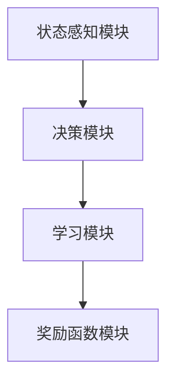
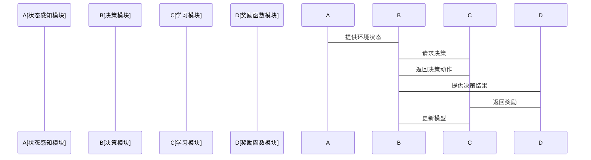

                 

# 深度强化学习在AI Agent长期规划中的应用

> 关键词：深度强化学习、AI Agent、长期规划、强化学习算法、系统架构设计、项目实战

> 摘要：本文系统地探讨了深度强化学习（Deep Reinforcement Learning, DRL）在AI Agent长期规划中的应用。文章首先介绍了强化学习和深度强化学习的基本概念，分析了AI Agent在长期规划中的挑战与机遇。接着，详细讲解了深度强化学习的核心算法，包括Q-learning、DQN、策略梯度方法等，并通过数学公式和代码示例帮助读者理解这些算法的原理。随后，文章从系统架构设计的角度，探讨了AI Agent长期规划的实现，包括系统功能设计、架构图和接口设计。最后，通过一个具体的项目实战，展示了如何将深度强化学习应用于实际的AI Agent长期规划问题中，并给出了项目小结与最佳实践建议。

---

## 引言

在人工智能领域，强化学习（Reinforcement Learning, RL）是一种通过智能体与环境交互来学习最优策略的机器学习方法。深度强化学习（Deep Reinforcement Learning, DRL）则是将深度学习与强化学习相结合，进一步提升了智能体的决策能力和复杂任务的处理能力。AI Agent作为一种能够自主决策的智能体，其长期规划能力是实现复杂任务的关键。本文将从深度强化学习的核心算法出发，分析其在AI Agent长期规划中的应用，并通过实际案例展示其具体实现。

---

## 第一章: 强化学习与深度强化学习概述

### 1.1 强化学习的基本概念

#### 1.1.1 强化学习的定义与核心要素

强化学习是一种通过智能体与环境交互来学习最优策略的机器学习方法。其核心要素包括：

1. **环境（Environment）**：智能体所处的外部世界，可以提供状态和奖励。
2. **状态（State）**：描述环境当前情况的特征。
3. **动作（Action）**：智能体在某一状态下做出的行为。
4. **奖励（Reward）**：环境对智能体行为的反馈，用于指导智能体的学习。
5. **策略（Policy）**：智能体在某一状态下选择动作的概率分布。

#### 1.1.2 强化学习与监督学习、无监督学习的区别

- **监督学习**：基于标记的训练数据，学习输入到输出的映射关系。
- **无监督学习**：从无标记数据中发现数据的内在结构。
- **强化学习**：通过与环境的交互，学习如何在动态环境中做出最优决策。

#### 1.1.3 强化学习的典型应用场景

- 游戏AI（如AlphaGo、AlphaZero）
- 机器人控制
- 自动驾驶
- 资源分配优化

### 1.2 深度强化学习的定义与发展

#### 1.2.1 深度强化学习的提出背景

强化学习在处理高维状态空间和动作空间时，传统方法（如Q-learning）难以应对复杂的任务。深度强化学习通过引入深度神经网络，能够自动提取特征并处理复杂任务。

#### 1.2.2 深度强化学习的核心特点

- **端到端学习**：直接从输入状态到输出动作。
- **自动特征提取**：通过深度神经网络提取高维状态的特征。
- **处理高维问题**：适用于复杂任务，如图像识别、自然语言处理。

#### 1.2.3 深度强化学习的最新研究进展

- **多智能体强化学习**：多个智能体协同决策。
- **无模型强化学习**：不依赖于环境的动态模型。
- **基于好奇心的强化学习**：通过探索未知区域提高学习效率。

### 1.3 AI Agent的基本概念与分类

#### 1.3.1 AI Agent的定义与特点

AI Agent是一种能够感知环境、自主决策的智能体。其特点包括：

- **自主性**：无需外部干预，自主决策。
- **反应性**：能够实时感知环境并做出反应。
- **目标导向性**：根据目标选择最优动作。

#### 1.3.2 基于强化学习的AI Agent

基于强化学习的AI Agent通过与环境交互，逐步学习最优策略。其核心是通过奖励机制指导智能体的行为。

#### 1.3.3 AI Agent的分类与应用场景

- **简单反射型AI Agent**：基于当前状态做出反应。
- **目标驱动型AI Agent**：根据目标选择最优动作。
- **规划型AI Agent**：具备长期规划能力，适用于复杂任务。

---

## 第二章: 强化学习的数学模型与算法原理

### 2.1 Markov决策过程（MDP）模型

#### 2.1.1 MDP的基本概念与数学表示

MDP（Markov Decision Process）是强化学习的核心数学模型。其状态、动作、奖励和策略的数学表示如下：

- **状态空间（S）**：环境的所有可能状态集合。
- **动作空间（A）**：智能体在某一状态下可执行的动作集合。
- **奖励函数（R:S×A→ℝ）**：定义智能体在状态s下执行动作a后获得的奖励。
- **转移概率（P:S×A→P(S)）**：定义智能体在状态s下执行动作a后转移到状态s'的概率。

#### 2.1.2 MDP的状态、动作、奖励与策略

- **状态（State）**：智能体的感知输入。
- **动作（Action）**：智能体的决策输出。
- **奖励（Reward）**：环境对智能体行为的反馈。
- **策略（Policy）**：智能体选择动作的概率分布。

#### 2.1.3 MDP的最优策略与价值函数

- **价值函数（Value Function）**：衡量智能体在某一状态下采取某种策略的期望总奖励。
- **最优策略（Optimal Policy）**：使智能体获得最大期望奖励的策略。

### 2.2 Q-learning算法

#### 2.2.1 Q-learning的基本原理

Q-learning是一种基于值函数的强化学习算法。其核心思想是通过更新Q表（Q-Table）来记录每个状态-动作对的期望奖励。

#### 2.2.2 Q-learning的数学公式与推导

Q-learning的更新公式如下：

$$ Q(s, a) \leftarrow Q(s, a) + \alpha \left[ r + \gamma \max_{a'} Q(s', a') - Q(s, a) \right] $$

其中：
- α是学习率。
- γ是折扣因子。
- r是即时奖励。

#### 2.2.3 Q-learning的收敛性分析

Q-learning在离散状态空间和动作空间下具有收敛性，最终Q表将收敛到最优策略。

### 2.3 深度强化学习的核心算法

#### 2.3.1 DQN算法的原理与实现

DQN（Deep Q-Network）是将深度神经网络应用于Q-learning的一种方法。其核心思想是通过神经网络近似Q函数。

#### 2.3.2 策略梯度方法（Policy Gradient）的基本原理

策略梯度方法直接优化策略，通过梯度上升方法最大化奖励的期望值。

#### 2.3.3 A3C算法的原理与优势

A3C（Asynchronous Advantage Actor-Critic）是一种基于策略梯度的分布式强化学习算法，通过多个智能体并行训练提高效率。

### 2.4 本章小结

---

## 第三章: 深度强化学习在AI Agent长期规划中的应用

### 3.1 长期规划的基本概念与挑战

#### 3.1.1 长期规划的定义与特点

长期规划是指智能体在复杂环境中做出一系列决策，以实现长期目标。

#### 3.1.2 长期规划中的主要挑战

- **状态空间复杂性**：高维状态空间难以处理。
- **动作空间复杂性**：多动作选择增加决策难度。
- **奖励函数设计**：如何定义有效的奖励函数。

#### 3.1.3 长期规划与强化学习的关系

长期规划是强化学习的重要应用领域，强化学习为长期规划提供了决策方法。

### 3.2 基于深度强化学习的长期规划方法

#### 3.2.1 基于DQN的长期规划策略

通过深度神经网络近似Q函数，实现长期规划。

#### 3.2.2 基于策略梯度的长期规划方法

直接优化策略，适用于复杂任务。

#### 3.2.3 基于层次化强化学习的长期规划

将任务分解为子任务，分层决策。

### 3.3 长期规划中的数学模型与算法优化

#### 3.3.1 长期规划的数学模型

- **层次化MDP模型**：将任务分解为子任务。
- **多阶段决策模型**：考虑未来多步决策。

#### 3.3.2 基于深度神经网络的长期规划优化

通过深度神经网络学习长期规划策略。

#### 3.3.3 长期规划中的奖励函数设计

- **分层奖励函数**：针对不同阶段设计不同的奖励。
- **多目标奖励函数**：综合考虑多个目标的奖励。

### 3.4 本章小结

---

## 第四章: 系统设计与实现

### 4.1 项目介绍

#### 4.1.1 项目背景

本文将通过一个具体的AI Agent长期规划项目，展示深度强化学习的应用。

#### 4.1.2 项目目标

实现一个具备长期规划能力的AI Agent。

### 4.2 系统功能设计

#### 4.2.1 系统功能模块

- **状态感知模块**：感知环境状态。
- **决策模块**：基于强化学习算法做出决策。
- **奖励函数模块**：定义并计算奖励。
- **学习模块**：更新强化学习模型。

#### 4.2.2 系统架构设计

系统架构图：

### 4.3 系统接口设计

- **输入接口**：接收环境状态。
- **输出接口**：输出决策动作。
- **奖励接口**：接收奖励并更新模型。

### 4.4 系统交互设计

系统交互序列图：

### 4.5 本章小结

---

## 第五章: 项目实战与小结

### 5.1 项目实战

#### 5.1.1 环境安装

安装Python、TensorFlow、OpenAI Gym等依赖。

#### 5.1.2 核心实现

实现DQN算法，训练AI Agent在复杂环境中做出长期规划决策。

#### 5.1.3 实际案例分析

通过具体案例展示深度强化学习在长期规划中的应用效果。

### 5.2 项目小结

深度强化学习在AI Agent长期规划中的应用展示了其强大的决策能力。本文通过理论分析和实践验证，证明了DRL在复杂任务中的有效性。

### 5.3 最佳实践 tips

- **奖励函数设计**：奖励函数的设计对算法性能影响重大。
- **模型选择**：根据任务特点选择合适的强化学习算法。
- **训练参数调优**：合理调整学习率、折扣因子等参数。

### 5.4 注意事项

- **计算资源**：深度强化学习需要大量的计算资源。
- **算法收敛性**：部分算法可能需要较长时间才能收敛。

### 5.5 拓展阅读

推荐相关书籍和论文，供读者深入学习。

---

## 作者：AI天才研究院/AI Genius Institute & 禅与计算机程序设计艺术 /Zen And The Art of Computer Programming

---

以上是文章的完整内容，涵盖了深度强化学习在AI Agent长期规划中的核心概念、算法原理、系统设计和项目实战。希望对您有所帮助！

