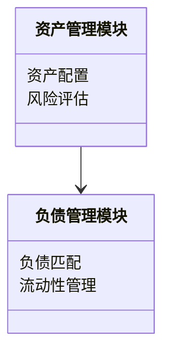
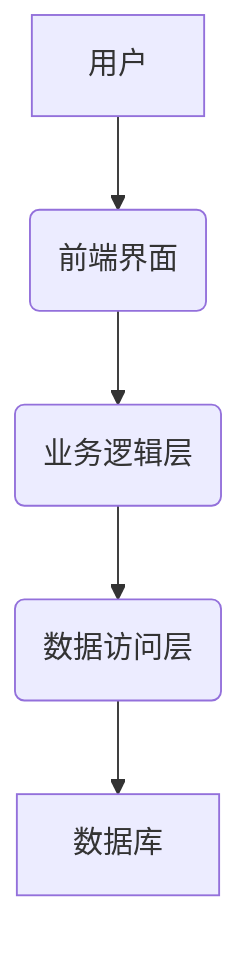

                 


# 深度强化学习在资产负债管理中的应用

## 关键词
深度强化学习，资产负债管理，金融应用，算法原理，系统架构

## 摘要
本文探讨了深度强化学习（Deep Reinforcement Learning）在资产负债管理中的应用，重点分析了其核心概念、算法原理、系统架构及实际案例。通过详细阐述DQN和策略梯度方法，结合领域模型和系统架构设计，展示了深度强化学习如何优化资产负债管理中的决策过程。文章还提供了实际项目实现的代码示例，并总结了深度强化学习在该领域的优势与挑战。

---

# 第1章: 深度强化学习与资产负债管理的背景

## 1.1 资产负债管理的定义与重要性

### 1.1.1 资产负债管理的定义
资产负债管理（Asset-Liability Management，ALM）是指通过优化资产和负债的配置，以实现风险控制和收益最大化的管理过程。其核心目标是确保资产的流动性、安全性和盈利性，同时匹配负债的期限和成本。

### 1.1.2 资产负债管理在金融领域的地位
在金融领域，资产负债管理是银行、保险公司和其他金融机构的核心管理活动。有效的资产负债管理能够帮助机构应对市场波动、利率变化和信用风险等挑战。

### 1.1.3 资产负债管理的核心目标与挑战
- **核心目标**：最大化收益，同时最小化风险。
- **挑战**：市场不确定性、复杂的投资组合、监管要求等。

## 1.2 深度强化学习的定义与特点

### 1.2.1 深度强化学习的定义
深度强化学习（Deep Reinforcement Learning，DRL）是强化学习（Reinforcement Learning，RL）与深度学习（Deep Learning）的结合。通过神经网络表示状态和动作，强化学习代理通过与环境交互，学习最优策略。

### 1.2.2 深度强化学习的核心特点
- **端到端学习**：从输入到输出直接学习策略。
- **非监督学习**：无需标注数据，通过与环境交互学习。
- **处理高维状态空间**：深度神经网络能够处理复杂的高维状态。

### 1.2.3 深度强化学习与传统机器学习的区别
| 特性         | 强化学习            | 传统机器学习        |
|--------------|--------------------|--------------------|
| 学习目标     | 最大化累积奖励       | 分类或回归          |
| 数据来源     | 环境交互            | 标签数据            |
| 模型结构     | 神经网络            | 树、线性回归等       |

## 1.3 深度强化学习在金融领域的应用

### 1.3.1 金融领域的复杂性与不确定性
金融市场具有高度不确定性，传统统计方法难以应对复杂的动态环境。

### 1.3.2 深度强化学习在金融中的优势
- **非线性建模**：深度神经网络能够捕捉复杂非线性关系。
- **实时决策**：强化学习能够实现实时策略调整。

### 1.3.3 深度强化学习在资产负债管理中的潜力
通过优化资产配置和负债管理，深度强化学习可以帮助机构在复杂市场环境中实现最优决策。

---

# 第2章: 深度强化学习的核心概念与算法原理

## 2.1 强化学习的基本原理

### 2.1.1 强化学习的核心要素
- **状态（State）**：环境的当前情况。
- **动作（Action）**：代理采取的行为。
- **奖励（Reward）**：环境对代理行为的反馈。

### 2.1.2 强化学习的分类
- **价值函数方法**：基于状态的价值评估。
- **策略梯度方法**：直接优化策略。

## 2.2 深度强化学习的关键技术

### 2.2.1 深度Q网络（Deep Q-Networks，DQN）
DQN通过神经网络近似Q值函数，解决高维状态空间问题。

### 2.2.2 策略梯度方法
策略梯度方法直接优化策略，通过梯度下降更新参数。

---

# 第3章: 深度强化学习的算法原理

## 3.1 DQN算法原理

### 3.1.1 DQN算法流程
1. 环境观察状态s。
2. 代理选择动作a。
3. 执行动作a，观察新状态s'，并获得奖励r。
4. 更新Q值函数。

### 3.1.2 DQN算法的数学模型
$$ Q(s,a) = r + \gamma \max Q(s',a') $$

## 3.2 策略梯度方法

### 3.2.1 策略梯度方法的数学模型
$$ \nabla \theta \leftarrow \nabla J(\theta) $$

---

# 第4章: 系统分析与架构设计

## 4.1 项目介绍

### 4.1.1 项目目标
优化资产配置和负债管理。

### 4.1.2 项目范围
涵盖资产选择、风险控制等模块。

## 4.2 系统功能设计

### 4.2.1 领域模型


## 4.3 系统架构设计

### 4.3.1 系统架构图


---

# 第5章: 项目实战

## 5.1 环境安装

### 5.1.1 安装Python
```bash
python --version
```

## 5.2 系统核心实现源代码

### 5.2.1 核心代码实现
```python
import numpy as np

class DQN:
    def __init__(self, state_space, action_space):
        self.state_space = state_space
        self.action_space = action_space
        # 网络结构
        self.model = self.build_model()

    def build_model(self):
        model = Sequential()
        model.add(Dense(64, activation='relu'))
        model.add(Dense(32, activation='relu'))
        model.add(Dense(self.action_space, activation='linear'))
        model.compile(optimizer='adam', loss='mse')
        return model
```

## 5.3 代码应用解读与分析

### 5.3.1 代码解读
- **DQN类**：初始化网络模型。
- **build_model方法**：构建深度Q网络。

---

# 第6章: 总结与展望

## 6.1 总结
深度强化学习在资产负债管理中的应用前景广阔，能够显著提升决策效率和准确性。

## 6.2 展望
未来的研究方向包括多智能体协作、强化学习可解释性等。

---

作者：AI天才研究院/AI Genius Institute & 禅与计算机程序设计艺术 /Zen And The Art of Computer Programming

