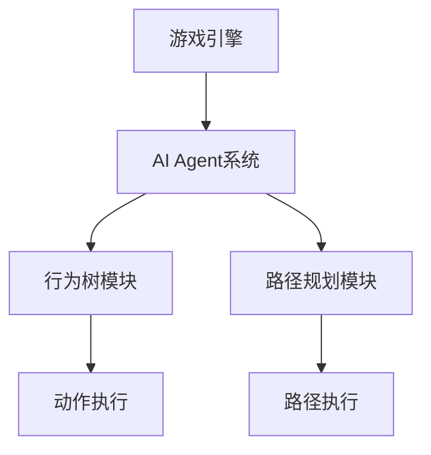

                 


# 游戏开发中的AI Agent非玩家角色

> **关键词**: 游戏开发, AI Agent, 非玩家角色, 路径规划, 行为树

> **摘要**: 本文深入探讨了游戏开发中AI Agent非玩家角色的核心概念、算法原理和实现方法。通过详细分析行为树、路径规划算法和数学模型，结合实际案例，展示了如何设计和实现智能的非玩家角色，提升游戏体验。

---

## 第一部分: 游戏中的AI Agent概述

### 第1章: AI Agent的基本概念

#### 1.1 什么是AI Agent
AI Agent（人工智能代理）是非玩家角色（NPC）的核心技术，用于模拟游戏中的智能行为，如敌人追击玩家或队友协作。

#### 1.2 AI Agent的作用
- 提供智能互动：NPC能够做出复杂的决策和行为。
- 提升游戏体验：通过智能行为增强游戏的沉浸感。
- 简化开发：减少手动编写脚本的工作量。

#### 1.3 AI Agent与NPC的关系
AI Agent是实现NPC智能行为的技术手段，通过算法和模型赋予NPC动态响应环境的能力。

### 第1.4 背景与重要性
随着游戏复杂度的增加，AI Agent技术在游戏开发中的应用越来越广泛，成为提升游戏可玩性和深度的关键因素。

---

## 第二部分: AI Agent的核心概念与原理

### 第2章: AI Agent的行为模型

#### 2.1 行为树模型
- **基本结构**: 根节点代表主要目标，子节点执行具体任务。
- **优缺点**: 高效但缺乏灵活性，适合复杂任务分解。
- **应用**: 常用于任务驱动型游戏，如RPG中的NPC任务处理。

#### 2.2 状态机模型
- **基本原理**: 定义不同的状态，状态间通过条件转移。
- **优缺点**: 简单直观，适合简单行为模式。
- **应用**: 常用于格斗游戏中的角色技能释放。

#### 2.3 基于规则的模型
- **特点**: 通过预定义规则模拟行为。
- **优缺点**: 易实现但缺乏智能性，适合简单逻辑。

#### 2.4 行为模型对比
| 模型 | 优点 | 缺点 |
|------|------|------|
| 行为树 | 结构清晰 | 状态过多导致复杂 |
| 状态机 | 易实现 | 行为单一 |
| 基于规则 | 简单 | 智能性低 |

---

## 第三部分: AI Agent的算法原理与实现

### 第3章: 路径规划算法

#### 3.1 A*算法
- **基本原理**: 通过评估函数找到最短路径。
- **实现步骤**: 初始化开放列表，评估节点，更新路径。
- **应用案例**: NPC绕障碍物移动。

#### 3.2 Dijkstra算法
- **原理**: 基于优先队列的最短路径算法。
- **实现**: 逐步扩展节点，记录最短路径。
- **适用场景**: 简单环境下的路径规划。

#### 3.3 R*算法
- **原理**: 基于A*的改进算法，适用于动态环境。
- **实现**: 动态更新路径，适应障碍物变化。
- **应用**: 开放世界游戏中的动态路径规划。

#### 3.4 对比分析
| 算法 | 优点 | 缺点 |
|------|------|------|
| A* | 优先级高 | 易受障碍影响 |
| Dijkstra | 简单 | 低效 |
| R* | 动态适应 | 复杂 |

---

## 第四部分: 数学模型与公式

### 第4章: 决策模型

#### 4.1 基于概率论的决策
- **公式**: P(A|B) = P(B|A) * P(A) / P(B)
- **应用**: 概率驱动的随机行为选择。

#### 4.2 基于模糊逻辑的决策
- **公式**: 使用模糊集合和隶属度函数。
- **应用**: 多条件下的模糊决策。

#### 4.3 基于机器学习的决策
- **模型**: 神经网络或决策树。
- **应用**: 复杂环境下的智能决策。

---

## 第五部分: 系统分析与架构设计

### 第5章: 系统架构设计

#### 5.1 系统功能设计
- **模块划分**: 行为决策模块、路径规划模块。
- **流程图**: 使用mermaid展示系统交互。

#### 5.2 系统架构图


---

## 第六部分: 项目实战

### 第6章: 实战案例

#### 6.1 实验环境
- **工具**: Unity或Unreal Engine。
- **语言**: C#或C++。

#### 6.2 核心代码实现
```python
def a_star(start, end, obstacles):
    open_list = [start]
    g = {start: 0}
    f = {start: heuristic(start, end)}
    while open_list:
        current = open_list[0]
        if current == end:
            return reconstruct_path(current, g)
        neighbors = get_neighbors(current)
        for neighbor in neighbors:
            tentative_g = g[current] + cost(current, neighbor)
            if neighbor not in g or tentative_g < g[neighbor]:
                g[neighbor] = tentative_g
                f[neighbor] = tentative_g + heuristic(neighbor, end)
                if neighbor not in open_list:
                    open_list.append(neighbor)
    return None
```

#### 6.3 代码解读
- **a_star函数**: 实现A*算法，计算最优路径。
- **heuristic函数**: 估算函数，计算曼哈顿距离。

#### 6.4 案例分析
- **场景**: 敌人追击玩家。
- **实现**: 使用A*算法规划路径，结合行为树执行动作。

---

## 第七部分: 总结与展望

### 7.1 总结
本文详细介绍了AI Agent在游戏开发中的应用，从基本概念到算法实现，为开发者提供了全面的指导。

### 7.2 展望
未来，AI Agent将更加智能化，结合机器学习和大数据分析，实现更复杂的智能行为。

---

**作者：AI天才研究院 & 禅与计算机程序设计艺术**

---

以上是文章的完整内容，涵盖了从基本概念到实现细节的各个方面，旨在为游戏开发者提供深入的技术指导。

