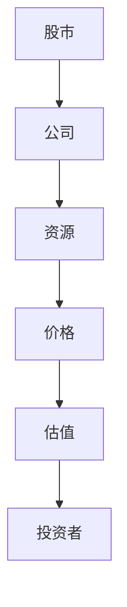
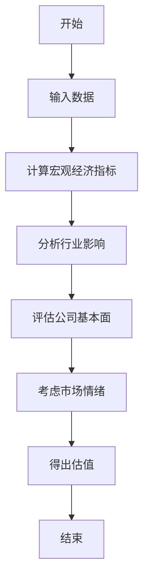

                 


# 澳大利亚股市估值:资源丰富国家的市场特点

## 关键词：澳大利亚股市，资源丰富，市场特点，估值方法，宏观经济，行业分析，风险管理

## 摘要：本文分析了澳大利亚股市的独特性，特别是作为资源丰富国家的市场特点。通过探讨宏观经济因素、行业分析和公司分析，本文揭示了影响股市估值的关键因素，并介绍了基本分析和相对估值法等方法。最后，总结了投资策略和风险管理的重要性。

---

# 第一部分: 澳大利亚股市估值概述

## 第1章: 澳大利亚股市与资源丰富国家的特点

### 1.1 澳大利亚经济与资源概况

#### 1.1.1 澳大利亚的经济结构

澳大利亚经济以多元化著称，但其资源行业（如矿业、农业）是其经济的核心驱动力。资源出口占其出口总额的绝大部分，特别是铁矿石、煤炭和黄金。

#### 1.1.2 澳大利亚的主要资源及其分布

澳大利亚是全球最大的矿石出口国之一，主要资源包括：
- 矿业：铁矿石、煤炭、铀、金矿。
- 农业：小麦、羊毛、牛肉。
- 能源：天然气。

资源主要分布在西澳大利亚、昆士兰和新南威尔士等地。

#### 1.1.3 资源对澳大利亚股市的影响

资源行业的繁荣直接推动了相关企业的盈利增长，进而影响股市估值。资源价格波动对股市具有显著影响，尤其是在全球经济波动时期。

### 1.2 澳大利亚股市的独特性

#### 1.2.1 澳大利亚股市的基本特点

- 以矿业和农业公司为主导。
- 市场波动性较大，受全球资源价格影响显著。
- 与国际市场的联动性较强，尤其是与亚洲市场。

#### 1.2.2 资源型国家股市的特殊性

资源型国家的股市通常表现出以下特点：
- 周期性较强，受资源价格波动影响。
- 企业盈利波动较大，影响股市估值。
- 政策和地缘政治风险对股市的影响显著。

#### 1.2.3 澳大利亚股市与国际市场的联系

澳大利亚股市与全球资本市场高度相关，尤其是与中国、日本和英国等主要资源进口国的市场联动性强。

### 1.3 本书的核心问题与目标

#### 1.3.1 股市估值的基本概念

股市估值是对公司股票的内在价值进行评估，通常基于财务数据、行业地位、市场前景等因素。

#### 1.3.2 资源丰富国家的市场特点

资源丰富国家的股市通常受资源价格波动影响较大，具有较高的波动性和周期性。

#### 1.3.3 本书的研究目标与方法

本书旨在分析澳大利亚股市的独特性，探讨其估值方法，并为投资者提供实用的策略建议。

---

## 第2章: 影响澳大利亚股市估值的主要因素

### 2.1 宏观经济因素

#### 2.1.1 国内生产总值（GDP）与股市的关系

GDP增长通常会带动企业盈利增长，从而推动股市上涨。然而，资源丰富国家的GDP波动较大，受资源价格影响显著。

#### 2.1.2 利率与股市估值

低利率环境通常会推高股市估值，因为资金成本降低，企业融资成本下降，投资意愿增强。

#### 2.1.3 汇率对股市的影响

汇率波动直接影响出口企业盈利，进而影响股市估值。澳元贬值通常会提升出口企业竞争力，利好股市。

### 2.2 行业分析与资源依赖

#### 2.2.1 资源行业的定义与分类

资源行业包括矿业、农业、能源等行业，这些行业对澳大利亚经济具有重要影响。

#### 2.2.2 资源价格波动对股市的影响

资源价格波动直接影响相关企业的盈利能力和股市估值。例如，铁矿石价格上涨会推高矿业公司的股价。

#### 2.2.3 其他行业的股市表现

虽然资源行业对澳大利亚股市影响最大，但其他行业（如金融、科技）也具有重要地位，尤其是科技行业近年来增长迅速。

### 2.3 公司基本面分析

#### 2.3.1 赢利能力分析

公司盈利能力是估值的重要指标，通常通过净利润率、ROE等指标衡量。

#### 2.3.2 偿债能力分析

公司债务水平和偿债能力直接影响其财务健康状况，进而影响股市估值。

#### 2.3.3 发展能力分析

公司未来增长潜力是估值的重要因素，通常通过市场份额、研发投入等指标衡量。

### 2.4 市场情绪与投资者行为

#### 2.4.1 市场情绪的定义与影响

市场情绪指投资者整体的心理状态，通常通过市场成交量、波动性等指标衡量。

#### 2.4.2 投资者行为对股市估值的影响

投资者行为受市场情绪影响，通常表现为追涨杀跌，加剧市场波动。

#### 2.4.3 市场情绪的量化分析

通过技术分析和情绪指标（如VIX指数）量化市场情绪，为估值提供参考。

---

## 第3章: 澳大利亚股市估值的核心概念与联系

### 3.1 核心概念原理

#### 3.1.1 股市估值的基本原理

股市估值基于对公司未来现金流的折现，通常使用DCF模型（ discounted cash flow model）进行评估。

#### 3.1.2 资源丰富国家的市场特点

资源丰富国家的股市通常具有较高的波动性和周期性，受资源价格影响显著。

#### 3.1.3 澳大利亚股市的独特性

澳大利亚股市受矿业和农业影响较大，且与亚洲市场联动性强。

### 3.2 概念属性特征对比表格

| 概念       | 定义                             | 特性                     |
|------------|----------------------------------|--------------------------|
| 股市估值   | 对公司股票价值的评估             | 客观性、动态性、复杂性    |
| 资源依赖   | 对资源行业的依赖程度             | 明显性、周期性、区域性    |
| 市场情绪   | 投资者心理对股市的影响             | 不稳定性、传染性、滞后性  |

### 3.3 ER实体关系图



---

## 第4章: 澳大利亚股市估值的算法原理

### 4.1 算法原理概述

#### 4.1.1 基本原理

股市估值通常基于对公司未来现金流的折现，考虑宏观经济、行业和公司基本面因素。

#### 4.1.2 算法流程

1. 收集宏观经济数据（GDP、利率、汇率）。
2. 行业分析，评估资源价格波动影响。
3. 公司基本面分析（赢利能力、偿债能力、发展能力）。
4. 结合市场情绪和技术分析，得出估值。

#### 4.1.3 算法优缺点

优点：全面考虑了宏观经济、行业和公司基本面因素。缺点：复杂性较高，需要大量数据和计算。

### 4.2 算法流程图



### 4.3 算法实现代码

```python
def calculate_stock_valuation():
    import pandas as pd
    import numpy as np
    
    # 宏观经济数据
    gdp = 1.5  # 假设GDP增长率为1.5%
    interest_rate = 0.03  # 假设利率为3%
    
    # 行业分析
    resource_price = 100  # 假设资源价格为100
    industry_impact = resource_price / 100  # 行业影响系数
    
    # 公司基本面分析
    net_profit = 100  # 净利润
    roe = net_profit / 500  # ROE为2%
    
    # 市场情绪分析
    market_sentiment = 0.7  # 市场情绪指数
    
    # 计算估值
    valuation = (gdp + interest_rate + industry_impact + roe + market_sentiment) / 5
    return valuation

calculate_stock_valuation()
```

---

## 第5章: 最佳实践与注意事项

### 5.1 最佳实践

#### 5.1.1 投资策略

- 长期投资：分散投资，降低风险。
- 价值投资：选择基本面良好的公司。
- 顺势而为：关注宏观经济和行业趋势。

#### 5.1.2 风险管理

- 设置止损点：控制风险。
- 分散投资：避免过度集中。
- 定期评估：及时调整投资组合。

### 5.2 小结

澳大利亚股市的独特性要求投资者关注资源行业、宏观经济和市场情绪。通过科学的估值方法和风险管理，投资者可以在资源丰富的市场中获得超额收益。

### 5.3 注意事项

- 资源价格波动较大，需谨慎操作。
- 宏观经济因素对股市影响显著，需密切关注。
- 市场情绪不可忽视，需结合技术分析。

---

# 作者：AI天才研究院 & 禅与计算机程序设计艺术

