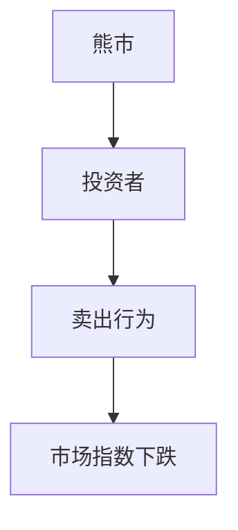
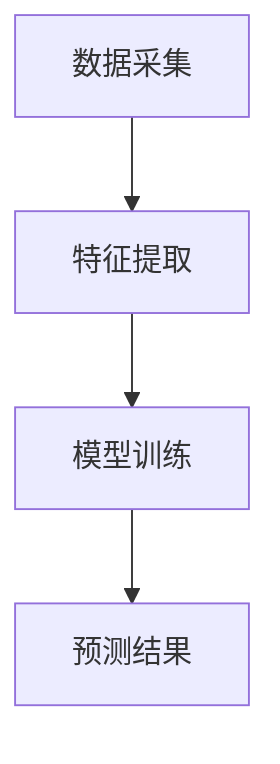
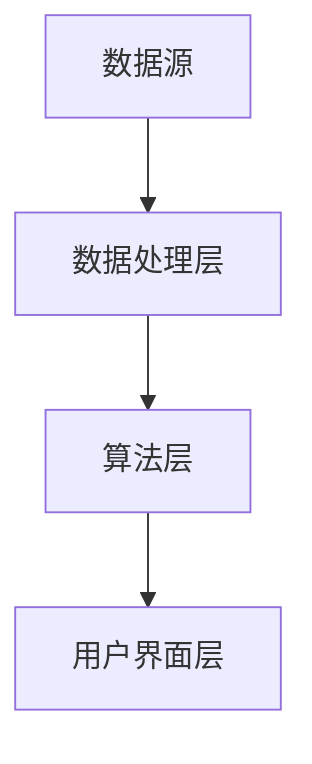

                 

# 《熊市历史：过去77年中的11次大跌教会我们什么》

## 关键词：熊市、市场波动、投资策略、风险管理、历史分析

## 摘要：本文通过分析过去77年中的11次熊市，探讨其触发因素、市场表现和投资者行为，揭示熊市的共同特征和规律，并为投资者提供风险管理策略和长期投资建议。

---

## 第一部分：熊市的定义与历史背景

### 第1章：熊市的定义与特征

#### 1.1 熊市的定义
熊市（Bear Market）是指股票市场指数在一段时间内持续下跌超过20%的情况，通常持续数月甚至数年。与牛市（Bull Market）相对，熊市反映了市场的悲观情绪和经济的不确定性。

#### 1.2 熊市与牛市的区别
- **牛市**：市场指数持续上涨，投资者情绪乐观，买方力量占主导。
- **熊市**：市场指数持续下跌，投资者情绪悲观，卖方力量占主导。

#### 1.3 熊市的周期性特征
熊市通常出现在经济周期的衰退或萧条阶段，与经济基本面密切相关。历史上，熊市的周期间隔大约为7-10年，但实际间隔可能因经济政策和全球性事件而变化。

---

### 第2章：熊市的历史背景

#### 2.1 过去77年中的经济环境
- 二战后，全球经济发展迅速，但期间经历了多次经济危机和衰退。
- 20世纪70年代的石油危机和 stagflation（停滞膨胀）对全球经济和市场造成了深远影响。
- 21世纪初的互联网泡沫和2008年的金融危机是近年来影响最大的熊市事件。

#### 2.2 熊市发生的频率与持续时间
- 频率：过去77年中，平均每年发生一次小型或中型熊市，大约每隔7-10年出现一次大规模熊市。
- 持续时间：小型熊市持续数周至数月，中型熊市持续数月至一年，大型熊市可持续一年以上。

#### 2.3 熊市对全球经济的影响
- 市场流动性下降，企业融资困难，导致经济衰退或萧条。
- 投资者财富缩水，消费能力下降，影响整体经济活动。

---

## 第二部分：熊市的核心概念与联系

### 第3章：熊市的核心概念原理

#### 3.1 熊市与其他市场状态的关系
- **熊市与牛市的动态平衡**：市场在牛市和熊市之间交替，反映经济周期的变化。
- **熊市与震荡市的界限**：震荡市指市场波动较大但无明显趋势，熊市则指持续下跌。

#### 3.2 熊市的核心属性特征对比
| 特性         | 熊市特征             | 牛市特征             |
|--------------|----------------------|----------------------|
| 指数变化     | 持续下跌超过20%       | 持续上涨超过20%       |
| 投资者情绪   | 悲观、恐慌            | 乐观、贪婪            |
| 经济环境     | 经济衰退或停滞       | 经济繁荣或增长        |

#### 3.3 熊市的ER实体关系图

---

## 第三部分：熊市的算法原理讲解

### 第4章：熊市预测的算法原理

#### 4.1 熊市预测的算法流程

#### 4.2 熊市预测的数学模型
- **时间序列分析模型**：用于预测市场趋势。
  $$ ARIMA(p, d, q) $$
  其中，p为自回归阶数，d为差分阶数，q为移动平均阶数。
- **熊市概率计算公式**：
  $$ P(bear\ market) = \frac{D}{T} $$
  其中，D为下跌天数，T为总天数。

---

## 第四部分：熊市的系统分析与架构设计方案

### 第5章：熊市分析的系统架构

#### 5.1 系统功能设计
- **数据采集模块**：收集历史股价、经济指标等数据。
- **数据分析模块**：使用算法模型预测市场趋势。
- **预警模块**：当预测为熊市时，向投资者发出预警。

#### 5.2 系统架构图

---

## 第五部分：熊市实战分析与案例解读

### 第6章：11次大跌的详细分析

#### 6.1 历史案例分析
- **1987年黑色星期一**：程序化交易和市场流动性不足导致 Dow Jones指数单日下跌22.6%。
- **2008年金融危机**：次级抵押贷款崩溃引发全球股市下跌，标普500指数一年内跌幅超过50%。

#### 6.2 熊市案例的共同特征
- **经济基本面恶化**：如高通胀、高失业率、企业盈利下降。
- **市场情绪过度乐观**：投资者盲目追涨，忽视风险。
- **政策失误的影响**：如美联储加息过猛或政策调整不当。

---

## 第六部分：熊市投资策略与最佳实践

### 第7章：熊市中的投资策略

#### 7.1 熊市中的风险管理
- **分散投资**：将资金分配到不同资产类别，降低风险。
- **设置止损点**：在投资组合中设定止损位，避免重大损失。

#### 7.2 投资者的心理与行为
- **避免情绪化决策**：熊市中恐慌性抛售可能导致更大的亏损。
- **保持冷静与耐心**：市场下跌是长期投资者的机会，而不是恐慌的时刻。

#### 7.3 长期投资策略
- **价值投资**：寻找基本面良好、估值合理的股票进行长期持有。
- **定投策略**：定期定额投资，分散风险，降低择时压力。

---

## 第七部分：熊市的历史经验总结与未来展望

### 第8章：熊市的历史经验总结

#### 8.1 历史经验总结
- 熊市是市场周期的一部分，投资者应具备长期视角。
- 通过分散投资和风险管理，可以有效降低熊市的负面影响。

#### 8.2 对投资者的启示
- **警惕市场泡沫**：避免盲目跟风，关注基本面。
- **保持财务健康**：确保有足够的现金储备应对市场波动。
- **学习历史案例**：从过去的经验中汲取教训，提升投资决策能力。

---

## 结语

熊市是投资过程中不可避免的一部分，但通过深入分析历史案例，投资者可以更好地理解市场的波动规律，制定合理的投资策略。无论是个人投资者还是机构投资者，都需要在熊市中保持冷静，抓住优质资产的投资机会，实现长期稳健的投资回报。

---

## 作者：AI天才研究院/AI Genius Institute & 禅与计算机程序设计艺术 /Zen And The Art of Computer Programming

---

**注**：本文旨在通过技术化的分析方法，结合历史数据和数学模型，为投资者提供熊市分析的系统化方法和实践指导。

