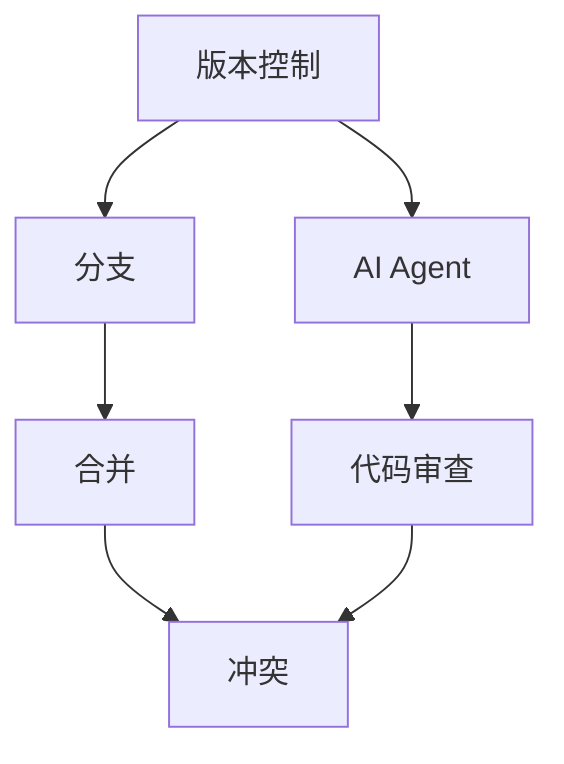
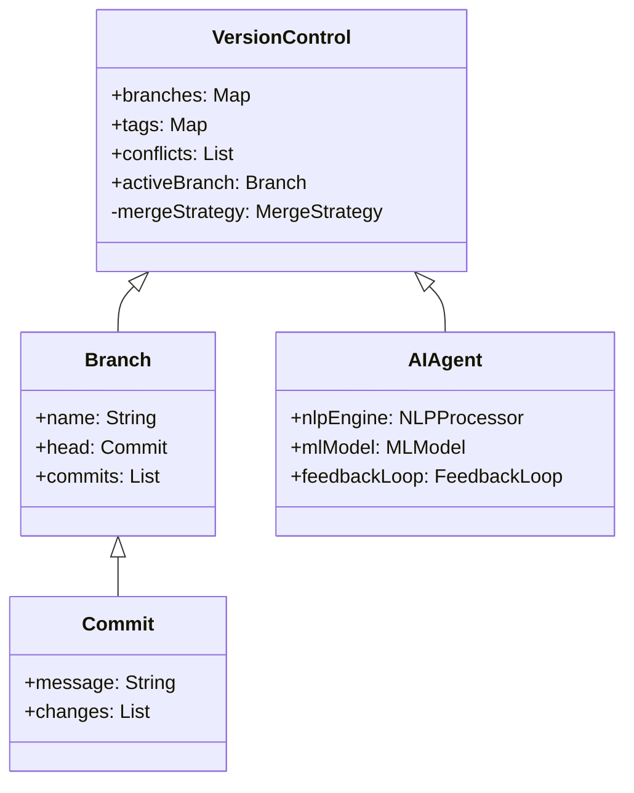
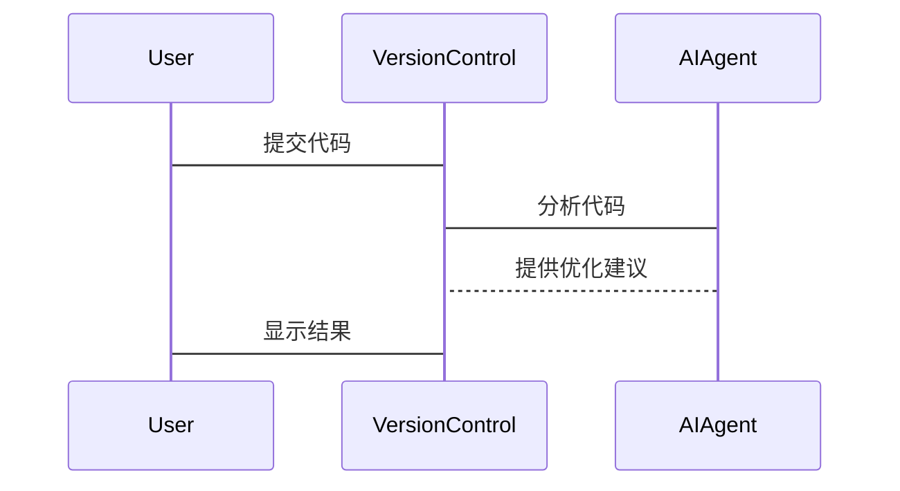

                 


# 版本控制：管理AI Agent的演进

---

## 关键词
版本控制, AI Agent, 算法原理, 系统架构, 项目实战

---

## 摘要
本文深入探讨了版本控制与AI Agent的结合，分析了版本控制的核心概念、AI Agent的能力，以及它们在代码管理和优化中的协同作用。通过对比分析、算法原理、系统架构设计和实际案例，本文揭示了AI Agent在版本控制中的潜在价值，并展望了未来的发展方向。

---

# 第一部分: 版本控制与AI Agent的背景介绍

## 第1章: 版本控制的核心概念

### 1.1 版本控制的基本概念
#### 1.1.1 什么是版本控制
版本控制是一种管理文件变化的技术，用于跟踪文件的修改历史，并在不同版本之间进行切换。它在软件开发中扮演着重要角色，帮助团队协作、恢复错误版本以及管理不同开发分支。

#### 1.1.2 版本控制的作用与意义
版本控制的主要作用包括：
1. **协作开发**：允许多人同时开发同一项目，避免文件冲突。
2. **历史记录**：记录代码的修改历史，便于回溯和恢复。
3. **分支管理**：支持不同的开发分支，隔离功能开发和修复工作。

#### 1.1.3 版本控制的分类与特点
版本控制工具分为两类：
1. **本地版本控制**：如CVS、SVN，只能管理本地文件。
2. **分布式版本控制**：如Git，支持多地仓库，具备更好的分叉和合并能力。

### 1.2 AI Agent的定义与特点
#### 1.2.1 什么是AI Agent
AI Agent（人工智能代理）是一种能够感知环境、执行任务并做出决策的智能实体。它通过自然语言处理、机器学习等技术，能够理解代码并提供优化建议。

#### 1.2.2 AI Agent的核心能力
1. **代码理解**：通过NLP技术，AI Agent能够理解代码的语义和结构。
2. **自动优化**：基于历史数据和上下文，AI Agent可以自动优化代码质量。
3. **自我学习**：通过反馈机制，AI Agent能够不断改进其决策能力。

#### 1.2.3 AI Agent与传统自动化工具的区别
| 特性         | 传统自动化工具       | AI Agent             |
|--------------|--------------------|----------------------|
| 决策能力     | 预定义规则           | 自适应学习与优化      |
| 代码理解     | 基于关键词匹配       | 深度语义理解           |
| 环境感知     | 无感知               | 高度感知环境变化       |

## 第2章: 版本控制与AI Agent的联系

### 2.1 版本控制中的问题背景
#### 2.1.1 开发过程中的版本冲突问题
在多人协作开发中，版本冲突是一个常见问题。传统版本控制工具依赖人工干预来解决冲突，效率较低。

#### 2.1.2 代码审查与优化的挑战
代码审查需要大量人工劳动，难以及时发现潜在问题。优化建议通常基于经验，缺乏数据支持。

#### 2.1.3 传统版本控制工具的局限性
传统工具依赖固定规则，难以应对复杂场景，且无法提供智能优化建议。

### 2.2 AI Agent在版本控制中的应用前景
#### 2.2.1 AI Agent如何解决版本冲突
AI Agent可以分析代码上下文，自动合并分支，减少人工干预。

#### 2.2.2 AI Agent在代码审查中的潜在价值
AI Agent可以实时分析代码质量，提供改进建议，提升代码可读性和安全性。

#### 2.2.3 未来版本控制工具的发展方向
未来的版本控制工具将更加智能化，AI Agent将成为核心组件，提供自动化决策和优化能力。

---

# 第二部分: 核心概念与联系

## 第3章: 核心概念的原理与对比

### 3.1 版本控制的核心原理
#### 3.1.1 分支与合并机制
版本控制通过分支和合并操作，管理代码的不同版本。例如，Git使用树状结构来表示分支关系。

#### 3.1.2 冲突检测与解决
当不同分支的代码发生冲突时，版本控制工具会提示用户手动解决冲突。AI Agent可以辅助分析冲突代码，提供建议。

#### 3.1.3 基于图的版本控制模型
版本控制可以表示为一个图结构，每个节点代表一个版本，边表示分支关系。

### 3.2 AI Agent的核心原理
#### 3.2.1 自然语言处理与代码理解
AI Agent通过NLP技术，理解代码的语义和结构，识别潜在问题。

#### 3.2.2 基于上下文的决策逻辑
AI Agent基于代码上下文，动态调整决策策略，提供个性化建议。

#### 3.2.3 自适应优化算法
AI Agent通过机器学习算法，不断优化其决策能力，提升版本控制效率。

## 第4章: 核心概念对比与实体关系图

### 4.1 版本控制与AI Agent的核心概念对比
| 特性         | 版本控制             | AI Agent             |
|--------------|--------------------|----------------------|
| 核心功能     | 管理代码版本         | 提供智能决策与优化     |
| 技术基础     | 分支与合并算法       | 机器学习与NLP         |
| 应用场景     | 代码管理             | 自动化开发与优化       |

### 4.2 实体关系图


---

# 第三部分: 算法原理与数学模型

## 第5章: 版本控制中的算法原理

### 5.1 分支与合并算法
#### 5.1.1 基于树的分支与合并流程
分支和合并是版本控制的核心操作，可以通过树状结构表示。

#### 5.1.2 冲突检测与解决算法
当两个分支修改同一文件时，版本控制工具会检测冲突并提示用户解决。

#### 5.1.3 基于图的版本控制

## 第6章: AI Agent的算法原理

### 6.1 基于上下文的决策逻辑
AI Agent通过分析代码上下文，生成优化建议。

### 6.2 基于NLP的代码理解
使用NLP技术，AI Agent可以理解代码语义，识别潜在问题。

### 6.3 自适应优化算法
通过机器学习算法，AI Agent不断优化其决策能力。

---

# 第四部分: 系统分析与架构设计

## 第7章: 系统分析与架构设计方案

### 7.1 项目介绍
本项目旨在开发一个AI Agent驱动的版本控制系统，结合版本控制与AI技术，提升代码管理效率。

### 7.2 系统功能设计
#### 7.2.1 领域模型


### 7.3 系统架构设计


### 7.4 系统接口设计
AI Agent与版本控制系统的交互接口需要支持代码提交、冲突检测、优化建议等功能。

### 7.5 系统交互设计


---

# 第五部分: 项目实战

## 第8章: 项目实战

### 8.1 环境配置
安装Git和AI Agent驱动的版本控制系统。

### 8.2 核心代码实现
```python
class VersionControl:
    def __init__(self):
        self.branches = {}
        self.active_branch = "main"
        self.aiagent = AIAgent()

    def create_branch(self, name):
        # 实现创建分支逻辑
        pass

    def merge_branch(self, source, target):
        # 实现合并逻辑
        pass

    def handle_conflict(self, conflict):
        # 使用AI Agent解决冲突
        self.aiaagent.resolve_conflict(conflict)

class AIAgent:
    def __init__(self):
        self.nlp_engine = NLPProcessor()
        self.ml_model = MLModel()

    def resolve_conflict(self, conflict):
        # 分析冲突并提供建议
        pass
```

### 8.3 代码解读与分析
AI Agent通过NLP和ML模型分析冲突代码，生成解决建议。

### 8.4 实际案例分析
通过一个实际案例，展示AI Agent如何优化版本控制流程。

---

# 第六部分: 最佳实践

## 第9章: 最佳实践

### 9.1 小结
本文详细探讨了版本控制与AI Agent的结合，展示了它们在代码管理中的协同作用。

### 9.2 注意事项
在实际应用中，需注意数据隐私和模型泛化能力。

### 9.3 拓展阅读
建议进一步研究AI在其他软件工程领域的应用。

---

# 作者：AI天才研究院 & 禅与计算机程序设计艺术

---

