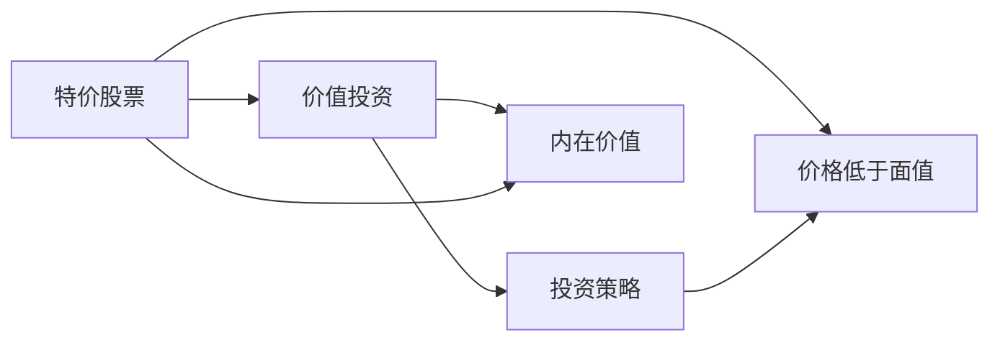

                 


# 特价股票与价值投资的关系探讨

> **关键词**：特价股票、价值投资、投资策略、股票分析、投资风险管理

> **摘要**：  
本文探讨了特价股票与价值投资之间的关系，分析了特价股票的定义、特点及价值投资的核心理念，详细阐述了如何通过价值投资策略识别和利用特价股票。文章从背景介绍、核心概念、算法原理、系统架构、项目实战到最佳实践，全面解析了两者的联系与应用。通过实例分析和数学模型，本文为投资者提供了科学的决策依据和实战指导。

---

## 第一部分：特价股票与价值投资的背景与基础

### 第1章：特价股票与价值投资的概述

#### 1.1 特价股票的定义与特点

**1.1.1 特价股票的定义**  
特价股票是指市价低于面值的股票，通常由于公司财务状况不佳、市场波动或其他特殊原因导致。这类股票往往被市场低估，具有较大的增值潜力。

**1.1.2 特价股票的特点**  
- **低估值**：市场价格远低于面值，通常被视为被市场低估的机会。  
- **高风险**：由于公司基本面较差，投资风险较高。  
- **潜在收益**：若公司基本面改善，股价可能回升，带来超额收益。

**1.1.3 特价股票的分类**  
- **普通特价股票**：因市场波动导致的短期低估。  
- **资产重组特价股票**：因公司资产重组或转型而被市场低估。  
- **破产重组特价股票**：公司濒临破产，通过重组恢复价值。

#### 1.2 价值投资的基本原理

**1.2.1 价值投资的定义**  
价值投资是一种长期投资策略，强调以低于内在价值的价格买入优质资产，通过长期持有实现收益。

**1.2.2 价值投资的核心理念**  
- **安全边际**：买入价格低于内在价值，确保投资的安全性。  
- **长期视角**：关注企业的长期盈利能力，而非短期市场波动。  
- **优质资产**：选择具有强大竞争优势和良好管理的公司。

**1.2.3 价值投资的适用场景**  
- **市场低迷**：市场恐慌导致资产价格被低估。  
- **优质企业困境**：企业因短期问题被市场抛弃，但具有长期价值。  
- **结构性低估**：某些行业或板块因市场忽视而被低估。

#### 1.3 特价股票与价值投资的关系

**1.3.1 特价股票与价值投资的联系**  
- 特价股票是价值投资的重要标的，因为其低估值特性与价值投资的安全边际理念高度契合。  
- 价值投资通过分析企业的内在价值，帮助投资者识别被低估的特价股票。

**1.3.2 特价股票与价值投资的区别**  
- 特价股票关注价格与面值的偏离，而价值投资关注价格与内在价值的偏离。  
- 特价股票更多是价格层面的低估，而价值投资涉及更全面的公司分析。

**1.3.3 特价股票在价值投资中的地位**  
特价股票是价值投资的潜在机会，但并非所有特价股票都适合价值投资。投资者需要结合公司基本面和市场环境进行综合判断。

---

## 第二部分：特价股票与价值投资的核心概念与联系

### 第2章：特价股票与价值投资的核心概念

#### 2.1 特价股票的核心概念

**2.1.1 特价股票的形成原因**  
- **市场波动**：短期市场波动导致股票价格低于面值。  
- **公司困境**：公司财务状况不佳或管理问题导致股价下跌。  
- **行业周期**：行业低迷期导致部分公司股票价格被低估。

**2.1.2 特价股票的市场表现**  
- 特价股票通常具有较高的波动性，短期内可能大幅波动。  
- 在市场回暖或公司基本面改善时，股价可能迅速回升。

**2.1.3 特价股票的风险与机会**  
- **风险**：公司基本面未改善可能导致股价继续下跌。  
- **机会**：市场反转或公司转型可能带来超额收益。

#### 2.2 价值投资的核心概念

**2.2.1 价值投资的选股标准**  
- **内在价值**：通过基本面分析估算公司的内在价值。  
- **安全边际**：买入价格低于内在价值。  
- **竞争优势**：选择具有强大竞争优势的公司。

**2.2.2 价值投资的长期视角**  
- 价值投资强调长期持有，关注企业的长期盈利能力。  
- 短期市场波动不影响企业的长期价值。

**2.2.3 价值投资的收益来源**  
- **价值回归**：当市场价格回归内在价值时，投资者获得收益。  
- **股息收益**：长期持有优质股票，获得稳定的股息收入。

#### 2.3 特价股票与价值投资的核心联系

**2.3.1 特价股票与价值投资的共同点**  
- 都关注价格与价值的偏离。  
- 都强调低估值带来的投资机会。

**2.3.2 特价股票与价值投资的差异点**  
- 特价股票关注价格低于面值，而价值投资关注价格低于内在价值。  
- 特价股票更关注价格层面，而价值投资更关注公司基本面。

**2.3.3 特价股票在价值投资中的应用**  
- 通过价值投资的方法识别被低估的特价股票。  
- 结合公司基本面分析，选择具有长期竞争优势的特价股票。

---

### 第3章：特价股票与价值投资的核心联系分析

#### 3.1 特价股票与价值投资的属性对比

| 属性                | 特价股票                          | 价值投资                          |
|---------------------|-----------------------------------|------------------------------------|
| 定义                | 市价低于面值的股票                | 以低于内在价值的价格买入优质资产 |
| 核心关注点          | 价格与面值的偏离                | 价格与内在价值的偏离              |
| 投资策略            | 寻找价格被低估的股票              | 寻找价格被低估且具有竞争优势的公司 |
| 风险与收益          | 高风险，潜在高收益              | 风险较低，收益稳定                |

#### 3.2 特价股票与价值投资的实体关系图



---

## 第三部分：特价股票与价值投资的算法原理

### 第4章：特价股票识别算法

#### 4.1 算法概述

识别特价股票的算法通常基于以下步骤：

1. **筛选低价股票**：筛选市价低于面值的股票。  
2. **基本面分析**：分析公司的财务状况、盈利能力、竞争优势等。  
3. **价值评估**：估算公司的内在价值，判断是否具备投资价值。  
4. **风险评估**：评估投资风险，结合市场环境制定投资策略。

#### 4.2 算法流程图


#### 4.3 算法实现

以下是一个简单的Python代码示例，用于筛选低价股票：

```python
import pandas as pd

# 假设df为包含股票数据的DataFrame，包含'price'和'face_value'两列
df['is_special_stock'] = df['price'] < df['face_value']

# 筛选特价股票
special_stocks = df[df['is_special_stock']]
```

---

### 第5章：价值投资策略的数学模型

#### 5.1 内在价值计算公式

$$ \text{内在价值} = \frac{\text{未来现金流}}{\text{折现率}} $$

#### 5.2 市盈率（P/E）公式

$$ \text{市盈率} = \frac{\text{股价}}{\text{每股净利润}} $$

#### 5.3 市净率（P/B）公式

$$ \text{市净率} = \frac{\text{股价}}{\text{每股净资产}} $$

---

## 第四部分：系统分析与架构设计

### 第6章：系统功能设计

#### 6.1 系统功能模块

- **数据采集模块**：采集股票数据，包括价格、面值、财务数据等。  
- **数据分析模块**：对数据进行清洗、计算和分析，筛选特价股票。  
- **价值评估模块**：基于基本面分析和数学模型计算内在价值。  
- **投资决策模块**：根据分析结果制定投资策略。

#### 6.2 系统架构图


---

## 第五部分：项目实战

### 第7章：价值投资策略在特价股票中的应用

#### 7.1 环境安装

安装必要的Python库：

```bash
pip install pandas numpy matplotlib
```

#### 7.2 核心代码实现

```python
import pandas as pd
import numpy as np

# 假设df为包含股票数据的DataFrame
def calculate_intrinsic_value(df):
    df['intrinsic_value'] = df['future_cash_flow'] / df['discount_rate']
    return df

# 筛选特价股票并计算内在价值
special_stocks = df[df['price'] < df['face_value']]
special_stocks = calculate_intrinsic_value(special_stocks)
```

#### 7.3 案例分析

以某公司为例，分析其特价股票的投资价值：

1. **数据采集**：获取该公司的股价、面值、财务数据等。  
2. **基本面分析**：分析公司的盈利能力、竞争优势、财务状况。  
3. **价值评估**：计算内在价值，判断是否具备投资价值。  
4. **投资决策**：根据分析结果制定投资策略。

---

## 第六部分：最佳实践与注意事项

### 第8章：价值投资策略的注意事项

#### 8.1 投资策略小结

- 特价股票是价值投资的重要标的，但并非所有特价股票都适合投资。  
- 投资者需要结合公司基本面和市场环境进行综合判断。

#### 8.2 投资风险管理

- **分散投资**：避免将所有资金投入到单一股票。  
- **长期持有**：价值投资需要耐心，避免短期波动干扰。  
- **持续学习**：关注市场动态和公司变化，及时调整投资策略。

#### 8.3 拓展阅读

- 建议阅读《价值投资实战》、《股票投资的真相》等书籍，深入理解价值投资的核心理念。

---

**作者：AI天才研究院/AI Genius Institute & 禅与计算机程序设计艺术 /Zen And The Art of Computer Programming**

