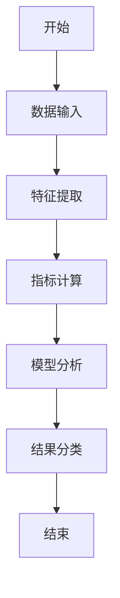
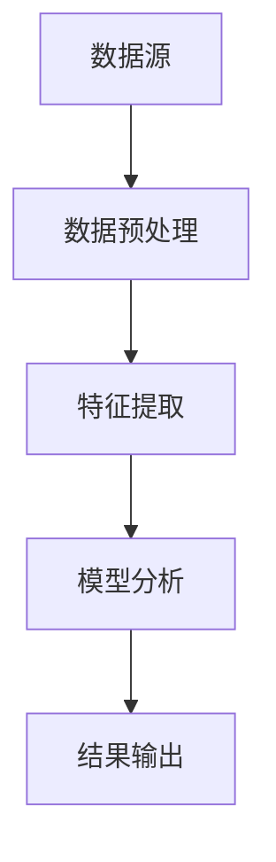

                 


# 特价股票与价值陷阱的区分方法

> 关键词：特价股票、价值陷阱、基本面分析、技术分析、投资策略

> 摘要：本文将详细探讨如何区分特价股票和价值陷阱，通过基本面分析和价值评估模型，结合算法和系统设计，帮助投资者做出明智决策。

---

# 第一部分：特价股票与价值陷阱的区分方法

## 第1章：引言

### 1.1 特价股票与价值陷阱的基本概念
- **特价股票**：指市场估值低于其真实价值的股票，通常是暂时被市场低估的机会。
- **价值陷阱**：指看似便宜但实际存在问题的股票，可能隐藏着重大风险。

### 1.2 区分的重要性
- 避免投资价值陷阱，抓住真正低估的特价股票，提升投资收益。

## 第2章：核心概念与对比分析

### 2.1 特价股票的核心要素
- **市场低估**：市盈率、市净率等指标低于行业平均水平。
- **基本面良好**：公司盈利稳定，财务状况健康。

### 2.2 价值陷阱的核心要素
- **公司基本面恶化**：收入下降、利润亏损。
- **行业风险**：行业衰退或政策变化带来的风险。

### 2.3 对比分析
- **表格对比**：列出特价股票和价值陷阱在市盈率、收入增长率等指标上的差异。
- **Mermaid流程图**：展示两者的区别和联系。

## 第3章：区分算法的数学模型

### 3.1 基本面分析法
- **市盈率公式**：
  $$市盈率 = \frac{股价}{每股收益}$$
- **市净率公式**：
  $$市净率 = \frac{股价}{每股净资产}$$

### 3.2 算法流程


## 第4章：系统分析与架构设计

### 4.1 问题场景
- 投资者需要准确判断股票类型，避免重大损失。

### 4.2 系统架构


## 第5章：项目实战

### 5.1 实战案例
- **数据选择**：选取某行业的股票数据集。
- **工具安装**：安装数据处理和分析工具。
- **代码实现**：
  ```python
  import pandas as pd
  data = pd.read_csv('stock.csv')
  # 特征提取
  data['市盈率'] = data['股价'] / data['每股收益']
  # 模型分析
  def is_special_stock(data):
      return data['市盈率'] < 15
  ```

### 5.2 结果解读
- 对比分析结果，识别出真正的特价股票。

## 第6章：总结与建议

### 6.1 最佳实践
- 定期更新数据，持续优化模型。

### 6.2 注意事项
- 谨防数据偏差，多维度分析。

### 6.3 拓展阅读
- 建议阅读相关书籍，深入学习投资策略。

---

作者：AI天才研究院/AI Genius Institute & 禅与计算机程序设计艺术 /Zen And The Art of Computer Programming

