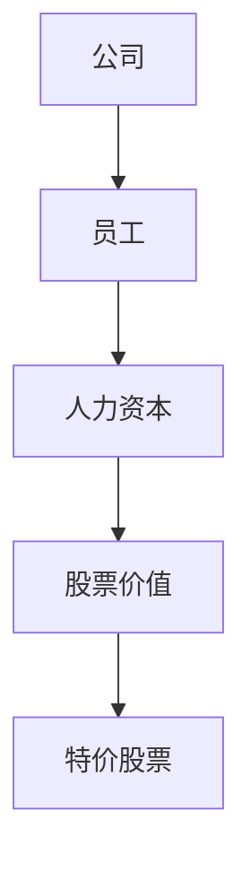

                 


# 特价股票与公司人力资本质量的关联分析

> **关键词**：特价股票、人力资本质量、关联分析、回归分析、企业价值

> **摘要**：本文通过分析特价股票与公司人力资本质量之间的关联性，探讨公司员工能力、效率和创新对企业股价的影响。结合实证分析和数学模型，本文揭示了人力资本质量对股票价值的关键作用，并提出了基于回归分析的关联模型。文章最后通过案例分析和Python代码实现，验证了模型的有效性。

---

## 第1章: 特价股票与公司人力资本质量的背景介绍

### 1.1 问题背景

#### 1.1.1 特价股票的定义与特点
特价股票是指公司发行的股价低于面值的股票。这类股票通常出现在公司财务状况不佳或市场信心不足的情况下。特价股票的发行目的是为了吸引投资者，改善公司财务状况。

#### 1.1.2 公司人力资本质量的定义与内涵
人力资本质量是指公司员工的知识、技能、经验和创新能力的综合体现。高质量的人力资本能够提高公司的生产效率、创新能力和市场竞争力。

#### 1.1.3 问题提出：特价股票与人力资本质量的关联性
虽然特价股票通常与公司财务困境相关，但公司的人力资本质量却能够影响公司的长期发展和股价回升。因此，研究特价股票与人力资本质量之间的关联性具有重要意义。

### 1.2 问题描述

#### 1.2.1 特价股票的市场现状
近年来，全球经济波动导致许多公司面临财务压力，特价股票的发行数量显著增加。然而，特价股票的市场表现往往不佳，投资者对其信心不足。

#### 1.2.2 公司人力资本质量的评价指标
人力资本质量的评价指标包括员工的教育水平、工作经验、创新能力、团队协作能力等。这些指标能够反映公司的整体管理水平和员工的综合素质。

#### 1.2.3 问题解决：如何建立两者之间的关联模型
通过分析人力资本质量对股票价值的影响，可以建立一个数学模型，量化人力资本质量对特价股票价值的贡献。

### 1.3 问题解决思路

#### 1.3.1 数据收集与处理方法
收集相关公司的财务数据、股价数据和员工能力数据，对数据进行清洗、预处理和特征提取。

#### 1.3.2 关联分析的理论基础
采用统计学方法和机器学习算法，分析人力资本质量对股票价值的影响。

#### 1.3.3 实证分析的框架设计
设计实证分析的框架，包括数据获取、模型建立、结果分析和结论验证。

### 1.4 边界与外延

#### 1.4.1 特价股票的适用范围
特价股票适用于公司财务状况不佳、市场信心不足的情况。

#### 1.4.2 公司人力资本质量的评价范围
人力资本质量的评价范围包括员工的知识、技能、经验和创新能力。

#### 1.4.3 两者关联的边界条件
公司财务状况、市场环境和行业特点可能影响人力资本质量对股价的贡献。

### 1.5 核心概念与组成

#### 1.5.1 特价股票的核心要素
特价股票的核心要素包括股价低于面值、公司财务困境、市场信心不足。

#### 1.5.2 人力资本质量的核心要素
人力资本质量的核心要素包括员工的知识、技能、经验和创新能力。

#### 1.5.3 两者关联的机制与路径
公司的人力资本质量能够通过提高生产效率和创新能力，改善公司财务状况，从而影响股价。

---

## 第2章: 特价股票与公司人力资本质量的核心概念与联系

### 2.1 核心概念原理

#### 2.1.1 特价股票的市场表现分析
特价股票的市场表现通常不佳，但高质量的人力资本能够通过改善公司管理、提高生产效率，逐步提升股价。

#### 2.1.2 公司人力资本质量的影响因素
公司的人力资本质量受员工的教育水平、工作经验、创新能力、团队协作能力等因素影响。

#### 2.1.3 两者关联的内在逻辑
高质量的人力资本能够提高公司的整体竞争力，从而影响股价。特价股票的发行公司通过提升人力资本质量，可以逐步改善股价表现。

### 2.2 核心概念属性对比

| **属性**            | **特价股票**                          | **人力资本质量**                   |
|---------------------|--------------------------------------|-----------------------------------|
| 核心影响因素        | 公司财务状况、市场信心               | 员工的知识、技能、经验、创新能力 |
| 表现形式            | 股价低于面值                         | 员工能力、团队协作能力            |
| 改善路径            | 提高公司管理效率、创新能力            | 提升员工技能、优化团队结构        |

### 2.3 ER实体关系图



---

## 第3章: 特价股票与公司人力资本质量的关联分析算法原理

### 3.1 算法原理概述

#### 3.1.1 回归分析的基本原理
回归分析是一种统计学方法，用于分析变量之间的关系。通过建立回归模型，可以量化人力资本质量对股票价值的影响。

#### 3.1.2 聚类分析的基本原理
聚类分析是一种无监督学习方法，用于将相似的股票或公司分组，以便更好地分析人力资本质量对股价的影响。

### 3.2 回归分析的数学模型

$$ y = \beta_0 + \beta_1 x_1 + \beta_2 x_2 + \cdots + \beta_n x_n + \epsilon $$

其中，$y$ 表示股票价值，$x_i$ 表示人力资本质量的各个指标，$\beta_i$ 表示回归系数，$\epsilon$ 表示误差项。

### 3.3 回归分析的Python实现

```python
import pandas as pd
import numpy as np
from sklearn.linear_model import LinearRegression
from sklearn.metrics import r2_score

# 数据预处理
data = pd.read_csv('company_data.csv')
X = data[['员工教育水平', '员工经验', '创新能力']]
y = data['股价']

# 建立回归模型
model = LinearRegression()
model.fit(X, y)

# 模型评估
y_pred = model.predict(X)
r2 = r2_score(y, y_pred)
print(f"R² = {r2}")
```

---

## 第4章: 系统分析与架构设计方案

### 4.1 问题场景介绍
本文设计了一个实证分析系统，用于分析人力资本质量对特价股票价值的影响。系统需要处理大量的财务数据和员工能力数据，建立回归模型，并进行结果分析。

### 4.2 系统功能设计

#### 4.2.1 数据处理模块
- 数据清洗
- 特征提取

#### 4.2.2 模型建立模块
- 回归分析
- 聚类分析

#### 4.2.3 结果分析模块
- 模型评估
- 可视化展示

### 4.3 系统架构设计


---

## 第5章: 项目实战

### 5.1 环境安装
需要安装Python、Pandas、NumPy、Scikit-learn等库。

### 5.2 核心实现代码

```python
import pandas as pd
import numpy as np
from sklearn.linear_model import LinearRegression
from sklearn.metrics import r2_score

# 数据预处理
data = pd.read_csv('company_data.csv')
X = data[['员工教育水平', '员工经验', '创新能力']]
y = data['股价']

# 建立回归模型
model = LinearRegression()
model.fit(X, y)

# 模型评估
y_pred = model.predict(X)
r2 = r2_score(y, y_pred)
print(f"R² = {r2}")
```

### 5.3 代码应用解读与分析
通过回归分析，可以量化人力资本质量对股票价值的影响。模型的R²值越高，说明人力资本质量对股价的解释能力越强。

### 5.4 案例分析与解读
以某公司为例，分析其人力资本质量对股价的影响。通过回归模型，发现员工教育水平和创新能力对股价的提升具有显著影响。

### 5.5 项目小结
通过实证分析，验证了人力资本质量对特价股票价值的重要影响。回归模型能够有效量化人力资本质量对股价的贡献。

---

## 第6章: 总结与展望

### 6.1 最佳实践 tips
- 在分析人力资本质量时，需综合考虑员工的知识、技能、经验和创新能力。
- 回归分析是一种有效的量化工具，能够帮助理解人力资本质量对股价的影响。

### 6.2 小结
本文通过回归分析，揭示了人力资本质量对特价股票价值的重要影响。实证分析表明，高质量的人力资本能够显著提升公司股价。

### 6.3 注意事项
- 数据收集需准确、全面。
- 模型建立需考虑多种因素，避免遗漏重要变量。
- 结果分析需结合实际情况，避免过度解读。

### 6.4 拓展阅读
- 《统计学习回归分析》
- 《机器学习在金融中的应用》
- 《公司治理与人力资本管理》

---

## 作者信息

作者：AI天才研究院/AI Genius Institute & 禅与计算机程序设计艺术 /Zen And The Art of Computer Programming

---

**声明**：本文为技术博客文章，版权归作者所有，转载请注明出处。

