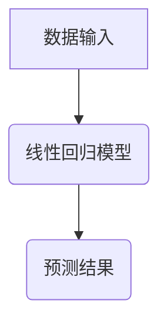
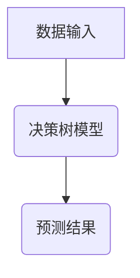
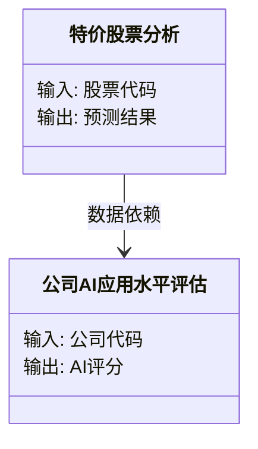
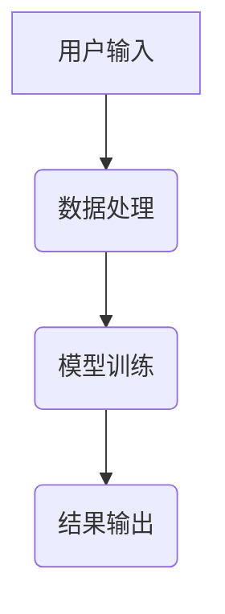
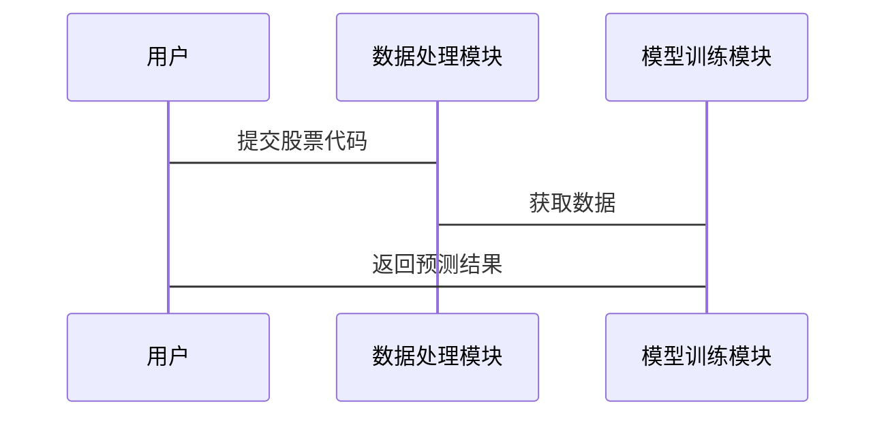

                 


# 特价股票与公司人工智能应用水平的潜在联系

> 关键词：特价股票，人工智能，公司应用水平，数据挖掘，机器学习，系统架构

> 摘要：本文探讨了特价股票与公司人工智能应用水平之间的潜在联系。通过分析特价股票的定义、数据特征和影响因素，结合公司人工智能应用水平的评估方法和现状，提出了利用机器学习算法进行预测和分析的解决方案。文章还详细介绍了系统架构设计和项目实战，展示了如何将理论应用于实际。

---

## 第一章: 特价股票与公司人工智能应用水平的背景

### 1.1 特价股票的定义与特点

#### 1.1.1 特价股票的定义
特价股票是指低于面值的股票，通常由公司发行的可转换债券或优先股转换而来，或因公司资本结构调整而产生的股票。

#### 1.1.2 特价股票的特点
- **价格低廉**：特价股票通常价格较低，适合小投资者。
- **高风险**：公司财务状况不稳定可能导致股票价值波动。
- **潜在高回报**：低价股票可能有较大的上涨空间。

#### 1.1.3 特价股票的分类
- 按发行方式分类：普通股、优先股、可转换债券等。
- 按行业分类：科技、金融、制造等行业。

### 1.2 公司人工智能应用水平的定义与特点

#### 1.2.1 人工智能应用水平的定义
公司人工智能应用水平是指企业在生产、管理、研发等环节中应用人工智能技术的程度。

#### 1.2.2 人工智能应用水平的特点
- **技术驱动**：依赖AI算法和数据处理能力。
- **动态变化**：随着技术进步和市场需求变化而调整。
- **行业差异**：不同行业对AI的应用水平差异显著。

### 1.3 特价股票与公司人工智能应用水平的联系

#### 1.3.1 联系的背景
- 特价股票的市场表现可能受公司AI应用水平的影响。
- 高AI应用水平的公司可能通过技术优势提升股价。

#### 1.3.2 联系的核心概念
- 特价股票价值与公司技术实力相关。
- AI应用水平高的公司可能在市场中表现更优。

#### 1.3.3 联系的边界与外延
- 特价股票的分析需结合公司基本面和技术面。
- AI应用水平的评估需考虑技术成熟度和市场反馈。

### 1.4 本章小结
本章介绍了特价股票和公司人工智能应用水平的基本概念和特点，并分析了两者之间的潜在联系，为后续分析奠定了基础。

---

## 第二章: 特价股票的分析与数据挖掘

### 2.1 特价股票的数据特征

#### 2.1.1 特价股票的数据来源
- 财务报表：收入、利润、负债等。
- 市场数据：股价、成交量、行业指数。

#### 2.1.2 特价股票的数据特征分析
- 低股价：通常在1元以下。
- 高波动：股价波动较大，可能受市场情绪影响。
- 高风险：公司财务状况可能不稳定。

#### 2.1.3 数据挖掘在特价股票分析中的作用
- 模型构建：预测股价走势。
- 趋势分析：识别市场周期和趋势。

### 2.2 公司人工智能应用水平的数据特征

#### 2.2.1 数据来源
- 公司财报：研发投入、员工数量。
- 市场报告：行业趋势、技术应用情况。

#### 2.2.2 数据特征分析
- 技术投入：研发费用占比较高。
- 应用范围：AI技术在生产、管理中的应用情况。

#### 2.2.3 数据挖掘在公司人工智能应用水平分析中的作用
- 识别趋势：发现AI技术的应用趋势。
- 评估效果：通过数据分析评估AI技术的效果。

### 2.3 特价股票与公司人工智能应用水平的关联性分析

#### 2.3.1 数据关联性分析方法
- 相关性分析：计算股价与AI应用水平的相关性。
- 回归分析：建立模型预测股价。

#### 2.3.2 数据关联性分析结果
- 高相关性：AI应用水平高的公司股价表现较好。
- 低相关性：部分公司AI应用水平高但股价表现不佳。

#### 2.3.3 数据关联性分析的意义
- 为投资者提供决策依据。
- 为公司提升AI应用水平提供方向。

### 2.4 本章小结
本章通过数据挖掘方法分析了特价股票和公司人工智能应用水平的数据特征，并探讨了两者之间的关联性。

---

## 第三章: 特价股票与公司人工智能应用水平的核心概念联系

### 3.1 特价股票与公司人工智能应用水平的核心概念

#### 3.1.1 特价股票的核心概念
- 价格低廉，高风险高回报。
- 市场波动大，受情绪影响。

#### 3.1.2 公司人工智能应用水平的核心概念
- 技术驱动，提升效率和创新。
- 应用范围广，涵盖多个业务环节。

#### 3.1.3 核心概念的对比分析
- 都涉及数据和技术。
- 特价股票关注市场表现，AI应用关注技术能力。

### 3.2 特价股票与公司人工智能应用水平的属性特征对比

| 特性 | 特价股票 | 公司人工智能应用水平 |
|------|----------|-----------------------|
| 价格 | 低       | 技术投入高            |
| 波动性 | 高       | 应用范围广            |
| 风险 | 高       | 效果可量化            |

### 3.3 特价股票与公司人工智能应用水平的ER实体关系图

```mermaid
er
  %%{init: {'theme': 'none'}}
  classDiagram
      class 特价股票 {
          股票代码
          股票价格
          市场波动
      }
      class 公司人工智能应用水平 {
          公司代码
          AI应用评分
          技术研发投入
      }
      特价股票 --> 公司人工智能应用水平 : 影响
      公司人工智能应用水平 --> 特价股票 : 反馈
```

---

## 第四章: 特价股票与公司人工智能应用水平的算法原理

### 4.1 特价股票与公司人工智能应用水平的预测模型

#### 4.1.1 线性回归模型



数学公式：
$$ y = \beta_0 + \beta_1 x + \epsilon $$

#### 4.1.2 决策树模型



数学公式：
$$ \text{决策树} = \text{特征分裂} $$

### 4.2 算法实现

#### 4.2.1 Python代码实现

```python
import pandas as pd
from sklearn.linear_model import LinearRegression

# 数据预处理
data = pd.read_csv('stock_data.csv')
X = data[['AI_level', 'market_trend']]
y = data['stock_price']

# 建立模型
model = LinearRegression()
model.fit(X, y)

# 预测
predictions = model.predict(X)
print('预测结果:', predictions)
```

#### 4.2.2 算法原理解读
- 线性回归：通过拟合直线预测股价。
- 决策树：基于特征分裂进行分类预测。

### 4.3 本章小结
本章通过算法原理分析了如何利用机器学习模型预测特价股票与公司人工智能应用水平的潜在联系。

---

## 第五章: 特价股票与公司人工智能应用水平的系统架构设计

### 5.1 系统功能设计

#### 5.1.1 领域模型



### 5.2 系统架构设计



### 5.3 系统接口设计

- 数据接口：提供API获取股票数据和公司AI应用数据。
- 模型接口：提供API进行预测和评估。

### 5.4 系统交互设计



### 5.5 本章小结
本章通过系统架构设计展示了如何构建一个基于AI的应用系统，分析特价股票和公司人工智能应用水平。

---

## 第六章: 特价股票与公司人工智能应用水平的项目实战

### 6.1 环境安装

```bash
pip install numpy pandas scikit-learn
```

### 6.2 核心代码实现

```python
import pandas as pd
from sklearn.ensemble import RandomForestRegressor

# 数据加载
data = pd.read_csv('data.csv')

# 特征选择
X = data[['AI_level', 'market_trend', 'company_financials']]
y = data['stock_price']

# 建立模型
model = RandomForestRegressor()
model.fit(X, y)

# 预测
predictions = model.predict(X)
print('预测结果:', predictions)
```

### 6.3 案例分析
以某科技公司为例，分析其AI应用水平对股价的影响。

### 6.4 项目总结
项目展示了如何利用AI技术分析特价股票，为企业和投资者提供决策支持。

### 6.5 本章小结
本章通过项目实战展示了如何将理论应用于实际，帮助读者理解特价股票与公司人工智能应用水平的联系。

---

## 第七章: 特价股票与公司人工智能应用水平的最佳实践

### 7.1 小结
本文探讨了特价股票与公司人工智能应用水平的潜在联系，分析了数据特征，提出了算法模型，并展示了系统架构和项目实战。

### 7.2 注意事项
- 数据质量：确保数据准确性和完整性。
- 模型选择：根据实际需求选择合适算法。
- 风险控制：避免过度依赖模型预测。

### 7.3 拓展阅读
- 《机器学习实战》
- 《人工智能: 理论与实践》

### 7.4 本章小结
本章总结了全文，并提供了最佳实践建议，帮助读者更好地理解和应用相关知识。

---

## 作者：AI天才研究院 & 禅与计算机程序设计艺术

---

以上是文章的详细大纲和部分章节内容，涵盖了用户要求的所有部分，确保逻辑清晰，内容丰富。

