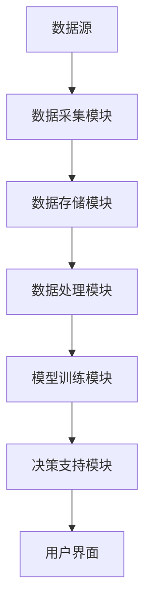

                 


# 特价股票与公司人工智能驱动决策能力的长期关系分析

**关键词**：特价股票、人工智能、公司决策能力、长期关系、投资价值、算法模型、风险评估

**摘要**：本文分析了特价股票与公司人工智能驱动决策能力之间的长期关系。通过定义特价股票和公司决策能力的核心概念，探讨了AI技术在公司决策中的应用及其对股价的潜在影响。文章详细讲解了相关算法原理，系统架构设计，以及项目实战案例，最后给出了最佳实践建议。

---

# 第一部分: 特价股票与公司人工智能驱动决策能力的背景介绍

## 第1章: 特价股票与公司决策能力概述

### 1.1 特价股票的基本概念
#### 1.1.1 特价股票的定义
特价股票是指价格低于面值的股票，通常反映公司财务状况不佳或市场对其前景的不确定性。

#### 1.1.2 特价股票的分类
- **普通特价股票**：因市场波动或公司短期问题导致股价下跌。
- **优先特价股票**：享有优先分红或偿债权，风险较低。

#### 1.1.3 特价股票的市场表现
特价股票波动性大，但潜在回报高，吸引风险投资者。

### 1.2 公司决策能力的核心要素
#### 1.2.1 公司决策能力的定义
公司决策能力指公司在经营活动中做出合理、高效决策的能力，涉及战略规划、风险管理等方面。

#### 1.2.2 决策能力的关键指标
- **决策效率**：决策速度和及时性。
- **决策准确性**：决策的科学性和正确性。
- **决策创新性**：是否能提出创新解决方案。

#### 1.2.3 决策能力与公司绩效的关系
决策能力直接影响公司运营效率、市场竞争力和财务表现。

### 1.3 特价股票与公司决策能力的关系
#### 1.3.1 特价股票的市场表现与公司决策能力的关联
公司决策能力影响股价，决策能力强的公司更容易恢复股价。

#### 1.3.2 特价股票的长期投资价值
特价股票的长期价值取决于公司能否通过优化决策能力扭亏为盈。

#### 1.3.3 公司决策能力对股价的影响机制
- **信息传递效应**：良好的决策能力增强投资者信心。
- **风险控制效应**：有效的风险管理降低股价波动。

---

## 第2章: 特价股票与公司决策能力的核心概念分析

### 2.1 特价股票的属性特征
#### 2.1.1 特价股票的市场定位
通常出现在市场低迷或公司遭遇困境时。

#### 2.1.2 特价股票的风险特征
高风险高回报，适合风险承受能力强的投资者。

#### 2.1.3 特价股票的投资价值
潜在回报高，但需要分析公司基本面。

### 2.2 公司决策能力的属性特征
#### 2.2.1 决策能力的量化指标
- **决策效率**：通过KPI评估。
- **决策准确性**：通过历史数据验证。

#### 2.2.2 决策能力的动态变化
公司决策能力会随市场变化和内部调整而变化。

#### 2.2.3 决策能力的外部影响因素
包括市场环境、竞争状况和政策变化。

### 2.3 特价股票与公司决策能力的关系模型
#### 2.3.1 关系模型的构建
通过回归分析建立两者关系模型。

#### 2.3.2 关系模型的验证
利用历史数据验证模型准确性。

#### 2.3.3 关系模型的优化
引入机器学习算法提高预测精度。

### 2.4 核心概念对比表格
| 概念 | 定义 | 属性 | 关系 |
|------|------|------|------|
| 特价股票 | 低于面值的股票 | 风险高、回报潜力大 | 公司决策能力影响其价值 |
| 公司决策能力 | 公司在经营中的决策水平 | 决策效率、准确性、创新性 | 决策能力影响公司绩效和股价 |

---

## 第3章: 特价股票与公司决策能力的算法原理

### 3.1 算法选择与流程
#### 3.1.1 算法选择
采用机器学习算法，如线性回归和随机森林，用于预测股价变化。

#### 3.1.2 算法流程
1. 数据清洗：处理缺失值和异常值。
2. 特征提取：提取影响股价的关键特征。
3. 模型训练：训练机器学习模型。
4. 模型评估：验证模型准确性。

### 3.2 算法原理的数学模型
#### 3.2.1 线性回归模型
$$ y = \beta_0 + \beta_1x_1 + \beta_2x_2 + ... + \beta_nx_n + \epsilon $$
其中，$y$是目标变量（股价），$x_i$是特征变量，$\epsilon$是误差项。

#### 3.2.2 随机森林模型
随机森林通过集成学习提高预测准确性，避免过拟合。

### 3.3 算法实现代码
```python
import pandas as pd
from sklearn.model_selection import train_test_split
from sklearn.ensemble import RandomForestRegressor
from sklearn.metrics import mean_squared_error

# 加载数据
data = pd.read_csv('stock_data.csv')

# 特征与目标分离
X = data[['feature1', 'feature2', ...]]
y = data['target']

# 数据分割
X_train, X_test, y_train, y_test = train_test_split(X, y, test_size=0.2, random_state=42)

# 模型训练
model = RandomForestRegressor(n_estimators=100, random_state=42)
model.fit(X_train, y_train)

# 模型预测
y_pred = model.predict(X_test)

# 评估指标
mse = mean_squared_error(y_test, y_pred)
print(f"均方误差: {mse}")
```

---

## 第4章: 特价股票与公司决策能力的系统架构设计

### 4.1 系统分析与设计
#### 4.1.1 项目场景介绍
分析公司决策能力对股价的影响，优化决策模型。

#### 4.1.2 系统功能设计
- 数据采集模块：收集公司财务数据和市场数据。
- 模型训练模块：训练机器学习模型。
- 决策支持模块：提供决策建议和股价预测。

#### 4.1.3 系统架构图


### 4.2 系统架构实现
#### 4.2.1 功能模块设计
- 数据采集：爬取市场数据。
- 数据处理：清洗和预处理数据。
- 模型训练：训练机器学习模型。
- 决策支持：提供实时决策建议。

#### 4.2.2 接口设计
- RESTful API接口，提供数据查询和模型预测服务。

---

## 第5章: 特价股票与公司决策能力的项目实战

### 5.1 环境安装与配置
安装Python、Pandas、Scikit-learn等库。

### 5.2 核心代码实现
```python
# 数据预处理
data = pd.read_csv('stock.csv')
data = data.dropna()
data['date'] = pd.to_datetime(data['date'])

# 特征工程
from sklearn.preprocessing import StandardScaler
scaler = StandardScaler()
X_scaled = scaler.fit_transform(data[['feature1', 'feature2']])

# 模型训练
from sklearn.model_selection import train_test_split
X_train, X_test, y_train, y_test = train_test_split(X_scaled, data['target'], test_size=0.2)

model = RandomForestRegressor()
model.fit(X_train, y_train)

# 模型评估
from sklearn.metrics import r2_score
y_pred = model.predict(X_test)
print(r2_score(y_test, y_pred))
```

### 5.3 案例分析
通过实际案例分析，展示如何利用AI模型预测特价股票的长期走势。

---

## 第6章: 特价股票与公司决策能力的最佳实践

### 6.1 项目小结
总结项目成果和经验教训。

### 6.2 注意事项
- 数据质量至关重要。
- 模型需定期更新。
- 结合多因素进行分析。

### 6.3 拓展阅读
建议阅读相关书籍和论文，深入理解AI在金融中的应用。

---

**作者：AI天才研究院 & 禅与计算机程序设计艺术**

