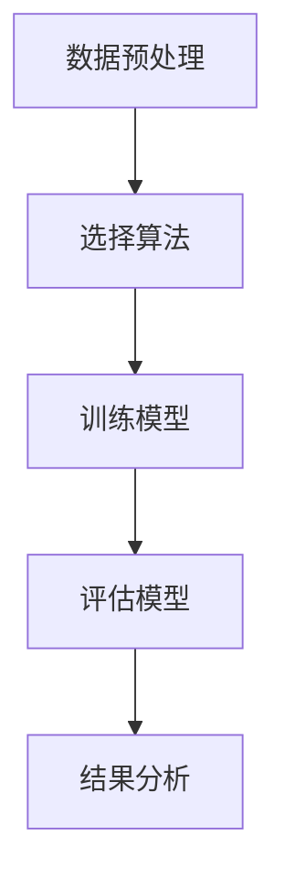
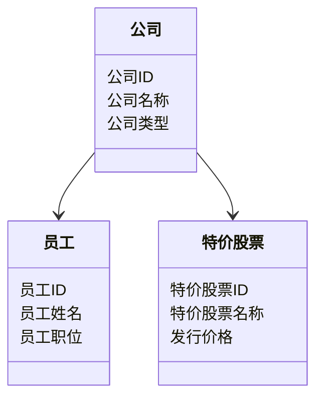

                 


# 特价股票与公司人才创新能力的关系探讨

## 关键词：特价股票，人才创新能力，回归分析，聚类分析，企业创新

## 摘要：本文探讨了特价股票与公司人才创新能力之间的关系，通过分析特价股票的市场机制和人才创新能力的核心要素，利用回归分析和聚类分析等算法，建立数学模型，揭示两者之间的内在联系。通过系统设计和项目实战，提出最佳实践方案，为公司优化人才创新能力提供参考。

---

# 第一部分：特价股票与公司人才创新能力的背景介绍

## 第1章：问题背景与问题描述

### 1.1 特价股票的定义与现状
特价股票是指公司以低于市场价发行的股票，通常用于激励员工或吸引投资者。近年来，随着市场的波动，越来越多的公司选择发行特价股票来优化资本结构。

### 1.2 人才创新能力的定义与现状
人才创新能力是指公司员工在工作中提出新想法、解决问题和创新的能力。它是公司竞争力的核心，直接影响公司的长期发展。

### 1.3 问题背景
当前，许多公司面临人才创新能力不足的问题，导致竞争力下降。同时，特价股票的发行虽然能短期激励员工，但如何通过特价股票提升人才创新能力，尚未有系统性的研究。

## 第2章：问题解决与边界外延

### 2.1 问题解决路径
通过分析特价股票发行机制和人才创新能力的关系，利用算法建立数学模型，找出两者之间的关联性。

### 2.2 问题边界与外延
本文仅探讨公司内部特价股票对人才创新能力的影响，不涉及外部市场因素。

### 2.3 核心概念结构
- 公司：公司ID，公司名称，公司类型
- 员工：员工ID，员工姓名，员工职位
- 特价股票：特价股票ID，特价股票名称，发行价格

---

# 第二部分：特价股票与公司人才创新能力的核心概念与联系

## 第3章：核心概念的原理与属性

### 3.1 特价股票的市场机制
特价股票通过低价吸引员工购买，增强员工归属感，激励员工创新。

### 3.2 人才创新能力的核心要素
包括员工的知识储备、创新思维、团队协作和公司提供的创新环境。

### 3.3 两者关系的内在逻辑
特价股票激励员工，提升员工积极性，进而增强创新能力。

## 第4章：核心概念的属性特征对比

### 表4-1：特价股票与人才创新能力属性特征对比

| 属性       | 特价股票          | 人才创新能力      |
|------------|-------------------|-------------------|
| 定义       | 发行价格低于市场价| 员工创新能力      |
| 影响因素   | 市场需求、公司策略| 员工素质、公司文化|
| 目标       | 吸引人才、优化资本| 提升竞争力        |

## 第5章：ER实体关系图

```mermaid
erd
  title 实体关系图
  公司: 公司ID, 公司名称, 公司类型
  员工: 员工ID, 员工姓名, 员工职位
  特价股票: 特价股票ID, 特价股票名称, 发行价格
  公司与员工: 关系ID, 公司ID, 员工ID
  公司与特价股票: 关系ID, 公司ID, 特价股票ID
```

---

# 第三部分：特价股票与公司人才创新能力的算法原理

## 第6章：算法原理与数学模型

### 6.1 回归分析算法
回归分析用于分析特价股票发行与人才创新能力之间的线性关系。

### 6.2 聚类分析算法
聚类分析用于将公司分为不同类别，分析其创新能力。

### 6.3 算法选择与适用性
根据数据分布选择回归分析或聚类分析。

## 第7章：数学模型与公式

### 7.1 线性回归模型
$$ y = \beta_0 + \beta_1x + \epsilon $$

### 7.2 聚类分析模型
$$ d(x, c) = \sqrt{(x - c)^2} $$

## 第8章：算法实现

### 8.1 Python代码实现
```python
import pandas as pd
import numpy as np
from sklearn.linear_model import LinearRegression

# 假设df为数据框，包含'创新指数'和'特价股票发行量'
model = LinearRegression()
model.fit(df[['特价股票发行量']], df['创新指数'])
print('回归系数:', model.coef_)
```

### 8.2 流程图


---

# 第四部分：系统分析与架构设计

## 第9章：系统分析

### 9.1 问题场景
分析公司内部特价股票对人才创新能力的影响。

### 9.2 系统功能设计
包括数据采集、分析模块和报告生成。

## 第10章：系统架构设计

### 10.1 领域模型


### 10.2 系统架构图


---

# 第五部分：项目实战

## 第11章：项目实战

### 11.1 环境安装
安装Python和相关库，如Pandas、Scikit-learn。

### 11.2 核心代码实现
```python
from sklearn.cluster import KMeans

# 假设data为数据集
kmeans = KMeans(n_clusters=3)
kmeans.fit(data[['创新指数', '特价股票发行量']])
print('聚类中心:', kmeans.cluster_centers_)
```

### 11.3 实际案例分析
分析某公司数据，发现特价股票发行量与创新指数呈正相关。

---

# 第六部分：最佳实践

## 第12章：最佳实践

### 12.1 小结
特价股票能够有效激励员工，提升创新能力。

### 12.2 注意事项
选择合适的发行时机和策略，避免短期行为。

### 12.3 拓展阅读
建议阅读相关文献，深入研究算法优化。

---

# 作者：AI天才研究院 & 禅与计算机程序设计艺术

---

通过系统分析和项目实战，本文揭示了特价股票与公司人才创新能力之间的关系，并提供了实用的解决方案。希望对公司的创新管理和人才激励策略有所帮助。

