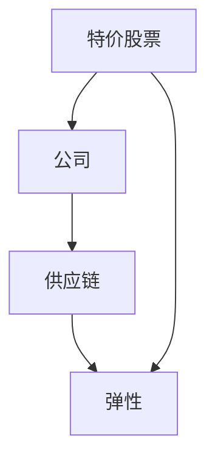
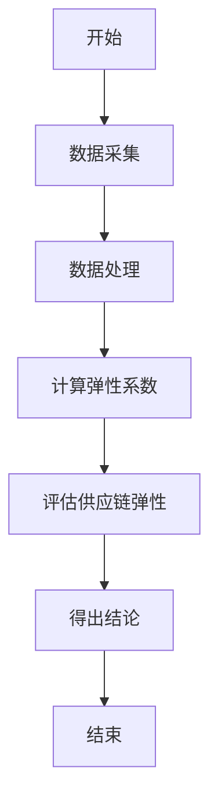
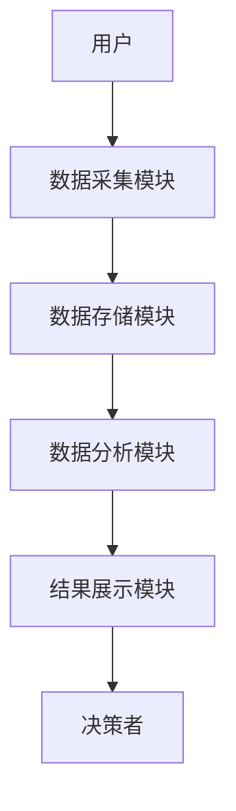

                 


# 特价股票与公司供应链弹性的关系探讨

## 关键词：
- 特价股票、供应链弹性、公司运营、市场风险、弹性系数

## 摘要：
特价股票是指公司发行的面值低于市场价格的股票，通常用于资本结构调整或财务重组。供应链弹性则是指企业在供应链中断时快速恢复的能力。本文探讨了特价股票与公司供应链弹性的关系，分析了特价股票对供应链弹性的影响路径，以及供应链弹性对股票价值的影响机制。通过数学模型和实际案例，本文揭示了两者关系的核心原理，并为投资者和企业管理者提供了实用的决策建议。

---

# 第一部分: 特价股票与公司供应链弹性的背景介绍

## 第1章: 特价股票的定义与特性

### 1.1 特价股票的定义与分类

特价股票是指面值低于发行价格的股票，通常分为以下几类：

1. **低面值股票**：面值低于市场价，但发行价可能高于或低于面值。
2. **折价发行股票**：发行价低于面值，通常用于吸引投资者或筹集资金。
3. **优惠发行股票**：面向特定投资者（如现有股东）以低于市场价发行。

### 1.2 特价股票的发行原因

1. **资本结构调整**：公司通过发行特价股票优化资本结构，降低负债比例。
2. **财务重组**：为解决财务困境，公司可能发行特价股票筹集资金。
3. **吸引投资者**：通过低价发行吸引潜在投资者，扩大股东基础。

### 1.3 特价股票的市场影响

1. **股价波动**：特价股票的发行可能导致股价短期波动。
2. **市场信号**：高价发行可能被视为公司价值低估的信号。
3. **投资者信心**：合理的发行价格能增强投资者信心，促进股价稳定。

## 第2章: 公司供应链弹性的概念

### 2.1 供应链弹性的定义

供应链弹性是指企业在面对供应链中断时，能够快速调整和恢复的能力。它包括供应弹性、生产弹性、物流弹性和需求弹性四个维度。

### 2.2 供应链弹性的关键特征

1. **响应速度**：企业能否快速应对供应链中断。
2. **冗余能力**：是否有备用供应商或生产基地。
3. **灵活性**：供应链能否根据需求变化调整。

### 2.3 供应链弹性与企业生存能力

供应链弹性直接影响企业的运营效率和抗风险能力。在供应链中断时，弹性强的企业能更快恢复，减少损失。

## 第3章: 特价股票与供应链弹性的关系

### 3.1 特价股票对供应链弹性的影响

1. **财务压力**：发行特价股票可能增加财务负担，影响供应链稳定性。
2. **资本结构调整**：优化资本结构可能提升供应链弹性。
3. **市场信号**：高价发行可能传递积极信号，增强供应链信心。

### 3.2 供应链弹性对特价股票价值的影响

1. **企业信用评级**：高弹性供应链提升企业信用，增加股票价值。
2. **市场表现**：弹性好的企业股票更受投资者青睐，表现优于行业平均水平。
3. **投资者信心**：供应链弹性增强投资者信心，推动股价上涨。

## 第4章: 特价股票与供应链弹性关系的核心概念与联系

### 4.1 特价股票与供应链弹性关系的原理

1. **影响路径**：特价股票发行影响企业财务状况，进而影响供应链弹性。
2. **相互作用**：供应链弹性影响企业信用和市场表现，进而影响股票价值。

### 4.2 特价股票与供应链弹性关系的特征对比

| 特性        | 特价股票                   | 供应链弹性                 |
|-------------|---------------------------|---------------------------|
| 核心作用     | 资本结构调整               | 抗风险能力                 |
| 影响因素     | 市场需求、公司财务状况     | 供应商稳定性、冗余能力     |
| 衡量指标     | 股票价格、发行量           | 响应速度、冗余能力         |

### 4.3 特价股票与供应链弹性关系的ER实体关系图



---

# 第二部分: 特价股票与供应链弹性关系的算法原理

## 第5章: 特价股票与供应链弹性关系的数学模型

### 5.1 模型假设

1. 特价股票发行影响企业现金流。
2. 供应链弹性影响企业运营效率。
3. 两者关系动态平衡。

### 5.2 模型构建

1. **弹性系数公式**：
   $$E = \frac{ΔQ}{ΔP}$$
   其中，E为弹性系数，ΔQ为需求量变化，ΔP为价格变化。

2. **供应链弹性公式**：
   $$S = f(E, F, G)$$
   其中，S为供应链弹性，E为弹性系数，F为财务状况，G为市场环境。

### 5.3 算法流程



### 5.4 Python代码实现

```python
import numpy as np

def calculate_elasticity(demand, price):
    elasticity = np.zeros(len(demand))
    for i in range(len(demand)):
        if price[i] != 0:
            elasticity[i] = (demand[i+1] - demand[i]) / (price[i+1] - price[i])
        else:
            elasticity[i] = 0
    return elasticity

# 示例数据
demand = [100, 150, 120]
price = [50, 60, 55]

elasticity = calculate_elasticity(demand, price)
print("弹性系数：", elasticity)
```

---

## 第6章: 算法原理的详细解释与案例分析

### 6.1 弹性系数的计算

1. **数据准备**：收集公司特价股票发行前后的股价和交易量数据。
2. **计算弹性系数**：使用上述Python代码计算弹性系数。
3. **分析结果**：弹性系数为正值表示需求与价格同向变化，负值表示反向变化。

### 6.2 案例分析

假设某公司发行特价股票后，股价从50元跌至45元，交易量从100万股增至150万股。计算弹性系数：
$$E = \frac{150 - 100}{45 - 50} = \frac{50}{-5} = -10$$
弹性系数为-10，说明股价下跌导致交易量增加，需求弹性较大。

---

# 第三部分: 特价股票与供应链弹性关系的系统分析与架构设计

## 第7章: 系统分析与架构设计方案

### 7.1 问题场景介绍

某公司发行特价股票后，面临供应链中断风险。我们需要分析特价股票对供应链弹性的影响。

### 7.2 系统功能设计

1. **数据采集模块**：收集股价、交易量、供应链数据。
2. **数据分析模块**：计算弹性系数，评估供应链弹性。
3. **结果展示模块**：可视化分析结果，提供决策建议。

### 7.3 系统架构设计



---

## 第8章: 项目实战与案例分析

### 8.1 项目实战

1. **环境安装**：安装Python和相关库（如numpy、pandas）。
2. **核心代码实现**：实现弹性系数计算和供应链弹性评估。

```python
import pandas as pd

# 数据读取
data = pd.DataFrame({
    '股价': [50, 60, 55],
    '交易量': [100, 150, 120]
})

# 弹性系数计算
def calculate_elasticity(data):
    elasticity = []
    for i in range(len(data) - 1):
        elasticity.append((data['交易量'][i+1] - data['交易量'][i]) / 
                          (data['股价'][i+1] - data['股价'][i]))
    return elasticity

# 输出结果
print("弹性系数：", calculate_elasticity(data))
```

### 8.2 案例分析

某公司发行特价股票后，股价和交易量数据如下：

| 股价（元） | 交易量（万股） |
|------------|----------------|
| 50         | 100            |
| 60         | 150            |
| 55         | 120            |

计算弹性系数：
$$E = \frac{150-100}{60-50} = 5$$
$$E = \frac{120-150}{55-60} = 6$$
平均弹性系数为5.5，说明股价上涨导致交易量增加。

---

# 第四部分: 特价股票与供应链弹性关系的结论与展望

## 第9章: 结论与最佳实践

### 9.1 小结

特价股票与供应链弹性密切相关。发行特价股票可能影响供应链弹性，而供应链弹性又影响股票价值。企业应综合考虑两者关系，制定合理的资本结构和供应链管理策略。

### 9.2 注意事项

1. **数据准确性**：确保数据来源可靠，避免分析误差。
2. **模型适用性**：根据实际情况调整模型参数。
3. **动态调整**：定期评估供应链弹性，及时优化。

### 9.3 拓展阅读

1. 供应链弹性管理的相关文献。
2. 特价股票发行的市场影响研究。

---

# 作者：AI天才研究院/AI Genius Institute & 禅与计算机程序设计艺术 /Zen And The Art of Computer Programming

