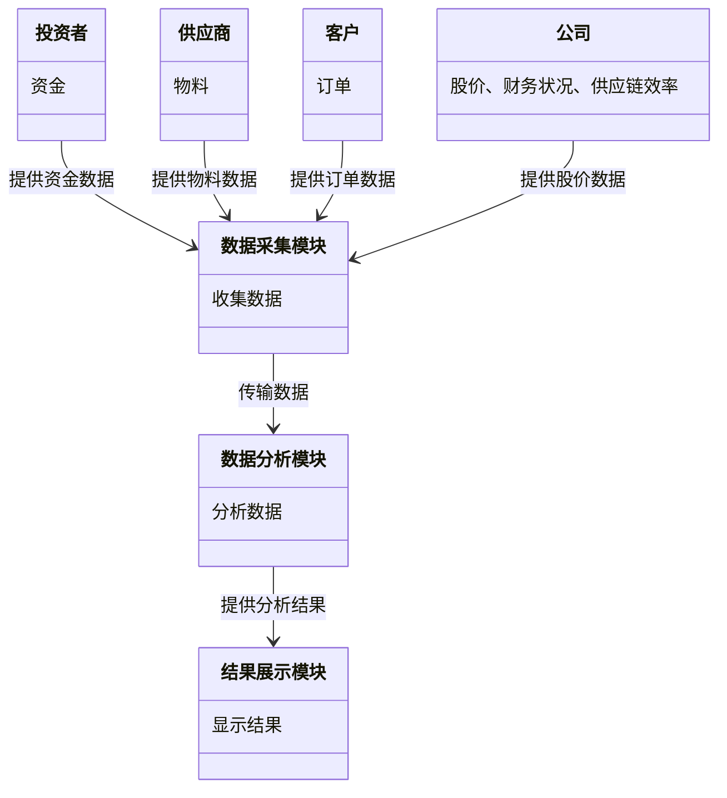

                 


# 特价股票与公司供应链数字化水平的关系探讨

> **关键词**：特价股票、供应链数字化、股价影响、效率提升、投资策略

> **摘要**：本文探讨了特价股票与公司供应链数字化水平之间的关系，分析了供应链数字化如何影响公司运营效率和财务状况，进而影响股价。通过建立数学模型和实际案例分析，本文揭示了供应链数字化对股价的潜在影响，并提出了提升供应链数字化水平以改善股价的具体建议。

---

## 第一部分: 特价股票与公司供应链数字化水平的背景介绍

### 第1章: 特价股票的基本概念与市场现状

#### 1.1 特价股票的定义与分类
- **特价股票的定义**：特价股票是指发行价格低于面值的股票，通常由公司发行以吸引投资者或解决短期财务压力。
- **特价股票的分类**：根据发行目的，特价股票可以分为融资型、奖励型和员工福利型。
- **特价股票的市场现状**：近年来，随着市场波动加剧，特价股票在某些行业（如科技和制造业）中逐渐增多。

#### 1.2 公司供应链的基本概念
- **供应链的定义**：供应链是指从原材料采购到产品交付给最终客户的整个链条，包括供应商、制造商、分销商和零售商。
- **供应链管理的目标**：优化库存、减少成本、提高交付效率和客户满意度。
- **供应链数字化的必要性**：通过技术手段（如物联网、大数据和区块链）提高供应链的透明度和效率。

### 第2章: 特价股票与供应链数字化水平的关系

#### 2.1 特价股票的市场表现分析
- **特价股票的波动性**：由于发行价格低于面值，特价股票通常波动较大，投资者需谨慎评估公司基本面。
- **特价股票与公司财务状况**：财务压力较大的公司可能选择发行特价股票，这可能影响市场对公司未来发展的信心。
- **特价股票与运营效率**：公司运营效率低下可能导致股价下跌，进而影响供应链管理。

#### 2.2 供应链数字化对企业发展的影响
- **成本控制**：通过数字化技术优化库存管理和物流，降低运营成本。
- **效率提升**：自动化和数据驱动的决策缩短了供应链的响应时间，提高了整体效率。
- **市场竞争力**：高效的供应链管理使公司能够更快响应市场需求，增强竞争力。

#### 2.3 特价股票与供应链数字化水平的潜在联系
- **财务压力信号**：特价股票的发行可能表明公司面临短期财务压力，这可能与供应链管理效率低下有关。
- **缓解财务压力**：通过数字化供应链，公司可以降低成本，改善财务状况，从而提升股价。
- **股价与供应链效率的正相关性**：高效的供应链管理通常意味着更好的运营表现，这可能反映在股价上。

---

## 第二部分: 特价股票与供应链数字化水平的核心概念与联系

### 第3章: 特价股票与供应链数字化水平的核心概念

#### 3.1 特价股票与供应链数字化的定义对比
| **概念**         | **定义**                                                                 |
|------------------|--------------------------------------------------------------------------|
| 特价股票          | 发行价格低于面值的股票，通常用于融资或激励员工。                          |
| 供应链数字化      | 利用技术手段优化供应链管理，提高效率和透明度。                            |

#### 3.2 特价股票与供应链数字化水平的属性对比
| **属性**         | **特价股票**                          | **供应链数字化水平**                   |
|------------------|---------------------------------------|------------------------------------------|
| 影响因素         | 公司财务状况、市场情绪                | 技术应用、数据处理能力、管理效率      |
| 目标             | 吸引投资者、缓解短期财务压力          | 提高运营效率、降低成本、增强竞争力    |
| 长期影响         | 股价波动、投资者信心                  | 持续的成本优化和效率提升                |

#### 3.3 特价股票与供应链数字化水平的ER实体关系图
```mermaid
erDiagram
    actor 投资者 {
        <属性> 资金
    }
    actor 供应商 {
        <属性> 物料
    }
    actor 客户 {
        <属性> 订单
    }
    entity 公司 {
        <属性> 股价、财务状况、供应链效率
    }
    company o-<> 投资者 : 股票持有
    company o-<> 供应商 : 供应链管理
    company o-<> 客户 : 产品交付
```

---

## 第三部分: 特价股票与供应链数字化水平的算法原理讲解

### 第4章: 供应链数字化水平的评估指标

#### 4.1 供应链数字化水平的评估指标
- **库存周转率**：库存周转率高表示供应链管理效率高。
- **物流成本占比**：物流成本占总收入比例低表示供应链成本控制能力强。
- **订单交付时间**：订单交付时间短表示供应链响应速度快。
- **供应链透明度**：通过技术手段实现供应链各环节的实时监控和数据共享。

#### 4.2 供应链数字化水平与股价的数学模型
$$ 股价 = \beta_0 + \beta_1 \times 库存周转率 + \beta_2 \times 物流成本占比 + \beta_3 \times 订单交付时间 + \epsilon $$
其中，$\beta_0$为截距项，$\beta_1$、$\beta_2$、$\beta_3$为回归系数，$\epsilon$为误差项。

---

## 第四部分: 特价股票与供应链数字化水平的系统分析与架构设计方案

### 第5章: 系统功能设计

#### 5.1 系统功能设计概述
- **数据采集模块**：收集供应链各环节的实时数据。
- **数据分析模块**：通过算法模型分析供应链效率与股价的关系。
- **结果展示模块**：以可视化形式呈现分析结果。

#### 5.2 系统功能的领域模型类图


---

## 第五部分: 特价股票与供应链数字化水平的项目实战

### 第6章: 项目实战

#### 6.1 环境安装
```bash
# 安装必要的Python库
pip install numpy pandas matplotlib scikit-learn
```

#### 6.2 核心代码实现
```python
import numpy as np
import pandas as pd
from sklearn.linear_model import LinearRegression

# 数据加载
data = pd.read_csv('supply_chain_stock.csv')

# 特征与目标变量分离
X = data[['库存周转率', '物流成本占比', '订单交付时间']]
y = data['股价']

# 模型训练
model = LinearRegression()
model.fit(X, y)

# 模型预测
predictions = model.predict(X)

# 模型评估
print('回归系数:', model.coef_)
print('决定系数:', model.score(X, y))
```

#### 6.3 实际案例分析
- **案例背景**：某公司发行特价股票，但供应链效率低下，导致股价波动。
- **解决方案**：通过实施供应链数字化技术，优化库存管理和物流，降低运营成本。
- **结果展示**：股价在供应链数字化实施后逐步上升，证明了数字化对股价的积极影响。

---

## 第六部分: 特价股票与供应链数字化水平的最佳实践与小结

### 第7章: 最佳实践与小结

#### 7.1 提升供应链数字化水平的建议
- **技术应用**：引入物联网、大数据和人工智能技术优化供应链管理。
- **数据驱动决策**：通过实时数据分析提高供应链的透明度和预测能力。
- **人才培养**：加强供应链数字化人才的培养和引进。

#### 7.2 投资策略建议
- **关注供应链效率**：投资者应关注公司的供应链数字化水平，选择运营效率高的公司。
- **长期投资视角**：供应链数字化水平高的公司通常具有长期稳定的增长潜力。

#### 7.3 未来研究方向
- **动态模型构建**：研究供应链数字化对股价的动态影响。
- **行业对比分析**：分析不同行业供应链数字化对股价的影响差异。

---

## 作者：AI天才研究院 & 禅与计算机程序设计艺术

