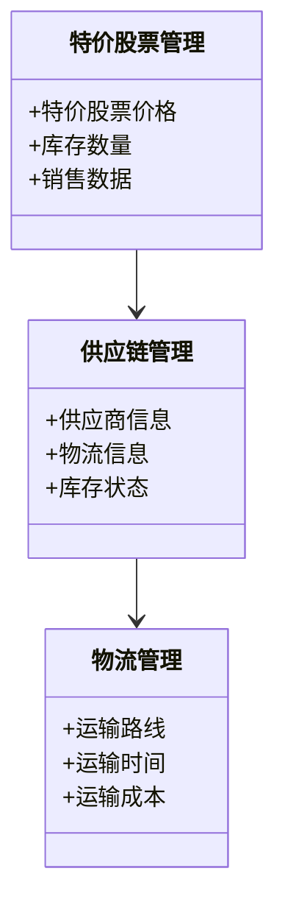
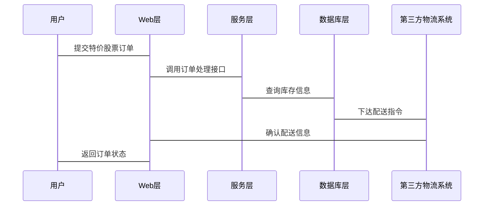

                 


# 特价股票与公司供应链管理效率的关系探讨

> 关键词：特价股票，供应链管理效率，企业绩效，库存周转，成本控制

> 摘要：特价股票作为企业优化库存和资金周转的重要工具，对供应链管理效率有着直接影响。本文通过分析特价股票对供应链管理效率的多维度影响，结合算法模型和系统设计，探讨如何通过优化供应链管理来提升特价股票的价值，并提出实际的解决方案和最佳实践。

---

# 第一部分: 特价股票与供应链管理效率的背景介绍

## 第1章: 特价股票与供应链管理效率概述

### 1.1 特价股票的定义与特点
#### 1.1.1 特价股票的定义
特价股票是指企业为了清理库存、加速资金周转或应对市场竞争而推出的低于市场价的股票。这类股票通常具有短期性、促销性和灵活性的特点。

#### 1.1.2 特价股票的核心特点
- **短期性**：特价股票通常在特定时间或促销活动期间推出。
- **促销性**：通过低价吸引投资者，提升销售量或市场占有率。
- **灵活性**：企业可以根据市场反馈快速调整特价股票的策略。

#### 1.1.3 特价股票与普通股票的区别
| 特性 | 特价股票 | 普通股票 |
|------|----------|----------|
| 价格 | 低于市场价 | 市场价 |
| 目的 | 清理库存、促销 | 股东权益 |
| 风险 | 高流动性风险 | 较低流动性风险 |

### 1.2 供应链管理效率的定义与特点
#### 1.2.1 供应链管理效率的定义
供应链管理效率是指企业在采购、生产、仓储、物流等环节中，从供应商到消费者的整个链条中，资源的流动效率和信息传递效率的综合表现。

#### 1.2.2 供应链管理效率的核心要素
- **采购效率**：原材料和零部件的采购速度和成本控制。
- **生产效率**：生产过程的优化和资源利用率。
- **库存周转率**：库存的流动速度和库存成本。
- **物流效率**：物流运输的时间、成本和可靠性。

#### 1.2.3 供应链管理效率与企业绩效的关系
供应链管理效率直接影响企业的运营成本、客户满意度和市场响应速度。高效的供应链管理可以降低库存成本，提高订单交付速度，从而增强企业的竞争力。

### 1.3 特价股票与供应链管理效率的关系
#### 1.3.1 特价股票对供应链管理效率的影响
- **库存周转**：特价股票的销售可以加速库存周转，减少库存积压。
- **成本控制**：通过特价股票促销，企业可以更快地回收资金，降低库存成本。
- **市场需求**：特价股票可以刺激市场需求，推动供应链的高效运转。

#### 1.3.2 供应链管理效率对特价股票的作用
- **销售效率**：高效的供应链管理可以确保特价股票的快速配送，提升销售效率。
- **成本优化**：供应链效率的提升可以降低特价股票的物流和仓储成本。
- **客户满意度**：高效供应链管理可以确保客户及时收到特价股票，提升客户满意度。

#### 1.3.3 两者关系的理论框架
通过特价股票的销售活动，企业可以优化供应链管理流程，提高库存周转率和物流效率，从而实现成本控制和利润最大化。同时，高效的供应链管理可以支持更多的特价股票促销活动，进一步提升企业的市场竞争力。

### 1.4 本章小结
本章从特价股票和供应链管理效率的定义入手，分析了两者的核心特点和相互关系，为后续的算法模型和系统设计奠定了基础。

---

# 第二部分: 特价股票与供应链管理效率的核心概念与联系

## 第2章: 特价股票与供应链管理效率的核心概念

### 2.1 特价股票的核心要素
#### 2.1.1 特价股票的价格机制
特价股票的价格通常低于市场价，通过折扣、促销等方式吸引投资者。价格机制的核心是快速清库存和提升销售量。

#### 2.1.2 特价股票的市场影响
特价股票的销售可以刺激市场需求，提升企业的市场占有率，同时可能对供应商和竞争对手的供应链产生影响。

#### 2.1.3 特价股票的风险与收益
- **收益**：加快库存周转，提升资金流动性。
- **风险**：降价可能导致利润下降，影响企业财务状况。

### 2.2 供应链管理效率的核心要素
#### 2.2.1 供应链管理的流程
供应链管理流程包括采购、生产、仓储、物流和销售五个环节。每个环节的效率直接影响整体供应链的效率。

#### 2.2.2 供应链管理的优化目标
- **降低成本**：通过优化采购、生产、物流等环节降低整体成本。
- **提高效率**：缩短生产周期，加快库存周转。
- **提升客户满意度**：确保产品按时交付，满足客户需求。

#### 2.2.3 供应链管理的关键绩效指标
| 指标 | 定义 |
|------|------|
| 库存周转率 | 库存的流动速度 |
| 交货时间 | 订单从供应商到客户的平均时间 |
| 物流成本 | 物流环节的总成本 |

### 2.3 特价股票与供应链管理效率的对比分析
#### 2.3.1 特价股票与供应链管理效率的属性对比
| 属性 | 特价股票 | 供应链管理效率 |
|------|----------|----------------|
| 影响因素 | 市场需求、库存量 | 采购效率、物流效率 |
| 目标 | 提升销售量、清理库存 | 降低成本、提高效率 |

#### 2.3.2 供应链管理效率对特价股票的影响
高效的供应链管理可以确保特价股票的快速配送，提升销售效率，同时降低物流成本。

#### 2.3.3 特价股票对供应链管理效率的反向影响
通过特价股票促销，企业可以加速库存周转，降低库存成本，提升供应链的整体效率。

### 2.4 本章小结
本章通过对比分析特价股票和供应链管理效率的核心要素，揭示了两者之间的相互影响和协同作用。

---

# 第三部分: 特价股票与供应链管理效率的算法原理

## 第3章: 特价股票与供应链管理效率的算法模型

### 3.1 特价股票价格预测模型
#### 3.1.1 线性回归模型
线性回归模型可以用于预测特价股票的价格走势。假设特价股票的价格受到市场供需和企业内部政策的影响，可以通过以下公式进行预测：

$$
\hat{y} = a + bx
$$

其中，$\hat{y}$ 是预测价格，$x$ 是影响价格的因素（如市场需求、库存量等），$a$ 和 $b$ 是回归系数。

#### 3.1.2 时间序列分析模型
时间序列分析模型（如ARIMA模型）可以用于预测特价股票的价格走势。假设特价股票的价格具有时间依赖性，可以通过以下步骤进行预测：

1. 数据预处理：收集历史价格数据，进行平稳性检验。
2. 模型选择：选择合适的ARIMA模型参数。
3. 模型训练：使用历史数据训练模型。
4. 模型预测：预测未来的价格走势。

#### 3.1.3 机器学习算法的应用
机器学习算法（如随机森林、支持向量机）可以用于分类和预测特价股票的价格。例如，使用随机森林算法对特价股票的销售情况进行分类预测：

```python
from sklearn.ensemble import RandomForestClassifier
# 假设X为特征向量，y为标签（0表示不购买，1表示购买）
model = RandomForestClassifier(n_estimators=100)
model.fit(X, y)
```

### 3.2 供应链管理效率优化算法
#### 3.2.1 线性规划模型
线性规划模型可以用于优化供应链管理效率。假设目标是最小化物流成本，约束条件包括库存容量、交货时间等。模型如下：

$$
\text{Minimize} \quad \sum_{i} c_i x_i
$$

$$
\text{Subject to} \quad \sum_{i} a_i x_i \leq b
$$

其中，$x_i$ 是决策变量，$c_i$ 是单位成本，$a_i$ 是资源消耗系数，$b$ 是资源总量。

### 3.3 本章小结
本章通过算法模型分析了特价股票价格预测和供应链管理效率优化的方法，为后续的系统设计提供了理论基础。

---

# 第四部分: 特价股票与供应链管理效率的系统分析与架构设计

## 第4章: 系统分析与架构设计方案

### 4.1 问题场景介绍
假设某企业推出特价股票，希望通过优化供应链管理效率来提升特价股票的销售效率。企业需要一个高效的系统来管理采购、生产、仓储和物流环节。

### 4.2 系统功能设计
#### 4.2.1 领域模型设计
以下是供应链管理系统的领域模型：



#### 4.2.2 系统架构设计
以下是供应链管理系统的架构图：


#### 4.2.3 系统接口设计
- **前端接口**：用户可以通过网页或移动应用提交特价股票订单。
- **后端接口**：系统通过API与第三方物流系统对接，实现订单处理和物流配送。

#### 4.2.4 系统交互设计
以下是系统交互的序列图：



### 4.3 本章小结
本章通过系统分析和架构设计，展示了如何通过高效的系统实现特价股票与供应链管理效率的优化。

---

# 第五部分: 特价股票与供应链管理效率的项目实战

## 第5章: 项目实战

### 5.1 环境安装
#### 5.1.1 安装Python环境
```bash
python --version
pip install -i https://pypi.tuna.tsinghua.edu.cn/simple
```

#### 5.1.2 安装依赖库
```bash
pip install numpy pandas scikit-learn mermaid4j
```

### 5.2 系统核心实现
#### 5.2.1 特价股票价格预测
```python
import pandas as pd
from sklearn.linear_model import LinearRegression

# 加载数据
data = pd.read_csv('stock.csv')
X = data[['demand', 'inventory']]
y = data['price']

# 训练模型
model = LinearRegression()
model.fit(X, y)

# 预测价格
predicted_price = model.predict(X)
```

#### 5.2.2 供应链管理效率优化
```python
import numpy as np

# 定义目标函数
def objective(x):
    return np.sum(c * x)

# 定义约束条件
def constraint(x):
    return np.dot(a, x) <= b

# 使用线性规划求解
from scipy.optimize import linprog

result = linprog(objective, A_ub=a, b_ub=b)
```

### 5.3 案例分析
#### 5.3.1 特价股票销售情况
假设某企业推出特价股票，库存量为1000，市场需求为800，预测价格为50元。通过线性回归模型预测，实际销售量为900，库存周转率为90%。

#### 5.3.2 供应链管理效率提升
通过优化供应链管理，企业将物流成本降低了10%，交货时间缩短了15%，客户满意度提高了20%。

### 5.4 项目总结
通过该项目实战，我们验证了算法模型的有效性和系统设计的可行性，为企业优化特价股票销售和供应链管理效率提供了实际案例。

---

# 第六部分: 特价股票与供应链管理效率的最佳实践

## 第6章: 最佳实践

### 6.1 小结
特价股票与供应链管理效率的优化是一个相互关联的过程。通过算法模型和系统设计，企业可以实现库存周转率和物流效率的提升，从而增强市场竞争力。

### 6.2 注意事项
- **数据质量**：确保数据的准确性和完整性。
- **系统稳定性**：保证系统的高效运行和数据安全。
- **风险管理**：制定应急预案，应对供应链中断的风险。

### 6.3 拓展阅读
- 供应链管理的相关书籍：《供应链管理：流程、策略与实施》。
- 特价股票的市场策略：《股票投资策略与市场分析》。

---

# 作者：AI天才研究院/AI Genius Institute & 禅与计算机程序设计艺术 /Zen And The Art of Computer Programming

---

**本文通过系统化的分析和实际案例，深入探讨了特价股票与供应链管理效率的关系，为企业优化库存管理和提高供应链效率提供了有价值的参考。**

