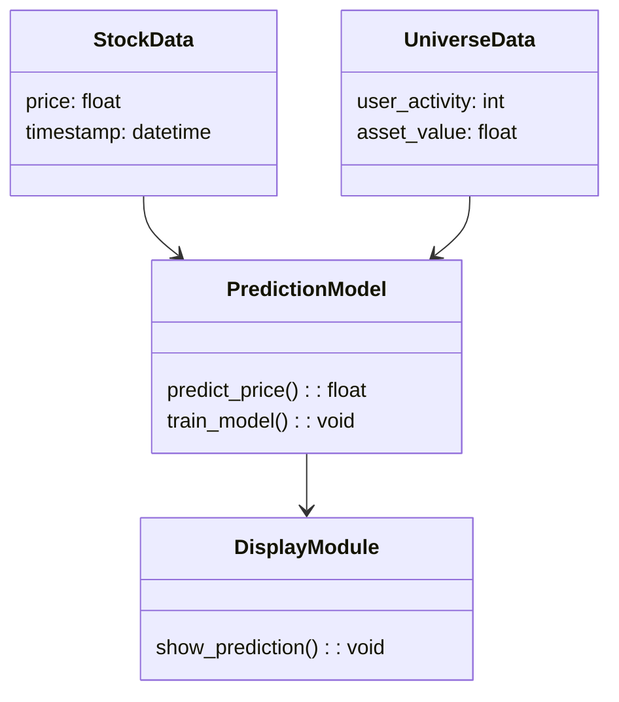
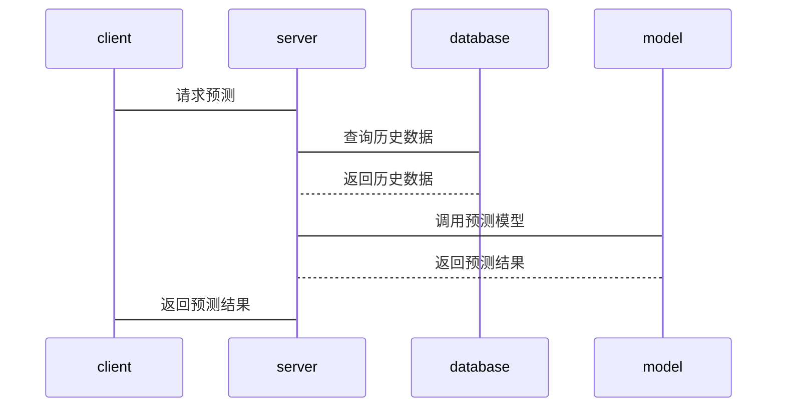

                 


# 特价股票与公司元宇宙互操作性能力的潜在关联研究

> **关键词**：特价股票、元宇宙、互操作性能力、股票价格预测、元宇宙经济系统

> **摘要**：  
本文旨在探讨特价股票与公司元宇宙互操作性能力之间的潜在关联。通过分析特价股票的市场机制、元宇宙的互操作性能力及其对公司的影响，本文揭示了两者在数据流、市场波动、技术实现等方面的关联。结合算法模型和系统架构设计，本文提出了基于时间序列分析的股票价格预测模型，并通过Python代码实现，展示了如何将元宇宙互操作性能力应用于实际场景。最终，本文总结了研究发现，并提出了未来的研究方向。

---

## 第一部分：背景介绍

### 第1章：特价股票与元宇宙的基本概念

#### 1.1 特价股票的定义与特征

- **1.1.1 特价股票的定义**  
  特价股票通常指价格较低的股票，通常在市场中被散户或机构投资者关注。其价格波动性较高，但潜在回报也较大。

- **1.1.2 特价股票的市场特征**  
  - 价格波动剧烈  
  - 市场流动性较低  
  - 受市场情绪影响较大  

- **1.1.3 特价股票的交易机制**  
  - 市场参与者包括散户、机构投资者和高频交易算法  
  - 交易策略包括技术分析和基本面分析  

#### 1.2 元宇宙的定义与特点

- **1.2.1 元宇宙的基本定义**  
  元宇宙是一个虚拟的共享空间，由虚拟现实（VR）和增强现实（AR）技术支持，用户可以通过数字设备进入这个虚拟世界。

- **1.2.2 元宇宙的核心技术特征**  
  - 虚拟现实（VR）与增强现实（AR）  
  - 区块链技术（用于虚拟资产确权）  
  - 人工智能（用于个性化推荐与数据分析）  

- **1.2.3 元宇宙的未来发展潜力**  
  - 数字资产交易  
  - 虚拟经济系统  
  - 元宇宙中的社交互动  

#### 1.3 特价股票与元宇宙的潜在关联

- **1.3.1 特价股票在元宇宙中的应用场景**  
  - 元宇宙中的虚拟货币与股票交易  
  - 元宇宙公司对虚拟资产的投资  

- **1.3.2 元宇宙对特价股票市场的影响**  
  - 虚拟资产的波动性对传统股票市场的影响  
  - 元宇宙公司的上市与融资  

- **1.3.3 特价股票与元宇宙互操作性能力的初步分析**  
  - 元宇宙中的数据流如何影响股票价格  
  - 公司互操作性能力对股价的潜在影响  

---

### 第2章：特价股票的市场机制与分析

#### 2.1 特价股票的市场参与主体

- **2.1.1 投资者**  
  - 散户投资者：对特价股票的交易行为受市场情绪影响较大。  
  - 机构投资者：通过基本面分析和量化交易策略参与市场。  

- **2.1.2 机构投资者**  
  - 通过高频交易算法进行短线操作。  
  - 基于公司基本面分析进行长线投资。  

- **2.1.3 市场监管机构**  
  - 负责市场规则制定与监管。  
  - 监测市场操纵行为。  

#### 2.2 特价股票的定价机制

- **2.2.1 市场供需关系**  
  - 供需失衡导致价格波动。  
  - 市场情绪影响供需关系。  

- **2.2.2 公司基本面分析**  
  - 盈利能力、资产负债率、成长性等指标。  
  - 公司新闻、财报发布对股价的影响。  

- **2.2.3 市场情绪与波动性**  
  - 市场情绪的量化指标：恐慌指数、投资者信心指数。  
  - 市场波动性与股票价格的相关性。  

#### 2.3 特价股票的交易策略

- **2.3.1 技术分析**  
  - 移动平均线（MA）、相对强弱指数（RSI）、MACD指标。  
  - 基于时间序列分析的预测模型。  

- **2.3.2 基本面分析**  
  - 公司财务数据、行业趋势分析。  
  - 宏观经济指标对股价的影响。  

- **2.3.3 风险管理**  
  - 设置止损点、分散投资、杠杆交易的风险控制。  

---

### 第3章：元宇宙中的公司互操作性能力

#### 3.1 元宇宙中的公司互操作性能力定义

- **3.1.1 互操作性的概念**  
  互操作性指不同系统或组件之间能够协同工作的能力。  
  在元宇宙中，互操作性能力决定了公司与其他系统或用户的互动效率。  

- **3.1.2 公司互操作性能力的内涵**  
  - 数据接口的标准化  
  - 虚拟资产的跨平台流转  
  - 元宇宙中的社交互动与协作  

#### 3.2 元宇宙中公司互操作性能力的影响因素

- **3.2.1 技术实现**  
  - 区块链技术用于虚拟资产确权。  
  - 人工智能技术用于个性化推荐与数据分析。  

- **3.2.2 市场规则**  
  - 元宇宙中的虚拟货币与现实货币的兑换机制。  
  - 公司在元宇宙中的商业模式。  

- **3.2.3 用户行为**  
  - 用户的虚拟资产投资行为。  
  - 用户的社交互动行为对股价的影响。  

---

## 第二部分：算法原理与系统架构设计

### 第4章：基于时间序列分析的股票价格预测模型

#### 4.1 问题场景介绍

- **4.1.1 特价股票价格波动预测的必要性**  
  - 特价股票的高波动性使其成为短期交易的理想标的。  
  - 预测模型可帮助投资者做出更明智的交易决策。  

- **4.1.2 元宇宙对公司互操作性能力的影响**  
  - 元宇宙中的虚拟资产交易可能影响公司股价。  
  - 元宇宙中的数据流可能提供新的预测特征。  

#### 4.2 算法原理

- **4.2.1 时间序列分析模型**  
  - 自回归积分滑动平均（ARIMA）模型：用于捕捉时间序列的趋势与周期性。  
  - 长短期记忆网络（LSTM）：适用于捕捉长期依赖关系。  

- **4.2.2 模型输入与输出**  
  - 输入：历史股价数据、市场情绪指标、元宇宙相关数据。  
  - 输出：未来股价预测值。  

#### 4.3 算法实现

- **4.3.1 Python代码实现**

```python
import pandas as pd
import numpy as np
from sklearn.metrics import mean_squared_error
from statsmodels.tsa.arima_model import ARIMA

# 加载数据
data = pd.read_csv('stock_price.csv')

# 划分训练集与测试集
train_data = data['price'].values
test_data = data['price'].values[-len(data)//2:]

# 训练ARIMA模型
model = ARIMA(train_data, order=(5,1,0))
model_fit = model.fit()

# 预测测试集
start_index = len(train_data)
end_index = start_index + len(test_data)
predicted = model_fit.forecast(end_index - start_index + 1)[0]

# 计算均方根误差
mse = mean_squared_error(test_data, predicted)
print(f'MSE: {mse}')
```

- **4.3.2 模型优化**

  - 超参数调整：通过网格搜索优化ARIMA模型的参数。  
  - LSTM模型的训练：使用Keras框架训练LSTM网络，捕捉长期依赖关系。  

#### 4.4 算法实现的数学模型

- **ARIMA模型**  
  ARIMA模型的数学公式如下：  
  $$ ARIMA(p, d, q) = y_t = \phi_1 y_{t-1} + \phi_2 y_{t-2} + \dots + \phi_p y_{t-p} + \theta_1 \epsilon_{t-1} + \theta_2 \epsilon_{t-2} + \dots + \theta_q \epsilon_{t-q} + \epsilon_t $$  

- **LSTM模型**  
  LSTM单元的结构包括输入门、遗忘门和输出门：  
  $$ i_t = \sigma(W_i x_t + U_i h_{t-1}) $$  
  $$ f_t = \sigma(W_f x_t + U_f h_{t-1}) $$  
  $$ o_t = \sigma(W_o x_t + U_o h_{t-1}) $$  
  $$ h_t = i_t \cdot \tilde{h}_t + f_t \cdot h_{t-1} $$  

---

### 第5章：系统架构设计

#### 5.1 系统功能设计

- **5.1.1 系统功能模块划分**  
  - 数据采集模块：从股票市场和元宇宙获取数据。  
  - 数据处理模块：清洗与特征提取。  
  - 预测模型模块：基于时间序列分析的预测模型。  
  - 结果展示模块：可视化预测结果。  

- **5.1.2 领域模型设计（类图）**



#### 5.2 系统架构设计

- **5.2.1 系统架构图**


- **5.2.2 系统接口设计**  
  - API接口：提供数据接口和预测接口。  
  - 数据接口：获取股票价格和元宇宙数据。  
  - 预测接口：返回预测的股票价格。  

- **5.2.3 系统交互设计**



---

## 第三部分：项目实战与最佳实践

### 第6章：项目实战

#### 6.1 环境安装

- **6.1.1 安装Python环境**  
  - 安装Python 3.8以上版本。  
  - 安装必要的库：`pandas`, `numpy`, `statsmodels`, `keras`, `tensorflow`.  

- **6.1.2 安装Jupyter Notebook**  
  - 用于数据可视化与算法实现。  

#### 6.2 系统核心实现

- **6.2.1 数据处理与特征提取**

```python
import pandas as pd
import numpy as np

# 加载数据
data = pd.read_csv('stock_price.csv')

# 数据清洗
data.dropna(inplace=True)

# 特征提取
data['return'] = data['price'].pct_change()
data['moving_avg'] = data['price'].rolling(5).mean()
```

- **6.2.2 预测模型实现**

```python
from statsmodels.tsa.arima_model import ARIMA
import matplotlib.pyplot as plt

# 训练ARIMA模型
model = ARIMA(data['price'], order=(5,1,0))
model_fit = model.fit()

# 预测未来价格
forecast = model_fit.forecast(steps=10)
plt.plot(data['price'], label='实际价格')
plt.plot(forecast, label='预测价格')
plt.legend()
plt.show()
```

#### 6.3 案例分析

- **6.3.1 数据来源**  
  使用某公司特价股票的历史价格数据与元宇宙相关数据。  

- **6.3.2 预测结果分析**  
  - 模型预测的准确性分析。  
  - 预测结果与实际价格的对比。  

#### 6.4 项目小结

- **6.4.1 项目总结**  
  - 成功实现了基于时间序列分析的股票价格预测模型。  
  - 展示了元宇宙数据对股票价格预测的潜在价值。  

---

### 第7章：最佳实践与未来展望

#### 7.1 最佳实践

- **7.1.1 小结**  
  - 理解特价股票与元宇宙的基本概念。  
  - 掌握时间序列分析的股票价格预测模型。  

- **7.1.2 注意事项**  
  - 数据的实时性与准确性至关重要。  
  - 模型的泛化能力需要进一步验证。  

- **7.1.3 拓展阅读**  
  - 推荐阅读《时间序列分析》与《区块链技术入门与应用》。  

#### 7.2 未来展望

- **7.2.1 研究方向**  
  - 探讨元宇宙中虚拟资产对传统股票市场的影响。  
  - 研究元宇宙中社交网络对股价波动的影响。  

- **7.2.2 技术发展**  
  - 深度学习技术在股票价格预测中的应用。  
  - 区块链技术在虚拟资产交易中的应用。  

---

## 作者

作者：AI天才研究院 & 禅与计算机程序设计艺术

