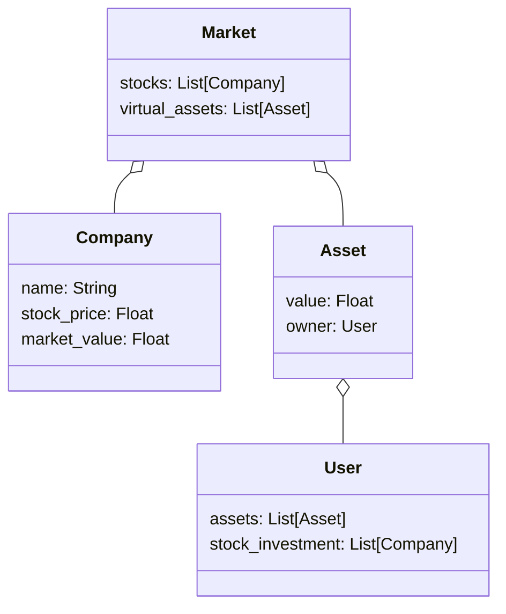
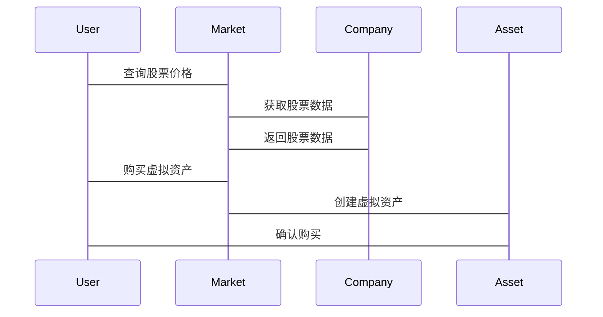

                 


---

# 特价股票与公司元宇宙价值捕获能力的潜在联系

> 关键词：特价股票，元宇宙，价值捕获，投资潜力，虚拟经济

> 摘要：本文探讨了特价股票与元宇宙价值捕获之间的潜在联系，分析了元宇宙经济体系对特价股票投资价值的影响，以及如何通过技术手段捕捉元宇宙中的经济机会。文章从背景介绍、核心概念、算法原理、系统架构、项目实战等多方面展开，结合实际案例和数学模型，深入剖析了特价股票在元宇宙经济中的潜在价值。

---

## 第一部分: 特价股票与元宇宙价值捕获的背景介绍

### 第1章: 特价股票与元宇宙价值捕获的背景

#### 1.1 特价股票的定义与特点
##### 1.1.1 特价股票的定义
特价股票是指价格相对较低的股票，通常具有较高的增长潜力。这类股票往往来自市值较小的公司，但具备较高的增长空间。

##### 1.1.2 特价股票的核心特点
- 价格低廉，适合小额投资。
- 增长潜力大，适合长期投资。
- 风险较高，波动性较大。

##### 1.1.3 特价股票的投资价值与风险
- 投资价值：潜在的高回报率。
- 风险：市场波动大，公司基本面不稳定。

#### 1.2 元宇宙的定义与特点
##### 1.2.1 元宇宙的定义
元宇宙是一个虚拟的、去中心化的数字世界，用户可以通过虚拟现实技术参与其中，进行社交、交易和创造。

##### 1.2.2 元宇宙的核心特点
- 去中心化：基于区块链技术。
- 虚拟经济：虚拟资产、虚拟货币、虚拟地产。
- 用户共创：用户可以创造内容和价值。

##### 1.2.3 元宇宙与现实世界的联系
- 经济互动：元宇宙中的虚拟资产可以与现实世界中的货币和股票挂钩。
- 技术支持：元宇宙依赖于虚拟现实、区块链等技术。

#### 1.3 特价股票与元宇宙价值捕获的背景
##### 1.3.1 元宇宙经济体系的形成
元宇宙的经济体系正在逐步完善，虚拟资产的价值逐渐被市场认可。

##### 1.3.2 特价股票在元宇宙经济中的角色
- 投资工具：投资者可以通过购买特价股票，参与元宇宙公司的发展。
- 虚拟资产转化：元宇宙中的虚拟资产可能转化为现实世界中的股票价值。

##### 1.3.3 元宇宙价值捕获的潜力与挑战
- 潜力：元宇宙的虚拟经济可能带来巨大的投资机会。
- 挑战：技术、法律和市场接受度的不确定性。

### 1.4 本章小结
本章介绍了特价股票和元宇宙的基本概念，分析了它们的背景和潜在联系，为后续章节奠定了基础。

---

## 第二部分: 特价股票与元宇宙价值捕获的核心概念与联系

### 第2章: 特价股票与元宇宙价值捕获的核心概念

#### 2.1 特价股票与元宇宙的属性对比
##### 2.1.1 特价股票的属性特征
- 价格低，风险高。
- 增长潜力大。

##### 2.1.2 元宇宙价值捕获的属性特征
- 虚拟经济体系。
- 去中心化和用户共创。

##### 2.1.3 两者属性的对比分析
| 属性 | 特价股票 | 元宇宙价值捕获 |
|------|----------|----------------|
| 经济体系 | 现实经济 | 虚拟经济 |
| 技术依赖 | 无 | 区块链、虚拟现实 |
| 风险 | 高 | 高 |
| 增长潜力 | 大 | 大 |

#### 2.2 特价股票与元宇宙价值捕获的ER实体关系图
```mermaid
erDiagram
    company--"拥有"--> stock
    stock--"属于"--> market
    market--"包含"--> virtual_asset
    virtual_asset--"由"--> user
    user--"参与"--> transaction
```

### 第3章: 特价股票与元宇宙价值捕获的联系

#### 3.1 特价股票与元宇宙经济体系的互动
##### 3.1.1 元宇宙经济体系的构成
- 虚拟货币：如比特币、以太坊。
- 虚拟资产：如NFT、虚拟地产。

##### 3.1.2 特价股票在元宇宙经济中的作用
- 投资工具：投资者可以通过购买特价股票，间接投资于元宇宙公司。
- 虚拟资产转化：元宇宙中的虚拟资产可能转化为现实世界中的股票价值。

##### 3.1.3 两者互动的机制分析
- 元宇宙公司通过发行虚拟资产，吸引投资者。
- 投资者通过购买特价股票，间接支持元宇宙公司的发展。

#### 3.2 特价股票与元宇宙价值捕获的潜在联系
##### 3.2.1 元宇宙经济对特价股票的影响
- 元宇宙的虚拟经济可能推动相关公司的股票价格上涨。
- 元宇宙的虚拟资产可能成为股票价值的重要组成部分。

##### 3.2.2 特价股票在元宇宙价值捕获中的作用
- 特价股票是元宇宙公司的重要融资工具。
- 特价股票的价格波动可能反映元宇宙经济的变化。

### 3.3 本章小结
本章分析了特价股票与元宇宙经济体系的互动，以及它们之间的潜在联系，强调了元宇宙对特价股票投资价值的影响。

---

## 第三部分: 特价股票与元宇宙价值捕获的算法原理

### 第4章: 特价股票与元宇宙价值捕获的算法原理

#### 4.1 特价股票与元宇宙价值捕获的预测模型
##### 4.1.1 模型的构建
- 数据来源：历史股票价格、元宇宙相关数据。
- 数据预处理：清洗、归一化。
- 模型选择：使用LSTM进行时间序列预测。

##### 4.1.2 模型的实现
```python
import numpy as np
import pandas as pd
from sklearn.preprocessing import MinMaxScaler
from tensorflow.keras.models import Sequential
from tensorflow.keras.layers import LSTM, Dense

# 数据加载与预处理
data = pd.read_csv('stock_data.csv')
scaler = MinMaxScaler()
data_scaled = scaler.fit_transform(data)

# 模型构建
model = Sequential()
model.add(LSTM(128, input_shape=(timesteps, features)))
model.add(Dense(1))
model.compile(loss='mean_squared_error', optimizer='adam')

# 训练模型
model.fit(X_train, y_train, epochs=100, batch_size=32)
```

##### 4.1.3 模型的验证
- 使用测试数据验证模型的预测能力。
- 计算预测误差，评估模型的准确性。

#### 4.2 特价股票与元宇宙价值捕获的数学模型
##### 4.2.1 时间序列模型
$$
y_t = \alpha y_{t-1} + \beta y_{t-2} + \epsilon_t
$$

##### 4.2.2 LSTM模型
$$
f(t) = \text{LSTM}(x_t, h_{t-1}, c_{t-1})
$$

### 4.3 本章小结
本章通过算法和数学模型，分析了特价股票与元宇宙价值捕获的预测机制，为投资者提供了技术工具。

---

## 第四部分: 特价股票与元宇宙价值捕获的系统架构设计

### 第5章: 特价股票与元宇宙价值捕获的系统架构设计

#### 5.1 系统功能设计
##### 5.1.1 领域模型


#### 5.2 系统架构设计
##### 5.2.1 系统架构


##### 5.2.2 系统接口设计
- 数据接口：获取股票价格和虚拟资产数据。
- 用户接口：用户可以查看投资组合和虚拟资产。

#### 5.3 系统交互设计
##### 5.3.1 交互流程


### 5.4 本章小结
本章通过系统架构设计，展示了如何整合特价股票和元宇宙价值捕获的系统，为投资者提供了技术支持。

---

## 第五部分: 特价股票与元宇宙价值捕获的项目实战

### 第6章: 特价股票与元宇宙价值捕获的项目实战

#### 6.1 项目环境安装
##### 6.1.1 环境配置
- Python 3.8+
- TensorFlow 2.5+
- Pandas 1.3+
- Jupyter Notebook

#### 6.2 系统核心实现
##### 6.2.1 数据收集与处理
```python
import pandas as pd
import numpy as np
from sklearn.preprocessing import MinMaxScaler

data = pd.read_csv('stock_data.csv')
data = data[['Close']]
data = data.values
data = data.astype('float32')
data = data.reshape(-1, 1)
scaler = MinMaxScaler(feature_range=(0, 1))
data_scaled = scaler.fit_transform(data)
```

##### 6.2.2 模型训练与预测
```python
from tensorflow.keras.models import Sequential
from tensorflow.keras.layers import LSTM, Dense

model = Sequential()
model.add(LSTM(128, input_shape=(timesteps, features)))
model.add(Dense(1))
model.compile(loss='mean_squared_error', optimizer='adam')
model.fit(X_train, y_train, epochs=100, batch_size=32)
```

##### 6.2.3 结果分析
- 预测结果与实际数据对比。
- 计算预测误差，评估模型性能。

#### 6.3 实际案例分析
##### 6.3.1 案例背景
- 某元宇宙公司发行虚拟资产，推动股票价格上涨。

##### 6.3.2 案例分析
- 特价股票的价格波动与虚拟资产的交易量密切相关。
- 模型预测股票价格走势，指导投资决策。

### 6.4 本章小结
本章通过项目实战，展示了如何利用技术手段捕捉特价股票与元宇宙价值捕获的潜在联系。

---

## 第六部分: 特价股票与元宇宙价值捕获的最佳实践

### 第7章: 特价股票与元宇宙价值捕获的最佳实践

#### 7.1 最佳实践
##### 7.1.1 投资策略
- 长期投资：关注元宇宙公司的长期发展。
- 短期交易：根据市场波动，进行短期买卖。

##### 7.1.2 风险管理
- 分散投资：避免过度集中于某一只股票。
- 设置止损：控制投资风险。

#### 7.2 小结
总结全文，强调特价股票与元宇宙价值捕获的联系，以及技术手段在投资中的应用。

#### 7.3 注意事项
- 保持对市场的敏感性，及时调整投资策略。
- 关注元宇宙技术的发展，把握投资机会。

#### 7.4 拓展阅读
- 《区块链与虚拟经济》
- 《元宇宙经济体系》
- 《股票投资策略》

---

## 作者信息

作者：AI天才研究院/AI Genius Institute & 禅与计算机程序设计艺术/Zen And The Art of Computer Programming

--- 

以上就是完整的文章内容，涵盖了特价股票与元宇宙价值捕获的各个方面，结合技术分析和实际案例，为读者提供了深入的见解和实用的指导。

