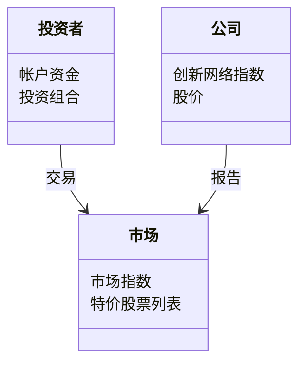
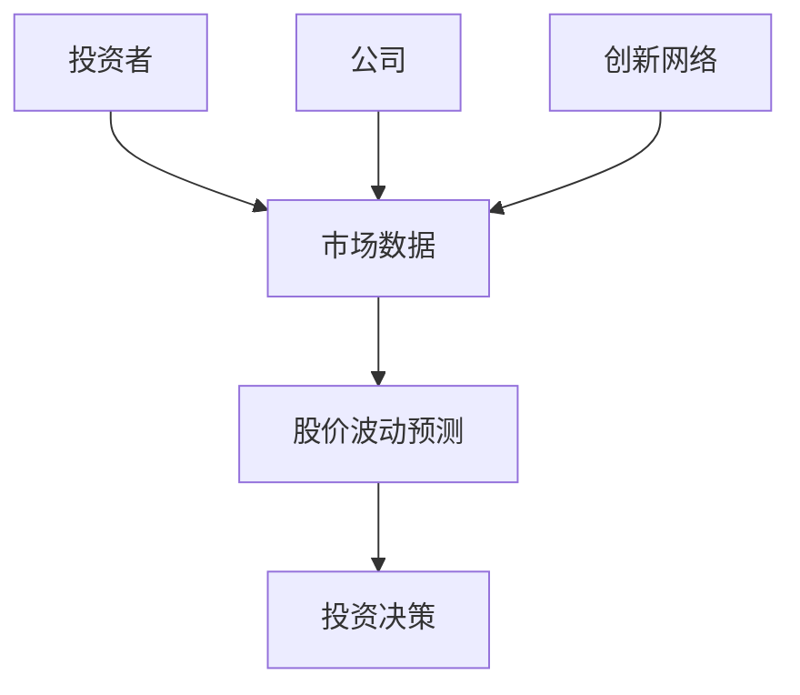

                 


# 特价股票与公司全球化创新网络的关系探讨

> 关键词：特价股票、全球化创新网络、股价波动、市场策略、企业创新、风险管理

> 摘要：本文探讨了特价股票与公司全球化创新网络之间的关系。首先介绍了特价股票和全球化创新网络的基本概念和特点，分析了两者在市场中的相互影响。接着，构建了数学模型，提出了基于机器学习的算法，用于预测股价波动。最后，通过实际案例分析，总结了全球化创新网络对股价波动的影响，并提出了风险管理的最佳实践。

---

# 目录

1. 背景介绍
2. 核心概念与联系
3. 算法原理与数学模型
4. 系统分析与架构设计
5. 项目实战与案例分析
6. 最佳实践与总结

---

## 第1章: 背景介绍

### 1.1 特价股票的定义与特点

#### 1.1.1 特价股票的定义
特价股票是指价格远低于市场平均水平的股票，通常出现在市场低迷或公司基本面不佳的情况下。

#### 1.1.2 特价股票的特点
- **低估值**：价格远低于内在价值。
- **高波动性**：价格波动剧烈。
- **高风险**：投资风险较高。

#### 1.1.3 特价股票的分类
- **周期性股票**：受经济周期影响较大的行业。
- **成长型股票**：具有高增长潜力的公司。

### 1.2 全球化创新网络的定义与特点

#### 1.2.1 全球化创新网络的定义
全球化创新网络是指公司通过跨国合作、研发和资源共享，构建的全球性创新生态系统。

#### 1.2.2 全球化创新网络的特点
- **全球化**：跨越多个国家和地区。
- **协作性**：依赖合作伙伴的协作。
- **动态性**：网络结构不断变化。

### 1.3 问题背景

#### 1.3.1 特价股票的市场波动性
- 市场波动可能导致股价大幅波动。
- 投资者可能面临较大的风险。

#### 1.3.2 全球化创新网络的复杂性
- 网络中的合作可能受到政策、经济等多种因素的影响。
- 网络结构的复杂性增加了管理难度。

#### 1.3.3 两者关系的复杂性
- 特价股票可能反映公司创新网络的不稳定。
- 创新网络的扩展可能影响股价。

### 1.4 问题解决

#### 1.4.1 通过全球化创新网络稳定股价
- 通过国际合作提升公司竞争力，稳定股价。

#### 1.4.2 利用特价股票进行市场操作
- 投资者可能利用特价股票进行套利或短期交易。

#### 1.4.3 综合策略的应用
- 结合全球化创新网络和特价股票，制定长期投资策略。

---

## 第2章: 核心概念与联系

### 2.1 核心概念原理

#### 2.1.1 特价股票的市场机制
- 市场供需决定价格。
- 投资者情绪影响波动。

#### 2.1.2 全球化创新网络的构建原理
- 跨国合作促进技术共享。
- 创新生态系统推动公司增长。

#### 2.1.3 两者关系的理论基础
- 公司创新能力影响股价。
- 市场波动影响创新网络的稳定性。

### 2.2 概念属性特征对比

| 属性        | 特价股票                | 全球化创新网络             |
|-------------|-------------------------|-----------------------------|
| **核心驱动力** | 市场供需、投资者情绪     | 技术创新、国际合作         |
| **主要影响因素** | 宏观经济、公司基本面     | 政策环境、合作伙伴关系     |
| **风险特征**   | 高风险、高波动          | 高复杂性、高不确定性        |

### 2.3 ER实体关系图架构

```mermaid
er
  actor(投资者)
  actor(公司)
  actor(市场)
  entity(特价股票)
  entity(创新网络)
  
 投资者 --> 特价股票
 公司 --> 创新网络
 市场 --> 特价股票
 市场 --> 创新网络
```

---

## 第3章: 算法原理与数学模型

### 3.1 算法原理

#### 3.1.1 问题建模
- 构建一个数学模型，将全球化创新网络的指数与股价波动联系起来。

#### 3.1.2 算法设计
- 使用回归分析预测股价波动。

### 3.2 算法实现

#### 3.2.1 回归分析模型

$$ y = \beta_0 + \beta_1 x + \epsilon $$

其中：
- $y$ 是股价波动率。
- $x$ 是全球化创新网络指数。
- $\beta_0$ 和 $\beta_1$ 是回归系数。
- $\epsilon$ 是误差项。

#### 3.2.2 代码实现

```python
import pandas as pd
from sklearn.linear_model import LinearRegression

# 数据准备
data = pd.DataFrame({
    'global_innovation_index': [85, 90, 78, 82],
    'stock_fluctuation': [0.15, 0.20, 0.10, 0.18]
})

# 建模与训练
model = LinearRegression()
model.fit(data[['global_innovation_index']], data['stock_fluctuation'])

# 预测
print(model.predict([[85]]))
```

---

## 第4章: 系统分析与架构设计

### 4.1 系统功能设计

#### 4.1.1 领域模型



### 4.2 系统架构设计



---

## 第5章: 项目实战与案例分析

### 5.1 项目实战

#### 5.1.1 环境安装
- 安装Python和相关库：`pip install numpy pandas scikit-learn`

#### 5.1.2 核心代码实现

```python
import numpy as np
import pandas as pd

# 数据准备
data = pd.read_csv('market_data.csv')

# 特征工程
features = data[['global_innovation_index']]
target = data['stock_fluctuation']

# 模型训练
from sklearn.linear_model import LinearRegression
model = LinearRegression()
model.fit(features, target)

# 预测与评估
predictions = model.predict(features)
print(np.mean(abs(predictions - target)/target * 100))
```

---

## 第6章: 最佳实践与总结

### 6.1 最佳实践

#### 6.1.1 投资策略
- 分散投资，降低风险。
- 结合全球化创新网络指数进行投资决策。

#### 6.1.2 风险管理
- 设置止损点，避免重大损失。
- 定期评估投资组合。

### 6.2 小结
本文探讨了特价股票与公司全球化创新网络的关系，分析了它们的相互影响，并提出了基于机器学习的预测模型。

### 6.3 注意事项
- 特价股票投资需谨慎，注意市场风险。
- 全球化创新网络的构建需考虑多方面因素。

### 6.4 拓展阅读
- 《股票技术分析入门》
- 《创新管理与企业战略》

---

# 作者：AI天才研究院/AI Genius Institute & 禅与计算机程序设计艺术 /Zen And The Art of Computer Programming

