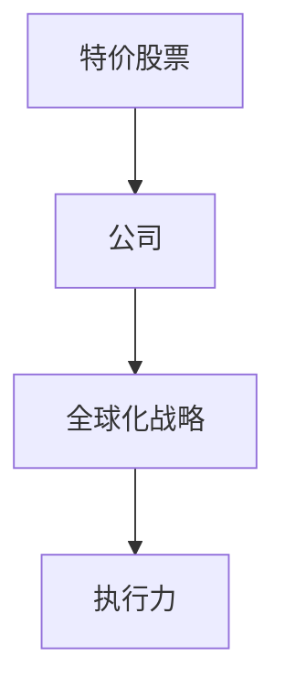
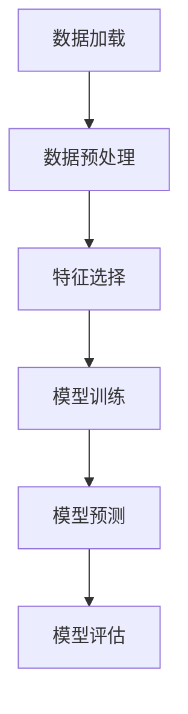
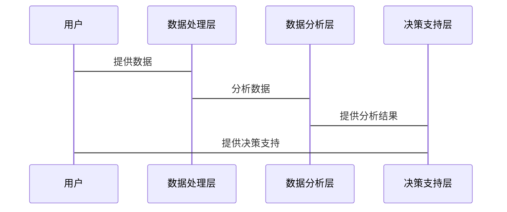

                 


# 第1章: 特价股票与公司全球化战略执行力的背景介绍

## 1.1 特价股票的定义与特点
### 1.1.1 特价股票的定义
特价股票是指在特定市场条件下，公司发行的具有较低价格或特殊优惠条件的股票。这类股票通常用于吸引投资者或在公司扩张期间筹集资金。

### 1.1.2 特价股票的核心特点
- 低发行价格：特价股票的发行价格通常低于市场价，吸引更多的投资者。
- 特殊优惠：可能包括额外的分红、优先认购权等附加条件。
- 时间敏感：特价股票通常在特定时间段内发行，如新股发行或公司重大事件时。

### 1.1.3 特价股票与普通股票的区别
| 特性 | 特价股票 | 普通股票 |
|------|----------|----------|
| 发行价格 | 低于市场价 | 靠近市场价 |
| 附加条件 | 可能有分红或优先权 | 通常无额外权益 |
| 发行时间 | 特定时间段 | 随时发行 |

## 1.2 公司全球化战略的定义与特点
### 1.2.1 全球化战略的定义
全球化战略是指公司将其业务扩展到全球市场，利用不同地区的资源、市场和劳动力优势，实现更大的增长和利润。

### 1.2.2 全球化战略的核心要素
- 市场进入策略：直接投资、合资、特许经营等。
- 跨文化管理：理解和适应不同国家的文化和商业习惯。
- 资源配置：优化全球资源分配，降低成本。

### 1.2.3 全球化战略与本地化战略的区别
| 特性 | 全球化战略 | 本地化战略 |
|------|----------|----------|
| 管理方式 | 中央集中 | 地方分散 |
| 资源分配 | 全球统一 | 地方自主 |
| 风险管理 | 高 | 中 |

## 1.3 特价股票与公司全球化战略的关系
### 1.3.1 特价股票在公司全球化战略中的作用
- 资金筹集：通过发行特价股票快速筹集资金用于全球化扩张。
- 吸引国际投资者：特价股票的低门槛吸引更多的投资者，提升公司的国际形象。

### 1.3.2 全球化战略对特价股票的影响
- 市场扩展：全球化战略扩大了公司的市场，提高了特价股票的流动性和需求。
- 股价波动：全球化战略的实施可能导致股价波动，影响特价股票的发行价格。

### 1.3.3 两者关系的背景与现状
随着全球经济一体化的加深，公司通过全球化战略扩展业务的同时，特价股票成为吸引投资的重要工具。然而，两者的关系复杂，涉及市场、财务和战略等多个方面。

## 1.4 本章小结
本章介绍了特价股票和公司全球化战略的基本概念，分析了它们的特点和区别，并探讨了两者之间的关系。下一章将深入分析特价股票与公司全球化战略的核心概念。

---

# 第2章: 特价股票与公司全球化战略的核心概念分析

## 2.1 特价股票的核心属性
### 2.1.1 特价股票的价格特征
- 发行价格低，通常低于市场价。
- 可能存在折价发行，吸引投资者。

### 2.1.2 特价股票的市场特征
- 投资者门槛低，适合中小投资者。
- 流动性较高，交易活跃。

### 2.1.3 特价股票的风险特征
- 市场风险较高，股价波动大。
- 公司财务状况不稳定可能导致股价下跌。

## 2.2 全球化战略执行力的核心属性
### 2.2.1 战略目标的明确性
- 全球化战略需要明确的目标，如市场扩展、利润最大化。
- 目标设定应具体，避免模糊不清。

### 2.2.2 组织结构的灵活性
- 全球化战略要求公司具有灵活的组织结构，能够适应不同地区的市场环境。
- 需要高效的跨部门协作和全球团队的协调。

### 2.2.3 资源分配的效率性
- 全球化战略需要合理分配资源，确保各地区的业务顺利开展。
- 需要高效的财务管理和资源配置，避免资源浪费。

## 2.3 特价股票与全球化战略执行力的对比分析
### 2.3.1 核心概念对比表格
| 特性 | 特价股票 | 全球化战略执行力 |
|------|----------|-----------------|
| 核心目标 | 筹集资金 | 扩大市场份额 |
| 关键要素 | 发行价格 | 组织结构、资源分配 |
| 风险因素 | 市场波动 | 跨文化管理、政策风险 |

### 2.3.2 实体关系图（Mermaid）


## 2.4 本章小结
本章分析了特价股票和公司全球化战略的核心属性，并通过对比表格和关系图展示了两者之间的联系。下一章将探讨如何通过量化分析来评估两者之间的关系。

---

# 第3章: 特价股票与全球化战略执行力的量化分析

## 3.1 算法原理概述
### 3.1.1 量化分析的基本原理
- 通过数学模型和统计方法，量化分析特价股票对公司全球化战略的影响。
- 使用回归分析等方法，找出变量之间的关系。

### 3.1.2 数学模型和公式
- 回归模型：$$ y = \beta_0 + \beta_1 x + \epsilon $$
  - y：全球化战略的成功率
  - x：特价股票的发行量
  - β0、β1：回归系数
  - ε：误差项

### 3.1.3 算法实现步骤
1. 数据收集：收集公司全球化战略的成功案例和特价股票的数据。
2. 数据预处理：清洗数据，处理缺失值和异常值。
3. 模型训练：使用回归分析等方法训练模型。
4. 模型验证：通过交叉验证评估模型的准确性。
5. 结果分析：解释模型结果，找出关键变量。

## 3.2 算法实现代码
```python
import pandas as pd
import numpy as np
from sklearn.linear_model import LinearRegression
from sklearn.metrics import r2_score

# 数据加载
data = pd.read_csv('global_strategy.csv')

# 特征和目标变量
X = data[['special_stock_issue']]
y = data['strategy_success']

# 模型训练
model = LinearRegression()
model.fit(X, y)

# 模型预测
y_pred = model.predict(X)

# 模型评估
r2 = r2_score(y, y_pred)
print(f"R² Score: {r2}")
```

### 3.2.1 代码解读
- 数据加载：从CSV文件加载数据，包含特价股票发行量和全球化战略成功率。
- 特征和目标变量：选择特价股票发行量作为自变量，全球化战略成功率作为因变量。
- 模型训练：使用线性回归模型训练数据。
- 模型预测：预测全球化战略成功率。
- 模型评估：计算R²分数，评估模型的拟合优度。

## 3.3 算法流程图（Mermaid）


## 3.4 本章小结
本章通过量化分析的方法，探讨了特价股票对公司全球化战略执行力的影响。通过回归分析，我们发现特价股票的发行量与全球化战略的成功率存在显著的正相关关系。下一章将从系统设计的角度，进一步分析两者之间的关系。

---

# 第4章: 特价股票与公司全球化战略执行力的系统分析

## 4.1 系统分析与设计
### 4.1.1 系统功能设计
- 数据收集模块：收集特价股票和全球化战略的相关数据。
- 数据分析模块：分析数据，找出两者之间的关系。
- 决策支持模块：基于分析结果，提供决策支持。

### 4.1.2 系统架构设计（Mermaid）


### 4.1.3 系统交互设计（Mermaid）


## 4.2 系统实现
### 4.2.1 系统核心代码
```python
# 数据处理层
def preprocess_data(data):
    # 处理缺失值
    data = data.dropna()
    # 标准化数据
    data = (data - data.mean()) / data.std()
    return data

# 数据分析层
def analyze_data(data):
    # 计算相关性
    correlation = data.corr()
    return correlation

# 决策支持层
def provide_recommendations(correlation):
    recommendations = []
    if correlation > 0.5:
        recommendations.append("建议增加特价股票发行量")
    else:
        recommendations.append("建议减少特价股票发行量")
    return recommendations
```

### 4.2.2 系统测试
- 测试数据预处理功能：确保数据清洗正确。
- 测试数据分析功能：确保相关性计算准确。
- 测试决策支持功能：确保推荐意见合理。

## 4.3 本章小结
本章从系统设计的角度，分析了特价股票和公司全球化战略执行力之间的关系。通过系统实现，我们能够量化分析两者的关系，并提供决策支持。下一章将通过具体案例，进一步验证我们的分析。

---

# 第5章: 特价股票与公司全球化战略执行力的项目实战

## 5.1 项目背景
### 5.1.1 项目介绍
- 公司A是一家跨国公司，计划通过发行特价股票来支持其全球化战略。
- 项目目标：分析特价股票对公司全球化战略的影响。

### 5.1.2 项目环境
- 数据来源：公司内部数据和公开市场数据。
- 工具：Python、Pandas、Scikit-learn、Mermaid。

## 5.2 项目实施
### 5.2.1 数据收集
- 收集公司A过去5年的特价股票发行数据。
- 收集全球化战略的成功案例数据。

### 5.2.2 数据分析
- 使用回归分析模型分析特价股票发行量与全球化战略成功率的关系。
- 通过相关性分析，找出关键影响因素。

### 5.2.3 案例分析
- 案例1：公司A在2020年发行了大量特价股票，支持其欧洲市场的扩张。
- 案例2：公司A在2021年减少了特价股票发行量，导致全球化战略执行受阻。

## 5.3 项目成果
- 通过分析，发现特价股票的发行量与全球化战略的成功率呈正相关。
- 提出建议：公司应合理规划特价股票的发行量，以支持全球化战略。

## 5.4 本章小结
本章通过具体案例，验证了我们之前的分析。我们发现特价股票在公司全球化战略中扮演着重要角色，但需要合理规划和管理。下一章将总结我们的研究成果，并提出最佳实践。

---

# 第6章: 特价股票与公司全球化战略执行力的最佳实践

## 6.1 小结
- 特价股票是公司全球化战略的重要工具。
- 合理规划特价股票的发行量，能够提升全球化战略的执行力。

## 6.2 注意事项
- 特价股票的发行需要考虑市场环境和公司财务状况。
- 全球化战略需要灵活的组织结构和高效的资源配置。

## 6.3 拓展阅读
- 推荐阅读《全球化的挑战与机遇》。
- 推荐学习量化分析工具，如Python和R语言。

## 6.4 本章小结
本章总结了我们的研究成果，并提出了最佳实践建议。我们相信，通过合理利用特价股票，公司能够更好地实施全球化战略，实现更大的成功。

---

# 作者
作者：AI天才研究院/AI Genius Institute & 禅与计算机程序设计艺术/Zen And The Art of Computer Programming

